### Elasticsearch学习

#### 简介

Elasticsearch是一款基于Java开发的开源分布式搜索引擎。在 [Apache Lucene™](https://lucene.apache.org/core/) 基础之上开发而来的，Elasticsearch隐藏了Lucene 的复杂性,取而代之的是提供了一套简单一致的RESTful API。是Elastic Stack（

包括 Elasticsearch、Kibana、Beats、Logstash ）的核心。

Kibana   提供可视化界面

Beats   是一个专门的数据采集工具，是 logstash的轻量级版本

Logstash  一个接收,处理,转发日志的工具

#### 优点

- 一个分布式的实时文档存储，*每个字段* 可以被索引与搜索
- 一个分布式实时分析搜索引擎
- 能胜任上百个服务节点的扩展，并支持 PB 级别(1PB=1024TB)的结构化或者非结构化数据
- 开箱即用（内置了许多默认配置，降低了使用者掌握搜索引擎原理的要求。只需要少数理解，即可具有生产力）

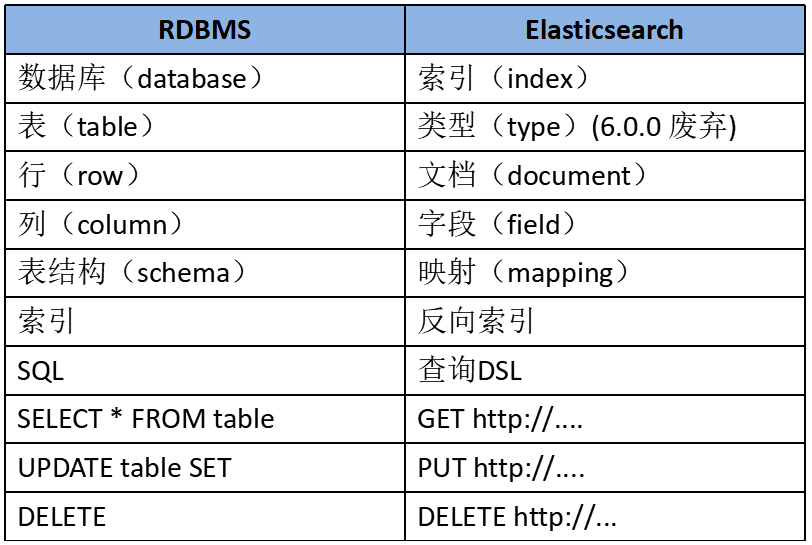

设计思想：倒排索引

```verilog
  正排索引 
  id     content
  --------------------
  1001   my name is zhangsan 
  1002   my name is li si 
 这个时候我们要做全文检索，一般会使用like。
 使用like数据量大的时候效率是一个方面的问题。还有准确率是另一个方面的问题
 例如查询Zhangsan  这个时候与表中的zhangsan 存在大小写差异问题。

 全文检索提出了一个新的概念
 倒排索引
 keyword    id
-----------------------------
 name       1001,1002
 zhangsan   1001
 按照倒排索引的逻辑 通过关键字，查找到对应的索引。然后拿到索引对应的数据。这里弱化了表的概念。从上面的与关系型数据库对比的表格可以看出。 type对应表。所以从7.x开始已经弃用了type类型。
```

#### 安装

##### windows安装

 从  [官网下载](https://www.elastic.co/cn/downloads/elasticsearch) 压缩包，之后进行解压。最新版本为8.1.3版本

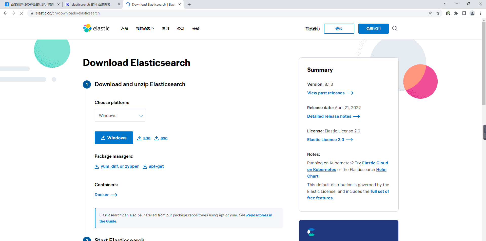

启动bin文件夹下的elasticsearch.bat 即可通过http://localhost:9200/ 访问

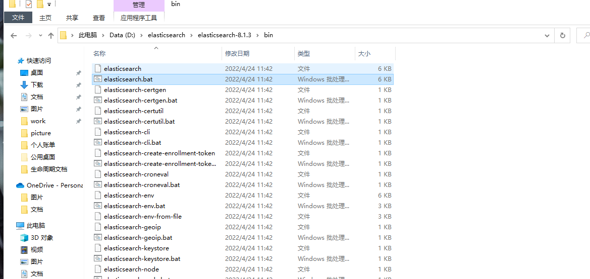

启动后情况

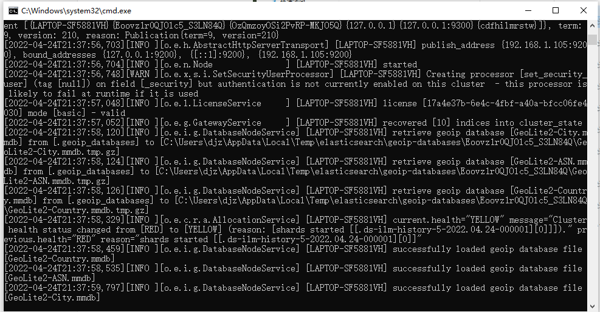

- Elasticsearch 9300端口为tcp协议的访问端口。9200是浏览器的http协议RESTful端口 可以在elasticsearch.yml 文件中修改端口号
- 7.8以上版本需要jdk1.8
- 报错闪退，可以从logs文件夹下查看日志。如果是内存问题就调大JVM的内存。config/jvm.options

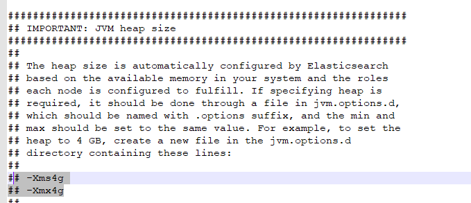

**集群配置**

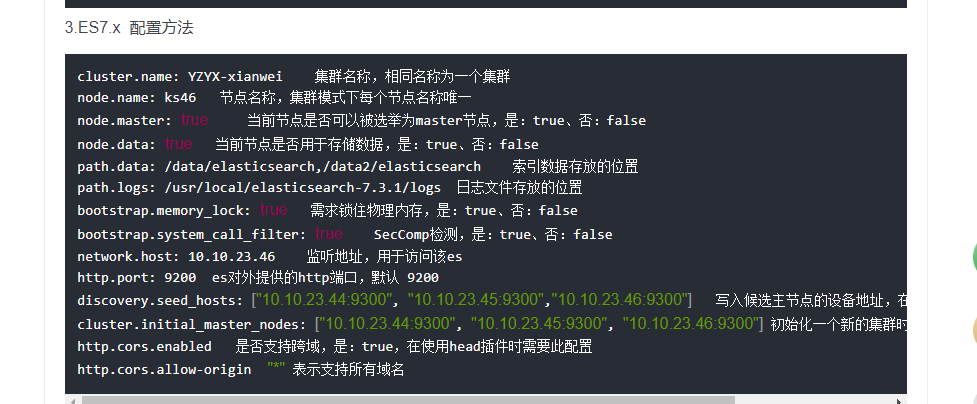

```yaml
#xpack的基础功能设置   高级用法属于付费内容  X-pack  7版本之后默认安装  6.8以前的版本需要手动安装X-pack的jar
xpack.security.enabled: false   #开启安全认证
xpack.security.enrollment.enabled: false     #自动注册用户密码  不建议开启 很坑爹
xpack.security.http.ssl:  
  enabled: false                   #true 的话需要使用https来访问
  keystore.path: certs/http.p12

xpack.security.transport.ssl:
  enabled: false
  verification_mode: certificate
  keystore.path: certs/transport.p12
  truststore.path: certs/transport.p12
# 安全认证开启之后，可以使用 elasticsearch-setup-passwords interactive 设置密码。
cluster.name: myElasticsearch
node.name: node-1
node.roles: [ master,data ]       # 8版本全新的配置方式 
#bootstrap.memory_lock: true     linux seccomp机制启动     windows下配置会报错
#bootstrap.system_call_filter: true  linux seccomp机制启动  windows下配置会报错
network.host: 0.0.0.0
http.port: 9201
transport.port: 9301
discovery.seed_hosts: ["127.0.0.1:9201","127.0.0.1:9202"]  #备选的主节点设备地址
cluster.initial_master_nodes: ["127.0.0.1:9301","127.0.0.1:9302"]  #新启动集群的时候初始化的节点，可以写节点名，例如 ["node-1","node-2"]
```

#### 相关工具

查看Elasticsearch使用的工具 

- Elasticsearch-head

  google浏览器的第三方插件，可以在google浏览器上方便的查看Elasticsearch的索引信息。功能相对简陋。有点在于不用部署服务。

  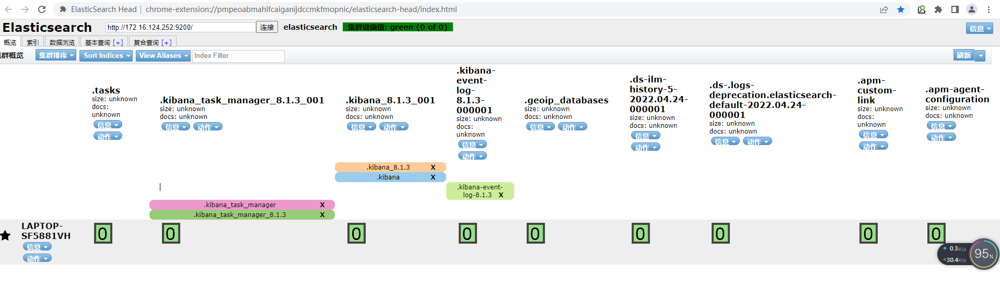

- Kibana

​       Kibana 是一个免费且开放的用户界面，能够让您对 Elasticsearch 数据进行可视化，并让您在 Elastic Stack 中进行导航。您可以进行各种操作，从跟踪查询负载，到理解请求如何流经您的整个应用，都能轻松完成。

​      需要单独部署服务。

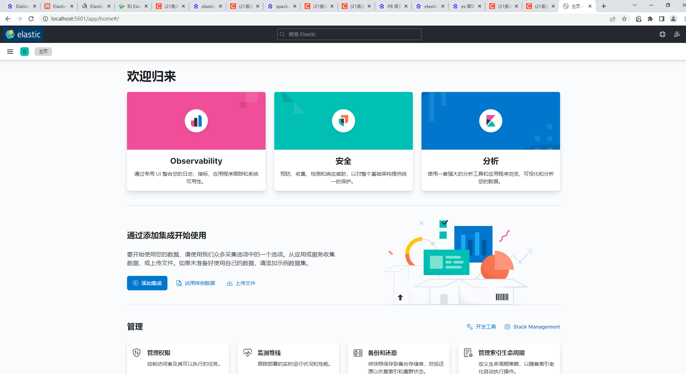

#### 索引操作

##### 创建索引

创建一个名称为emp 的索引。 使用postman

```xml
PUT    http://localhost:9201/emp  
```

```json
{
    "acknowledged": true,
    "shards_acknowledged": true,
    "index": "emp"
}
```

##### 查看索引信息

```
GET  http://localhost:9201/emp 
```


```json
{
    "emp": {
        "aliases": {},
        "mappings": {},
        "settings": {
            "index": {
                "routing": {
                    "allocation": {
                        "include": {
                            "_tier_preference": "data_content"
                        }
                    }
                },
                "number_of_shards": "1",
                "provided_name": "emp",
                "creation_date": "1650895255937",
                "number_of_replicas": "1",
                "uuid": "pBAX31GhQm-z4SpHG901kg",
                "version": {
                    "created": "8010399"
                }
            }
        }
    }
}
```

##### 查看所有索引信息

```xml
GET http://localhost:9201/_cat/indices?v
```

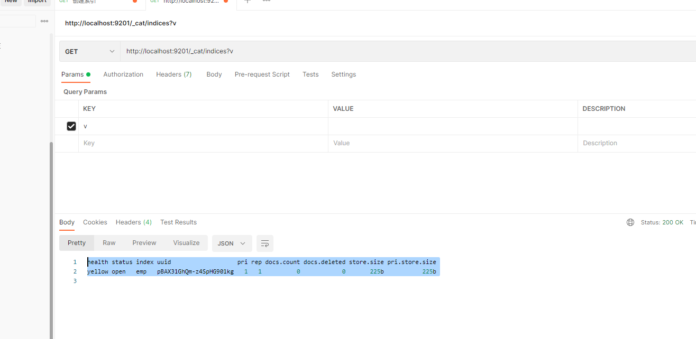

##### 删除索引

```
DELETE http://localhost:9201/emp
```

```json
{
    "acknowledged": true
}
```

#### 文档操作

##### 创建文档

像之前的emp索引存入一个文档，包含姓名、年龄、兴趣、简介。

```json
POST  http://localhost:9201/emp/_doc/123   
      http://localhost:9201/emp/_create/123  
      http://ip:port/indexName/_doc/oid
body
{
    "name" :   "zhangsan",
    "age" :         32,
    "about" :       "I like to collect rock albums",
    "interests":  [ "music" ]
}
```

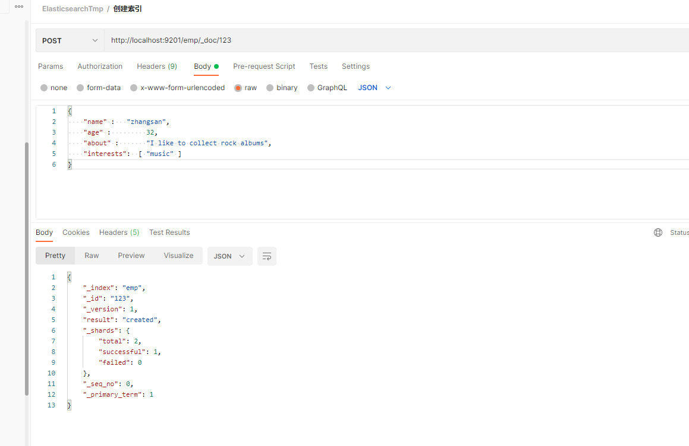

请求不加ID的话会自动生成id

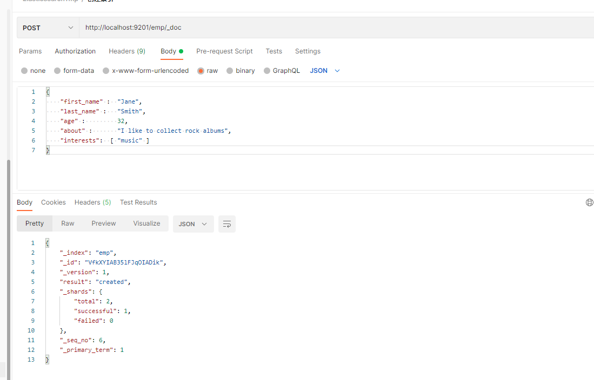

在没有索引的情况下，执行的话，会先创建索引，然后插入数据。如果不指定ID。**重复提交的话会重复创建数据。**

索引的映射有两种显示映射和动态映射。 

动态映射允许使用者在刚开始尝试和探索数据的时候只需为Elasticsearch文档编制索引，即可自动添加新字段。可以将字段添加到顶级映射、内部对象和嵌套字段中。

##### 文档查询

###### 主键查询

```json
GET  http://localhost:9201/emp/_doc/123   
```

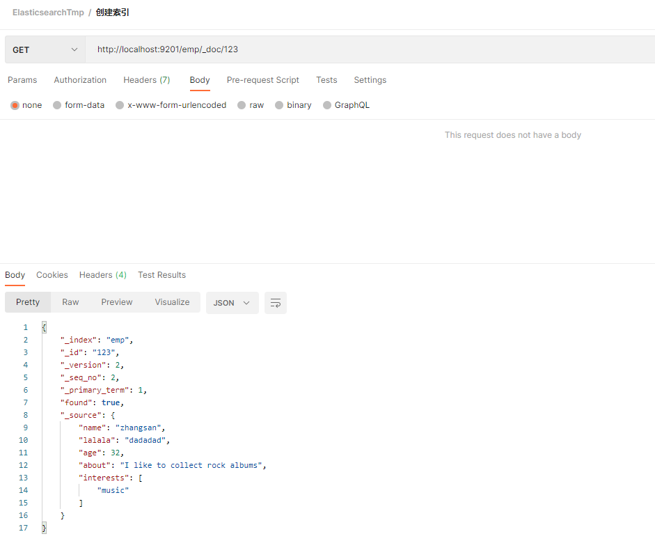

###### 全查询

```
GET  http://localhost:9201/emp/_search
```

```json
{
    "took": 41,
    "timed_out": false,
    "_shards": {
        "total": 1,
        "successful": 1,
        "skipped": 0,
        "failed": 0
    },
    "hits": {
        "total": {
            "value": 2,
            "relation": "eq"
        },
        "max_score": 1.0,
        "hits": [
            {
                "_index": "emp",
                "_id": "123  ",
                "_score": 1.0,
                "_source": {
                    "name": "zhangsan",
                    "age": 32,
                    "about": "I like to collect rock albums",
                    "interests": [
                        "music"
                    ]
                }
            },
            {
                "_index": "emp",
                "_id": "123",
                "_score": 1.0,
                "_source": {
                    "name": "zhangsan",
                    "lalala": "dadadad",
                    "age": 32,
                    "about": "I like to collect rock albums",
                    "interests": [
                        "music"
                    ]
                }
            }
        ]
    }
}
```

##### 文档修改

###### 覆盖修改

```json
PUT  http://localhost:9201/emp/_doc/123
{
    "name" :   "wanggang",
    "age" :         32,
    "about" :       "I like to collect rock albums",
    "interests":  [ "music" ]
}
```

```json
{
    "_index": "emp",
    "_id": "123",
    "_version": 3,
    "result": "updated",
    "_shards": {
        "total": 2,
        "successful": 1,
        "failed": 0
    },
    "_seq_no": 3,
    "_primary_term": 1
}
```

再次查询id为123的数据，name变为wanggang

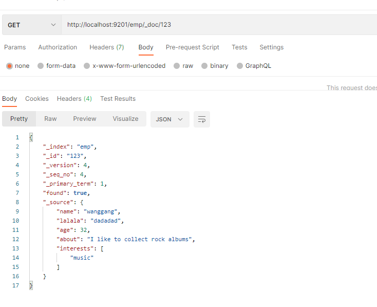

###### 局部修改

```json
POST http://localhost:9201/emp/_update/123
{
  "doc":{
    "name":"lilei"
  }
}
```

##### 删除文档

```
DELETE http://localhost:9201/emp/_doc/123
```

#### 复杂查询

##### 条件查询

```json
GET  http://localhost:9201/emp/_search
{
  "query":{
       "match":{
           "name":"lilei"
       }
  }
}
--------------------
全查询
{
  "query":{
       "match_all":{
       }
  }
}
```

```json
{
    "took": 8,
    "timed_out": false,
    "_shards": {
        "total": 1,
        "successful": 1,
        "skipped": 0,
        "failed": 0
    },
    "hits": {
        "total": {
            "value": 1,
            "relation": "eq"
        },
        "max_score": 0.6931471,
        "hits": [
            {
                "_index": "emp",
                "_id": "123",
                "_score": 0.6931471,
                "_source": {
                    "name": "lilei",
                    "lalala": "dadadad",
                    "age": 32,
                    "about": "I like to collect rock albums",
                    "interests": [
                        "music"
                    ]
                }
            }
        ]
    }
}
```

##### 分页查询

```json
GET  http://localhost:9201/emp/_search
{
  "query":{
       "match":{
           "name":"lilei"
       }
  },
  "from":0,  //起始位置
  "size":3   //每页数据
}
```

##### 查询排序

```json
GET  http://localhost:9201/emp/_search
{
    "query": {
        "match": {
            "name": "lilei"
        }
       
    },
     "from": 0,
     "size": 3,
         "sort": {
            "age": "desc"
        }
}
```

##### 复合查询

###### bool

由boolean类型条件组合而成的查询，匹配与这些boolean条件相匹配的文档。

查询的构建由一个或者多个boolean子句构成,每个子句都应该包含一个发生类型（ occurrence type）

| Occur    | 描述                                 |
| -------- | ---------------------------------- |
| must     | 子句的内容（条件）必须出现在文档中，并且影响文档的得分        |
| should   | 查询条件应该出现在文档中。                      |
| must_not | 查询内容不得出现在文档中，忽略评分。返回的所有文档评分为0      |
| filter   | 子句的内容（条件）必须出现在文档中，filter的内容不影响文档得分 |

bool遵循more-matches-is-better的原则。意味着满足must和should子句查询的分数将会汇总到一起作为最后的_scorre评分。filter和must_not的子句不纳入到评分范围，仅进行过滤文档

```json
{
  "query":{
    "bool":{   //条件
      "must":[],   //同时成立
        "should":[], // or
       "must_not":[], // 都不成立
      "filter":{    //  过滤器，过滤掉不匹配的数据。
        "range":{
          "age":{
            "gt":20  // 大于20
            "It":50  // 小于50
          }
        }
      }
    }
  }
}
```

###### boosting

返回匹配positive 的文档，同时根据`negative` 的条件降低文档得分。

| 参数             | 说明                           |
| -------------- | ---------------------------- |
| positive       | 查询你期望的内容，返回的文档必须满足这些条件       |
| negative       | 查询内容用来降低文档的相似性得分             |
| negative_boost | 介于0-1之间。positive查询结果与该得分系数相乘 |

若一个匹配返回的文档既满足positive查询子句又满足negative查询子句,那么boosting查询计算相似度分数步骤如下:
1)、获取从positive查询中的原始分数;
2)、将获取的分数与negative_boost系数相乘得到最终分;

```json
//查询年龄为32的人，同时名字为zhangsan的人的信息得分降低
{
    "query": {
        "boosting": {
            "positive": {
                "match": {
                    "age": "32"
                }
            },
            "negative": {
                "match": {
                    "name": "zhangsan"
                }
            },
            "negative_boost": 0.1
        }
    }
}
```

```json
{
    "took": 1,
    "timed_out": false,
    "_shards": {
        "total": 1,
        "successful": 1,
        "skipped": 0,
        "failed": 0
    },
    "hits": {
        "total": {
            "value": 4,
            "relation": "eq"
        },
        "max_score": 1.0,
        "hits": [
            {
                "_index": "emp",
                "_id": "123",
                "_score": 1.0,
                "_source": {
                    "name": "lilei",
                    "lalala": "dadadad",
                    "age": 32,
                    "about": "I like to collect rock albums",
                    "interests": [
                        "music"
                    ]
                }
            },
            {
                "_index": "emp",
                "_id": "egKwZIABav0305nQHzfG",
                "_score": 1.0,
                "_source": {
                    "name": "小张",
                    "age": 32,
                    "about": "I like to collect rock albums",
                    "interests": [
                        "足球"
                    ]
                }
            },
            {
                "_index": "emp",
                "_id": "ewKwZIABav0305nQhzdY",
                "_score": 1.0,
                "_source": {
                    "name": "小明",
                    "age": 32,
                    "about": "I like to collect rock albums",
                    "interests": [
                        "乒乓球"
                    ]
                }
            },
            {
                "_index": "emp",
                "_id": "123  ",
                "_score": 0.1,
                "_source": {
                    "name": "zhangsan",
                    "age": 32,
                    "about": "I like to collect rock albums",
                    "interests": [
                        "music"
                    ]
                }
            }
        ]
    }
}
```

###### constant_score   常数分

封装一个过滤器查询，并且将满足过滤器条件的文档得分设置为boost参数的值.

```json
名字为zhangsan 的人得分设置为1.2
{
    "query":{
      "constant_score":{
          "filter":{
              "match":{
                  "name":"zhangsan"
              }
          },
          "boost":1.2
      }
    }
}
```

```json
{
    "took": 1,
    "timed_out": false,
    "_shards": {
        "total": 1,
        "successful": 1,
        "skipped": 0,
        "failed": 0
    },
    "hits": {
        "total": {
            "value": 1,
            "relation": "eq"
        },
        "max_score": 1.2,
        "hits": [
            {
                "_index": "emp",
                "_id": "123  ",
                "_score": 1.2,
                "_source": {
                    "name": "zhangsan",
                    "age": 32,
                    "about": "I like to collect rock albums",
                    "interests": [
                        "music"
                    ]
                }
            }
        ]
    }
}
```

###### dis_max

返回的文档满足一个或者多个子句条件。返回结果满足多个子句（条件）。以匹配度最高的子句得分作为文档得分。

tie_breaker值为在多个字段中包含相同术语的文档分配更高的相关分数.如果文档匹配多个子句，则dis_max查询计算文档的相关性分数，如下所示：

- 从得分最高的匹配子句中获取相关性得分。
- 将任何其他匹配子句的分数乘以该tie_breaker值。
- 将最高分数添加到相乘分数中。

```json
{
    "query": {
        "dis_max": {
            "queries": [
                {
                    "match": {
                        "age": "32"
                    }
                },
                {
                    "match": {
                        "name": "zhangsan"
                    }
                }
            ],
              "tie_breaker": 0.1
        }
    }
}
```

```json
{
    "took": 1,
    "timed_out": false,
    "_shards": {
        "total": 1,
        "successful": 1,
        "skipped": 0,
        "failed": 0
    },
    "hits": {
        "total": {
            "value": 4,
            "relation": "eq"
        },
        "max_score": 1.4940739,
        "hits": [
            {
                "_index": "emp",
                "_id": "123  ",
                "_score": 1.4940739,
                "_source": {
                    "name": "zhangsan",
                    "age": 32,
                    "about": "I like to collect rock albums",
                    "interests": [
                        "music"
                    ]
                }
            },
            {
                "_index": "emp",
                "_id": "123",
                "_score": 1.0,
                "_source": {
                    "name": "lilei",
                    "lalala": "dadadad",
                    "age": 32,
                    "about": "I like to collect rock albums",
                    "interests": [
                        "music"
                    ]
                }
            },
            {
                "_index": "emp",
                "_id": "egKwZIABav0305nQHzfG",
                "_score": 1.0,
                "_source": {
                    "name": "小张",
                    "age": 32,
                    "about": "I like to collect rock albums",
                    "interests": [
                        "足球"
                    ]
                }
            },
            {
                "_index": "emp",
                "_id": "ewKwZIABav0305nQhzdY",
                "_score": 1.0,
                "_source": {
                    "name": "小明",
                    "age": 32,
                    "about": "I like to collect rock albums",
                    "interests": [
                        "乒乓球"
                    ]
                }
            }
        ]
    }
}
```

###### function_score


