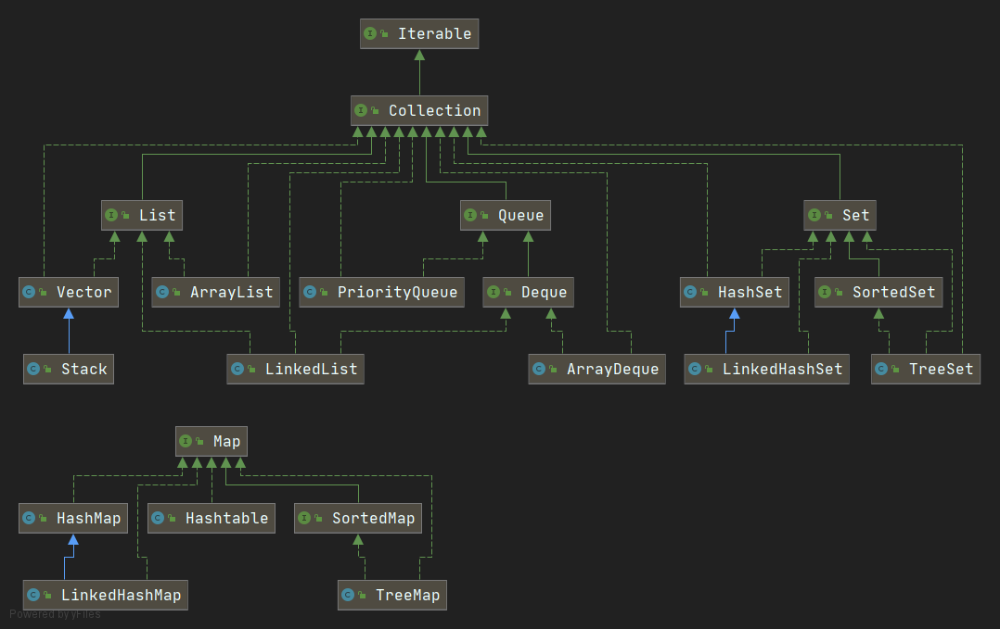
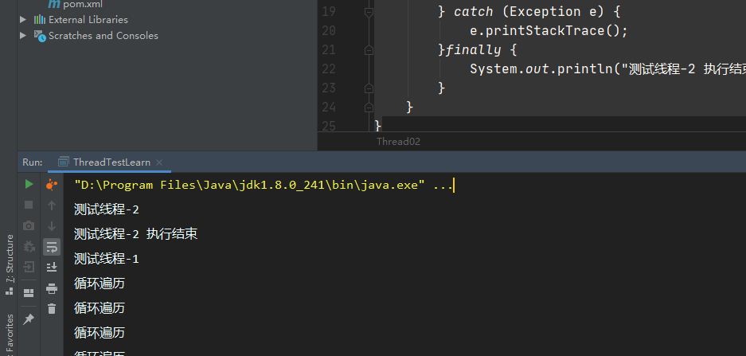
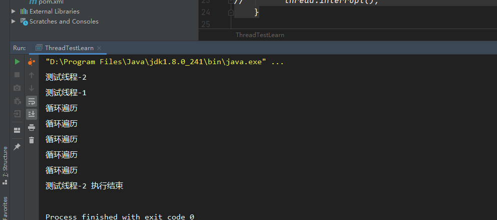
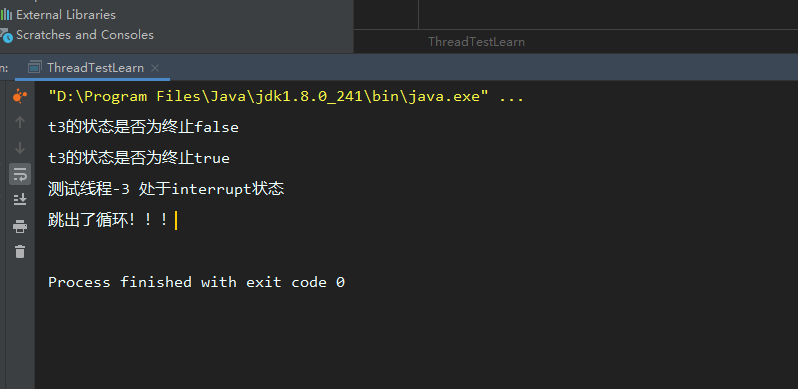
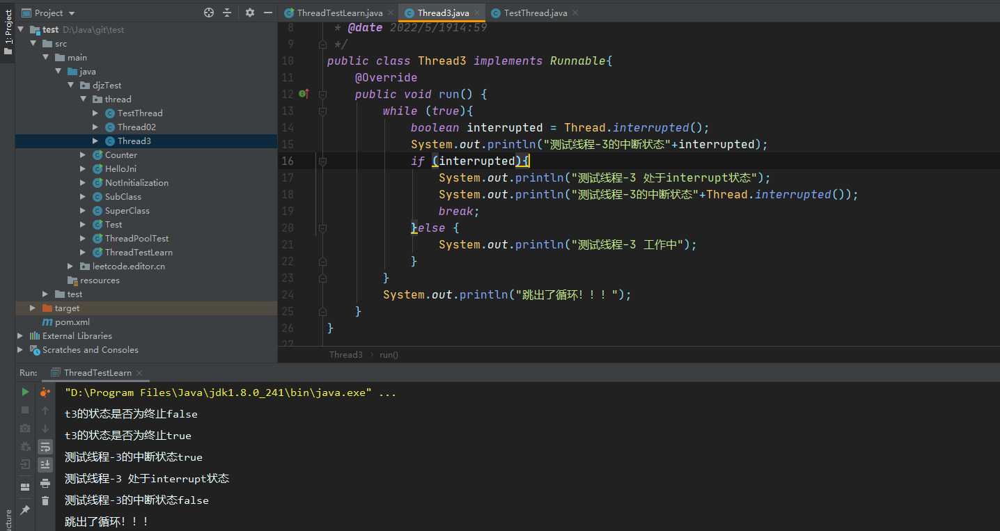
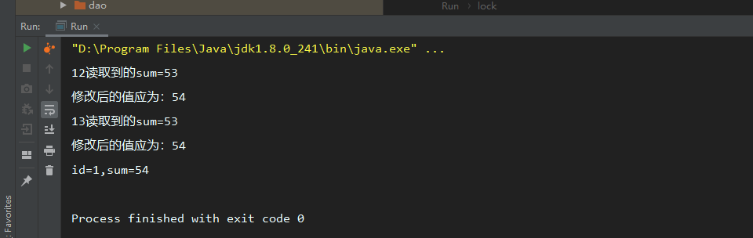
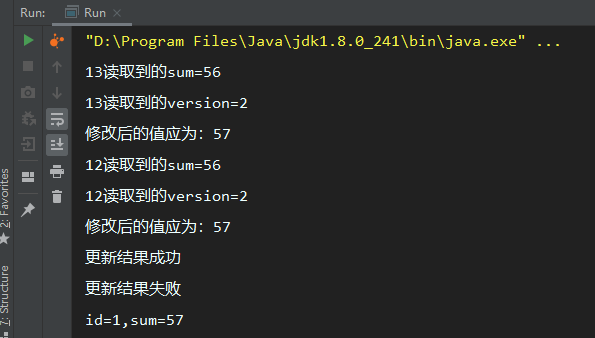

## Java基础

### JDK1.8的新特性

##### Lambda表达式

###### 是什么？

Lambda 表达式，也可称为闭包，它是推动 Java 8 发布的最重要新特性。

Lambda 允许把函数作为一个方法的参数（函数作为参数传递进方法中）。

使用 Lambda 表达式可以使代码变的更加简洁紧凑。

###### 语法

```txt
(parameters) -> expression
或
(parameters) ->{ statements; }
```

###### IDEA快捷键

alt+enter 可以将匿名内部类转换成Lambda表达式

###### 简单示例

```java
Collections.sort(userList, (a1, b1) -> b1.getAge()- a1.getAge());
Collections.sort(userList, new Comparator<User>() {
          @Override
          public int compare(User a, User b) {
              return b.getAge()-a.getAge();
          }
      });
```

##### 函数式接口

###### 是什么？

只包含一个抽象方法的接口，成为函数式接口。并且可以使用lambda表达式来创建该接口的对象，可以在任意函数式接口上使用@FunctionalInterface注解，来检测它是否是符合函数式接口。同时javac也会包含一条声明，说明这个接口是否符合函数式接口。

###### 自定义函数式接口

```
@FunctionalInterface
public interface fucInterface {
    
    public  void  test();
}

```

###### 优点

- 方便函数式编程
- 代码简洁
- 容易进行并行计算

###### 缺点

- 不容易调试
- 可读性查

##### 函数式编程

 内置的函数式接口都在 java.util.function包下  

| 接口                  | 参数   | 返回类型    | 说明                                       |
| ------------------- | ---- | ------- | ---------------------------------------- |
| Comsumer<T> 消费型接口   | T    | void    | 对T对象进行应用操作                               |
| Supplier<T> 供给型接口   | 无    | T       | `T get()`;返回类型T的对象                       |
| Function<T，R> 函数型接口 | T    | R       | `R apply（T，t）`；对T进行操作并返回R类型对象            |
| Predicate<T> 断言型接口  | T    | boolean | `boolean test(T t)` 对T 对象进行条件判断并返回boolean |

**简单使用示例**

```java
public static void main(String[] args) {
       //供给型接口函数创建一个User对象 
        Supplier<User> userSupplier = () -> new User();
        //声明一个断言型函数进行判断
        Predicate<User> p = user -> user.getAge()>10;
        User u =userSupplier.get();
        //声明一个操作型函数对user进行操作
         Consumer<User> c = user -> {
            user.setAge(5);
            System.out.println(u.toString());
        };
        c.accept(u);
        boolean test = p.test(u);
        System.out.println(test);
        //声明一个函数型接口 进行赋值操作并返回年龄
        Function<User,Integer> f = user -> {user.setAge(18); user.setName("xiaohong");return user.getAge();};

        System.out.println(f.apply(u));
    }
```

##### 方法引用和构造器引用

###### 方法引用

使用::来将方法名和对象隔开。属于是lambda的语法糖

```java
 FunctionGeneric<String> strName = s -> System.out.println(s);
 strName.fun("Lambda表达式没有使用方法引用");
        
        //方法引用
        FunctionGeneric<String> strName2 = System.out::println;
        strName2.fun("使用方法引用");

```

###### 构造器引用

使用说明：函数式接口参数列表和构造器参数列表要一致，该接口返回值类型也是构造器返回值类型

格式：ClassName :: new

```java
//构造器引用
        Function<String, Integer> fun1 = (num) -> new Integer(num);
        Function<String, Integer> fun2 = Integer::new;

        //数组引用
        Function<Integer,Integer[]> fun3 = (num) ->new Integer[num];
        Function<Integer,Integer[]> fun4 = Integer[]::new;
```

##### StreamAPI

###### 是什么？

位于java.util.stream包下。StreamAPI主要帮助我们更好的进行集合操作。对集合的操作进行流水线式的处理。可以理解为更加高级的迭代器。

###### 特点

- 不存储对象
- 不改变源对象
- 操作具有延迟性。

###### 创建一个Stream

```java
//通过集合创建流
List<Integer> list =new ArrayList<>();
Stream<Integer> stream1 = list.stream();
//通过数组创建流
String[] strs= new String[10];
Stream<String> stream = Arrays.stream(strs);
//Stream.of 创建流
 Stream<String> a = Stream.of("a", "b");
//创建无限制流
 Stream.generate(Math::random);
        Stream<Integer> iterate = Stream.iterate(1, t -> t + 2);
```

###### 流的中间操作

| 方法                              | 说明                                   |
| ------------------------------- | ------------------------------------ |
| filter(Predicate p)             | 过滤器，接收断言，根据断言进行过滤处理                  |
| distinct()                      | 筛选,通过流生成元素的hashCode和equals方法取出相同元素   |
| limit(long maxSize)             | 截断流，使其长度不超过上限                        |
| skip(long n)                    | 跳过元素，返回丢弃前n个元素的流。若流中元素不足n个。返回空流。     |
| map（Function f）                 | 接收一个函数，会被应用到每一个元素上，生成新的stream        |
| mapToDouble(toDoubleFunction f) | 接收一个函数，会被应用到每一个元素上，生成新的DoubleStream  |
| mapToInt(toIntFunction  f)      | 接收一个函数，会被应用到每一个元素上，生成新的IntStream     |
| mapToLong(toLongFunction f)     | 接收一个函数，会被应用到每一个元素上，生成新的LongStream    |
| flatMap(Function f)             | 接收一个函数，将流中的所有元素转换成另一个元素，然后将所有的流连城一个流 |
| sorted()                        | 排序                                   |
| sorted(Comparator comp)         | 比较器排序                                |

###### 流的终止操作

| 方法                                | 说明                                       |
| --------------------------------- | ---------------------------------------- |
| allMatch(Predicate p)             | 检测元素是否全部匹配                               |
| anyMatch(Predicate p)             | 检测是否至少有一个元素匹配                            |
| noneMatch(Predicate p)            | 检测是否不包含匹配元素                              |
| findFirst()                       | 返回第一个元素                                  |
| findAny()                         | 返回当前流中的任意一个元素                            |
| count（）                           | 返回流中元素总数                                 |
| Max(Comparator comp）              | 返回最大值                                    |
| Min(Comparator comp)              | 返回最小值                                    |
| forEach(Consumer c)               | 内部迭代                                     |
| reduce(T iden, BinaryOperation b) | 提供一个跟Stream中数据同类型的初始值identity，通过累加器accumulator迭代计算Stream中的数据，得到一个跟Stream中数据相同类型的最终结果 |
| reduce(BinaryOperation b)         | 对Stream中的数据通过累加器accumulator迭代计算，最终得到一个Optional对象 |

###### 简单使用

```java
//使用流创建三个对象
User a = new User("a",10);
User b = new User("c",10);
User c = new User("c",10);
Stream<User> userStream = Stream.of(a, b, c);
List<User> collect = userStream.collect(Collectors.toList());
System.out.println(collect.size());
        //创建流
        User a = new User("a",10,"man");
        User b = new User("b",18,"man");
        User c = new User("c",20,"man");
        Stream<User> userStream = Stream.of(a, b, c);
       //通过流进行排序
        userStream.sorted().forEach(System.out::println);
```

### 反射

#### 介绍

反射是Java的一种语言特性。它允许Java程序在运行期间对自身进行检查。被private封装的资源只能类内部访问，外部无法访问。但是通过使用反射，可以直接操作类私有属性。反射可以在类运行的时候获取一个类的所有信息，并且操作类的字段、方法、构造器等部分。

#### 常用API

##### 获取class的方法

1.调用某个类的对象的getClass()方法，即：对象.getClass()；

```java
Student st =new Student();
Class<? extends Student> stClass = st.getClass();
```

2.调用类的class属性类获取该类对应的Class对象，即：类名.class

```java
Class<Student> studentClass = Student.class;
```

3.使用Class类中的forName()静态方法（最安全，性能最好）即：Class.forName(“类的全路径”)

```java
Class<?> aClass = Class.forName("reflect.Student");
```

4.通过类构造器获取

```java
Class clazz = ClassLoader.loadClass("cn.javaguide.TargetObject");
```

##### 常用方法

```java
//获取包名、类名  以reflect.Student对象为例
clazz.getPackage().getName()//包名   reflect
clazz.getSimpleName()//类名  Student
clazz.getName()//完整类名  reflect.Student
clazz.getClassLoader()//获取类加载器
//获取成员变量定义信息
getFields()//获取所有公开的成员变量,包括继承变量   public java.lang.String reflect.Student.sex
getDeclaredFields()//获取本类定义的成员变量,包括私有,但不包括继承的变量
getField(变量名)//获取公开成员
getDeclaredField(变量名)//获取成员变量。包括private修饰的对象
 
//获取构造方法定义信息
getConstructor(参数类型列表)//获取公开的构造方法
getConstructors()//获取所有的公开的构造方法
getDeclaredConstructors()//获取所有的构造方法,包括私有
getDeclaredConstructor(int.class,String.class)
 
//获取方法定义信息
getMethods()//获取所有可见的方法,包括继承的方法
getMethod(方法名,参数类型列表)
getDeclaredMethods()//获取本类定义的的方法,包括私有,不包括继承的方法
getDeclaredMethod(方法名,int.class,String.class)
 
//反射新建实例
clazz.newInstance();//执行无参构造创建对象
clazz.newInstance(222,"韦小宝");//执行有参构造创建对象
clazz.getConstructor(int.class,String.class)//获取构造方法
 
//反射调用成员变量
clazz.getDeclaredField(变量名);//获取变量
clazz.setAccessible(true);//使私有成员允许访问
f.set(实例,值);//为指定实例的变量赋值,静态变量,第一参数给null
f.get(实例);//访问指定实例变量的值,静态变量,第一参数给null
 
//反射调用成员方法
Method m = Clazz.getDeclaredMethod(方法名,参数类型列表);
m.setAccessible(true);//使私有方法允许被调用
m.invoke(实例,参数数据);//让指定实例来执行该方法
```

##### 简单使用示例

###### 使用反射创建一个对象

```java
Class<?> clazz = Class.forName("reflect.Student");
Constructor<?> c = clazz.getConstructor();
Student xiaohong = (Student)c.newInstance();
xiaohong.setName("小红");
```

###### 使用反射对象修改私有属性。

```java
//创建一个小红的学生
Class<?> clazz = Class.forName("reflect.Student");
Constructor<?> c = clazz.getConstructor();
Student xiaohong = (Student)c.newInstance();
xiaohong.setName("小红");
xiaohong.setSex("男");
//使用反射修改性别为女
Field sex = clazz.getDeclaredField("sex");
sex.set(xiaohong,"女");
System.out.println(xiaohong.getSex());
```

#### 常见面试问题

##### 什么是反射？

反射是Java的一种语法特性，这种特性允许Java在程序运行期间，对类进行自我检测。可以获取到类的所有信息。包括所有属性、变量、构造器。同时允许对这些信息进行操作。

##### 什么是Java序列化？

将Java程序以一串字符的形式保存到磁盘上。称为Java序列化。

##### 什么是反序列化？

将保存在磁盘文件中的java字节码重新转换成java对象称为反序列化。  使用`transient ` 关键字可以指定不想要序列化的字段

##### 为什么要序列化

1.将对象转化成字节流可以方便传输、存储

2.序列化不仅可以保存对象。还可以存储对象的引用对象数据

3.可以实现分布式对象。

### 老生常谈的面向对象

##### 是什么？

面向对象是一种思想，相对于面向过程而言。将某一类具有相同行为与属性的事物看做同一种对象。

##### 为什么？(面向对象的好处)

面向对象的思想更符合我们日常的行为习惯，开发效率也会更高。可以提高系统的可维护性、可扩展性、可重用性。

**可维护性 **：面向对象的思想开发会将程序分隔成不同的对象。每个对象具有不同的功能。当某一功能需要修改时，我们仅仅需要对该对象下的某个方法做变更即可。降低了维护成本。

**可扩展性** ：主要体现的Java面向对象的三大特征上：封装、继承、多态。将程序封装成对象。对象之间可以继承。在原有的类基础上，子类继承了父类的方法。同时可以在子类上进行更多的功能开发。

**多态 **是建立在继承的基础上的。要满足三个条件：

- 继承，必须有子类继承父类
- 重写，子类重写父类方法
- 向上转型，子类的引用赋值给父类对象。

**可重用性** :  常说的复用，因为代码被封装成了不同的对象。在需要执行某一操作时，仅仅需要调用该操作下对应方法即可。

##### 怎么做？(对象的实现过程)

Java中使用new关键字来创建对象。

### 基本数据类型及运算符

##### 基本类型

| 基本类型    | 大小     | 包装类型    |
| ------- | ------ | ------- |
| boolean |        | Boolean |
| char    | 16bit  | Char    |
| byte    | 8bits  | Byte    |
| short   | 16bits | Short   |
| int     | 32bits | Integer |
| long    | 64bits | Long    |
| float   | 32bits | Float   |
| double  | 64bits | Double  |
| void    |        | Void    |

##### 按位运算符

```java
&  与操作
|  或操作
^  异或操作
&=
|=
```

##### 移位操作符

进行二进制的位移操作。

```java
>> 有符号右移
<< 有符号左移
>>> 无符号右移
<<< 有符号左移
```

#### 对象引用类型

##### 强引用

强引用不会被GC回收，并且在java.lang.ref里也没有实际的对应类型 如：Object obj = new Object();

##### 软引用

被软引用的对象，如果内存空间足够，垃圾回收器不会回收，如果内存空间不足， 垃圾回收器将回收这些对象占用的内存空间，软件引用对应着java.lang.ref.SoftReference 类，一个对象如果要被软引用 只需将其作为参数传入

```java
SoftReference<Object> softRef =new SoftReference(obj);
```

##### 弱引用

与前面的软引用相比，被弱引用了的对象拥有更短的内存时间(生命周期)。垃圾回收器一旦发现了被弱引用 的对象，不管当前内存空间是不是足够，都会回收他的内存，弱引用使用方法与软引用类似，但回收策略不同。

##### 虚引用

虚引用不是一种真实可用的引用类型，完全可以视为一种“形同虚设”的引用类型。 设计虚拟引用的目的在于结合引用关联队列，实现对对象引用关系的跟踪。虚引用对应着 java.lang.ref.PhantomReference 类 一个对象如果要被虚引用，只要将其作为参数传入PhantomReference 类的构造方法中就行了，同时作为参数传入的还有引用关联队列 java.lang.ref.ReferenceQueue 的对象实例。虚引用的用法： SoftReference,WeakReference,PhantomReference 类都继承自 java.lang.ref.Reference 抽象类。

### 为什么说Java只有值传递？

#### 基本数据类型和对象引用类型的区别

基本数据类型存储在栈内存中。

对象引用类型变量引用存放在栈中，实际对象存储在堆内存中。

#### 值传递

方法调用的时候，实际参数将数值传递给形参，形参获得的是数据副本。形参数据更改不会影响实际参数的值。

#### 引用传递

方法调用时，实际参数的引用（是指地址，而不是参数的值）被传递给方法中相应的形式参数，函数接收到的是原始值的内存地址，在方法中，形参与实参的内容相同，方法中对形参的处理会影响实参的值。

#### 举例说明

##### 案例1：传递基本数据类型参数

```java
public class test {

    public static void main(String[] args) {
      int sum1=1;
      int sum2=2;
      swap(a,b);
        System.out.println(sum1);
        System.out.println(sum2);
    }
    public  static  void  swap(int a,int b){
        int c=a;
        a=b;
        b=c;
    }

}
```

**输出结果**：

```java
1
2
Process finished with exit code 0
```

可以发现，`swap` 中的a、b互换的操作并没有影响到`sum1` 和`sum2` 的值。因为a、b只是`sum1` 和`sum2` 的副本。

##### 案例2：传递引用类型参数

```java
public class test {

    public static void main(String[] args) {
     int[] array={1,2,3,4};
        System.out.println(array[0]);
     change(array);
        System.out.println(array[0]);
    }

    private static void change(int[] ars) {
        ars[0]=2;
    }

}
```

**输出结果：** 

```java
1
2

Process finished with exit code 0
```

此时我们发现`change` 中改变array[0] 的操作生效了。`ars` 同样是 `array` 的副本。只不过副本的内容是存储地址。即`array` 与 `ars` 指向同一个数组。这也就说明了为什么方法内部对形参的修改会影响到实参。

##### 总结

Java 中将实参传递给方法（或函数）的方式是 **值传递** ：

- 如果参数是基本类型的话，很简单，传递的就是基本类型的字面量值的拷贝，会创建副本。
- 如果参数是引用类型，传递的就是实参所引用的对象在堆中地址值的拷贝，同样也会创建副本。

### 重载和重写

##### 重载

方法名称相同，参数不同的处理叫做重载。重载的方法在同一个类中。

##### 重写

方法名称参数相同，重写了方法体中的实现叫做重写。重写发生在继承的父子直接。或者接口实现

### 初始化顺序

遵循先父后子，变量优于块，静态优于非静态

- 父类静态变量
- 父类静态代码块
- 子类静态变量
- 子类静态代码块
- 父类非静态变量
- 父类非静态代码块
- 父类构造函数
- 子类非静态变量
- 子类非静态代码块
- 子类构造函数

### 权限控制

**public**  任何人都可以访问

**protected** 

- 基类（父类）的protected成员（包括成员变量个成员方法）对本包内可见，并且对子类可见；
- 若子类与基类（父类）不在同一包中，那么在子类中，只有子类实例可以访问其从基类继承而来的protected方法，而在子类中不能访问基类实例（对象）（所调用）的protected方法。
- 不论是否在一个包内，父类中可以访问子类实例（对象）继承的父类protected修饰的方法。（子父类访问权限特点：父类访问域大于子类）
- 若子类与基类（父类）不在同一包中,子类只能在自己的类（域）中访问父类继承而来的protected成员，无法访问别的子类实例（即便同父类的亲兄弟）所继承的protected修饰的方法。
- 若子类与基类（父类）不在同一包中，父类中不可以使用子类实例调用（父类中没有）子类中特有的（自己的）protected修饰的成员。（毕竟没有满足同一包内和继承获得protected成员的关系）

**private**  除了当前类，其他人均不可访问

### String和StringBuilder和StringBuffer的区别

StringBuffer 是线程安全的。底层使用了synchronized关键字

StringBuilder 不是线程安全的。

String创建之后不会更改，我们常做的+=操作底层实现是new StringBuilder 来完成的。

在进行字符串的+=操作时，通常使用StringBuffer或者StringBuilder的效率会更高。

### throw和throws的区别

throw在方法中表示抛出异常。

throws 修饰函数名，表示该方法可能抛出异常。

```java
    public static void main(String[] args) throws Exception{
        System.out.println(test());
       try {
           
       }catch (Exception e){
           throw e;
       }
    }

```

### Java中的异常

分为Error和Exception

Error：编译时异常及系统错误

Exception：可以抛出异常的基本类型

### String能否被继承

不能被继承，因为final修饰了类

### Final、Finally和Finalize

final 用于声明 属性(属性不可交变)、方法(方法不可覆盖)、类(类不可继承)。

finally 是 异常处理语句结构 的一部分，不管是否有异常，他的语句总是执行。

finalize 是Object类的一个方法，主要是在收集器执行的时候会调用被回收对象的此方法，进行资源回收，例如关闭文件等。

### Integer == int  结果

结果为false  

- 比较对象为基本数据类型，则比较的是存储的值
- 如果是引用类型，则比较所指向的对象的地址值是否相等。（引用类型本事是指向一个地址值）

equals()

不能比较基本数据类型。比较的是引用类型的变量所指向的对象的地址值

### 集合

#### Java集合类图结构



从上图可以看出，Java的集合主要分为两大类。一类是Collection接口，存放单一元素；一类是Map接口，主要存放键值对。从上图可以看出。Collection接口继承了Iterable接口。被Queue、List、Set继承。

注：上图仅仅列举了工作中常用的一些集合。

#### List、Set、Queue、Map的区别

- List：存储有序、可重复的元素
- Set：无序、不可重复的元素
- Queue：队列，存储元素遵循先进先出原则。有序、重复。
- Map：存储键值对，key不可重复、无序。Value可重复，无序。

#### 数据结构

##### List

- `ArrayList`  : Object[]
- `LinkedList` :双向链表
- `Vector` :  Object[]   

##### Set

- `HashSet`(无序、唯一)：基于HashMap实现，底层使用了HashMap存储数据
- `TreeSet` (有序、唯一): 红黑树（自平衡二叉树）
- `LinkedHashSet`: LinkedHashSet 是 HashSet 的子类，并且其内部是通过 LinkedHashMap 来实现的。有点类似于我们之前说的 LinkedHashMap 其内部是基于 HashMap 实现一样，不过还是有一点点区别的

##### Queue

- `ArrayQueue`:`Object[]` 数组 + 双指针
- `PriorityQueue`:`Object[]` 数组实现双叉堆

##### Map

- `HashMap`:JDK1.7主要是数组加链表的结构。JDK1.8之后改为数组加链表加红黑树的结构。
- `LinkedHashMap`:LinkedHashMap 继承自 HashMap，所以它的底层仍然是基于拉链式散列结构即由数组和链表或红黑树组成。另外，LinkedHashMap 在上面结构的基础上，增加了一条双向链表，使得上面的结构可以保持键值对的插入顺序。同时通过对链表进行相应的操作，实现了访问顺序相关逻辑。
- `Hashtable`： 数组+链表组成的，数组是 `Hashtable` 的主体，链表则是主要为了解决哈希冲突而存在的
- `TreeMap`： 红黑树（自平衡的排序二叉树）

#### Collection下的List及其实现类

##### ArrayList 、Vector的区别

- `ArrayList ` 底层实现是`Object[]` 线程不安全，适用于频繁查找的使用场景
- `Vector` 底层实现同样是`Object[]` 线程安全，使用了`synchronized` 关键字。

##### ArrayList和LinkedList的区别

- **是否线程安全：** 二者都不是线程安全的。
- **底层数据结构：** `ArrayList ` 底层实现是`Object[]`,`LinkedList` :双向链表.
- **插入与删除是否受元素位置影响：** 

​      `ArrayList` 采用数组存储，所以插入和删除元素的时间复杂度受元素位置的影响。 比如：执行`add(E e)`方法的时候， `ArrayList` 会默认在将指定的元素追加到此列表的末尾，这种情况时间复杂度就是 O(1)。但是如果要在指定位置 i 插入和删除元素的话（`add(int index, E element)`）时间复杂度就为 O(n-i)。因为在进行上述操作的时候集合中第 i 和第 i 个元素之后的(n-i)个元素都要执行向后位/向前移一位的操作。

​     `LinkedList` 采用链表存储，所以，如果是在头尾插入或者删除元素不受元素位置的影响（`add(E e)`、`addFirst(E e)`、`addLast(E e)`、`removeFirst()` 、 `removeLast()`），时间复杂度为 O(1)，如果是要在指定位置 `i` 插入和删除元素的话（`add(int index, E element)`，`remove(Object o)`）， 时间复杂度为 O(n) ，因为需要先移动到指定位置再插入。

- **是否支持快速随机访问：**`ArrayList` 支持快速随机访问。`LinkedList` 不支持。快速随机访问就是通过元素的序号快速获取元素对象(对应于get(int index)方法)。`LinkedList` 虽然也有`get(int index)` 方法，底层实现是通过遍历链表来实现的。
- **内存占用方面：** `ArrayList` 主要是会预留一部分的使用空间，`LinkedList` 则是本身存储的内容比较多，包括前驱后继节点等信息。

##### ArrayList和LinkedList的使用选择

###### 需要扩容的情况

ArrayList 插入指定位置或者末尾位置很快。但是数量大的时候需要扩容。LinkedList不存在扩容问题。但是向指定位置插入因为要遍历链表会降低效率。

###### 不需要扩容的情况

ArrayList指定位置插入数据。需要将后续数据移动。效率相对较慢。LinkedList不需要移动。

**综上**：如果需要频繁在中间位置插入数据。使用LinkedList会好一些。如果插入场景少，经常查询通常使用ArrayList。

Vector的方法大多都使用了synchronized 关键字。所以是线程安全的。它扩容会扩容两倍。ArrayList会扩容1.5呗。

##### ArrayList的扩容机制

请看[ArrayList的扩容机制](ArrayList的扩容机制原理.md)

#### Collection下的Set及其实现类

##### 比较 HashSet、LinkedHashSet 和 TreeSet 三者的异同

- `HashSet`、`LinkedHashSet` 和 `TreeSet` 都是 `Set` 接口的实现类，都能保证元素唯一，并且都不是线程安全的。
- `HashSet`、`LinkedHashSet` 和 `TreeSet` 的主要区别在于底层数据结构不同。`HashSet` 的底层数据结构是哈希表（基于 `HashMap` 实现）。`LinkedHashSet` 的底层数据结构是链表和哈希表，元素的插入和取出顺序满足 FIFO。`TreeSet` 底层数据结构是红黑树，元素是有序的，排序的方式有自然排序和定制排序。
- 底层数据结构不同又导致这三者的应用场景不同。`HashSet` 用于不需要保证元素插入和取出顺序的场景，`LinkedHashSet` 用于保证元素的插入和取出顺序满足 FIFO 的场景，`TreeSet` 用于支持对元素自定义排序规则的场景。

#### Collection下的Queue及其实现类

##### Queue 与 Deque 的区别

`Queue` 是单端队列，只能从一端插入元素，另一端删除元素，实现上一般遵循 **先进先出（FIFO）** 规则。

`Queue` 扩展了 `Collection` 的接口，根据 **因为容量问题而导致操作失败后处理方式的不同** 可以分为两类方法: 一种在操作失败后会抛出异常，另一种则会返回特殊值。

| `Queue` 接口 | 抛出异常      | 返回特殊值      |
| ---------- | --------- | ---------- |
| 插入队尾       | add(E e)  | offer(E e) |
| 删除队首       | remove()  | poll()     |
| 查询队首元素     | element() | peek()     |

`Deque` 是双端队列，在队列的两端均可以插入或删除元素。

`Deque` 扩展了 `Queue` 的接口, 增加了在队首和队尾进行插入和删除的方法，同样根据失败后处理方式的不同分为两类：

| `Deque` 接口 | 抛出异常          | 返回特殊值           |
| ---------- | ------------- | --------------- |
| 插入队首       | addFirst(E e) | offerFirst(E e) |
| 插入队尾       | addLast(E e)  | offerLast(E e)  |
| 删除队首       | removeFirst() | pollFirst()     |
| 删除队尾       | removeLast()  | pollLast()      |
| 查询队首元素     | getFirst()    | peekFirst()     |
| 查询队尾元素     | getLast()     | peekLast()      |

事实上，`Deque` 还提供有 `push()` 和 `pop()` 等其他方法，可用于模拟栈。

```java
    public static void main(String[] args) {
      int[] arr =new int[]{1,8,6,2,5,4,8,3,7};
        //队列模拟栈时，队首为栈底。队尾为栈顶
        Deque<Integer> monoStack= new ArrayDeque();

        for (int i : arr) {
            //将数据依次插入队首，插入栈顶
            monoStack.push(i);
        }
        //查询队首，即查询栈顶
        System.out.println(monoStack.peekFirst());
        //查询队尾，即查询栈底
        System.out.println(monoStack.peekLast());
        //查询队首，即查询栈顶
        System.out.println(monoStack.peek());
        //弹出队首，即弹出栈顶
        System.out.println(monoStack.pollFirst());
        //弹出队尾，即弹出栈底
        System.out.println(monoStack.pollLast());
        //弹出队首，即弹出栈顶
        System.out.println(monoStack.poll());
        //弹出栈顶
        System.out.println(monoStack.pop());
    }
```


##### ArrayDeque 与 LinkedList 的区别

ArrayDeque 和 LinkedList 都实现了 Deque 接口，两者都具有队列的功能，但两者有什么区别呢？

ArrayDeque 是基于可变长的数组和双指针来实现，而 LinkedList 则通过链表来实现。

ArrayDeque 不支持存储 NULL 数据，但 LinkedList 支持。

ArrayDeque 是在 JDK1.6 才被引入的，而LinkedList 早在 JDK1.2 时就已经存在。

ArrayDeque 插入时可能存在扩容过程, 不过均摊后的插入操作依然为 O(1)。虽然 LinkedList 不需要扩容，但是每次插入数据时均需要申请新的堆空间，均摊性能相比更慢。

从性能的角度上，选用 ArrayDeque 来实现队列要比 LinkedList 更好。此外，ArrayDeque 也可以用于实现栈。

#####说一说 PriorityQueue
PriorityQueue 是在 JDK1.5 中被引入的, 其与 Queue 的区别在于元素出队顺序是与优先级相关的，即总是优先级最高的元素先出队。

这里列举其相关的一些要点：

PriorityQueue 利用了二叉堆的数据结构来实现的，底层使用可变长的数组来存储数据
PriorityQueue 通过堆元素的上浮和下沉，实现了在 O(logn) 的时间复杂度内插入元素和删除堆顶元素。
PriorityQueue 是非线程安全的，且不支持存储 NULL 和 non-comparable 的对象。
PriorityQueue 默认是小顶堆，但可以接收一个 Comparator 作为构造参数，从而来自定义元素优先级的先后。
PriorityQueue 在面试中可能更多的会出现在手撕算法的时候，典型例题包括堆排序、求第K大的数、带权图的遍历等，所以需要会熟练使用才行。

#### Map

##### HashMap

###### 关键参数

| initialCapacity | 负载因子  默认为0.75 |
| --------------- | ------------- |
| initialCapacity | 初始容量  默认是16   |
| threshold       | 临界值，大于该参数需要扩容 |

threshold =initialCapacity * initialCapacity

###### HashMap实现 JDK1.7

底层实现是数组+链表的方式实现的

###### HashMap实现JDK1.8

数组+链表+红黑树实现的

###### put方法的实现

1.调用hash()方法，在hash()中，通过hashCode()计算出key的一个hash值，与hash值右移16位结果做异或运算。（`hash^(hash>>>16)`）得到一个hash值。

```markdown
**这里为什么要做异或运算?**
异或运算能更好的保留各部分的特征，如果采用&运算计算出来的值会向0靠拢，采用|运算计算出来的值会向1靠拢
**为什么要右移16位呢?**
int 类型是4字节 32比特。底层二进制是32位的二进制串，当nodeTable长度过小时，做异或运算。高位就全部为0.导致高位的字节无法参与到后续的运算中。容易发生hash碰撞。
```

2.nodeTable长度为0或者数组为null，就调用resize()重新分配大小。

3.通过hash与nodeTable.length-1做与运算求得数组下标。当前nodeTable[index]为null 就将new一个节点插入到该位置。

4.nodeTable[index]不为空，比较两个节点的hash值。hash值一致，比较key值。如果还一致，将该节点的value替换成输入值。key值不一致时，判断headNode是否是TreeNode类型。

5.是TreeNode类型，就调用TreeNode的put添加节点方法

```markdown

```

6.不是TreeNode,遍历链表，判断hash值，hash值一致就继续判断key。key一致就替换value。遍历到尾部，就添加这个节点到尾部。链表长度超过8个节点，就调用treeifyBin()转换成红黑树结构。转红黑树前会判断数组长度是否大于64.小于就resize  大于才转换

```markdown  
**为什么转换阈值设置为8**
链表的查询时间复杂度为O(n) 红黑树为O(log(n)) 如果 hashCode 分布良好，也就是 hash 计算的结果离散好的话，那么红黑树这种形式是很少会被用到的，因为各个值都均匀分布，很少出现链表很长的情况。在理想情况下，链表长度符合泊松分布，各个长度的命中概率依次递减，当长度为 8 的时候，概率仅为 0.00000006。

treeifyBin()的逻辑
  1.nodeTable的长度小于64 或者为null  调用resize()
  2.headnode不为空  遍历替换成TreeNode
  3.treeify（）
 
```

7.判断map的size大小是否超过threshold扩容大小。超过的话调用resize方法扩容

###### HashMap get方法的实现

1.通过key的hashCode计算hash值。与右移16位的结果做异或运算。得到数组下标。

2.获取数组下标处的元素。不存在返回null，存在节点就比较hash和key值，一致就返回value。

3.key不同的情况下，判断是否节点是TreeNode类型是调用getTreeNode()方法

4.不是TreeNode类型，遍历链表获取value。没有匹配返回null

###### HashMap扩容  resize

1.判断旧的一个节点数组大小是否大于0.

2.大于0就判断是否大于理论最大值。大于就将数组长度设置为Integer.Max。小于最大值且旧的数组长度大于16就将扩容大小设置为旧的 threshold大小左移1位的值。

3.遍历计算新的下标位置。同时判断节点是否为TreeNode节点。 是TreeNode走splite

4.不是TreeNode类型。与旧数组大小-1做与运算 结果为0的放在index不变。不为0的放在旧坐标+旧数组长度的坐标下。

```java
//   |= 位运算      
static final int tableSizeFor(int cap) {
        int n = cap - 1;
        n |= n >>> 1;
        n |= n >>> 2;
        n |= n >>> 4;
        n |= n >>> 8;
        n |= n >>> 16;
        return (n < 0) ? 1 : (n >= MAXIMUM_CAPACITY) ? MAXIMUM_CAPACITY : n + 1;
    }
```

##### 与hashTable的区别

###### 相同点

都实现了Map、Cloneable、Serializable的接口

###### 不同点

- hashtable 的key或value不允许是null，加了非空判断。 HashMap的key或value允许为null。
- 求取hash的算法不同。hashMap是自定义算法，在使用hashCode取到hash值后会与无符号右移16位结果做异或运算。hashTable直接使用的hashCode方法获取hash值
- Hashtable 继承的是 Dictionary类，而 HashMap 继承的是 AbstractMap 类
- 初始化容量不同：HashMap 的初始容量为：16，Hashtable 初始容量为：11，两者的负载因子默认都是：0.75。
- 扩容机制不同：当已用容量>总容量 * 负载因子时，HashMap 扩容规则为当前容量翻倍，Hashtable 扩容规则为当前容量翻倍 +1。
- 支持的遍历种类不同：HashMap只支持Iterator遍历,而HashTable支持Iterator和Enumeration两种方式遍历

##### 与HashSet的区别于联系

1. HashSet 的底层实现是HashMap
2. HashSet 实现了Set接口，HashMap实现了Map接口。存储的数据不同，Map存储的键值对。Set存储对象。

##### HashMap与TreeMap的区别

`TreeMap` 和`HashMap` 都继承自`AbstractMap` ，但是需要注意的是`TreeMap`它还实现了`NavigableMap`接口和`SortedMap` 接口。


实现 `NavigableMap` 接口让 `TreeMap` 有了对集合内元素的搜索的能力。

实现`SortedMap`接口让 `TreeMap` 有了对集合中的元素根据键排序的能力。默认是按 key 的升序排序，不过我们也可以指定排序的比较器。示例代码如下：

```java
public class Person {
    private Integer age;

    public Person(Integer age) {
        this.age = age;
    }

    public Integer getAge() {
        return age;
    }


    public static void main(String[] args) {
        TreeMap<Person, String> treeMap = new TreeMap<>(new Comparator<Person>() {
            @Override
            public int compare(Person person1, Person person2) {
                int num = person1.getAge() - person2.getAge();
                return Integer.compare(num, 0);
            }
        });
        treeMap.put(new Person(3), "person1");
        treeMap.put(new Person(18), "person2");
        treeMap.put(new Person(35), "person3");
        treeMap.put(new Person(16), "person4");
        treeMap.entrySet().stream().forEach(personStringEntry -> {
            System.out.println(personStringEntry.getValue());
        });
    }
}
```

输出：

```java
person1
person4
person2
person3
```

##### 重写equals方法的同时为什么要重写hashCode方法

相等的对象，他们的hash值必须相同。如果只重写equals方法。会导致判定一致，两个对象的hash值不一致。或者hash值一致。equals返回false的情况。(object的equals上的注释有规定)

```java
public class student {
    String  id;

    String name;

    @Override
    public int hashCode() {
        return Objects.hash(id, name);
    }

    @Override
    public boolean equals(Object o) {
        if (this == o) {return true;}
        if (o == null || getClass() != o.getClass()) {return false;}
        student student = (student) o;
        return id.equals(student.id) &&
                name.equals(student.name);
    }
}

```

##### ConcurrentHashMap

###### 为什么使用？

- HashMap不是线程安全的。多线程put数据，容易导致Entry形成环形的数据结构。进而出现死循环的现象
- HashTable是线程安全的，但是底层实现是使用的synchronized来实现的。线程竞争激烈的情况下效率低下，
- ConcurrentHashMap本身是分段加锁。因为是分段锁的技术。每段数据会单独存在锁。极大的降低了锁的竞争情况

###### 数据结构

1.8之前ConcurrentHashMap 由segment数组和HashEntry组成。segment是一种可重入锁。一个segment里包含一个HashEntry数组。

1.8优化移除了segment。Synchronized + CAS + Node   通过乐观锁来实现。

###### put

###### JDK1.7

先定位 Segment，再定位桶，put 全程加锁，没有获取锁的线程提前找桶的位置，并最多自旋 64 次获取锁，超过则挂起。

###### JDK1.8

跟hashMap的逻辑一致。先求hash值。通过与数组长度-1做与运算获得数组下标。判断该下标下是否有node。为空通过CAS进行操作。-1扩容。其他情况执行链表插入，插入过程加了synchronize关键字操作。

###### get

value 加了volatile关键字。

### Java IO基础知识总结

#### 简介

IO 即 Input/Output，输入和输出。数据输入到计算机内存的过程即输入，反之输出到外部存储（比如数据库，文件，远程主机）的过程即输出。数据传输过程类似于水流，因此称为 IO 流。IO 流在 Java 中分为输入流和输出流，而根据数据的处理方式又分为字节流和字符流。

#### 字节流

##### 简介

字节流主要操作Byte类型数据，以byte数组为准，主要操作类是`OutputStream` 和 `InputStream`

##### 字节输出流：OutputStream

`OutputStream`是整个IO包中字节输出流的最大父类。定义如下：

```java
public abstract class OutputStream implements Closeable, Flushable {}
```

由上可以看出`OutputStream` 是一个抽象类，使用时需要先实例化子类对象

###### 提供的常用方法

| 序号   |  类型  |                    方法                    |         描述          |
| ---- | :--: | :--------------------------------------: | :-----------------: |
| 1    |  普通  | public void close() throws IOException { } |        关闭输出流        |
| 2    |  普通  | public void flush() throws IOException { } |        刷新缓存区        |
| 3    |  普通  | public void write(byte b[]) throws IOException { } |   将一个byte数组写入数据流    |
| 4    |  普通  | public void write(byte b[], int off, int len){} | 将一个指定范围的byte数组写入数据流 |
| 5    |  普通  |   public abstract void write(int b){}    |     将一个字节写入数据流      |

###### 向文件写入字符串

```java
package IoTest.byteIo;

import java.io.File;
import java.io.FileOutputStream;
import java.io.IOException;
import java.io.OutputStream;

/**
 * @author djz
 * @Title: OutTest
 * @ProjectName djz-nacos
 * @Description: 向文件写入字符串
 * @date 2022/10/1314:14
 */
public class OutTest {

    public static void main(String[] args) throws IOException {
        File f =new File("test.txt");
        if (!f.exists()){
            f.createNewFile();
        }
        OutputStream out =new FileOutputStream(f);
        String str="Hello world";
        out.write(str.getBytes());
        out.close();
    }
}

```

##### 字节输入流：InputStream

定义如下：

```java
public abstract class InputStream implements Closeable {}
```

与`OutputStream` 一样，`InputStream` 也是抽象类，使用需要实例化子类对象。

###### 常用方法

| 序号   | 方法                                       | 类型   | 描述               |
| ---- | ---------------------------------------- | ---- | ---------------- |
| 1    | public void close() throws IOException {} | 普通   | 关闭输入流            |
| 2    | public int available() throws IOException {} | 普通   | 获取输入文件的大小        |
| 3    | public abstract int read() throws IOException; | 普通   | 读取内容             |
| 4    | public int read(byte b[])                | 普通   | 将读取的内容存放到byte数组中 |

###### 读取文件内容

```java
package IoTest.byteIo;


import java.io.File;
import java.io.FileInputStream;
import java.io.InputStream;

/**
 * @author djz
 * @Title: InTest
 * @ProjectName djz-nacos
 * @Description: TODO
 * @date 2022/10/1314:24
 */
public class InTest {
    public static void main(String[] args) throws Exception {
        File f = new File("test.txt");
        InputStream in = new FileInputStream(f);
        byte[] bytes = new byte[1024];
        int read = in.read(bytes);
        in.close();
        System.out.println(new String(bytes,0,read));
    }
}

```

#### 字符流

##### 简介

程序中一个字符等于两个字节，Java中提供了Reader和Writer两个字符流。

##### 字符输出流Writer

Writer本身是一个输出类，定义如下：

```java
public abstract class Writer implements Appendable, Closeable, Flushable
```

此类本身也是一个抽象类，要使用此类，需要实例化子类。

###### 常用方法

| 序号   | 方法                                       | 类型   | 描述      |
| ---- | ---------------------------------------- | ---- | ------- |
| 1    | abstract public void close() throws IOException; | 普通   | 关闭流     |
| 2    | abstract public void flush() throws IOException; | 普通   | 强制清空缓存  |
| 3    | public void write(String str) throws IOException | 普通   | 将字符串输入  |
| 4    | public void write(char cbuf[]) throws IOException | 普通   | 将字符数组输入 |

###### 向文件输入数据

```java
package IoTest.StrIo;

import java.io.File;
import java.io.FileWriter;
import java.io.Writer;

/**
 * @author djz
 * @Title: WriteTest
 * @ProjectName djz-nacos
 * @Description: TODO
 * @date 2022/10/1412:23
 */
public class WriteTest {

    public static void main(String[] args) throws  Exception {
        File f =new File("test.txt");
        Writer writer =new FileWriter(f);
        writer.write("nihao");
        writer.close();
    }
}
```

##### 字符出入流 Reader

Reader 是使用字符的方式从文件读取数据。定义如下：

```java
public abstract class Reader implements Readable, Closeable
```

###### 常用方法

| 序号   | 方法                                       | 类型   | 描述         |
| ---- | ---------------------------------------- | ---- | ---------- |
| 1    | abstract public void close() throws IOException; | 普通   | 关闭流        |
| 2    | public int read() throws IOException     | 普通   | 读取单个字符     |
| 3    | public int read(char cbuf[]) throws IOException | 普通   | 读取内容到字符数组中 |

###### 读取文件中内容

```java
package IoTest.StrIo;

import java.io.File;
import java.io.FileReader;

/**
 * @author djz
 * @Title: Reader
 * @ProjectName djz-nacos
 * @Description: TODO
 * @date 2022/10/1412:31
 */
public class Reader {
    public static void main(String[] args) throws  Exception {
        File f =new File("test.txt");
        java.io.Reader fileReader = new FileReader(f);
        char c[]=new char[1024];
        int read = fileReader.read(c);
        fileReader.close();
        System.out.println(new String(c,0,read));
    }
}

```

##### 字节流和字符流的区别

- 字节流在操作时，不会用到缓冲区，是直接对文件进行操作的。
- 字符流在操作是，使用了缓冲区，通过缓存操作文件。

当使用字符流操作文件写入内容时，不关闭字符流。打开文件发现文件没有写入的内容。而字节流不存在这样的问题。当使用字符流的`flush` 方法强制清空缓存。发现内容被输入到文件中。

#### 转换流

IO包除了提供字符流和字节流，还提供了字节字符转换流

- `OutputStreamWriter` 是Writer的子类。将输出的字符流转变为字节流。将一个字符流输出对象转变为字节流输出对象
- `InputStreamReader` 是Reader的子类。将输入的字节流转变为字符流。即将一个字节流的输入对象转变为字符流的输入对象

#### NIO

##### 简介

同步非阻塞性IO流

Netty


### 并发

#### 并发编程的三大要素

- 原子性     一个或多个操作要么全部执行，要么全部不执行
- 有序性    程序按照代码的顺序执行
- 可见性    多线程操作共享变量时，一个线程修改。其他线程要保证能立即看到。

#### Java内存模型

JMM是一个抽象概念。线程本地会有一个私有的本地内存。线程之间的共享变量会存放在主内存中。本地内存存放以读写的共享变量副本。通信过程如下：

- 线程A操作共享变量副本。也就是本地内存中的数据。将数据刷新到主内存
- 线程B去主内存读取A更新的数据。

#### 为什么会出现并发安全问题

多线程操作共享变量。线程A做了修改。修改内容未更新到主内存的过程中。B线程读取了主内存信息。

#### 如何保证线程安全

volatile和synchronized

#### 死锁的条件

- 互斥条件：进程要求对所分配的资源进行排它性控制，即在一段时间内某资源仅为一进程所占用。
- 请求和保持条件：当进程因请求资源而阻塞时，对已获得的资源保持不放。
- 不剥夺条件：进程已获得的资源在未使用完之前，不能剥夺，只能在使用完时由自己释放。
- 环路等待条件：在发生死锁时，必然存在一个进程–资源的环形链。

#### 主线程等待子线程执行结束的实现方法

- 子线程调用join（）
- while(t.isAlive) 判断子线程是否存活
- Thread.activeCount>1
- CountDownLatch 
- CyclicBarrier

### 多线程

#### 线程的状态

- NEW      新建，初始状态，在执行start方法之前。
- RUNNABLE   执行start方法，线程进入运行状态
- BLOCKED     阻塞状态，线程阻塞于锁
- WAITING   等待状态，当前线程需要等待其他线程完成一些状态   join
- TIME_WAITING  超时等待状态，达到指定时间继续向后执行
- TERMINATED   终止状态，线程执行完毕

#### 线程的常用方法说明

##### ThreadLocal

线程变量，以threadLocal为key绑定一个值到线程上。

```java
public class demo {
    private static final ThreadLocal<Long> TIME_THREADLOACL=new ThreadLocal(){
        @Override
        protected Object initialValue() {
            return System.currentTimeMillis();
        }
    };
    public static void main(String[] args) {
        Long aLong = demo.TIME_THREADLOACL.get();
        System.out.println(aLong);
    }
}
```

**适用于场景**

- 1、每个线程需要有自己单独的实例
- 2、实例需要在多个方法中共享，但不希望被多线程共享

常用于 耗时统计

##### join

A线程调用B线程，B线程执行join方法，则A线程被挂起直到B线程执行结束。示例如下

```java
//线程2启动中调用了线程1，线程1调用了join()方法。线程2被挂起
//线程1
public class TestThread implements Runnable {
    @Override
    public void run() {
        System.out.println("测试线程-1");
        for (int i = 0; i < 5; i++) {
            System.out.println("循环遍历");
        }
    }

    public TestThread() {
    }

}
//线程2
public class Thread02 implements Runnable{
    @Override
    public void run() {
        System.out.println("测试线程-2");
        TestThread testThread = new TestThread();
        Thread thread =new Thread(testThread);
        thread.start();
        try {
            thread.join();
        } catch (Exception e) {
            e.printStackTrace();
        }finally {
            System.out.println("测试线程-2 执行结束");
        }
    }
}

    public static void main(String[] args) throws Exception {

        Thread02 thread02=new Thread02();
        Thread t2 = new Thread(thread02);
        //开始方法
        t2.start();
        //

        //线程终止
//        thread.interrupt();
    }
```

将join的调用注释掉，结果如下



调用join方法后输出结果



##### start

线程的启动方法

##### interrupt

将线程设置为中断状态。如果线程处于阻塞状态（wait、sleep、join）会中断阻塞并抛出异常。如果非阻塞状态，会执行run结束然后终止。


##### isInterrupted

判断线程是否处于中断状态,当线程处于等待状态时，会抛出中断异常。

```java
//t3线程启动，如果不调用interrupt()方法，会一直循环下去，调用了interrupt（）方法。线程被设置为中断状态。在循环中使用Thread.interrupted()来获取当前线程的状态是否为中断，中断则执行break。结果打印出了 跳出循环的提示，说明interrupt只是设置状态。
public class Thread3 implements Runnable{
    @Override
    public void run() {
        while (true){
            if (Thread.interrupted()){
                System.out.println("测试线程-3 处于interrupt状态");
                break;
            }else {
                System.out.println("测试线程-3 工作中");
            }
        }
        System.out.println("跳出了循环！！！");
    }
}

    public static void main(String[] args) {
        Thread3 thread3=  new Thread3();
        Thread t3 = new Thread(thread3);
        t3.start();
        boolean interrupted = t3.isInterrupted();
        System.out.println("t3的状态是否为终止"+interrupted);
        t3.interrupt();
         interrupted = t3.isInterrupted();
        System.out.println("t3的状态是否为终止"+interrupted);
    }
```



##### stop

强制中断线程。会有线程安全问题。不建议使用

#### Thread类方法说明

##### Thread.Interruputed

获取当前类的是否中断，返回一个boolean 值并清空这个状态。如下图所示，两次调用获取状态不一致。



##### Thread.currentThread

获取当前线程

##### Thread.yield

让线程处于就绪状态。获取到资源后继续执行。不会重新开始执行run方法。

##### Thread.sleep

让线程进入睡眠状态。可以通过使用interrupt方法来唤醒\

```java
package djzTest.thread;

/**
 * @author djz
 * @Title: waitThread
 * @ProjectName djz-nacos
 * @Description: TODO
 * @date 2022/7/2511:52
 */
public class waitThread implements Runnable{
    @Override
    public void run() {
        try {
            Thread.sleep(10000);
        } catch (InterruptedException e) {
            e.printStackTrace();
        }
        while (true){

            System.out.println("============线程执行中==============");

        }

    }
}

```

```java
public class main {

    public static void main(String[] args) throws InterruptedException {
        waitThread w =new waitThread();
        Thread t =new Thread(w);
        t.start();
        t.interrupt();
//        t.wait();
    }
}
```

#### 线程的等待问题

##### 使用wait方法。

1. wait方法需要获取到锁。所以必须有同步代码块。必须配合synchronized关键字
2. wait会释放锁。notify不会。notify和wait的调用对象要一致。都是锁对象

```java
import java.util.ArrayList;
import java.util.List;

/**
 * @author djz
 * @Title: main
 * @ProjectName djz-nacos
 * @Description: TODO
 * @date 2022/7/2511:53
 */
public class main {

    private static Object obj =new Object();


    private volatile static List list =new ArrayList();

    public static void main(String[] args)  {

        Thread t1 = new Thread(new Runnable() {
            @Override
            public void run() {
                System.out.println("t1启动");
                synchronized (obj) {
                    System.out.println("t1获取到锁");
                    try {
                        if (list.size()<10){
                            System.out.println("t1进入等待状态");
                            obj.wait(10000);
                            System.out.println("t1解除等待状态");
                        }
                    } catch (InterruptedException e) {
                        e.printStackTrace();
                    }
                    System.out.println("t1收到通知");
                    System.out.println("t1运行中");
                }

            }
        });

        Thread t2 = new Thread(new Runnable() {
            @Override
            public void run() {
                System.out.println("t2启动");
                synchronized (obj) {
                    System.out.println("t2获取到锁");
                    for (int i = 0; i < 100; i++) {
                        list.add(i);
                    }
                    System.out.println("t2运行中");
                    if (list.size()>0){
                        try {
                            obj.notify();
                        } catch (Exception e) {
                            e.printStackTrace();
                        }
                        System.out.println("发送通知唤醒t1");
                    }
                    System.out.println("t2运行结束");
                }
            }
        });

        t1.start();
        t2.start();
    }

```

- sleep 方法睡眠。interrupt 方法 需要捕获异常

```java
ppublic class main {

    public static void main(String[] args) throws InterruptedException {
        int i = 10;
        Thread t1 = new Thread(new Runnable() {
            @Override
            public void run() {

                synchronized (main.class) {
                    try {
                        Thread.sleep(10000);
                    } catch (InterruptedException e) {
                        e.printStackTrace();
                    }
                    System.out.println("t1运行中");
                }

            }
        });

        Thread t2 = new Thread(new Runnable() {
            @Override
            public void run() {
                synchronized (main.class) {

                    System.out.println("t2运行中");
                }
            }
        });

        t1.start();
        t2.start();
        t1.interrupt();
//        t1.wait(10000);

    }
}

```

#### 线程中断问题

- 使用stop 强制中断线程。
- 使用interruput 设置中断状态。并在程序中捕获中断异常来完成中断操作
- 人为的设置中断标识，可以使用volatile关键字定义静态变量来实现。

```java
public class Shutdown {

    public static void main(String[] args) throws InterruptedException {
        Runner one = new Runner();
        Thread countThread =new Thread(one,"CountThread");
        countThread.start();
        TimeUnit.SECONDS.sleep(1);
        countThread.interrupt();
        Runner two=new Runner();
        countThread = new Thread(two,"CountThread");
        countThread.start();
        TimeUnit.SECONDS.sleep(1);
        two.cancel();
    }
    private static  class Runner implements Runnable{
        private long i;
        private volatile  boolean on =true;

        @Override
        public void run() {
            while (on &&!Thread.currentThread().isInterrupted()){
                i++;
            }
            System.out.println("Count i= "+i);
        }
        public void  cancel(){
            on =false;
        }
    }
}
```


#### volatile

##### 定义

Java编程语言允许线程访问共享变量，为了确保共享变量能够被准确和一致地更新，线程应该确保通过排他锁单独获取这个变量。

Java字段被该变量声明，则所有线程看到这个变量的值是一致的。

##### 实现原理

被volatile修饰的的变量，在转换为汇编语言的时候，会多出Lock前缀的指令。处理器在处理Lock前缀指令的时候会做两件事情：

- 将当前处理器的缓存行的数据写回到系统内存中。
- 写回内存的操作会因为缓存一致性协议导致其他CPU里缓存的内存地址无效。

##### volatile优化

JDK7中新增了LinkedTransferQueue。使用了追加字节的方式来进行了出队和入队的性能优化。

#### synchronized

- 修饰同步方法，锁对象是当前示例对象。
- 修饰静态同步方法，锁对象是当前类的class对象。
- 修饰同步方法块，锁对线是Synchronized括号里配置的对象。

##### 实现原理

JVM基于进入和退出monitor对象来实现同步。也就是monitorenter和monitorexit指令。任何一个对象都对应一个monitor。代码块同步在编译完成后，会在开始处插入monitorenter。在结束或者异常处插入monitorexit。当一个monitor被持有后，即为锁定状态。线程执行到monitorenter指令处会尝试获取monitor的所有权，即尝试获取锁对象。

##### 锁升级

Java SE 1.6 之后 引入了偏向锁和轻量级锁的概念。锁的状态分为：无锁状态、偏向锁、轻量级锁状态和重量级锁状态。


###### 偏向锁

- 线程访问同步代码块，会先判断是否加锁。未加锁的情况下，会在对象头和栈帧中存放偏向的线程ID
- 当线程第二次访问的时候，不需要再做CAS操作（比较内存位置V与预期原值是否A一致，一致替换成新值B）。只需要测试一下对象头中记录的线程ID是否指向当前线程即可
- 如果记录与当前访问线程不一致。会尝试撤销偏向锁。

###### 偏向锁的撤销

- 在撤销偏向锁时，会先判断持锁线程是否存活。如果存活，会在线程的安全节点处暂停线程。不存活则使用CAS操作修改线程ID
- 对于存活的持锁线程，检测是否仍在执行同步代码块的代码。如果未执行完毕。认为存在锁的竞争，升级为轻量锁。如果执行结束，则修改偏向锁。
- 唤醒暂停线程

###### 偏向锁的关闭

```shell
-XX:-UseBiasedLocking=false
```

###### 轻量锁

- 升级为轻量锁之后，JVM会在当前线程的帧栈中创建存储锁的记录空间。将对象头中的Markword复制到锁记录中
- 线程通过CAS操作尝试将MarkWord替换为指向锁记录的指针。如果成功，即为获得锁。失败则进入自旋。尝试解锁

###### 轻量锁解锁

- 线程会尝试使用CAS操作将Displaced Mark Word（位移标记） 替换会对象头。如果成功，表示没有发生竞争。如果失败，说明当前锁存在竞争。达到自旋次数上限后，锁会膨胀为重量级锁。

###### 锁标志位

- 00   轻量级锁
- 01   偏向锁
- 11    GC标记
- 10    重量级锁

#### Lock

##### 简介

Lock 是JDK提供的一个接口。目的是为了提供相较于`synchronized` 更加灵活的加锁方式。支持更加灵活的结构、更多不同的属性以及多个对象关联（condition）。

##### 与synchronized的区别

- lock关键字是显示的获取与释放锁，synchronized是隐式获取
- lock获取锁的可操作性和中断性好
- lock会尝试非阻塞性的获取锁，
- 可以设置超时获取锁

##### API

| 方法名                                      | 描述        |
| ---------------------------------------- | --------- |
| void lock()                              | 获取锁       |
| void lockInterruptibly() throws InterruptedExeption | 可中断地获取锁   |
| boolean tryLock()                        | 尝试非阻塞的获取锁 |
| boolean tryLock(long  time,TimeUnit unit) | 超时获取锁     |
| void unlocked()                          | 解锁        |
| Condition newCondition()                 | 获取等待通知组件。 |

##### LockSupport

###### 简介

`LockSupport` 是JDK提供的一个线程阻塞工具类。所有的方法都是静态方法，可以让线程在任意位置阻塞。

###### 常用方法

```java
// 设置线程t的parkBlocker字段的值为arg
private static void setBlocker(Thread t, Object arg) {
        // Even though volatile, hotspot doesn't need a write barrier here.
        UNSAFE.putObject(t, parkBlockerOffset, arg);
    }
//解除阻塞  解除线程阻塞
    public static void unpark(Thread thread) {
        if (thread != null)
            UNSAFE.unpark(thread);
    }
//阻塞线程  暂停当前线程
    public static void park(Object blocker) {
        Thread t = Thread.currentThread();
        setBlocker(t, blocker);
        UNSAFE.park(false, 0L);
        setBlocker(t, null);
    }
//暂停当前线程，不过有超时时间的限制
    public static void parkNanos(Object blocker, long nanos) {
        if (nanos > 0) {
            Thread t = Thread.currentThread();
            setBlocker(t, blocker);
            UNSAFE.park(false, nanos);
            setBlocker(t, null);
        }
    }
//暂停当前线程，直到某个时间
    public static void parkUntil(Object blocker, long deadline) {
        Thread t = Thread.currentThread();
        setBlocker(t, blocker);
        UNSAFE.park(true, deadline);
        setBlocker(t, null);
    }
//
    public static Object getBlocker(Thread t) {
        if (t == null)
            throw new NullPointerException();
        return UNSAFE.getObjectVolatile(t, parkBlockerOffset);
    }
//无期限暂停当前线程
    public static void park() {
        UNSAFE.park(false, 0L);
    }
//暂停当前线程，不过有超时时间的限制
    public static void parkNanos(long nanos) {
        if (nanos > 0)
            UNSAFE.park(false, nanos);
    }
//暂停当前线程，直到某个时间
    public static void parkUntil(long deadline) {
        UNSAFE.park(true, deadline);
    }
```

###### 简单使用

```java
package AQS;

import java.util.concurrent.locks.LockSupport;

/**
 * @author djz
 * @Title: LockSupportDemo
 * @ProjectName djz-nacos
 * @Description: TODO
 * @date 2022/11/516:44
 */
public class LockSupportDemo {

    public static Object u = new Object();
    static ChangeObjectThread t1 = new ChangeObjectThread("t1");
    static ChangeObjectThread t2 = new ChangeObjectThread("t2");

    public static class ChangeObjectThread extends Thread {
        public ChangeObjectThread(String name) {
            super(name);
        }
        @Override public void run() {
            synchronized (u) {
                System.out.println("in " + getName());
                LockSupport.park();
                if (Thread.currentThread().isInterrupted()) {
                    System.out.println("被中断了");
                }
                System.out.println("继续执行");
            }
        }

    }

    public static void main(String[] args) throws InterruptedException {
        t1.start();
        Thread.sleep(1000L);
        t2.start();
        Thread.sleep(3000L);
        t1.interrupt();
        LockSupport.unpark(t2);
        t1.join();
        t2.join();
    }
}
```

`park` 与 `wait/notify` 的区别：

1. `park`不需要获取某个对象的锁
2. 因为中断的时候`park`不会抛出`InterruptedException`异常，所以需要在`park`之后自行判断中断状态，然后做额外的处理

`Object blocker`，这是个什么东西呢？这其实就是方便在线程dump的时候看到具体的阻塞对象的信息。

##### ReentrantLock

###### 简介

JDK提供的一个Lock的实现类，是一种可重入锁。内部定义了三个内部类`Sync` `NonfairSync` 和`FairSync`

其中 `NonfairSync` 和`FairSync` 都继承了 `sync`.

###### Sync内部类

```java
//可以直观看出Sync是一个抽象类,继承了AQS.典型的方法模板设计模式
abstract static class Sync extends AbstractQueuedSynchronizer {
        private static final long serialVersionUID = -5179523762034025860L;

        Sync() {
        }
//抽象方法
        abstract void lock();

        final boolean nonfairTryAcquire(int var1) {
            Thread var2 = Thread.currentThread();
            int var3 = this.getState();
            if (var3 == 0) {
                if (this.compareAndSetState(0, var1)) {
                    this.setExclusiveOwnerThread(var2);
                    return true;
                }
            } else if (var2 == this.getExclusiveOwnerThread()) {
                int var4 = var3 + var1;
                if (var4 < 0) {
                    throw new Error("Maximum lock count exceeded");
                }

                this.setState(var4);
                return true;
            }

            return false;
        }

        protected final boolean tryRelease(int var1) {
            int var2 = this.getState() - var1;
            if (Thread.currentThread() != this.getExclusiveOwnerThread()) {
                throw new IllegalMonitorStateException();
            } else {
                boolean var3 = false;
                if (var2 == 0) {
                    var3 = true;
                    this.setExclusiveOwnerThread((Thread)null);
                }

                this.setState(var2);
                return var3;
            }
        }

        protected final boolean isHeldExclusively() {
            return this.getExclusiveOwnerThread() == Thread.currentThread();
        }

        final ConditionObject newCondition() {
            return new ConditionObject(this);
        }

        final Thread getOwner() {
            return this.getState() == 0 ? null : this.getExclusiveOwnerThread();
        }

        final int getHoldCount() {
            return this.isHeldExclusively() ? this.getState() : 0;
        }

        final boolean isLocked() {
            return this.getState() != 0;
        }

        private void readObject(ObjectInputStream var1) throws IOException, ClassNotFoundException {
            var1.defaultReadObject();
            this.setState(0);
        }
    }
```

###### FairSync

```java
 static final class FairSync extends Sync {
        private static final long serialVersionUID = -3000897897090466540L;
   // 实现了抽象方法
        final void lock() {
            acquire(1);
        }

        /**
         * Fair version of tryAcquire.  Don't grant access unless
         * recursive call or no waiters or is first.
         */
        protected final boolean tryAcquire(int acquires) {
            final Thread current = Thread.currentThread();
            int c = getState();
            if (c == 0) {
                if (!hasQueuedPredecessors() &&
                    compareAndSetState(0, acquires)) {
                    setExclusiveOwnerThread(current);
                    return true;
                }
            }
            else if (current == getExclusiveOwnerThread()) {
                int nextc = c + acquires;
                if (nextc < 0)
                    throw new Error("Maximum lock count exceeded");
                setState(nextc);
                return true;
            }
            return false;
        }
    }
```

###### NofairSync

```java
    /**
     * Sync object for non-fair locks
     */
    static final class NonfairSync extends Sync {
        private static final long serialVersionUID = 7316153563782823691L;

        /**
         * Performs lock.  Try immediate barge, backing up to normal
         * acquire on failure.
         */
        final void lock() {
            if (compareAndSetState(0, 1))
                setExclusiveOwnerThread(Thread.currentThread());
            else
                acquire(1);
        }

        protected final boolean tryAcquire(int acquires) {
            return nonfairTryAcquire(acquires);
        }
    }
```

###### 简单使用

```java

```

##### ReentrantReadWriteLock

###### 简介

ReentrantReadWriteLock 是读写锁，和ReentrantLock会有所不同，对于读多写少的场景使用ReentrantReadWriteLock 性能会比ReentrantLock高出不少。在多线程读时互不影响，不像ReentrantLock即使是多线程读也需要每个线程获取锁。不过任何一个线程在写的时候就和ReentrantLock类似，其他线程无论读还是写都必须获取锁。需要注意的是同一个线程可以拥有 writeLock 与 readLock (但必须先获取 writeLock 再获取 readLock, 反过来进行获取会导致死锁)

###### 简单使用

```java
private static final ReadWriteLock readWriteLock = new ReentrantReadWriteLock();

    public static void main(String[] args) {
        Integer test = 2;
        ExecutorService threadPool = Executors.newFixedThreadPool(10);


        for (int i = 0; i < 3; i++) {
            threadPool.execute(() -> {
                try {
                    readWriteLock.writeLock().lockInterruptibly();
                    System.out.println("写入数据" + test);
                    // 假装耗时操作
                    TimeUnit.SECONDS.sleep(5);
                } catch (InterruptedException e) {
                    e.printStackTrace();
                } finally {
                    readWriteLock.writeLock().unlock();
                }
            });
        }
        for (int i = 0; i < 20; i++) {
            threadPool.execute(() -> {
                try {
                    readWriteLock.readLock().lockInterruptibly();
                    System.out.println("读取数据" + test);
                    // 假装耗时操作
                    TimeUnit.SECONDS.sleep(5);
                } catch (InterruptedException e) {
                    e.printStackTrace();
                } finally {
                    readWriteLock.readLock().unlock();
                }
            });
        }
    }
```

##### 原理（队列同步器）

Lock的实现主要通过队列同步器来实现的。

##### AQS

###### AQS说明

AQS（AbstractQueuedSynchronizer）本身是一个抽象类。内部定义了两个内部类`node` 和`ConditionObject` 

###### Node内部类

Node中，存储了前驱节点和后继节点。并存放了等待的线程。提供了获取前一个节点的方法。

代码如下：

```java
 static final class Node {
     // 节点共享模式下正在等待状态  的标记 
        static final Node SHARED = new Node();
     // 节点 独占模式下正在等待状态 的标记
        static final Node EXCLUSIVE = null;
      // waitStatus值，表示线程已取消
        static final int CANCELLED =  1;
      // waitStatus值，指示后续线程需要取消标记
        static final int SIGNAL    = -1;
      //waitStatus值，指示线程正在等待条件
        static final int CONDITION = -2;
    //waitStatus值，指示下一个acquireShared应无条件传播
        static final int PROPAGATE = -3;
   
    volatile int waitStatus;
   
    volatile Node prev;
   
    volatile Node next;

    volatile Thread thread;
     Node nextWaiter;  
    //判断会否是共享的    
    final boolean isShared() {
            return nextWaiter == SHARED;
        } 
   //获取前驱节点的方法
final Node predecessor() throws NullPointerException {
            Node p = prev;
            if (p == null)
                throw new NullPointerException();
            else
                return p;
 }    
Node() { }

        Node(Thread thread, Node mode) {     // Used by addWaiter
            this.nextWaiter = mode;
            this.thread = thread;
        }

        Node(Thread thread, int waitStatus) { // Used by Condition
            this.waitStatus = waitStatus;
            this.thread = thread;
        }
}
```

###### ConditionObject内部类

`ConditionObject` 实现了 `Condition` 接口。代码如下：

```java
 public class ConditionObject implements Condition, java.io.Serializable {
        private static final long serialVersionUID = 1173984872572414699L;
        /** 条件队列的第一个节点  transient防止序列化 */
        private transient Node firstWaiter;
        /** 条件队列的最后一个节点 */
        private transient Node lastWaiter;
        public ConditionObject() { }
        /**
         *添加一个新的等待者到条件队列中
         */
        private Node addConditionWaiter() {
            Node t = lastWaiter;
            // If lastWaiter is cancelled, clean out.
            if (t != null && t.waitStatus != Node.CONDITION) {
                unlinkCancelledWaiters();
                t = lastWaiter;
            }
            Node node = new Node(Thread.currentThread(), Node.CONDITION);
            if (t == null)
                firstWaiter = node;
            else
                t.nextWaiter = node;
            lastWaiter = node;
            return node;
        }
        /**
         * 移除并传输 直到节点为null或者未取消的节点。（注释直译）
         * 个人理解这个方法的作用是在条件队列中节点全部出队后将firstWaiter 和 lastWaiter 重置
         */
        private void doSignal(Node first) {
            do {
                if ( (firstWaiter = first.nextWaiter) == null)
                    lastWaiter = null;
                first.nextWaiter = null;
            } while (!transferForSignal(first) &&
                     (first = firstWaiter) != null);
        }

        /**
         * 将条件队列中的所有节点出队，传输到同步队列
         */
        private void doSignalAll(Node first) {
            lastWaiter = firstWaiter = null;
            do {
                Node next = first.nextWaiter;
                first.nextWaiter = null;
                transferForSignal(first);
                first = next;
            } while (first != null);
        }

        /**
         * 消除链表中取消等待的节点。
         */
        private void unlinkCancelledWaiters() {
            Node t = firstWaiter;
            Node trail = null;
            while (t != null) {
                Node next = t.nextWaiter;
                if (t.waitStatus != Node.CONDITION) {
                    t.nextWaiter = null;
                    if (trail == null)
                        firstWaiter = next;
                    else
                        trail.nextWaiter = next;
                    if (next == null)
                        lastWaiter = trail;
                }
                else
                    trail = t;
                t = next;
            }
        }
        // public methods

        /**
         * 将等待时间最长的node 出队进入同步队列中
         */
        public final void signal() {
            if (!isHeldExclusively())
                throw new IllegalMonitorStateException();
            Node first = firstWaiter;
            if (first != null)
                doSignal(first);
        }

        /**
         * 释放队列中的所有节点。让node进入同步状态
         */
        public final void signalAll() {
            if (!isHeldExclusively())
                throw new IllegalMonitorStateException();
            Node first = firstWaiter;
            if (first != null)
                doSignalAll(first);
        }

        /**
         * Implements uninterruptible condition wait.
         * <ol>
         * <li> Save lock state returned by {@link #getState}.
         * <li> Invoke {@link #release} with saved state as argument,
         *      throwing IllegalMonitorStateException if it fails.
         * <li> Block until signalled.
         * <li> Reacquire by invoking specialized version of
         *      {@link #acquire} with saved state as argument.
         * </ol>
         */
        public final void awaitUninterruptibly() {
            Node node = addConditionWaiter();
            int savedState = fullyRelease(node);
            boolean interrupted = false;
            while (!isOnSyncQueue(node)) {
                LockSupport.park(this);
                if (Thread.interrupted())
                    interrupted = true;
            }
            if (acquireQueued(node, savedState) || interrupted)
                selfInterrupt();
        }

        /*
         * For interruptible waits, we need to track whether to throw
         * InterruptedException, if interrupted while blocked on
         * condition, versus reinterrupt current thread, if
         * interrupted while blocked waiting to re-acquire.
         */

        /** Mode meaning to reinterrupt on exit from wait */
        private static final int REINTERRUPT =  1;
        /** Mode meaning to throw InterruptedException on exit from wait */
        private static final int THROW_IE    = -1;

        /**
         * Checks for interrupt, returning THROW_IE if interrupted
         * before signalled, REINTERRUPT if after signalled, or
         * 0 if not interrupted.
         */
        private int checkInterruptWhileWaiting(Node node) {
            return Thread.interrupted() ?
                (transferAfterCancelledWait(node) ? THROW_IE : REINTERRUPT) :
                0;
        }

        /**
         * Throws InterruptedException, reinterrupts current thread, or
         * does nothing, depending on mode.
         */
        private void reportInterruptAfterWait(int interruptMode)
            throws InterruptedException {
            if (interruptMode == THROW_IE)
                throw new InterruptedException();
            else if (interruptMode == REINTERRUPT)
                selfInterrupt();
        }

        /**
         * 实现可中断条件等待。
         */
        public final void await() throws InterruptedException {
            if (Thread.interrupted())
                throw new InterruptedException();
            Node node = addConditionWaiter();
            int savedState = fullyRelease(node);
            int interruptMode = 0;
            while (!isOnSyncQueue(node)) {
                LockSupport.park(this);
                if ((interruptMode = checkInterruptWhileWaiting(node)) != 0)
                    break;
            }
            if (acquireQueued(node, savedState) && interruptMode != THROW_IE)
                interruptMode = REINTERRUPT;
            if (node.nextWaiter != null) // clean up if cancelled
                unlinkCancelledWaiters();
            if (interruptMode != 0)
                reportInterruptAfterWait(interruptMode);
        }

        /**
         * 实现超时等待
         */
        public final long awaitNanos(long nanosTimeout)
                throws InterruptedException {
            if (Thread.interrupted())
                throw new InterruptedException();
            Node node = addConditionWaiter();
            int savedState = fullyRelease(node);
            final long deadline = System.nanoTime() + nanosTimeout;
            int interruptMode = 0;
            while (!isOnSyncQueue(node)) {
                if (nanosTimeout <= 0L) {
                    transferAfterCancelledWait(node);
                    break;
                }
                if (nanosTimeout >= spinForTimeoutThreshold)
                    LockSupport.parkNanos(this, nanosTimeout);
                if ((interruptMode = checkInterruptWhileWaiting(node)) != 0)
                    break;
                nanosTimeout = deadline - System.nanoTime();
            }
            if (acquireQueued(node, savedState) && interruptMode != THROW_IE)
                interruptMode = REINTERRUPT;
            if (node.nextWaiter != null)
                unlinkCancelledWaiters();
            if (interruptMode != 0)
                reportInterruptAfterWait(interruptMode);
            return deadline - System.nanoTime();
        }

        /**
         * 实现绝对定时条件等待。
         */
        public final boolean awaitUntil(Date deadline)
                throws InterruptedException {
            long abstime = deadline.getTime();
            if (Thread.interrupted())
                throw new InterruptedException();
            Node node = addConditionWaiter();
            int savedState = fullyRelease(node);
            boolean timedout = false;
            int interruptMode = 0;
            while (!isOnSyncQueue(node)) {
                if (System.currentTimeMillis() > abstime) {
                    timedout = transferAfterCancelledWait(node);
                    break;
                }
                LockSupport.parkUntil(this, abstime);
                if ((interruptMode = checkInterruptWhileWaiting(node)) != 0)
                    break;
            }
            if (acquireQueued(node, savedState) && interruptMode != THROW_IE)
                interruptMode = REINTERRUPT;
            if (node.nextWaiter != null)
                unlinkCancelledWaiters();
            if (interruptMode != 0)
                reportInterruptAfterWait(interruptMode);
            return !timedout;
        }

        /**
         * Implements timed condition wait.
         * <ol>
         * <li> If current thread is interrupted, throw InterruptedException.
         * <li> Save lock state returned by {@link #getState}.
         * <li> Invoke {@link #release} with saved state as argument,
         *      throwing IllegalMonitorStateException if it fails.
         * <li> Block until signalled, interrupted, or timed out.
         * <li> Reacquire by invoking specialized version of
         *      {@link #acquire} with saved state as argument.
         * <li> If interrupted while blocked in step 4, throw InterruptedException.
         * <li> If timed out while blocked in step 4, return false, else true.
         * </ol>
         */
        public final boolean await(long time, TimeUnit unit)
                throws InterruptedException {
            long nanosTimeout = unit.toNanos(time);
            if (Thread.interrupted())
                throw new InterruptedException();
            Node node = addConditionWaiter();
            int savedState = fullyRelease(node);
            final long deadline = System.nanoTime() + nanosTimeout;
            boolean timedout = false;
            int interruptMode = 0;
            while (!isOnSyncQueue(node)) {
                if (nanosTimeout <= 0L) {
                    timedout = transferAfterCancelledWait(node);
                    break;
                }
                if (nanosTimeout >= spinForTimeoutThreshold)
                    LockSupport.parkNanos(this, nanosTimeout);
                if ((interruptMode = checkInterruptWhileWaiting(node)) != 0)
                    break;
                nanosTimeout = deadline - System.nanoTime();
            }
            if (acquireQueued(node, savedState) && interruptMode != THROW_IE)
                interruptMode = REINTERRUPT;
            if (node.nextWaiter != null)
                unlinkCancelledWaiters();
            if (interruptMode != 0)
                reportInterruptAfterWait(interruptMode);
            return !timedout;
        }

        //  support for instrumentation

        /**
         * Returns true if this condition was created by the given
         * synchronization object.
         *
         * @return {@code true} if owned
         */
        final boolean isOwnedBy(AbstractQueuedSynchronizer sync) {
            return sync == AbstractQueuedSynchronizer.this;
        }

        /**
         * Queries whether any threads are waiting on this condition.
         * Implements {@link AbstractQueuedSynchronizer#hasWaiters(ConditionObject)}.
         *
         * @return {@code true} if there are any waiting threads
         * @throws IllegalMonitorStateException if {@link #isHeldExclusively}
         *         returns {@code false}
         */
        protected final boolean hasWaiters() {
            if (!isHeldExclusively())
                throw new IllegalMonitorStateException();
            for (Node w = firstWaiter; w != null; w = w.nextWaiter) {
                if (w.waitStatus == Node.CONDITION)
                    return true;
            }
            return false;
        }

        /**
         * Returns an estimate of the number of threads waiting on
         * this condition.
         * Implements {@link AbstractQueuedSynchronizer#getWaitQueueLength(ConditionObject)}.
         *
         * @return the estimated number of waiting threads
         * @throws IllegalMonitorStateException if {@link #isHeldExclusively}
         *         returns {@code false}
         */
        protected final int getWaitQueueLength() {
            if (!isHeldExclusively())
                throw new IllegalMonitorStateException();
            int n = 0;
            for (Node w = firstWaiter; w != null; w = w.nextWaiter) {
                if (w.waitStatus == Node.CONDITION)
                    ++n;
            }
            return n;
        }

        /**
         * Returns a collection containing those threads that may be
         * waiting on this Condition.
         * Implements {@link AbstractQueuedSynchronizer#getWaitingThreads(ConditionObject)}.
         *
         * @return the collection of threads
         * @throws IllegalMonitorStateException if {@link #isHeldExclusively}
         *         returns {@code false}
         */
        protected final Collection<Thread> getWaitingThreads() {
            if (!isHeldExclusively())
                throw new IllegalMonitorStateException();
            ArrayList<Thread> list = new ArrayList<Thread>();
            for (Node w = firstWaiter; w != null; w = w.nextWaiter) {
                if (w.waitStatus == Node.CONDITION) {
                    Thread t = w.thread;
                    if (t != null)
                        list.add(t);
                }
            }
            return list;
        }
    }
```

 AQS（AbstractQueuedSynchronizer）通过定义`node` 使用双向链表，组成条件队列来管理等待的线程。设置了`State` 变量来描述状态

获取状态`getState()`

设置状态 `setState()` 

CAS `compareAndSetState()` 三个状态相关的方法

基于模板方法的设计模式，使用者需要继承同步器AQS重写指定方法。

###### AQS抽象接口

| 方法                                       | 描述        |
| ---------------------------------------- | --------- |
| protected boolean tryAcquire(int arg) {} | 尝试独占模式获取锁 |
| protected boolean tryRelease(int arg) {} | 尝试释放独占锁   |
| protected int tryAcquireShared(int arg) {} | 尝试共享模式获取锁 |
| protected boolean tryReleaseShared(int arg) {} | 尝试共享模式释放锁 |
| protected boolean isHeldExclusively(){}  | 锁是否被占用    |

###### AQS实现示例

```java
package QueueSynchronied;

import java.util.concurrent.TimeUnit;
import java.util.concurrent.locks.AbstractQueuedSynchronizer;
import java.util.concurrent.locks.Condition;
import java.util.concurrent.locks.Lock;

/**
 * @author djz
 * @Title: Mutex
 * @ProjectName djz-nacos
 * @Description: TODO
 * @date 2022/8/814:26
 */
public class Mutex implements Lock {

   /** 静态内部类，自定义同步器
      使用静态内部类的好处在于：
      1.该类可以直接访问外部类的静态方法
      2.内部类不对外提供服务可以减少引用节省资源消耗
      */
    private static class  Sync extends AbstractQueuedSynchronizer{
        protected Sync() {
            super();
        }

          //独立式获取同步状态，实现该方法需要查询当前状态并判断是否符合预期，然后通过CAS设置同步
        @Override
        protected boolean tryAcquire(int arg) {
            //设置为0时获取锁
            if (compareAndSetState(0,1)){
                setExclusiveOwnerThread(Thread.currentThread());
                return true;
            }
            return false;
        }

        //独立式释放同步状态
        @Override
        protected boolean tryRelease(int arg) {
            if (getState()==0){
                throw  new IllegalMonitorStateException();
            }
            setExclusiveOwnerThread(null);
            setState(0);
            return true;
        }
  
        //共享式获取锁状态，返回值大于0等于0，表示获取成功
        @Override
        protected int tryAcquireShared(int arg) {
            return super.tryAcquireShared(arg);
        }
       //共享式释放锁状态
        @Override
        protected boolean tryReleaseShared(int arg) {
            return super.tryReleaseShared(arg);
        }

       //是否处于占用
        @Override
        protected boolean isHeldExclusively() {
            return super.isHeldExclusively();
        }
        
    }

    private final Sync sync =new Sync();
    
    
    
    @Override
    public void lock() {

    }

    @Override
    public void lockInterruptibly() throws InterruptedException {

    }

    @Override
    public boolean tryLock() {
        return sync.tryAcquire(1);
    }

    @Override
    public boolean tryLock(long time, TimeUnit unit) throws InterruptedException {
        return false;
    }

    @Override
    public void unlock() {
        sync.tryRelease(1);
    }

    @Override
    public Condition newCondition() {
        AbstractQueuedSynchronizer.ConditionObject conditionObject = new AbstractQueuedSynchronizer.ConditionObject();
        return conditionObject;
    }
}

```

###### AQS同步队列

- 依赖内部的同步队列来完成状态同步管理。当前线程获取同步状态失败，同步器会将当前线程及等待状态信息构造一个node节点。并存放到队列中。同时阻塞线程。
- node节点会有前驱和后置两个指针。通过`compareAndSetTail(Node expect,Node update)` 方法将新的node加入尾部。
- 首节的释放同步状态时，会将nextNode设置为新的首节点，同时更改nextNode的状态。并断开与nextNode的连接。

###### AQS独占式同步状态获取

- 线程会先执行自定义的`tryAcquire()`方法,获取同步状态。
- 获取状态失败，会构建一个异步式的节点node（Node.EXCLUSIVE）
- 通过addWaiter(Node node) 方法将节点加入到同步队列的尾部。
- 调用`acquiredQueued(Node node,int arg)` 方法，使节点以死循环的方式获取同步状态。
- 获取不到则阻塞节点中的线程。被阻塞的线程的唤醒依靠前驱节点的出队或中断来实现。

###### AQS独占式同步状态释放

- 线程会调用tryRelease（）方法。
- 释放成功，会调用unparkSuccessor。使用LockSupport来唤醒处于等待的线程

###### AQS共享式状态获取

- 调用`acquireShared` 方法。通过`tryAcquiredShared` 判断是否可以获取同步状态
- 大于等于0表示可以获取同步状态。执行`doAcquireShared` 方法
- 如果前驱为头节点，尝试获取同步状态。获取值大于等于0.表明获取成功并从自旋过程退出

###### AQS共享式状态释放

- 线程会调用tryReleaseShared（）方法。
- 释放成功，会调用doReleaseShared方法

###### AQS独占式超时获取同步状态

添加了超时特性。

###### AQS总结

同步队列会阻塞线程。

共享和独占式线程会自旋

共享会支持多线程处理访问同步状态。

自旋的好处在于同步代码块内容少的情况下可以避免线程切换的开销。

自旋锁适用于并发度不是特别高的场景，以及临界区比较短小的情况，这样可以利用避免线程切换来提高效率。
如果临界区很大，线程一旦拿到锁，很久才会释放的话，那就不合适用自旋锁，因为自旋会一直占用 CPU 却无法拿到锁，白白消耗资源。

##### 重入锁 ReentrantLock

通过组合自定义同步器来实现的锁的获取与释放。

```java
  final boolean nonfairTryAcquire(int acquires) {
            final Thread current = Thread.currentThread();
            int c = getState();
            if (c == 0) {
                if (compareAndSetState(0, acquires)) {
                    setExclusiveOwnerThread(current);
                    return true;
                }
            }
            else if (current == getExclusiveOwnerThread()) {
                int nextc = c + acquires;
                if (nextc < 0) // overflow
                    throw new Error("Maximum lock count exceeded");
                setState(nextc);
                return true;
            }
            return false;
        }
```

增加了对当前线程二次获取锁的判断。如果是再次请求。同步状态值增加。并返回成功。

```java
      protected final boolean tryRelease(int releases) {
            int c = getState() - releases;
            if (Thread.currentThread() != getExclusiveOwnerThread())
                throw new IllegalMonitorStateException();
            boolean free = false;
            if (c == 0) {
                free = true;
                setExclusiveOwnerThread(null);
            }
            setState(c);
            return free;
        }

```

释放时，只有当同步状态为0时，将线程设置为null，返回true；

##### 读写锁

###### 简单使用

```java
package ReadWriteLock;

import java.util.HashMap;
import java.util.Map;
import java.util.concurrent.locks.Lock;
import java.util.concurrent.locks.ReentrantReadWriteLock;

/**
 * @author djz
 * @Title: Cache
 * @ProjectName djz-nacos
 * @Description: TODO
 * @date 2022/8/1015:02
 */
public class Cache {
    
    static Map<String,Object> map =new HashMap<>();
    static ReentrantReadWriteLock rwl= new ReentrantReadWriteLock();
    static Lock r =rwl.readLock();
    static Lock w =rwl.writeLock();
    
    public static final  Object get(String key){
        r.lock();
        try {
            return map.get(key);
        }finally {
            r.unlock();
        }
    }
    public static final Object put(String key,Object value){
        w.lock();
        try {
            return map.put(key,value);
        }finally {
            w.unlock();
        }
    }
    public static  final  void  clear(){
        w.lock();
        try {
            map.clear();
        }finally {
            w.unlock();
        }
    }
}

```

###### 写锁的获取与释放

线程未获取写锁时，直接获取写锁。同一线程重复获取写锁时，增加写状态

线程获取写锁时，读锁已被获取。则线程进入等待状态

线程竞争写锁，未获取写锁的线程进入等待状态

锁释放时，每次减少写状态。为0时标识已被释放，

###### 读锁的获取与释放

写锁未被获取时，总能成功获取到读锁。写锁被获取时，进入等待状态。

#### 多线程的创建

1. 继承Thread
2. 实现Runnable接口。重写run方法
3. 实现Callable 接口 + futureTask

```java
public class callableThread implements Callable {
    @Override
    public Integer call() throws Exception {
        return 1;
    }

    public static void main(String[] args) throws ExecutionException, InterruptedException {
        FutureTask task =new FutureTask(new callableThread());
        new Thread(task).start();
        Object o = task.get();
        System.out.println(o);
    }
}

```

4.Executors线程池工具

#### Callable和Runnable的区别

- Callable有返回值，Runnable没有
- Callable使用需要配合futureTask使用 无法直接放入Thread中
- 重写的方法不同
- Callable可以抛出异常。runnable需要在run方法中手动处理

#### 线程的执行

```
thread.start();

```

#### 线程池

##### 实现原理

- 线程池判断核心线程池里面的线程数是否都在执行任务。不是，创建一个线程执行当前任务。是进入下一步
- 线程池判断工作队列是否已经满了。没满就添加进去，满了就进入下一步
- 线程池判断线程数是否达到最大线程数。没有就创建线程来执行任务。如果已经满了就交给饱和策略来处理。

##### 饱和策略

- AbortPolicy        直接抛出异常
- CallerRunsPolicy   只用调用者所在线程来运行任务
- DiscardOldestPolicy  丢弃队列里最近一个任务，执行当前任务
- DiscardPolicy  不处理，丢弃 

##### 关键参数

- 核心线程数 corePoolSize
- 最大线程数 maxinumPoolsize
- 线程活跃时间  keepAliveTime  线程空闲时间保持存活的时间
- 线程活动保持时间的单位 TimeUnit
- 任务队列 runnableTaskQueue 
- 线程工厂  ThreadFactory  可以给线程命名
- 饱和策略  RejectedExecutionHandler  

##### 任务队列

- ArrayBlockingQueue 数组结构的阻塞队列
- LinkedBlockingQueue  链表结构的队列
- SynchronousQueue  不存储元素的阻塞队列
- PriorityBlockingQueue  具有优先级的无限阻塞队列 

##### 线程池的创建

- 通过使用ThreadPoolExecutor创建
- 使用@Async @Configutration @EnableAsync

```Java
@Configuration
@EnableAsync
public class ThreadPoolTaskConfig {

    // 核心线程数（默认线程数）
    private static final int corePoolSize = 10;
    // 最大线程数
    private static final int maxPoolSize = 100;
    // 允许线程空闲时间（单位：默认为秒）
    private static final int keepAliveTime = 10;
    // 缓冲队列数
    private static final int queueCapacity = 200;
    // 线程池名前缀
    private static final String threadNamePrefix = "lifeCycle-Service-";

    @Bean("lifeCycleTaskExecutor")
    public ThreadPoolTaskExecutor getAsyncExecutor(){
        ThreadPoolTaskExecutor executor = new ThreadPoolTaskExecutor();
        executor.setCorePoolSize(corePoolSize);
        executor.setMaxPoolSize(maxPoolSize);
        executor.setQueueCapacity(queueCapacity);
        executor.setKeepAliveSeconds(keepAliveTime);
        executor.setThreadNamePrefix(threadNamePrefix);
        // 线程池对拒绝任务的处理策略
        executor.setRejectedExecutionHandler(new ThreadPoolExecutor.CallerRunsPolicy());
        // 初始化
        executor.initialize();
        return executor;
    }

}
```

##### 线程池提交任务

**execute**

直接执行无返回结果

##### **submit**

返回一个Future对象,可以使用get方法获取返回值。但是会阻塞当前线程

##### 线程的关闭

shutdown 或者shutdownNow

shutdown将线程状态设置为SHUTDOWN 然后中断没有执行任务的线程

shutdownNow 会将所有线程设置为STOP 然后中断线程。

调用之后使用isShutdown获取到true  使用isTerminaed需要等线程真正关闭才会返回true

##### 线程池的合理配置

- CPU密集型的任务，线程池配置为CPU数+1
- IO密集型任务，尽可能多的配置线程数
- 混合型，如果可以拆分。依照上述策略。如果拆分后执行时间相差较大，就没必要了。
- 优先级不同的任务，可以使用优先级队列来处理。
- 执行时间不同的任务可以设置不同的线程池来执行
- 依赖其他系统资源的任务，就尽量设置多一些的线程数。

##### 线程池监控

- taskCount
- completeTaskCount
- largestPoolSize
- getPoolSize
- getActiveCount

##### 通过ThreadPoolExecutor 创建的线程池

```java
ThreadPoolExecutor poolExecutor =
  new ThreadPoolExecutor(corePoolSize,maxinunmPoolsize,keepAliveTime,TimeUnit.HOURS,queue,threadFactory,  handler);
```

#### Executors

**包括：**

- Executors.newFixedThreadPool：创建⼀个固定⼤⼩的线程池，可控制并发的线程数，超出的线程会在队列中等待；
- Executors.newCachedThreadPool：创建⼀个可缓存的线程池，若线程数超过处理所需，缓存⼀段时间后会回收，若线程数不够，则新建线程；
- ​    Executors.newSingleThreadExecutor：创建单个线程数的线程池，它可以保证先进先出的执⾏顺序；
- ​    Executors.newScheduledThreadPool：创建⼀个可以执⾏延迟任务的线程池；
- ​    Executors.newSingleThreadScheduledExecutor：创建⼀个单线程的可以执⾏延迟任务的线程池；
- ​    Executors.newWorkStealingPool：创建⼀个抢占式执⾏的线程池（任务执⾏顺序不确定）【JDK1.8 添加】。
- ​    ThreadPoolExecutor：最原始的创建线程池的⽅式，它包含了 7 个参数可供设置，后⾯会详细讲。


#### 程序计数器

##### CountDownLatch

###### 应用场景

在主线程中等待所有线程完成之后做统计汇总。不可重新初始化

###### 简单使用

```java
package ProgramCounter;

import java.util.concurrent.CountDownLatch;

/**
 * @author djz
 * @Title: CountDownLatchTest
 * @ProjectName djz-nacos
 * @Description: TODO
 * @date 2022/8/1614:25
 */
public class CountDownLatchTest {

    static CountDownLatch count =new CountDownLatch(2);

    public static void main(String[] args) throws InterruptedException {
       new Thread(new Runnable() {
           @Override
           public void run() {
               System.out.println(1);
               count.countDown();//数量减一
               System.out.println(2);
               count.countDown();
           }
       }).start();
        count.await();//等待直到计数器归0。可以指定等待时长。
        System.out.println(3);
    }
}

```

##### CyclicBarrier

###### 应用场景

cyclic是循环，barrier是栅栏，合起来就是可循环的栅栏。多线程执行任务，必须等到所有线程到达某个点之后，线程才可以继续执行。

###### 简单代码

```java
package ProgramCounter;

import java.util.concurrent.BrokenBarrierException;
import java.util.concurrent.CyclicBarrier;

/**
 * @author djz
 * @Title: CyclicBarrierTest
 * @ProjectName djz-nacos
 * @Description: TODO
 * @date 2022/8/1614:36
 */
public class CyclicBarrierTest {

    static   CyclicBarrier  c = new CyclicBarrier(3);

    public static void main(String[] args) throws BrokenBarrierException, InterruptedException {
        new Thread(new Runnable() {
            @Override
            public void run() {
                try {
                    c.await();
                } catch (InterruptedException e) {
                    e.printStackTrace();
                } catch (BrokenBarrierException e) {
                    e.printStackTrace();
                }
                System.out.println(1);
            }
        }).start();
        c.await();
        System.out.println(2);
    }
}

```

##### 主要区别

CountDownLatch主要将创建线程作为主线程。可以在主线程汇总其他线程返回的数据。不可重新初始化。

CyclicBarrier可以reset。作用于多个线程。所有线程执行到标记点后，主线程继续执行。

#### 原子操作类

##### 原子更新基本类

- `AtomicBoolean`
- `AtomicInteger`
- `AtomicLong`

**常用方法**

1. `addAndGet（interestingdelta）` 以原子方式将输入的数值与实力中的值相加
2. `compareAndSet（int expect,int update）` 如果输入的数值等于预期，则更细输入值。
3. `getAndIncrement()` 以原子方式加1自增
4. `getAndSet（int newValue）` 以原子的方式设置newValue并返回旧值。

#### 多线程并发读写同一条数据

##### 问题描述

多个线程并发的读取同一条数据库中的数据，并对数据做++操作后重新写入数据库。

##### 创建代码

```java
package mapping;

/**
 * @author djz
 * @Title: TestNum
 * @ProjectName djz-nacos
 * @Description: mybatis映射类 映射表为TEST_NUM
 * @date 2022/8/1511:23
 */
public class TestNum {
    String id;
    int sum;

    @Override
    public String toString() {
        return "id="+id+",sum="+sum;
    }

    public TestNum(String id, int sum) {
        this.id = id;
        this.sum = sum;
    }

    public TestNum() {
    }

    public String getId() {
        return id;
    }

    public void setId(String id) {
        this.id = id;
    }

    public int getSum() {
        return sum;
    }

    public void setSum(int sum) {
        this.sum = sum;
    }
}

```

##### xml

```xml
<?xml version="1.0" encoding="UTF-8" ?>
<!DOCTYPE mapper
        PUBLIC "-//mybatis.org//DTD Mapper 3.0//EN"
        "http://mybatis.org/dtd/mybatis-3-mapper.dtd">


<!--NameSpace 任意起名字，就是这个Mapper.xml的身份标签-->
<mapper namespace="TEST_NUM">

    <!--sql语句是select类型，标签用select，
    id随便起，是这条sql语句的身份标签，一个xml文件里可以有多个sql语句，但是id不能重复

    resultType是执行sql的结果，
    mybatis底层会把statement执行sql的结果集解析出来。用set方法封装到User对象里，因为User的变量名和数据库列名一样，所以通过反射setXx可以封装成功
   -->

    <select id="selectSum" resultType="mapping.TestNum">
        select * from test_num where id = 1
    </select>

    <select id="selectSumForUpdate" resultType="mapping.TestNum">
        select * from test_num  where id = 1 For update
    </select>

    <update id="updateSum" parameterType="int">
        update test_num set sum =#{sum} where id=1
    </update>
</mapper>
```

##### 线程实现

```java
package thread;

import dao.dao;

/**
 * @author djz
 * @Title: addThread
 * @ProjectName mybatis
 * @Description: TODO
 * @date 2022/8/1512:31
 */
public class addThread implements Runnable{
    dao dao = new dao();

    public void run() {

        updateSum();
    }

    public  void updateSum(){
        int i = 0;
        try {
            i = dao.readSum();
            System.out.println(Thread.currentThread().getId()+"读取到的sum="+i);
            i++;
            System.out.println("修改后的值应为："+i);
            dao.updateSum(i);
        } catch (Exception e) {
            e.printStackTrace();
        }
    }
}
```

##### 执行情况

```java
import dao.dao;
import mapping.TestNum;
import thread.addThread;

import java.io.IOException;
import java.util.concurrent.locks.ReentrantReadWriteLock;

/**
 * @author djz
 * @Title: Run
 * @ProjectName mybatis
 * @Description: TODO
 * @date 2022/8/1512:03
 */
public class Run {

    private static ReentrantReadWriteLock lock = new ReentrantReadWriteLock();

    public static void main(String[] args) throws IOException, InterruptedException {
        dao dao =new dao();
        addThread addThread =new addThread();
        Thread t1 = new Thread(addThread);
        Thread t2 = new Thread(addThread);
        t1.start();
//        TimeUnit.SECONDS.sleep(3);
        t2.start();
        t1.join();
        t2.join();
        TestNum testNum = dao.readTestSum();
        System.out.println(testNum.toString());
    }


}

```

执行结果如下：



可以看到，执行两次。预期结果应该为55.结果并发执行后。结果为54

##### 解决方法

###### synchronized

简单粗暴的使用synchronized关键字来解决

```java
public synchronized void updateSum(){
    int i = 0;
    try {
        i = dao.readSum();
        System.out.println(Thread.currentThread().getId()+"读取到的sum="+i);
        i++;
        System.out.println("修改后的值应为："+i);
        dao.updateSum(i);
    } catch (Exception e) {
        e.printStackTrace();
    }
}
```

###### 乐观锁

乐观锁假设数据不会发生冲突，只在数据提交时，进行数据的检测工作。

使用版本号机制来实现乐观锁,在表中添加version字段作为版本号。

```java
package mapping;

/**
 * @author djz
 * @Title: TestNum
 * @ProjectName djz-nacos
 * @Description: TODO
 * @date 2022/8/1511:23
 */
public class TestNum {
    String id;
    int sum;

    int version;

    public int getVersion() {
        return version;
    }

    public void setVersion(int version) {
        this.version = version;
    }

    public TestNum(String id, int sum, int version) {
        this.id = id;
        this.sum = sum;
        this.version = version;
    }

    @Override
    public String toString() {
        return "id="+id+",sum="+sum;
    }

    public TestNum(String id, int sum) {
        this.id = id;
        this.sum = sum;
    }

    public TestNum() {
    }

    public String getId() {
        return id;
    }

    public void setId(String id) {
        this.id = id;
    }

    public int getSum() {
        return sum;
    }

    public void setSum(int sum) {
        this.sum = sum;
    }
}

```

修改更新sql，添加版本号作为更新条件之一.更新后版本号+1

```sql
 update test_num set sum =#{sum},version=version+1 where id=1 and version =#{version}
```

添加对sql执行结果的校验。

```java
 public void updateSum(int i,int version)  {

//        TimeUnit.SECONDS.sleep(5);
        SqlSession session = null;
        try {
          Map<String,Object> map = new HashMap<String,Object>();
            map.put("sum",i);
            map.put("version",version);
            session = getSession();
            int update = session.update("TEST_NUM.updateSum", map);
            System.out.println("更新结果"+(update==1?"成功":"失败"));
            session.commit();
            session.close();
        } catch (IOException e) {
            e.printStackTrace();
        }

    }
```

执行结果如下，会有一次执行成功，一次执行失败。



###### 悲观锁

悲观锁具有强烈的独占和排他性，对数据修改持有保守态度。

悲观锁依靠事务回滚来实现。通过使用mysql的行锁。

### 注解

#### 简介

注解也叫元数据，JDK1.5引入的一个特性。用于对代码的标记说明。可以作用于包、类、字段、接口、方法参数、局部变量。

#### 注解的类型

- JDK和框架注解
- 元注解  元注解用于修饰注解的，如@Retention（标明注解被保留的阶段）、@Target（标明注解使用的范围）、@Inherited（标明注解可继承）、@Documented（标明是否生成javadoc文档)
- 自定义注解 户可以根据自行需求自定义注解

#### 元注解

##### @Target

指明注解的作用域。可以指定多个值。类型为`ElementType`

```java
@Documented
@Retention(RetentionPolicy.RUNTIME)
@Target(ElementType.ANNOTATION_TYPE)
public @interface Target {
    /**
     * Returns an array of the kinds of elements an annotation type
     * can be applied to.
     * @return an array of the kinds of elements an annotation type
     * can be applied to
     */
    ElementType[] value();
}

```

| TYPE            | 用于描述类、接口或enum声明，如@Service、@Component等    |
| --------------- | ---------------------------------------- |
| FIELD           | 用于描述属性，比如@JSONField等                     |
| METHOD          | 用于描述方法，比如@Override                       |
| PARAMETER       | 用于描述方法参数，比如Mybatis框架中的@Param             |
| CONSTRUCTOR     | 用于描述构造函数                                 |
| LOCAL_VARIABLE  | 用于描述局部变量                                 |
| ANNOTATION_TYPE | 用于描述注解类型，比如@Target本身，@Retention，@Document注解等 |
| PACKAGE         | 用于描述包名                                   |
| TYPE_PARAMETER  | 用于描述参数类型                                 |
| TYPE_USE        | 表示该注解能使用在使用类型的任意语句中                      |

##### @Retention

指明注解的生命周期。`RetentionPolicy` 记录可以指定的值

```java
@Documented
@Retention(RetentionPolicy.RUNTIME)
@Target(ElementType.ANNOTATION_TYPE)
public @interface Retention {
    /**
     * Returns the retention policy.
     * @return the retention policy
     */
    RetentionPolicy value();
}

```

```java
public enum RetentionPolicy {
    //编译时丢弃
    SOURCE,
    //在编译阶段会被写入字节码，当类加载的时候会被丢弃
    CLASS,
    //不会被丢弃，运行期间也可以使用，所以通过反射机制就可以读取该注解的信息，通常自定义注解都会采用RUNTIME类型
    RUNTIME
}
```

##### @Inherited

表明能否被继承

##### @Documented

定义注解是否将注解信息加到Java文档中。使用JavaDoc命令生成文档是否会保留。

#### 原理

注解本身只是起到了标记的作用。通过Java的反射原理。判断类或者方法上是否标记了注解。进而进行相关业务逻辑的处理。

#### 自定义注解实现

最常见的用户登录场景。有的接口上我们需要进行是否登录的逻辑判断。可以定义一个`@LoginJudgment` 注解来实现这一个功能，首先我们需要定义一个`@LoginJudgment` 注解

```java
/**
 * @author djz
 * @Title: LoginJudgment
 * @ProjectName test
 * @date 2022/12/1 16:26
 */
@Target(ElementType.TYPE)
@Retention(RetentionPolicy.RUNTIME)
@Documented
public @interface LoginJudgment {

    boolean exception() default false;
    
}
```

##### 基于Spring AOP 的实现

在使用Spring框架下我们可以基于AOP来实现

```java
@Component
@Aspect
public class LoginAop {

    @Around("@annotation(com.dascy.learn.aop.aspect.LoginJudgment)")
    public  Object doBefore(ProceedingJoinPoint point) throws Throwable {
        MethodSignature signature = (MethodSignature) point.getSignature();
        Method method = signature.getMethod();
        if (method.getAnnotation(LoginJudgment.class) != null) {
            //判断是否登录逻辑
            RequestAttributes ra = RequestContextHolder.getRequestAttributes();
            ServletRequestAttributes sra = (ServletRequestAttributes) ra;
            HttpServletRequest request = sra.getRequest();
            String remoteUser = request.getRemoteUser();
            if (remoteUser.equals("sys")){
               return point.proceed();
           }else {
             throw  new Exception("用户未登录或者没有权限");
           }

        }
        return point.proceed();
    }
}
```

##### 判断注解是否存在方式代码

```java
        Class cla = Class.forName("LoginJudgment");        
/** 1.查找类上的注解 */
        Annotation classAnnotation = cla.getAnnotation(Logined.class);
        if(classAnnotation != null){
            System.out.println("类被@Logined注解修饰");
        }

        /** 2.查找方法上的注解 */
        Method[] methods = cla.getMethods();
        for (Method method : methods){
            if(method.getAnnotation(Logined.class) != null){
                System.out.println("方法:" + method.getName() + "被注解@Logined" + "修饰");
            }
        }

        /** 3.查找属性上的注解 */
        Field[] fields = cla.getFields();
        for (Field field : fields){
            if(field.getAnnotation(Logined.class) != null){
                System.out.println("属性:" + field + "被注解@Logined" + "修饰");
            }
        }

        /** 4.查找构造函数上的注解 */
        Constructor constructor = cla.getConstructor(String.class);
        if(constructor.getAnnotation(Logined.class)!=null){
            System.out.println("构造器被@Logined注解修饰");
        }
```

