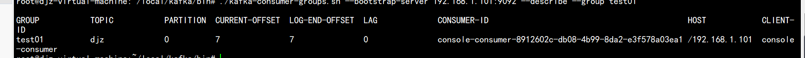
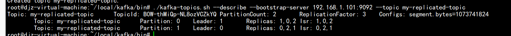
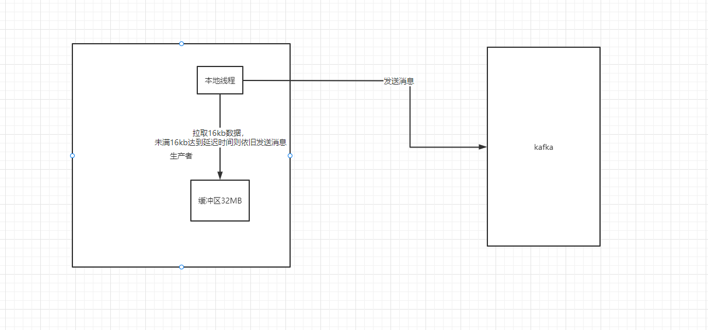
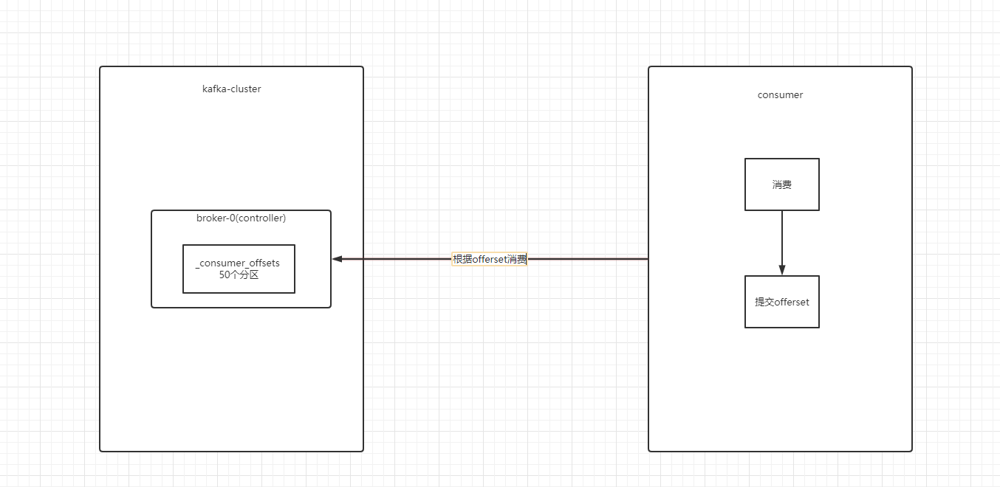

## Kafka学习

### Kafka的基础知识

#### 什么是Kafka

Kafka是一种高吞吐量、分布式、基于发布/订阅的消息系统。

| broker         | Kafka服务器，负责消息存储和转发                       |
| -------------- | ---------------------------------------- |
| topic          | 消息的主题，一个逻辑性概念用来区分消息类别                    |
| partition      | 分区，为了解决消息数据量大的问题提出的一个方案。topic可以有多个分区     |
| offset         | 消息在日志中的位置，消息的唯一序列号，在分区中的偏移量              |
| Producer       | 消息生产者                                    |
| Consumer       | 消息消费者                                    |
| Consumer Group | 消费者组                                     |
| Zookeeper      | 保存着集群 broker、 topic、 partition等meta 数据；另外，还负责broker故障发现， partition leader选举，[负载均衡](https://so.csdn.net/so/search?q=%E8%B4%9F%E8%BD%BD%E5%9D%87%E8%A1%A1&spm=1001.2101.3001.7020)等功能 |

##### partition的数据文件

partition 中的消息有三个属性  offset  、MessageSize、data。offset是消息在partition中的偏移量。确定消息在parition中的位置。可以理解为ID  MessageSize表示消息的数据量大小、data为消息的具体内容。

#### 为什么要使用MQ中间件

- 解耦，允许你独立的扩展消息中间件两边的应用，只需要保证遵循相同的接口约束
- 冗余，对消息进行了持久化操作。知道确认完全消费后才会清理。可以避免数据丢失
- 扩展性，因为解耦了消息的入队和处理。所以可以很容易的扩展
- 灵活性和削峰  
- 可恢复性 即便消费者挂掉了，重启后依旧可以获取消息进行处理
- 异步通信 

#### 消息队列的流派

目前消息队列的中间件选型有：

- rabbitMQ
- rocketMQ
- kafka
- zeroMQ

按照流派划分为有broker和无broker两种，broker的中文直译是经纪人的意思，动词的含义是安排，协商。由此我们可以理解broker的作用就是起到消息分发的作用。将消息分发到不同消息队列中去。

##### 有Broker的MQ

这个流派会选择一台服务器作为Broker，所有的消息都会通过它中转。生产者把消息发送给它就结束了自己的任务，Broker则将消息主动推送给消费者（或者消费者主动轮询）。这个流派又分为重Topic和轻Topic两种类型

###### 重Topic

kafka、ActiveMQ 就属于重Topic类型。生产者会发送key和数据到Broker，由Broker比较key之后决定给哪个消费者，这种模式下topic往往是一个比较大的概念，一个系统经常会出现只有一个topic的情况。

###### 轻Topic

这种的代表就是RabbitMQ。生产者发送key和数据，消费者定义订阅的队列，Broker收到数据之后会通过一定的逻辑计算出key的对应队列，然后把数据交给队列。topic只是中转模式中的一种。

##### 无Broker的MQ

无Broker的代表就是ZeroMQ。ZeroMQ被设计成了一个库而不是中间件。封装出了类似于socket的API来完成发送数据和读取数据。

#### Kafka的安装及启动

- 安装部署一台zookeeper服务器
- 安装jdk
- 下载kafka的安装包
- 上传到kafka的服务器上
- 解压
- 进入到config下修改server.properties文件，配置释义如下：

```shell
#broker.id属性在kafka集群中必须要是唯一的。必须是正数 
broker.id=0
#kafka部署的机器id及提供服务的端口号
listeners=PLAINTEXT://192.168.1.101:9092
#broker处理消息的最大线程数，一般情况下数量为cpu核数
num.network.threads=3
#服务器用于处理请求的线程数，其中可能包括磁盘I/O
num.io.threads=8
#socket的发送缓冲区，socket的调优参数SO_SNDBUFF
socket.send.buffer.bytes=102400
#socket的接受缓冲区，socket的调优参数SO_RCVBUFF
socket.receive.buffer.bytes=102400
# 最大请求缓冲区
socket.request.max.bytes=104857600
#存储日志路径
log.dirs=/root/local/kafka-log
#每个topic的分区个数，若是在topic创建时候没有指定的话会被topic创建时的指定参数覆盖
num.partitions=1
#每个数据目录用于启动时日志恢复和关闭时刷新的线程数。
#对于数据目录位于RAID阵列中的安装，建议增加此值。
num.recovery.threads.per.data.dir=1
# 数据文件保留多长时间， 存储的最大时间超过这个时间会根据log.cleanup.policy设置数据清除策略log.retention.bytes和log.retention.minutes或log.retention.hours任意一个达到要求，都会执行删除有2删除数据文件方式：按照文件大小删除：log.retention.bytes，按照2中不同时间粒度删除：分别为分钟，小时
log.retention.hours=168
# topic的分区是以一堆segment文件存储的，这个控制每个segment的大小，会被topic创建时的指定参数覆盖
log.segment.bytes=1073741824
# 文件大小检查的周期时间，是否处罚 log.cleanup.policy中设置的策略
log.retention.check.interval.ms=300000
#zk地址及端口
zookeeper.connect=192.168.1.101:2181
#zk超时时间设置
zookeeper.connection.timeout.ms=18000
```

- 进入bin目录下，执行启动命令

```shell
./kafka-server-start.sh -daemon  ../config/server.properties
```

#### 常用Linux命令

##### 创建Topic

```shell
#新版的命令，旧版本命令有所不同
./kafka-topics.sh --create --bootstrap-server 192.168.1.101:9092 --replication-factor 1 --partitions 1 --topic djz
```

##### 查看Topic

查看当前kafka内有哪些topic

```shell
./kafka-topics.sh --list  --bootstrap-server 192.168.1.101:9092 
```

##### 发送消息

```shell
./kafka-console-producer.sh --broker-list 192.168.1.101:9092  --topic djz
```

##### 消费消息

从最后一条消息的偏移量+1开始消费

```shell
./kafka-console-consumer.sh --bootstrap-server 192.168.1.101:9092  --consumer-property group.id=test01 --topic djz
```

从头开始消费

```shell
./kafka-console-consumer.sh --bootstrap-server 192.168.1.101:9092 --from-beginning --topic djz
```

##### 查看消费组信息

```shell
#查看当前主题下有哪些消费组
./kafka-consumer-groups.sh --bootstrap-server 192.168.1.101:9092 --list
#查看消费组中的具体信息
./kafka-consumer-groups.sh --bootstrap-server 192.168.1.101:9092 --describe --group test01
```



- GROUP    分组名称
- TOPIC       消费组所订阅的主题
- PATITION    分组数量
- CURRENT-OFFSET  当前偏移量
- LOG-END-OFFSET   存在多少消息
- LAG      未被消费的消息
- CONSUMER-ID   消费者ID
- HOST    主机信息
- CLIENT    客户端信息

##### 创建分区

```shell
./kafka-topics.sh --create --bootstrap-server 192.168.1.101:9092 --partitions 2 --topic djz1
```

##### 查看分区

```shell
./kafka-topics.sh --describe --bootstrap-server 192.168.1.101:9092 --topic djz1
```

#### 消息消费方式

##### 单播消息

在一个kafka的topic中，启动两个消费者，一个生产者，问：生产者发送消息，这条消息是否会同时被两个消费者消费？

如果多个消费者在同一个组，只有一个消费者会收到订阅的topic消息。换言之，同一个消费组中只能有一个消费者收到一个topic中的消息。

##### 多播消息

不同的消费组订阅同一个topic，不同消费组中只有一个消费者收到topic消息。

##### 如何避免消息重复消费

使用缓存，在发送消息的时候，给消息指定唯一ID。在接收到消息的时候，去跟缓存做比对。缓存中未含有ID，消费并存入缓存。含有就不做消费。

#### 主题和分区的概念

##### 主题Topic

主题Topic可以理解是一个类别的别称

##### partition分区

一个主题中的消息量非常大，可以通过设置分区来进行分布式的存储。这样做的好处：

- 分区存储，可以解决统一存储文件过大的问题
- 提供了读写的吞吐量：读和谐可以同时在多个分区中进行

一个分区只能被一个消费者消费。

#### Kafka中消息日志文件中保存的内容

- 0000.log：保存发送的消息
- _consumer_offsets-49: kafka内部自己创建了_consumer_offsets 主题包含了50个分区。这个主题主要来存放消费者消费某个主题的偏移量

细节：

- 消费消息的时候。消费者会定期的将消费分区的offset提交给kafka内部的topic：_comsumer_offsets,提交过去的时候，key是consumerGroupId+topic+分区好，value就是当前offset的值，kafka会定期清理topic里的消息。
- 为了应对高并发的请求，kafka默认创建了50个分区。可以通过offsets.topic.num.partitions 设置
- 通过以下公式可以选出consumer消费的offset要提交到哪个分区

​    公式：  hash(consumerGroupId)%_consumer_offsets主题的分区数

#### 副本的概念

副本是主题中的分区创建的多个备份，多个备份在kafka集群的多个broker中，会有一个副本作为leader，其他均为follower

```shell
./kafka-topics.sh --create --bootstrap-server 192.168.1.101:9092 --replication-factor 3 --partitions 2 --topic my-replicated-topic
```



- leader  kafka的读写操作，都发生在leader上。leader负责将数据同步给follower。当leader挂掉之后。经过主从选举，从多个follower中选举产生新的leader
- Isr 表示可以同步和已同步的节点。如果节点性能较差，会被移除


### Kafka的Java功能实现

#### 生产者实现

##### 引入依赖

```xml
<dependency>
          <groupId>org.apache.kafka</groupId>
          <artifactId>kafka-clients</artifactId>
          <version>3.2.0</version>
      </dependency>
```

##### 代码实现

```java
public class MyProducer {
    private final static String TOPIC_NAME = "my-replicated-topic";

    public static void main(String[] args) throws InterruptedException {
        Properties pros = new Properties();
        pros.setProperty(ProducerConfig.BOOTSTRAP_SERVERS_CONFIG,
                "192.168.1.101:9092,192.168.1.101:9093,192.168.1.101:9094");
        /*
         * 发送消息持久化机制参数
         * acks=0：表示producer不需要等待任何broker确认收到消息的回复，就可以继续发送下一条消息。性能最高，但是最容易丢失消息
         * acks=1：表示至少要等待leader已经成功将数据写入本地log，但是不需要等待所有follower是否成功写入。就可以消费下一条消息
         * 如果follower没备份成功，但是leader挂掉了。就会导致消息丢失
         * acks=-1或all  需要等待 min.insync.relicas 这个参数配置的副本个数都成功写入日志，这种策略会保证只要一个备份存活就
         * 不会丢失。
         * */
        pros.put(ProducerConfig.ACKS_CONFIG, "1");
        //失败重试。重试次数
        pros.put(ProducerConfig.RETRIES_CONFIG, 3);

        //重试间隔设置
        pros.put(ProducerConfig.RETRY_BACKOFF_MS_CONFIG, 300);

        //设置发送消息的本地缓冲区  默认为32MB
        pros.put(ProducerConfig.BUFFER_MEMORY_CONFIG, 33554432);

        //kafka本地线程会从缓冲区取数据，批量发送到broker,该配置为设置缓冲区发送消息大小  默认为16kb
        pros.put(ProducerConfig.BATCH_SIZE_CONFIG,16384);

        /*
        默认是0会立即发送，但是会影响性能。一般设置10ms  这个消息发送完成后，会进入本地的一个batch，10ms内如果batch占用达到了16kb，
        会将这部分内容一起发送给kafka服务器。没满也会发送。
         */
        pros.put(ProducerConfig.LINGER_MS_CONFIG,10);
        //把发送的key从字符串序列化为字符数组
        pros.put(ProducerConfig.KEY_SERIALIZER_CLASS_CONFIG, StringSerializer.class.getName());
        //把发送的value从字符串序列化为字符数组
        pros.put(ProducerConfig.VALUE_SERIALIZER_CLASS_CONFIG, StringSerializer.class.getName());

        //发送消息客户端
        Producer<String, String> producer = new KafkaProducer<String, String>(pros);

        int msgNum = 5;

        final CountDownLatch countDownLatch = new CountDownLatch(msgNum);

        for (int i = 0; i < 5; i++) {
            Order order = new Order((long) i, i);
            //指定发送分区
//            ProducerRecord<String, String> producerRecord =new ProducerRecord<String, String>(TOPIC_NAME,
//                    0,order.getOrderId().toString(), JSON.toJSONString(order));

            //未指定发送分区  计算公式 hash(key)%partitionNum
            ProducerRecord<String, String> producerRecord = new ProducerRecord<String, String>(TOPIC_NAME,
                    order.getOrderId().toString(), JSON.toJSONString(order));
/*
            try {
                //等待消息发送成功的同步阻塞方法
                RecordMetadata metadata = producer.send(producerRecord).get();
                System.out.println("同步消息发送消息结果：" + "topic" + metadata.topic() +
                        "|partition-" + metadata.partition()+"|offset-"+metadata.offset()

                );
            } catch (Exception e) {
                e.printStackTrace();
                //1.记录日志  预警系统+1
                //2.设置时间间隔1s  同步方式再次发送，失败则记录人工日志
                try {
                    RecordMetadata metadata = producer.send(producerRecord).get();
                } catch (Exception ex) {
                   //人工介入
                }
            }
*/
                    //异步发送消息
                  producer.send(producerRecord, new Callback() {
                      @Override
                      public void onCompletion(RecordMetadata metadata, Exception e) {
                          if (e!=null){
                              System.err.println("消息发送失败"+e.getStackTrace());
                          }
                          if (metadata!=null){
                              System.out.println("异步消息发送消息结果：" + "topic" + metadata.topic() +
                                      "|partition-" + metadata.partition()+"|offset-"+metadata.offset()

                              );
                          }
                          //
                       countDownLatch.countDown();
                      }
                  });


        }
        countDownLatch.await(5, TimeUnit.SECONDS);
        producer.close();
    }

}

```

#### 消费者实现

##### 引入依赖

```xml
<dependency>
          <groupId>org.apache.kafka</groupId>
          <artifactId>kafka-clients</artifactId>
          <version>3.2.0</version>
      </dependency>
```

##### 代码实现

```java
public class MyConsumer {

    private final static String TOPIC_NAME = "my-replicated-topic";

    public static void main(String[] args) {
        Properties pros = new Properties();
        pros.setProperty(ConsumerConfig.BOOTSTRAP_SERVERS_CONFIG,
                "192.168.1.101:9092,192.168.1.101:9093,192.168.1.101:9094");
        //开启自动提交
        pros.put(ConsumerConfig.AUTO_COMMIT_INTERVAL_MS_CONFIG,false);
        //设置延迟时间
        pros.put(ConsumerConfig.AUTO_COMMIT_INTERVAL_MS_CONFIG, "10");
        //反序列化
        pros.put(ConsumerConfig.KEY_DESERIALIZER_CLASS_CONFIG, StringDeserializer.class.getName());
        pros.put(ConsumerConfig.VALUE_DESERIALIZER_CLASS_CONFIG,StringDeserializer.class.getName());

        pros.put(ConsumerConfig.GROUP_ID_CONFIG,"test01");
        //重置偏移量
        pros.put(ConsumerConfig.AUTO_OFFSET_RESET_CONFIG, "earliest");
        Consumer<String,String > consumer =new KafkaConsumer<String, String>(pros);
        ArrayList<String> strings = new ArrayList<>();
        strings.add(TOPIC_NAME);
        consumer.subscribe(strings);
        /* 循环拉取 */
        int i =0;
        while(true) {
            if (i++ > 10) break; // 只消费10条数据
            /* 消费消息-获取数据 */

            ConsumerRecords<String, String> consumerRds  = consumer.poll(Duration.ofSeconds(100));
            /* 解析并打印 ConsumerRecords  */
            /* 遍历 ConsumerRecords*/
            for(ConsumerRecord<String, String> rd : consumerRds) {
                System.out.println("[消费者] " + rd.key() + "--" + rd.value());
            }
        }
        /* 关闭消费者 */
         consumer.close();
//        consumer.seek(TOPIC_NAME,);
    }
}
```

### Kafka的相关机制

#### Kafka存储机制

- producer发送消息首先要有个topic，topic是逻辑上的概念。
- broker 也就是kafka的服务器接收到消息后，会存放到partition中。parition是物理上的概念。每个partition在服务器上的体现就是一个log文件。log文件会存放消息数据
- producer生成的消息，不断添加在log文件的尾部。为了防止数据过大，采用了分片和索引机制。将parition分为多个segment
- 每个segment会包含 .index .log和.timeIndex文件。位于同一个文件夹下。文件夹名为topic+分区序号
- .index 偏移量索引文件    .timeIndex时间戳索引文件   .log 日志

#### Kafka高吞吐的原因

##### 顺序读写

kafka的消息是不断追加到文件中的，这个特性使kafka可以充分利用磁盘的顺序读写性能，顺序读写不需要硬盘磁头的寻道时间，只需很少的扇区旋转时间，所以速度远快于随机读写。

##### 零拷贝

linux kernel2.2  提供的零拷贝机制。使用DMA（Directory Memmory Access）技术。

**未使用DMA的文件传输机制**

1. 用户调用read方法读取文件从用户态转变为内核态
2. cpu发起IO从磁盘读取数据到磁盘缓冲区
3. 之后中断IO将数据拷贝到PageCache
4. 从PageCache拷贝到用户缓冲区

CPU被大量占用

**DMA技术**

- 用户进程调用 read 方法，向操作系统发出 I/O 请求，请求读取数据到自己的内存缓冲区中，进程进入阻塞状态；
- 操作系统收到请求后，进一步将 I/O 请求发送 DMA，然后让 CPU 执行其他任务；
- DMA 进一步将 I/O 请求发送给磁盘；
- 磁盘收到 DMA 的 I/O 请求，把数据从磁盘读取到磁盘控制器的缓冲区中，当磁盘控制器的缓冲区被读满后，向 DMA 发起中断信号，告知自己缓冲区已满；
- **DMA 收到磁盘的信号，将磁盘控制器缓冲区中的数据拷贝到内核缓冲区中，此时不占用 CPU，CPU 可以执行其他任务**；
- 当 DMA 读取了足够多的数据，就会发送中断信号给 CPU；
- CPU 收到 DMA 的信号，知道数据已经准备好，于是将数据从内核拷贝到用户空间，系统调用返回；

##### 文件分段

kafka的队列topic被分为了多个区partition，每个partition又分为多个段segment，所以一个队列中的消息实际上是保存在N多个片段文件中。操作的时候每次都是操作小文件。可以调高并行处理能力

##### 批量发送

Kafka允许进行批量发送消息，先将消息缓存在内存中，然后一次请求批量发送出去，比如可以指定缓存的消息达到某个量的时候就发出去，或者缓存了固定的时间后就发送出去 ，如100 条消息就发送，或者每5秒发送一次，这种策略将大大减少服务端的I/O次数

##### 数据压缩

Kafka 还支持对消息集合进行压缩，Producer可以通过GZIP或Snappy格式对消息集合进行压缩，压缩的好处就是减少传输的数据量，减轻对网络传输的压力，Producer压缩之后，在 Consumer需进行解压，虽然增加了CPU的工作，但在对大数据处理上，瓶颈在网络上而不是 CPU，所以这个成本很值得。

#### Kafka发送消息缓冲区机制



- kafka在本地设置有缓冲区。默认32MB

```java
  pros.put(ProducerConfig.BUFFER_MEMORY_CONFIG, 33554432);
```

- kafka每次会从缓冲区拉取16kb的数据量，发送给服务器。(BATCH_SIZE_CONFIG)也可以改变大小

```java
 pros.put(ProducerConfig.BATCH_SIZE_CONFIG,16384);
```

- 如果数据量未满16kb，达到设置的延迟时间。默认为10ms 也会进行发送

```java
  pros.put(ProducerConfig.LINGER_MS_CONFIG,10);
```

#### offset自动提交和手动提交

##### 自动提交

consumer poll消息完成后，自动提交offset到kafka服务器

```java
//是否自动提交
pros.put(ConsumerConfig.AUTO_COMMIT_INTERVAL_MS_CONFIG,true);
//自动提交的延迟时间
pros.put(ConsumerConfig.AUTO_COMMIT_INTERVAL_MS_CONFIG, "10");
```

自动提交会丢失消息。如果poll操作完成后，还未消费完消息。消费者挂掉了。由于已经自动提交了offset，下次poll就会在下一个位置开始消费。从而导致消费的缺失。

##### 手动提交

consumer poll消息完成后，需要人为的设置提交offset

```java
pros.put(ConsumerConfig.AUTO_COMMIT_INTERVAL_MS_CONFIG,false);
```

- 手动同步提交

```java
   if (consumerRds.count()>0){
     //同步提交，当前线程会阻塞直到offset提交成功
                consumer.commitSync();
   }
```

- 手动异步提交

```java
if (consumerRds.count() > 0) {
  //异步提交不会阻塞线程。存在后续处理时使用
    consumer.commitAsync(new OffsetCommitCallback() {
       @Override
       public void onComplete(Map<TopicPartition, OffsetAndMetadata> offsets,
                              Exception exception) {
              if (exception != null) {

                        }
                    }
                });
            }
```

#### 消费者poll消息的过程

- 消费者建立与broker之间的长链接，开始poll消息
- 默认一次poll  500条消息

```java
  pros.put(ConsumerConfig.MAX_POLL_RECORDS_CONFIG,500);
```

- 根据消费速度的快慢来设置，如果两次poll的时间超过30s，kafka会认为消费能力过弱，提出消费组，将分区分配给其他消费者

```java
 pros.put(ConsumerConfig.MAX_POLL_INTERVAL_MS_CONFIG,30*1000);
```

- 如果1s内没有poll到任何消息，则继续进行poll操作。循环往复。如果poll超时。则长轮询结果。

  ```java
  ConsumerRecords<String, String> consumerRds  = consumer.poll(Duration.ofSeconds(100));
  ```

- 消费者发送心跳时间

```java
  pros.put(ConsumerConfig.HEARTBEAT_INTERVAL_MS_CONFIG,1000);
```

- kafka如果超过10s没有收到消费者心跳，则将消费者提出消费组。进行Rebalance。

```java
   pros.put(ConsumerConfig.SESSION_TIMEOUT_MS_CONFIG,1000*10);
```

### SpringBoot整合Kafka

#### 引入依赖

```xml
        <dependency>
            <groupId>org.springframework.kafka</groupId>
            <artifactId>spring-kafka</artifactId>
        </dependency>
```

#### 配置文件

```yml
server:
  port: 8080
spring:
  kafka:
    bootstrap-servers: 192.168.1.101:9092,192.168.1.101:9093,192.168.1.101:9094
    producer:
      retries: 3
      batch-size: 16384
      buffer-memory: 33554432
      acks: 1
      key-serializer: org.apache.kafka.common.serialization.StringSerializer
      value-serializer: org.apache.kafka.common.serialization.StringSerializer
    consumer:
      group-id: default-group
      enable-auto-commit: false
      auto-offset-reset: earliest
      key-deserializer: org.apache.kafka.common.serialization.StringDeserializer
      value-deserializer:     org.apache.kafka.common.serialization.StringDeserializer
      max-poll-records: 500
    listener:
      ack-mode: manual_immediate
```

#### 创建生成者

```java
package com.ascy.learn.kafka.controller;

import org.springframework.beans.factory.annotation.Autowired;
import org.springframework.kafka.core.KafkaTemplate;
import org.springframework.web.bind.annotation.RequestMapping;
import org.springframework.web.bind.annotation.RequestMethod;
import org.springframework.web.bind.annotation.RestController;

/**
 * @author djz
 * @Title: MyKafkaController
 * @ProjectName djz-nacos
 * @Description: TODO
 * @date 2022/7/1616:10
 */
@RestController
@RequestMapping("/msg")
public class MyKafkaController {
    private final static String TOPIC_NAME = "my-replicated-topic";
    @Autowired
    private KafkaTemplate<String,String> kafkaTemplate;

    @RequestMapping(value = "/send",method = RequestMethod.GET)
    public String sendMessage(){
       kafkaTemplate.send(TOPIC_NAME,"0","test");

       return "success";
    }
}

```

#### 创建消费者

```java
package com.ascy.learn.kafka.consumer;

import org.apache.kafka.clients.consumer.ConsumerRecord;
import org.springframework.kafka.annotation.KafkaListener;
import org.springframework.kafka.annotation.PartitionOffset;
import org.springframework.kafka.annotation.TopicPartition;
import org.springframework.kafka.support.Acknowledgment;
import org.springframework.stereotype.Component;

/**
 * @author djz
 * @Title: MyConsumer
 * @ProjectName djz-nacos
 * @Description: TODO
 * @date 2022/7/1616:21
 */
@Component
public class MyConsumer {

    @KafkaListener(topics = "my-replicated-topic", groupId = "test01")
    public void listenGroup(ConsumerRecord<String, String> record, Acknowledgment ack) {

        //手动提交
        ack.acknowledge();

    }

   @KafkaListener(groupId = "testGroup",topicPartitions = {
           @TopicPartition(topic = "test01",partitions = {"0","1"}),
           @TopicPartition(topic = "test02",partitions = "0",
           partitionOffsets = @PartitionOffset(partition = "1",initialOffset = "100"))
   },concurrency = "3")
    public void listenGroupPro(ConsumerRecord < String, String>record, Acknowledgment ack) {

        //手动提交
        ack.acknowledge();

    }

}
```

### Kafka集群Controller、acks、ISR、Rebalance、和HW

#### Controller

Kafka集群中的broker在zk中创建临时序号节点，序号最小的节点将作为集群的controller，负责管理整个集群中的所有分区和副本的状态。

- 当某个分区的leader副本出现故障时，由控制器负责为该分区选举新的leader副本
- 当检测到某个分区的ISR集合发生变化时，有控制器负责通知所有的broker更新其元数据信息
- 当使用Kafka-topics.sh脚本为某个topic增加分区数量时，同样还是由控制器负责让新分区被其他节点感知。

#### acks

- acks=0  producer写入 leader 分区，然后不等待 broker 同步完成的确认，就继续发送下一条(批)消息
- acks=1 producer写入 leader 分区，producer需等待 leader 成功收到数据并得到确认，才发送下一条（批）消息。
- acks=all producer 写入 leader 分区，producer 需等待 leader 成功收到数据并得到确认，且 producer 得到 follwer确认，才发送下一条（批）消息

#### ISR

ISR全称是“In-Sync Replicas”，也就是保持同步的副本，他的含义就是，跟Leader始终保持同步的Follower有哪些。

broker中的配置项,unclean.leader.election.enable = false，表示不允许非ISR中的副本被选举为首领，以免数据丢失。

#### Rebalance

- 前提：消费组中的消费者没有指定消费分区
- 触发条件：当消费组中的消费者和分区的关系发生变化的时候
- 分区分配策略：

1. range：根据公式计算：按照分区序号排序(范围分配)。假设 n＝分区数／消费者数量， m＝分区数%消费者数量 ，那么前 m 个消费者每个分配 n+1 个分区，后面的（消费者数量－m ）个消费者每个分配 n 个分区
2. round-robin轮询：轮流消费
3. sticky：粘合策略。不改变之前分区策略的前提下进行重新分配

#### HW（high-water）和LEO(LOG-END-OFFSET)

Kafka 所有副本都有对应的高水位和 LEO 值，在 Leader 副本所在的 Broker 上，还保存了其他 Follower 副本的 LEO 值。

HW俗称高水位，highWater的缩写。取partition中最小的LEO作为HW。consumer最多只能消费到HW所在的位置。另外每个replica都有HW。对于leader新写入的消息。consumer不能立即消费，leader会等待该消息被所有ISR中的replicas同步后更新HW

### Kafka线上优化

#### 如何防止消息丢失

- 发送方：ack是1或者-1/all可以防止消息丢失。
- 消费方：修改自动提交为手动提交

#### 如何防止消息的重复消费

添加幂等性保证

- mysql插入业务id作为主键
- 使用redis或者zk的分布式锁

#### 如何做到顺序消费

- 发送方：在发送时将ack不能设置0，关闭重试，使用同步发送，等待发送成功后再发送后一条消息
- 接收方：消息是发送到一个分区中。只使用一个消费组的消费者进行消费

#### 解决消息积压问题

- 在消费者中启动多个线程同时消费  提升消费者能力
- 启动多个消费者
- 让消费者把消息发送到另外的topic上，进行消息转发


### 与其他类型MQ的比较

Kafka适合做日志处理

RocketMQ适合做业务处理

#### 1.数据可靠性

Kafka使用异步刷盘方式，异步Replication；

RocketMQ支持异步/同步刷盘；异步/同步 Replication；

#### 2.性能对比

kafka单机吞吐量号称在百万条/秒

RocketMQ大约在10万条/秒；

#### 3.单机支持的队列数

Kafka单机超过64个队列/分区，消息发送性能降低严重；

RocketMQ单机支持最高5万个队列，性能稳定；

#### 4.消费失败重试

kafka不支持消费失败重试。RocketMQ消费失败支持定时重试，每次重试间隔时间顺延。

#### 5.消息顺序性

Kafka某些配置下，支持消息顺序，但是一台Broker宕机后，就会产生消息乱序；

RocketMQ支持严格的消息顺序，在顺序消费场景下，一台Broker宕机后，发送消息会失败，但是不会乱序。

##### 6.定时消息

Kafka不支持定时消息；

RocketMQ支持定时消息

#### 7.分布式事务消息

Kafka不支持分布式事务消息

RocketMQ支持分布式事务消息

