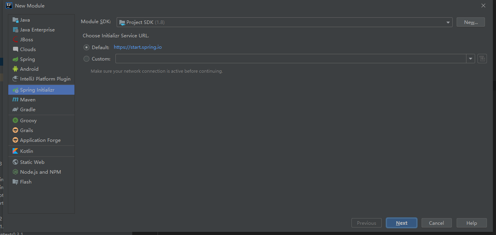
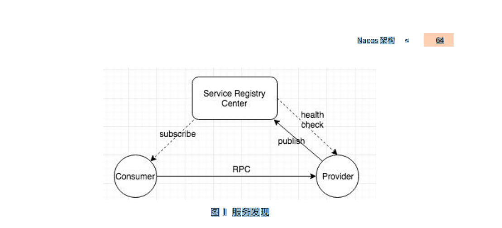

### SpringCloud学习

#### SpringCloud Gateway

##### 简介

Spring Cloud Gateway是基于spring生态系统（ Spring Boot 2.x, Spring WebFlux, and Project Reactor）构建的API 网关。目的是提供一个简单、高效的方式来路由到API。并且提供安全认证、日志监控、指标管理等方面的功能

##### 使用说明

- 创建一个SpringBoot的工程项目
- 引入SpringCloud Gateway 的jar包

```xml
        <dependency>
            <groupId>org.springframework.cloud</groupId>
            <artifactId>spring-cloud-starter-gateway</artifactId>
        </dependency>
```

需要注意：

​     SpringCloud Gateway不能打成war包运行

##### 相关术语

- **Route:** 网关的基本组成部分，由ID、目标URI、断言集合、过滤器集合构成。断言集合返回true，就路由到该目标URI
- **Predicate:** 断言（谓语）Java 8 的一个方法函数。用来匹配Http请求的任意部分。例如请求头或者参数。
- **Filter**: 过滤器，可以发送下游请求之前或者之后对请求或者响应做处理

##### 工作原理


1. 浏览器发送请求到Spring Cloud Gateway
2. Gateway  Handler Mapping（映射处理器）匹配是否有合适的路由地址。如果匹配到合适的路由就将请求发送到Gateway Web Handler（web处理器）
3. Gateway Web Handler（web处理器）通过特定的Filters（过滤器链）处理请求。
4. Filter 分为 pre 和post 两种。在请求到代理服务（目标URI）之前执行pre Filter  之后执行post Filter
5. 依照 3  2  1 的顺序返回。

请求的URI如果没有定义端口，会走http和https的默认端口。分别是80和443

##### 配置过滤器和断言

提供快捷配置和完全扩展两种方式配置

###### 快捷配置(Shortcut  Configuration)

快捷配置通过 `=`和 `,` 来完成配置。  过滤的名称  `=`   key，value

**application.yml**

```yaml
spring:
  cloud:
    gateway:
      routes:
      - id: after_route
        uri: https://example.org
        predicates:
        - Cookie=mycookie,mycookievalue
```

###### 完全扩展的范式配置( Fully Expanded Arguments)

比较标准的yaml格式配置。

**application.yml**

```xml
spring:
  cloud:
    gateway:
      routes:
      - id: after_route
        uri: https://example.org
        predicates:
        - name: Cookie
          args:
            name: mycookie
            regexp: mycookievalue
```

##### 断言工厂([Route Predicate Factories](https://docs.spring.io/spring-cloud-gateway/docs/current/reference/html/#gateway-request-predicates-factories))

Spring Cloud Gateway内置了许多定义好的断言工厂.可以通过 `and` 连接的方式来组合使用以满足复杂场景的需求。

###### 路由后置断言工厂（[The After Route Predicate Factory](https://docs.spring.io/spring-cloud-gateway/docs/current/reference/html/#the-after-route-predicate-factory)）

包含了一个参数`datetime` 是Java 的一个`ZonedDateTime`) 这个断言会匹配这个时间点之后的请求。

```yaml
spring:
  cloud:
    gateway:
      routes:
      - id: after_route
        uri: https://example.org
        predicates:
        - After=2017-01-20T17:42:47.789-07:00[America/Denver]
```

###### 路由前置断言工厂([The Before Route Predicate Factory](https://docs.spring.io/spring-cloud-gateway/docs/current/reference/html/#the-before-route-predicate-factory))

包含了一个参数`datetime` 是Java 的一个`ZonedDateTime`) 这个断言会匹配这个时间点之前的请求。

```yaml
spring:
  cloud:
    gateway:
      routes:
      - id: before_route
        uri: https://example.org
        predicates:
        - Before=2017-01-20T17:42:47.789-07:00[America/Denver]
```

###### 路由时间范围断言工厂([The Between Route Predicate Factory](https://docs.spring.io/spring-cloud-gateway/docs/current/reference/html/#the-between-route-predicate-factory))

包含了两个时间参数`datetime1` `datetime2`，匹配两个时间之间的请求,要求请求时间大于`datetime1` 小于 `datetime2`

```yaml
spring:
  cloud:
    gateway:
      routes:
      - id: between_route
        uri: https://example.org
        predicates:
        - Between=2017-01-20T17:42:47.789-07:00[America/Denver], 2017-01-21T17:42:47.789-07:00[America/Denver]
```

###### Cookie断言工厂([The Cookie Route Predicate Factory](https://docs.spring.io/spring-cloud-gateway/docs/current/reference/html/#the-cookie-route-predicate-factory))

包含两个重要参数。分别是`name`和`regexp`（ Java regular expression）,匹配的请求要求其所包含的Cookie名为`name` ，满足指定的正则表达式。

```yaml
spring:
  cloud:
    gateway:
      routes:
      - id: cookie_route
        uri: https://example.org
        predicates:
        - Cookie=chocolate, ch.p
```

匹配 名为chocolate， 并且ch.p规则的Cookie

###### 请求头断言工厂([The Header Route Predicate Factory](https://docs.spring.io/spring-cloud-gateway/docs/current/reference/html/#the-header-route-predicate-factory))

`header`  请求头

`regexp`  Java 正则表达式

```yaml
spring:
  cloud:
    gateway:
      routes:
      - id: header_route
        uri: https://example.org
        predicates:
        - Header=X-Request-Id, \d+
```

###### 域名路由断言工厂([The Host Route Predicate Factory](https://docs.spring.io/spring-cloud-gateway/docs/current/reference/html/#the-host-route-predicate-factory))

一个域名列表，Ant-style样式的匹配模式，使用`,` 分隔

```yaml
spring:
  cloud:
    gateway:
      routes:
      - id: host_route
        uri: https://example.org
        predicates:
        - Host=**.somehost.org,**.anotherhost.org
```

匹配指定域名的请求。URI模板变量支持{sub}.myhost.org 格式

`{sub}` 的变量映射到`ServerWebExchange.getAttributes()`

###### 请求方法断言工厂([The Method Route Predicate Factory](https://docs.spring.io/spring-cloud-gateway/docs/current/reference/html/#the-method-route-predicate-factory))

参数为`Method` 匹配请求方式与指定方式一直的http请求

```
spring:
  cloud:
    gateway:
      routes:
      - id: method_route
        uri: https://example.org
        predicates:
        - Method=GET,POST
```

###### 路径断言工厂([The Path Route Predicate Factory](https://docs.spring.io/spring-cloud-gateway/docs/current/reference/html/#the-path-route-predicate-factory))

`PathMatcher` 匹配路径

`matchTrailingSlash` 匹配斜杠， 值为true 或者false  默认为true，设置为false后，/{segment}无法匹配到 

```yaml
spring:
  cloud:
    gateway:
      routes:
      - id: path_route
        uri: https://example.org
        predicates:
        - Path=/red/{segment},/blue/{segment}
```

如果`matchTrailingSlash` = `false`,  `/red/1/`无法匹配。

`segment` 存放在 `ServerWebExchange.getAttributes()` 获取如下

```java
Map<String, String> uriVariables = ServerWebExchangeUtils.getPathPredicateVariables(exchange);
String segment = uriVariables.get("segment");
```

###### 查询断言工厂([The Query Route Predicate Factory](https://docs.spring.io/spring-cloud-gateway/docs/current/reference/html/#the-query-route-predicate-factory))

`param`   参数

`regexp` 匹配规则

```yaml
spring:
  cloud:
    gateway:
      routes:
      - id: query_route
        uri: https://example.org
        predicates:
        - Query=red, gree.
```

匹配包含参数满足key 为red   value符合gree格式的请求。

###### 地址断言工厂([The RemoteAddr Route Predicate Factory](https://docs.spring.io/spring-cloud-gateway/docs/current/reference/html/#the-remoteaddr-route-predicate-factory))

顾名思义，匹配符合192.168.1.1-192.168.1.24的地址的请求

```yaml
spring:
  cloud:
    gateway:
      routes:
      - id: remoteaddr_route
        uri: https://example.org
        predicates:
        - RemoteAddr=192.168.1.1/24
```

###### 权重路由断言工厂([The Weight Route Predicate Factory](https://docs.spring.io/spring-cloud-gateway/docs/current/reference/html/#the-weight-route-predicate-factory))

`group` 分组

`weight` 权重

```yaml
spring:
  cloud:
    gateway:
      routes:
      - id: weight_high
        uri: https://weighthigh.org
        predicates:
        - Weight=group1, 8
      - id: weight_low
        uri: https://weightlow.org
        predicates:
        - Weight=group1, 2
```

将80%的请求转发到weighthigh.org   20的请求转发到weightlow.org

###### X-Forwarded-For 断言工厂（[The XForwarded Remote Addr Route Predicate Factory](https://docs.spring.io/spring-cloud-gateway/docs/current/reference/html/#the-xforwarded-remote-addr-route-predicate-factory)）

```yaml
spring:
  cloud:
    gateway:
      routes:
      - id: xforwarded_remoteaddr_route
        uri: https://example.org
        predicates:
        - XForwardedRemoteAddr=192.168.1.1/24
```

##### Filter Factorires


##### 构建一个整合Nacos的Spring Cloud Gateway 网关应用

1. IDEA 创建一个SpringBoot项目。

​     

   2.引入spring-cloud-starter-gateway 和spring-cloud-starter-alibaba-nacos-discovery

```xml
        <dependency>
            <groupId>org.springframework.cloud</groupId>
            <artifactId>spring-cloud-starter-gateway</artifactId>
            <version>2.2.6.RELEASE</version>
        </dependency>

        <dependency>
            <groupId>com.alibaba.cloud</groupId>
            <artifactId>spring-cloud-starter-alibaba-nacos-discovery</artifactId>
            <version>2.2.2.RELEASE</version>
        </dependency>
```

​    3.配置bootstrap.xml

```yaml
server:
  port: 8090
spring:
  application:
    name: dig-gateway
  cloud:
    gateway:
      routes:
        - id: nacos_02_route #路由的唯一标识
          uri: lb://dig-nacos-01  #lb使用本地的负载均衡策略
          predicates:
            - Path=/order-serv/**
          filters:
            - StripPrefix=1
      enabled: true
    nacos:
      discovery:
        server-addr: 127.0.0.1:8848
        username: nacos
        password: nacos
```

#### SpringCloud Nacos

##### 简介

Nacos是Alibaba开源的一项技术、可以用来作为配置中心和服务注册中心

##### 快速使用

1. 下载安装包解压
2. 在数据库中执行conf下的nacos.sql文件
3. 配置conf文件夹下的application.properties文件
4. 使用命令启动nacos

##### SpringBoot整合

1. 启动nacos的服务。在IDEA中创建一个SpringBoot工程
2. 添加依赖   版本 0.2.x.RELEASE 对应的是 Spring Boot 2.x 版本，版本 0.1.x.RELEASE 对应的是 Spring Boot 1.x 版本如下所示整合的SpringBoot版本未2.7.0 所以Nacos版本号使用0.2.7

```xml
<dependency>
    <groupId>com.alibaba.boot</groupId>
    <artifactId>nacos-config-spring-boot-starter</artifactId>
    <version>0.2.7</version>
</dependency>
```

1. 使用 `@NacosPropertySource` 加载 `dataId` 为 `example` 的配置源，并开启自动更新

   ```java
   @SpringBootApplication
   @NacosPropertySource(dataId = "example", autoRefreshed = true)
   public class NacosConfigApplication {
   
       public static void main(String[] args) {
           SpringApplication.run(NacosConfigApplication.class, args);
       }
   }
   ```

##### SpringCloud整合

1. 启动nacos的服务。在IDEA中创建一个SpringBoot工程
2. 添加 spring-cloud-starter-alibaba-nacos-discovery 依赖
3. 添加 spring-cloud-starter-alibaba-nacos-config 依赖
4. 在SpringBoot的启动类上添加@EnableDiscoveryClient注解
5. 在bootstrapt.yml 或者applacation.properties下添加nacos配置

```xml
<---------applacation.properties-----------/>
server.port=8070
spring.application.name=service-provider
spring.cloud.nacos.discovery.server-addr=127.0.0.1:8848  
<---------bootstrapt.yml-----------/>
server:
  port: 8070
spring:
  cloud:
    nacos:
      discovery:
        <--> server-addr: 127.0.0.1:8848 </-->
        port: 8848 
        ip: 127.0.0.1
  application:
      name: dig-nacos-01
```

##### 配置中心

- dataId      配置文件的名称
- group      分组
- namespace     不同环境的配置文件隔离。

###### 配置一致性模型

Nacos 配置管理⼀致性协议分为两个大部分，第⼀部分是 Server 间⼀致性协议，⼀个是SDK(软件开发发工具包)与Server 的⼀致性协议，配置作为分布式系统中非强⼀致数据，在出现脑裂的时候可用性高于⼀致性，因此阿里配置中心是采用 AP ⼀致性协议。

###### Server 间的⼀致性协议

DB模式    任何一个服务更新配置，会先持久化到数据库，持久化成功之后，会通知其他服务更新配置。

非DB模式  Raft 协议。

###### SDK和server之间的一致性

SDK通过MD5值检测是否一致来判断的。

Nacos 1.X  短连接模拟长链接，每30s发送一个心跳，跟server对比SDK配置的MD值是否一致。如果一致就hold住，如果不一致就返回不一致配置。然后SDK获取新值。

Nacos 2.X 相较于30s的长轮询，升级为长链接模式。配置变更后，启动建立长链接，配置变更后，服务端推送便跟配置，SDK拉取最新配置。

**什么是长轮询**

客户端请求服务器端之后，如果配置一致，就hold住，如下图hold 80s 直到配置变更或者超时。


##### 服务发现



- 服务提供者Provider 在服务创建的时候，会向注册中心Nacos发送建立(publish)请求。将服务注册到注册中心
- 注册中心会监控Provider的健康状况
- 消费者Consumer在订阅服务的时候，会从注册中心获取服务提供者的地址信息
- 通过RPC请求调用Provider

###### 健康监测机制

**主流检测机制**

主流的健康监测机制TTL（TIME TO LIVE），客户端在一定时间没有向注册中心发送心跳，注册中心会认为服务已经不健康。进而触发后续的剔除逻辑。

**Nacos的检测机制**

Nacos 提供两种服务实例类型：临时实例和永久实例。

临时实例：临时注册在服务中心的实例。服务删除或者不可用的时候就会剔除。

永久实例：在被删除之前会永久的存在于注册中心，且有可能并不知道注册中心存在，不会主动向注册中心上报心跳，那么这个时候就需要注册中心主动进行探活。

**临时实例监控检测机制**

通过 Nacos 的OpenAPI 进行服务注册或通过 Nacos 提供的 SDK 进行服务注册。SDK（2.0版本通过远程RPC调用。）客户端会定时的通过 RPC 连接向 Nacos 注册中心发送心跳，保持连接的存活。如果客户端和注册中心的连接断开，那么注册中心会主动剔除该 client 所注册的服务，达到下线的效果。同时 Nacos 注册中心还会在注册中心启动时，注册⼀个过期客户端清除的定时任务，用于删除那些健康状态超过⼀段时间的客户端。

**永久实例监控检测机制**

使用 SDK 对于永久实例的注册实际也是使用 OpenAPI 的方式进行注册，这样可以保证即使是客户端下线后也不会影响永久实例的健康检查。

Nacos会在永久服务初始化时，根据客户端选择的协议类型注册探活的定时任务。

提供的三个协议类型：

- Http
- Tcp
- Mysql

可以通过白名单来放弃监控检测

##### 负责均衡

Nacos默认使用的是权重负责均衡策略。项目中使用权重模式可以实现无感知的更新

#### SpringCloud Ribbon

##### 简介

SpringCloud 基于Netflix Ribbon实现的一套基于HTTP和TCP协议的客户端负载均衡工具。

##### 原理

微服务启动要注册到注册中心，需要设置一个application.name 。注册中心将相同的application.name的应用认定为一个集群，会存放一个服务列表。存在微服务之间的调用的时候，请求端从注册中心获取 服务列表，然后Ribbon会根据设定好的负载均衡算法从列表中选择一个URL。

##### 负载均衡方案

###### 集中式负载均衡（服务器端负载均衡）

在客户端与服务端之间使用独立的负载均衡设施。（Nginx、或者硬件）

###### 客户端负载均衡

Ribbon，只负载均衡的功能实现是在客户端来做的。

##### 使用

```java
   @LoadBalanced
    @Bean
    public RestTemplate restTemplate() {
        return new RestTemplate();
    }

  @Autowired
    private LoadBalancerClient loadBalancerClient;
    ServiceInstance choose = loadBalancerClient.choose("");
     choose.getUri();
     choose.getHost();
            choose.getPort();
            choose.getMetadata();
            choose.getServiceId();
            choose.getInstanceId();
            choose.getScheme();
```

##### 负载均衡策略

###### 轮询策略

按顺序轮流访问。

###### 权重策略

根据不同服务的响应时间不同设置权重。响应时间越长，权重越小。选中几率越低。

###### 随机策略

随机选择一个进行访问

###### 最小并发数策略

选择正在请求中的并发数量小的服务。

###### 重试策略

选定一个负载均衡策略，如果获取的服务实例为 null 或已经失效，则在指定的时间之内不断地进行重试来获取服务，如果超过指定时间依然没获取到服务实例则返回 null

###### 可用性敏感策略

过滤掉一直失败的服务

过滤掉高并发的服务

###### 区域性敏感策略

  以一个区域为单位考察可用性，对于不可用的区域整个丢弃。从可用的区域中选择服务。

  ip区域内存在一个或者多个不可用或者响应慢的实例，会降低该区域的权重。

##### 指定负责均衡策略

```java
@Configuration
public class Myconfig {
    
    @LoadBalanced
    @Bean
    public RestTemplate restTemplate(){
        return  new RestTemplate();
    }
    
    @Bean
    public RandomRule randomRule(){
        return new RandomRule();
    }
}
```

#### SpringCloud OpenFeign

##### 简介

OpenFeign是一种声明式、模板化的HTTP客户端。声明式调用是指像调用本地方法一样调用远程方法。

##### 原理

1. 调用方从注册中心获取服务列表
2. 调用方调用OpenFeign接口中的方法
3. 调用方的OpenFeign通过应用程序名调用服务

##### 使用

```
@EnableFeign
@FeignClient("方法名")
```

#### 


