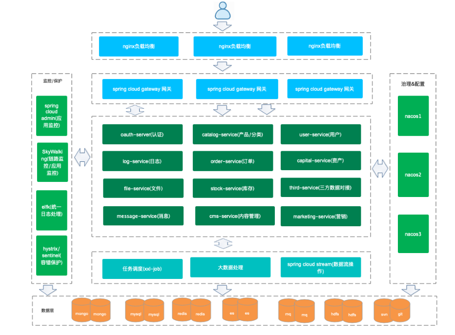

## JVM

### JVM和JDK和JRE的区别

JDK（Java development kit）Java开发环境。包含JRE

JRE（Java running Environment）Java运行环境。类库、类加载器和JVM构成

JVM（Java Virtual Machine） JVM就是一个引擎，提供运行时环境驱动Java代码或程序应用程序。JRE的一部分。

### JVM内存区域划分

由堆、栈、方法区、程序计数器组成。

| 堆 （运行时常量池）     | new的对象实例   数组                 |
| -------------- | ----------------------------- |
| 栈 （JVM栈和本地方法栈) | 局部变量(基本数据类型)和对象引用类型           |
| 方法区            | 加载好的类放在方法区，常量、静态变量            |
| 程序计数器          | 存储的是地址描述的是当前线程接下来 要执行的指令在什么地方 |

JVM栈与本地方法栈（Native Method Stack）的主要区别在于 本地方法栈执行native方法(非Java语言实现的接口)

程序计数器、栈都是线程独有的，所以线程安全

堆和方法区是共享的。所以线程不安全

### 内存分配策略

   1.所有new的对象都在堆里面。对象优先分配到新生代Eden区.

> 新生代会按照8:1的比例划分Eden 和Survior区。Survior会按1：1划分from space 和to space

   2.大对象（-XX:PretenureSizeThreadshold=1024）直接进入老年代，在新生代里面长期存活的对象进入老年代。

   3.长期存活对象会进入老年代。当GC 年龄大于15（默认）会转存老年代。

   4.如果年龄相同的对象内存超过新生代的一半，超过或等于该年龄的对象会转存老年代。

   5.老年代的连续空间大于新生代对象总大小或者历次晋升的平均值，就会进行MinorGC。否则进行FullGC。

### 垃圾收集器

#### Serial收集器

**特点**

- 单线程、
- 会暂停其他工作线程。

#### ParNew收集器

**特点**

- Serial收集器的多线程版本
- 会暂停其他工作线程。

#### Parallel Scavenge 收集器

**特点**

- 并行的多线程收集器
- 关注点在于达到一个可控制吞吐量（CPU运行代码时间/CPU消耗总时间）
- 提供自适应调节策略
- 1.7和1.8默认的新生代收集器

#### CMS收集器

**运作过程**

- 初始标记 暂停线程标记一下GC Roots可关联到的对象
- 并发标记  对标记对象进行跟踪
- 重新标记  修正并发标记期间因用户程序继续运行导致的标记变化对象。
- 并发清理  并发的进行GC操作

**特点**

- 以获取最短回收停顿时间为目标。
- 对CPU资源敏感，因为并发会占用CPU资源。导致应用程序变慢。吞吐量降低。
- 无法回收浮动垃圾（并发清理阶段产生的垃圾）
- 基于标记清理实现，会产生大量内存碎片。

#### G1收集器

**特点**

- 并发与并行兼顾。缩短了其他收集器的Stop-The-World的时间
- 分代收集
- 空间整合。整体基于标记-整理来实现的
- 可预测性停顿。将内存空间分成独立区域，有计划的避免Java堆中进行全区域的垃圾收集。
- 1.9版本以上默认的垃圾收集器

**运行过程**

- 初始标记
- 并发标记
- 最终标记 正并发标记期间因用户程序继续运行导致的标记变化对象。并记录日志
- 筛选回收 对各个区域的回收价值和成本进行排序。根据用户期望的GC停顿时间来进行回收。

Unsafe.class下存在native方法引用。

native 关键字修饰接口，说明该接口在外部定义。使用非Java语言实现。

```java
//native 的使用 cd 到target/class下 需要使用 javah  包名+类名 命令 生成 C的头文件。在里面实现C的代码.编译完成的C文件需要放入windows的C类库下面
public class HelloJni {
    static {
        System.loadLibrary("hello");
    }

     private  native void sayHello();

    public static void main(String[] args) {
            new HelloJni().sayHello();
    }
}


```

### GC垃圾回收机制

##### 引用计数法

​      通俗的来说就是每一个程序有一个计数器，当程序被引用的时候计数器加1，引用失效计数器减1。计数器为0的对象表示不可用。

​       缺点：两个对象互相引用的时候，计数器都不为0.无法被回收。

JVM虚拟机没有使用这种方法。

##### 可达性分析算法

​      以 GC Roots 为根，向下搜索。搜索走过的路径称为引用链，如果一个对象与GC Roots 之间不存在联通的引用链。即不可达。认为该对象可回收。

##### 标记-清除算法

分为标记和清理两个阶段。标记阶段标记所有要回收的对象。清理阶段清理这些对象

缺点是：效率不高，清理后会产生大量内存不连续的碎片。导致分配给大对象时内存不足需要提前触发回收。

###### 复制算法（新生代回收算法）

将内存划分为大小相等的块，当一块内存使用结束的时候，将该区域存活的对象复制到另一块内存区域。然后回收当前内存区域。

缺点：内存缩小为原来的一半。

##### 标记-整理算法

在标记-清理的基础上，增加一步整理的功能。在清楚前，将有存活对象的内存区域向一端移动，然后清理边界之外的内存区域。

##### 分代收集算法

将内存分为新生代和老年代。新生代是生命周期短。新生代的对象因为生命周期短，所以使用复制算法进行回收。老年代的生命周期长，使用标记-整理或者标记-清除算法。

### JVM调优常用参数

- -Xmx1024m：最大堆内存，当物理内存不超过192m时最大堆内存为物理内存的一半，否则为物理内存的四分之一
- -Xms1024m：最小堆内存，一般设置为与-Xmx同等值
- -XX:+PrintGCDetails：输出gc详细日志
- -XX:+PrintGCTimeStamps或-XX:+PrintGCDateStamps：输出gc信息时带上时间戳


- jcmd：专用于查看JVM状态，可以查看正在运行的进程，会显示出进程号

### JVM分析堆内存溢出步骤

#### 直接内存溢出（Directory Memory）

直接内存（Direct Memory）并不是虚拟机运行时数据区的一部分，也不是 JVM 规范中定义的内存区域。但这部分内存也被频繁的使用，而且也可能导致 [OutOfMemoryError](https://so.csdn.net/so/search?q=OutOfMemoryError&spm=1001.2101.3001.7020) 异常出现。

#### 内存溢出（OutOfMemory）

内存溢出（OutOfMemory，简称OOM）是一个令人头疼的问题，它通常出现在某一块内存空间耗尽的时候。在 Java 程序中，导致内存溢出的原因有很多，其中最常见的有：堆溢出、直接内存溢出、方法区溢出等。

##### 堆溢出

```java
java.lang.OutOfMemoryError: Java heap space
```

**原因**

1、代码中可能存在大对象分配
2、可能存在内存泄露，导致在多次GC之后，还是无法找到一块足够大的内存容纳当前对象。

**解决方法**

1、检查是否存在大对象的分配，最有可能的是大数组分配
2、通过jmap命令，把堆内存dump下来，使用mat工具分析一下，检查是否存在内存泄露的问题
3、如果没有找到明显的内存泄露，使用 -Xmx 加大堆内存
4、还有一点容易被忽略，检查是否有大量的自定义的 Finalizable 对象，也有可能是框架内部提供的，考虑其存在的必要性

##### 方法区或者运行时常量池的溢出

```java
-XX:MetaspaceSize=N //设置Metaspace的初始（和最小大小）
-XX:MaxMetaspaceSize=N //设置Metaspace的最大大小，默认为-1，即不限制， 或者说只受限于本地内存大小
```

**报错信息**

```java
java.lang.OutOfMemoryError: PermGen spacejava.lang.OutOfMemoryError: Metaspace
```

**原因**

1、在Java7之前，频繁的错误使用String.intern()方法
2、运行期间生成了大量的代理类，导致方法区被撑爆，无法卸载
3、应用长时间运行，没有重启

**解决方式**

1、检查是否永久代空间或者元空间设置的过小
2、检查代码中是否存在大量的反射操作
3、dump之后通过mat检查是否存在大量由于反射生成的代理类
4、放大招，重启JVM

##### 栈溢出

**报错信息**

```java
java.lang.OutOfMemoryError : unable to create new native Thread
```

**原因**

1.出现这种异常，基本上都是创建的了大量的线程导致的，以前碰到过一次，通过jstack出来一共8000多个线程。

2.递归导致栈深度超出

**解决**

通过 -Xss 降低的每个线程栈大小的容量

### class在JVM中的加载过程

##### 类加载的生命周期

- **加载**

​        1.通过一个类的全限定名来获取定义此类的二进制字节流

​        2.将这个字节流所代表的静态存储结构转化为方法区的运行时数据结构

​        3.在内存中生成一个代表这个类的class对象。作为方法区这个类的各种数据的访问入口。

- **验证**

​        1.文件格式验证   （是否以魔数开头、主次版本号是否在当前虚拟机处理范围）

​        2.元数据验证    对字节码描述的信息进行语义分析。类之间的相关关系及操作是否符合Java语法规范

​        3.字节码验证     对类的方法体进行校验。校验方法体中的操作是否符合语法规范

​        4.符号引用验证  对类自身以外的信息进行匹配验证。例如A类引用B类的数据。是否能正确获取。

- **准备**

​       为类变量分配内存并设置类变量初始值的阶段

- **解析**

​       将类中的常量池内的符号引用替换成直接引用的过程

​       符号引用：一组符号，与虚拟机内存无关。

​       直接引用：指向地址的指针、相对偏移量或者间接定位的句柄。与虚拟机的内存分布相关

- **初始化**  

  根据程序员指定的主观计划，进行类变量和资源的初始化。类构造器方法<clinit>() 的执行过程

  **JVM规范规定了五种情况**

​        1.遇到 new 、getstatic、putstatic、invokestatic 字节码指令的时候。尚未初始化，则必须先进行初始化操作。对应的Java代码场景：new关键字实例化对象、读取、设置一个类的静态字段、调用一个静态方法。

​        2.使用java.lang.reflect包的方法对类做反射调用的时候

​        3.初始化子类时，先初始化父类。

​        4.虚拟机启动时，用户指定了要执行的主类  main方法的类

​        5.JDK1.7 动态语音支持时，java.lang.invoke.MethodHandle示例后的解析结果的方法句柄对应的类未初始时。

```java
//静态代码块只能访问定义在代码块之前的静态变量。定义在之后的变量可以赋值不可以访问。
//父类会在子类之前初始化
//父类的初始化方法先执行所以父类的静态语句先于子类执行
public class Test{
  static{
    i=0;   // 可以赋值
    System.out.println(i);  //会报非法向前引用
  }
  static int i=1;
}
```

- **使用**
- **卸载**

##### 类加载器

###### **定义**

生成描述类的二进制字节流的过程 实现这一操作的模块 成为类加载器

###### **双亲委派模型**

不同类加载器通过组合工作。除了顶层的启动类加载器外，其他类加载器都有他的父加载器。在加载器处理加载任务时，会优先让父加载器处理直到传递至最顶层BootstrapClass Loader。父加载器无法处理，自己再尝试处理。

###### 双亲委派模式缺点

子类加载器可以使用父类加载的类。父类不能使用子类加载的类。例如SPI 实现的Java类一般是由AppClassLoader来加载的，BootstrapClass Loader无法找到SPI的实现类，无法代理AppClassLoader。

## Java基础

[Java基础篇](Java基础.md)

### 注解相关

#### @Autowired和@Resource注解的区别是什么？

@Autowired 由Spring提供，只按照byType注入  可以使用@Qualifier byName

@Resource 由J2EE提供，默认按照byName自动注入

#### 常用注解说明

##### Controller层

###### @Controller

控制器。定义一个控制类。接收DispatcherServlet的分发请求。

###### @RequstMapping

处理请求的路径问题。用于映射一个地址或者路径。可以作用于类和方法上.表明该方法或者类的请求路径

###### @ResponseBody

将Java对象转json

###### @RequestBody

接收请求体中的内容并封装成javabean。一般用于处理非 Content-Type: application/x-www-form-urlencoded编码格式的数据，比如：application/json、application/xml等类型的数据。一个方法只能有一个。

###### @RequestParam

接收请求头中的指定属性赋值给形参。有三个属性：value/name、defaultvalue、required。

###### @PathVariable

映射URL绑定占位符。通过 @PathVariable 可以将 URL 中占位符参数绑定到控制器处理方法的入参中：URL 中的 {xxx} 占位符可以通过@PathVariable(“xxx“) 绑定到操作方法的入参中。

##### Service层

###### @Service

将该类标注为service类。处理业务逻辑。注入到Spring容器中。

###### @Component

泛指各种组件。不需要归类分层的类都可以使用该注解纳入Spring容器管理。

##### dao层

###### @Repository

标识数据访问层。表名该类是数据访问dao层。纳入Spring容器管理。

##### 其他

###### @Bean

方法级别的注解。用来表名方法产生一个纳入Spring管理的bean

###### @Order

控制bean的加载顺序

###### @DependsOn

表明该bean启动依赖于其他bean

###### @Lazy

仅在默认单例作用域的情况下才具有实际效果。延迟加载

###### @Configuration

配置类注解

## 设计模式

### 策略模式

#### 是什么？

将某一特征的对象。分割成策略类、实现类和持有角色类。

策略类：由接口或者抽象类构成。

实现类：策略类的具体实现

持有角色类：策略类的持有者。提供策略的调用。

##### 持有角色类

使用抽象类定义的持有角色类，用来代指某一特征的对象，例如人、动物等。基础类中会引用不同的行为接口。通过调用set方法来完成自定义行为的功能。

```java
/**
 * @author djz
 * @Title: personAbstract
 * @ProjectName djz-nacos
 * @Description: 人物类
 * @date 2022/6/615:59
 */
public abstract class personAbstract {

    public String name;

    public String sex;

    public String age;

    //唱歌行为类
    public designMode.policyMode.behavior.singBehavior singBehavior;
    //跑步行为类
    public designMode.policyMode.behavior.runBehavior runBehavior;

    public void setSingBehavior(designMode.policyMode.behavior.singBehavior singBehavior) {
        this.singBehavior = singBehavior;
    }

    public void setRunBehavior(designMode.policyMode.behavior.runBehavior runBehavior) {
        this.runBehavior = runBehavior;
    }

    public String getName() {
        return name;
    }

    public void setName(String name) {
        this.name = name;
    }

    public String getSex() {
        return sex;
    }

    public void setSex(String sex) {
        this.sex = sex;
    }

    public String getAge() {
        return age;
    }

    public void setAge(String age) {
        this.age = age;
    }
}

```

##### 策略类

如下使用接口定义不同的功能方法，同时通过实现这些接口完成具体的功能。

```Java
/**
 * @author djz
 * @Title: runBehavior
 * @ProjectName djz-nacos
 * @Description: TODO
 * @date 2022/6/616:02
 */
public interface runBehavior {

    public  void  run();
}
```

```java
/**
 * @author djz
 * @Title: runSlow
 * @ProjectName djz-nacos
 * @Description: TODO
 * @date 2022/6/616:04
 */
public class runSlow implements runBehavior {

    @Override
    public void run() {
        System.out.println("跑的慢");
    }
}

```

##### 实现类

继承基类，用来定义具体的子类对象。例如人会有不同的职业。 

```java
/**
 * @author djz
 * @Title: singer
 * @ProjectName djz-nacos
 * @Description: TODO
 * @date 2022/6/616:10
 */
public class singer extends personAbstract{

    public singer(designMode.policyMode.behavior.singBehavior singBehavior) {
        this.singBehavior = singBehavior;
    }
}
```

##### 优点

- 遵循了开闭原则（对扩展开发，对修改关闭），使用者可以在不修改原有代码的基础上灵活使用或添加算法功能
- 能有效的避免代码重复（将重复代码移动到父类中）
- 可以有效的避免使用多重if-else语句

##### 缺点

- 每一个算法的实现都要单独生成一个策略类。如果算法多会导致类的数量多
- 使用者需要知道所有的策略。

### 观察者模式

##### 主题

观察者模式分为主题和订阅者（观察者），主题顾名思义，就是作为信息的生产方，在主题发生变化或者发出信息的时候，提醒订阅方进行相应的操作,提供消费者提醒方法，移除和添加订阅者的方法。

```java
/**
 * @author djz
 * @Title: subject   主题
 * @ProjectName 观察者模式
 * @Description: 观察者模式主要解决一对多的问题。MQ的设计模式实际就遵从观察者模式
 * @date 2022/6/616:23
 */
public  interface subject {

    public  void  notifyMethod();

    public  void  removeOb(observer observer);
    public  void addOb(observer observer);
}

```

```java
/**
 * @author djz
 * @Title: sub1
 * @ProjectName djz-nacos
 * @Description: TODO
 * @date 2022/6/616:27
 */
public class sub1 implements subject {
    private List<observer> observerList =new ArrayList<>();
    @Override
    public void notifyMethod() {
        for (observer observer : observerList) {
            observer.update();
        }
    }

    @Override
    public void removeOb(observer observer) {
        observerList.remove(observer);
    }

    @Override
    public void addOb(observer observer) {
        observerList.add(observer);
    }
}

```

##### 订阅者

消费主题消息，完成之后的相关操作

```java
public class ob1 implements observer{
    @Override
    public void update() {
        System.out.println("消息更新");
    }
}
```

### 装饰者模式

##### 装饰对象

###### 装饰对象基类

使用抽象类编写一个装饰对象的抽象类作为抽象组件，可以提供抽象方法用来在子类中进行重写，提供功能的扩展。公共代码可以在该组件中编写，避免重复。

```java
/**
 * @author djz
 * @Title: phone
 * @ProjectName djz-nacos
 * @Description: 
 * @date 2022/6/616:50
 */
public abstract class computer {
    public String name;

    public abstract double cost();
}
```

###### 装饰者对象

继承抽象类，同时实现在类中重写抽象方法。

```java
/**
 * @author djz
 * @Title: base
 * @ProjectName djz-nacos
 * @Description: TODO
 * @date 2022/6/616:56
 */
public class base extends computer {
    @Override
    public double cost() {
        return 0;
    }
}

```

##### 装饰者

###### 装饰者基类

使用抽象类继承装饰对象的抽象类，同时在该抽象类中进行引用

```java
public  abstract class computerDecoration extends computer {
    computer computer;

    public computerDecoration(computer computer) {
        this.computer = computer;
    }

    @Override
    public double cost() {
        return computer.cost();
    }
}
```

###### 装饰者

通过继承抽象装饰者。来实现具体的装饰者。完成具体功能

```java
public class CpuUpdate extends computerDecoration {

    @Override
    public double cost() {
        return computer.cost()+2000;
    }

    public CpuUpdate(computer computer) {
        super(computer);
    }
}

```

##### 总结

装饰者，给对象动态附加额外的功能。相较于子类化的方法提供了弹性的替代做法

### 工厂模式

##### 简单工厂模式

将经常修改的创建代码提取出来，创建一个工厂类。如下

```java
public class tableFactory {
    public Object create(String type) {
        Object object=null;
        switch (type){
            case "mysql":
                object= new mysqlTable();;break;
            case "oracle":
                object=  new oracleTable();break;
            default:
                object=   new hiveTable();;break;
        }
        return object;
    }
}
```

##### 工厂方法模式

###### 抽象工厂

在简单工厂模式的基础上，使用抽象类抽象出来一个基础抽象组件,组件中提供抽象方法让子类决定具体的创建，同时可以在基础抽象组件中编写公共代码避免重复

```java
public abstract class abstractFactory {

    public String url;
    public String password;
    public String user;

    public abstract  void create(String type);

}

```

###### 具体工厂

```java
public class tableFactory extends abstractFactory {

    @Override
    public Object create(String type) {
        Object object=null;
        switch (type){
            case "mysql":
                object= new mysqlTable();;break;
            case "oracle":
                object=  new oracleTable();break;
            default:
                object=  new hiveTable();;break;
        }
        return object;
    }
}

```

###### 抽象产品

这里举例使用表

```java
public abstract class abstarctTable {

    
}

```

###### 具体产品

```java
public class oracleTable extends abstarctTable {

    public oracleTable() {
        System.out.println("创建oracle表");
    }
}

```

###### 使用

```java
public class test {
    public static void main(String[] args) {
        abstractFactory factory  = new tableFactory();
        factory.create("mysql");
    }
}

```

##### 抽象工厂模式

在工厂方法模式的基础上，在上层添加同一的工厂创建接口、所有的工厂类实现该接口。同时提供一个构造器来统一创建工厂。

```java
public class factoryBuilder {

    public static abstractFactory getFactory(String factoryType){

       if ("db".equals(factoryType)){
           return  new dbConnectFactory();
       }else {
           return  new tableFactory();
       }

    }
}
```

##### 比较

工厂方法模式是在简单工厂模式上的延伸，满足了开闭原则。实现了可扩展。

抽象工厂针对的是产品族。工厂模式针对是产品系列。一个产品族包含多个产品新列。

抽象工厂模式不利于产品族的扩展。

### 单例模式

##### 懒汉式

```java
/**
 * 
 * @ClassName: Singleton
 * @Description: 懒汉式单例（在第一次调用的时候实例化自己）
 * 这种方式是最基本的实现方式，这种实现最大的问题就是不支持多线程。因为没有加锁 synchronized，
 *   所以严格意义上它并不算单例模式。
 */
public class Singleton {
	//构造函数私有化
	private Singleton(){}
	
	private static Singleton singleton = null;
	
	//构建实例化方法
	public static Singleton getSingleton(){
		if(singleton == null){
			singleton = new Singleton();
		}
		return singleton;
	}
}
```

##### 饿汉式

```java
/**
 * 
 * @ClassName: Singleton2
 * @Description: 饿汉式
 * 这种方式比较常用，但容易产生垃圾对象。
 * 优点：没有加锁，执行效率会提高。
 * 缺点：类加载时就初始化，浪费内存。
 */
class Singleton2 {
        //私有构造函数
	private Singleton2(){};
	private static Singleton2 singleton2= new Singleton2();
	public static Singleton2 getSingleton2(){
		return singleton2;
	}
}
```

##### 线程同步

```java 
/**
 * 
 * @ClassName: Singleton2
 * @Description: 加synchronized关键字
 * 优点：线程同步
 * 缺点：同步性能消耗大
 */
class Singleton2 {
 	//构造函数私有化
	private Singleton(){}
	
	private static Singleton singleton = null;
	
	//构建实例化方法
	public static synchronized Singleton getSingleton(){
		if(singleton == null){
			singleton = new Singleton();
		}
		return singleton;
	}
}
```

##### 最优版

```java
/**
 * 
 * @ClassName: Singleton2
 * @Description: 改良版
 * volatile保证变量的可见性，使用双重检查锁定。来减少同步的性能消耗。当线程加载到方法时。先判断变量是否为空。为空才进行实例化操作。极大的加快了响应速度。二次加锁是为了避免多实例的创建。
 */
class Singleton2 {
 	//构造函数私有化
	private Singleton(){}
	
	private volatile static Singleton singleton = null;
	
	//构建实例化方法
	public static  Singleton getSingleton(){
		if(singleton == null){ 
          synchronized(Singleton2.class){
            if(singleton == null){
              	singleton = new Singleton();
            }
          }
		}
		return singleton;
	}
}
```

### 命令模式

##### 执行（execute）

执行命令的对象

```java
/**
 * @author djz
 * @Title: client
 * @ProjectName djz-nacos
 * @Description: TODO
 * @date 2022/7/1215:17
 */
public class client {

    public void  sayHello(){
        System.out.println("hello world");
    }
}

```

##### 命令（Command）

###### 命令接口

```java
public interface order {
    void  execute();
}
```

###### 命令实现

```java
public class command implements order{

    //执行命令的对象
    client client;

    public command(designMode.commandModel.execute.client client) {
        this.client = client;
    }

    @Override
    public void execute() {
         client.sayHello();
    }
}
```

##### 入口（invoke）

```java
/**
 * @author djz
 * @Title: Control
 * @ProjectName djz-nacos
 * @Description: 命令适配类
 * @date 2022/7/1215:30
 */
public class Control {

    designMode.commandModel.command.order order ;

    public void setOrder(designMode.commandModel.command.order order) {
        this.order = order;
    }
   
    public  void  buttonWasPressed(){
        order.execute();
    }    
}


```

### 模板方法模式

定义一个算法的骨架，将一些步骤延迟到子类中实现。

```java
/**
 * @author djz
 * @Title: abstractMethod
 * @ProjectName djz-nacos
 * @Description: TODO
 * @date 2022/7/1215:58
 */
public abstract class abstractMethod {

    final void doSomething(){
        sayHello();
        sayBye();
    }

    abstract void sayHello();
    abstract void sayBye();
}

```

子类实现

```java
/**
 * @author djz
 * @Title: sayByeNotHellow
 * @ProjectName djz-nacos
 * @Description: TODO
 * @date 2022/7/1216:00
 */
public class sayByeNotHellow extends abstractMethod {

    @Override
    void sayHello() {

    }

    @Override
    void sayBye() {
        System.out.println("bye");
    }
}
```

### 状态模式

在状态模式（State Pattern）中，类的行为是基于它的状态改变的。这种类型的设计模式属于行为型模式。

##### 优点

1. 封装了转换规则。
2. 枚举可能的状态，在枚举状态之前需要确定状态种类。
3. 将所有与某个状态有关的行为放到一个类中，并且可以方便地增加新的状态，只需要改变对象状态即可改变对象的行为。 
4. 允许状态转换逻辑与状态对象合成一体，而不是某一个巨大的条件语句块。
5. 可以让多个环境对象共享一个状态对象，从而减少系统中对象的个数。

##### 缺点

1. 状态模式的使用必然会增加系统类和对象的个数。 
2. 状态模式的结构与实现都较为复杂，如果使用不当将导致程序结构和代码的混乱。
3. 状态模式对"开闭原则"的支持并不太好，对于可以切换状态的状态模式，增加新的状态类需要修改那些负责状态转换的源代码，否则无法切换到新增状态，而且修改某个状态类的行为也需修改对应类的源代码。

##### 使用场景

1、行为随状态改变而改变的场景。 

2、条件、分支语句的代替者。

##### 实现

###### 状态接口

```java
public interface State {
   public void doAction();
}
```

###### 状态实现

```java
/**
 * @author djz
 * @Title: startState
 * @ProjectName djz-nacos
 * @Description: TODO
 * @date 2022/7/1216:16
 */
public class startState implements state {
    @Override
    public void doAction() {
        System.out.println("开始操作");
    }
}

```

```java

/**
 * @author djz
 * @Title: startState
 * @ProjectName djz-nacos
 * @Description: TODO
 * @date 2022/7/1216:16
 */
public class startState implements state {
    @Override
    public void doAction() {
        System.out.println("开始操作");
    }
}
```

###### 使用

```java
/**
 * @author djz
 * @Title: Context
 * @ProjectName djz-nacos
 * @Description: TODO
 * @date 2022/7/1216:15
 */
public class context {

    private stopState stopState;
    
    private startState startState;
    
    public void  nowState(int a ){
        if (a==1){
            startState.doAction();
        }else {
            stopState.doAction();
        }
    }
}

```

### 代理模式

#### 什么是代理

通常创建一个对象，我们使用new的方式创建。代理模式则是通过创建一个代理类proxy的方式访问服务。代理类会持有一个委托类对象，代理类本身不会去实现服务。而是通过调用委托类对象来实现服务。

#### 代理模式类结构图


#### 解决问题

​      在直接访问对象时带来的问题，比如说：要访问的对象在远程的机器上。在面向对象系统中，有些对象由于某些原因（比如对象创建开销很大，或者某些操作需要安全控制，或者需要进程外的访问），直接访问会给使用者或者系统结构带来很多麻烦，我们可以在访问此对象时加上一个对此对象的访问层。

#### 使用场景

Spring Aop

#### 优点

1. 职责清晰。
2. 高扩展性。 
3. 智能化。

#### 缺点

- 由于在客户端和真实主题之间增加了代理对象，因此有些类型的代理模式可能会造成请求的处理速度变慢。 
- 实现代理模式需要额外的工作，有些代理模式的实现非常复杂。

#### 静态代理

##### 是什么？

静态代理就是程序员在编写代码的时候就已经把代理类的源码写好了，编译后就会生成.class文件

##### 实现

以加载图片为例

###### 提供一个接口

```java
public interface Image {
   void display();
}
```

###### 接口的远程服务器实现

```java
public class RealImage implements Image {
 
   private String fileName;
 
   public RealImage(String fileName){
      this.fileName = fileName;
      loadFromDisk(fileName);
   }
 
   @Override
   public void display() {
      System.out.println("Displaying " + fileName);
   }
 
   private void loadFromDisk(String fileName){
      System.out.println("Loading " + fileName);
   }
}
```

###### 接口的代理实现

```java
public class ProxyImage implements Image{
 
   private RealImage realImage;
   private String fileName;
 
   public ProxyImage(String fileName){
      this.fileName = fileName;
   }
 
   @Override
   public void display() {
      if(realImage == null){
         realImage = new RealImage(fileName);
      }
      realImage.display();
   }
}
```

#### 动态代理

##### 是什么？

代理类在程序运行时创建的代理方式被成为动态代理。在静态代理中，代理类（RenterProxy）是自己已经定义好了的，在程序运行之前就已经编译完成。而动态代理是在运行时根据我们在Java代码中的“指示”动态生成的。动态代理相较于静态代理的优势在于可以很方便的对代理类的所有函数进行统一管理，如果我们想在每个代理方法前都加一个方法，如果代理方法很多，我们需要在每个代理方法都要写一遍，很麻烦。而动态代理则不需要。

##### JDK代码实现

在java的java.lang.reflect包下提供了一个Proxy类和一个InvocationHandler接口，通过这个类和这个接口可以生成JDK动态代理类和动态代理对象

###### 定义一个接口

跟静态代理一样。先定义一个行为接口。提供统一的行为方法。

```java
package Proxy;

/**
 * @author djz
 * @Title: Person
 * @ProjectName djz-nacos
 * @Description: TODO
 * @date 2022/10/613:14
 */
public interface Person {
    
    
    public void sing();
}

```

###### 创建被代理的类。

```java
package Proxy;

/**
 * @author djz
 * @Title: Entrust
 * @ProjectName djz-nacos
 * @Description: 委托类，即被代理的类
 * @date 2022/10/613:17
 */
public class Entrust implements Person {

    public Entrust() {
        super();
    }


    @Override
    public void sing() {
        System.out.println("唱个歌");
    }
}

```

###### 实现InvocationHandler

```java
package Proxy;

import java.lang.reflect.InvocationHandler;
import java.lang.reflect.Method;

/**
 * @author djz
 * @Title: handlerImp
 * @ProjectName djz-nacos
 * @Description: TODO
 * @date 2022/10/613:18
 */
public class handlerImp<T> implements InvocationHandler {

    private  T  target;

    public handlerImp(T target) {
        this.target = target;
    }
    /**
     * proxy:代表动态代理对象
     * method：代表正在执行的方法
     * args：代表调用目标方法时传入的实参
     */
    @Override
    public Object invoke(Object proxy, Method method, Object[] args) throws Throwable {
        //代理过程中插入其他操作
        System.out.println("代理进行代理操作中");
        Object result = method.invoke(target, args);
        return result;
    }
}
```

###### 测试

```java
package Proxy;

import java.lang.reflect.Proxy;

/**
 * @author djz
 * @Title: Test
 * @ProjectName djz-nacos
 * @Description: TODO
 * @date 2022/10/613:13
 */
public class Test {

    public static void main(String[] args) {
      //创建委托类
        Entrust entrust = new Entrust();
        handlerImp<Entrust> entrusthandlerImp = new handlerImp<>(entrust);
        Person renterProxy = (Person)Proxy.newProxyInstance(Person.class.getClassLoader(),
                new Class[]{Person.class}, entrusthandlerImp);
        renterProxy.sing();

    }
}
```

##### CGLIB代理

被代理类未实现接口，可以使用CGLIB来实现动态代理。

###### 定义一个被代理类

```java
package Proxy.cglb;

/**
 * @author djz
 * @Title: UserServce
 * @ProjectName djz-nacos
 * @Description: TODO
 * @date 2022/10/614:54
 */
public class UserService {

    public  void  sayHello(){

        System.out.println("你好啊");
    }
}
```

###### 创建一个拦截器

```java
package Proxy.cglb;

import net.sf.cglib.proxy.MethodInterceptor;
import net.sf.cglib.proxy.MethodProxy;

import java.lang.reflect.Method;

/**
 * @author djz
 * @Title: ProxyInterceptor
 * @ProjectName djz-nacos
 * @Description: TODO
 * @date 2022/10/619:38
 */
public class ProxyInterceptor implements MethodInterceptor {

    @Override
    public Object intercept(Object o, Method method, Object[] objects, MethodProxy methodProxy) throws Throwable {
        System.out.println("代理作用中");
        Object result = method.invoke(o, objects);
        return result;
    }
}

```


###### 创建代理工厂类

```java
package Proxy.cglb;

import net.sf.cglib.proxy.Enhancer;

/**
 * @author djz
 * @Title: ProxyFactory
 * @ProjectName djz-nacos
 * @Description: TODO
 * @date 2022/10/614:56
 */
public class ProxyFactory  {


    public static  Object createCglibProcy(Class clazz){

        Enhancer enhancer =new Enhancer();
        // 为加强器指定要代理的业务类（即为下面生成的代理类指定父类）
       enhancer.setSuperclass(clazz);
        // 设置回调：对于代理类上所有方法的调用，都会调用CallBack，而Callback则需要实现intercept()方法
       enhancer.setCallback(new ProxyInterceptor());
       return enhancer.create();

    }
}

```

###### 测试

```java
package Proxy.cglb;

/**
 * @author djz
 * @Title: Test
 * @ProjectName djz-nacos
 * @Description: TODO
 * @date 2022/10/613:28
 */
public class Test {

    public static void main(String[] args) {

        UserService UserService = (UserService)ProxyFactory.createCglibProcy(UserService.class);
        UserService.sayHello();
    }
}

```


## 通信协议

#### HTTP

HTTP（HyperText Transfer Protocol：超文本传输协议）是一种用于分布式、协作式和超媒体信息系统的应用层协议。 简单来说就是一种发布和接收 HTML 页面的方法，被用于在 Web 浏览器和网站服务器之间传递信息。

HTTP 默认工作在 TCP 协议 80 端口

HTTP 协议以明文方式发送内容，不提供任何方式的数据加密，如果攻击者截取了Web浏览器和网站服务器之间的传输报文，就可以直接读懂其中的信息，因此，HTTP协议不适合传输一些敏感信息，比如：信用卡号、密码等支付信息。

#### HHTPS

HTTPS（Hypertext Transfer Protocol Secure：超文本传输安全协议）是一种透过计算机网络进行安全通信的传输协议。HTTPS 经由 HTTP 进行通信，但利用 SSL/TLS 来加密数据包。HTTPS 开发的主要目的，是提供对网站服务器的身份认证，保护交换数据的隐私与完整性。

HTTPS 默认工作在 TCP 协议443端口

工作流程：

1. TCP 三次同步握手
2. 客户端验证服务器数字证书
3. DH 算法协商对称加密算法的密钥、hash 算法的密钥
4. SSL 安全加密隧道协商完成
5. 网页以加密的方式传输，用协商的对称加密算法和密钥加密，保证数据机密性；用协商的hash算法进行数据完整性保护，保证数据不被篡改。

#### HTTP 与 HTTPS 区别

- HTTP是明文协议，不做加密。HTTPS 是SSL和HTTP。加密。安全性好
- 使用HTTPS需要到CA申请证书。
- HTTP的响应速度比HTTPS快。主要在于HTTPS三次握手传输的包要多。多了SSL的9个包。HTTP传输3个包
- 端口不同
- HTTPS 比 HTTP 要更耗费服务器资源。

#### 三次握手

在TCP/IP协议中，TCP协议通过三次握手建立一个可靠的连接

- 客户端尝试连接服务器。向服务器发送syn包（同步序列编号Synchronize Sequence Numbers）,客户端进入SYN_SEND状态等待服务器响应
- 服务器处理syn并做出响应。返回syn+ack(*Ack*nowledge character)。服务器进入SYN_RECV状态
- 客户端接收到SYN+ACK的包，向服务器发送确认包ACK。此包发送完毕，客户端和服务器进入ESTABLISHED状态，完成三次握手

#### 四次挥手

- 客户端发送FIN，表示不会再发送数据。进入等待状态FIN_WAIT_1
- 服务器端接收到FIN，返回ack。确认报文为序列号+1
- 服务器关闭并发送FIN给客户端
- 客户端发回ACK[报文](https://baike.baidu.com/item/%E6%8A%A5%E6%96%87)确认，并将确认序号设置为收到序号加1。

#### 为啥不能二挥、三挥

发送FIN之后不会立即断开连接。只是表明不再发送数据。二挥会导致服务器未发送完的消息无法被接收。

三挥会导致客户端以为服务器未接收到FIN一直发送FIN。

#### 打开一个网址使用了哪些协议

- DNS协议，将域名解析为IP
- TCP/IP协议  IP找地址、TCP规范传输规则。
- HTTP协议   在TCP/IP协议接收到数据之后，需要通过HTTP协议来解析。HTTP报文分为请求报文和响应报文，都包括三部分：首行、头部和主体。

#### TCP/UDP的区别

UDP 适合广播发送。效率高但是不可靠

TCP 适合两个对象间传递数据

#### Content-Type

##### 是什么？

中文直译为内容类型，表明这个参数是用来指定http请求的内容类型格式的。用来告诉服务器端应该如何处理请求信息。

##### 常见类型

- Application/Json

- Application/xml

- application/x-www-form-urlencoded   

  HTTP会将请求参数用key1=val1&key2=val2的方式进行组织，并放到请求实体里面，注意如果是中文或特殊字符如"/"、","、“:" 等会自动进行URL转码。不支持文件，一般用于表单提交。

- multipart/form-data   支持文件上传的格式


## 系统架构

#### 微服务架构图



微服务是相较于传统的服务部署而言的。传统的服务部署代码耦合性高，不利于升级维护。微服务是分布式架构的一种，将传统应用中的功能模块拆解成可以独立部署运行的应用。一方面降低了服务的耦合，一方面有利于服务的维护升级。

#### Getaway

###### 定义

由Spring Cloud 官方推出的第二代网关框架。由WebFlux+Netty+Reactor实现的响应式API网关.基于Filter的方法提供网关的基本功能，例如安全认证、监控、限流等功能。

###### 解决问题

微服务开发下，不同微服务地址端口不同，前后端请求变得复杂。网关起到的作用就是将这些请求地址和端口号同一管理起来。做路由的转发。网关本身就是一个微服务。

###### 作用

- 服务路由
- 流量控制
- 熔断保护
- 日志监控
- 安全认证

###### 配置项说明

- 断言(Predicate) 允许开发人员匹配http请求中的任意内容。根据匹配结果返回一个布尔值
- 路由(route)由 id 目标URI、断言集合、过滤器集合组成。如果聚合断言结果为真，则转发到该路由
- 过滤器(filter) 可以在返回请求之前或之后修改请求和响应的内容   

#### 框架

##### SpringMVC

###### 实现原理

1.用户访问网页提交request请求

2.前端控制器（dispatcherServlet）接收用户请求与响应

3.前端控制器调用处理映射器（handleMapping）解析请求对应的 `Handler`

4.解析到对应的 `Handler`（也就是我们平常说的 `Controller` 控制器）后，开始由 `HandlerAdapter` 适配器处理。

5.HandlerAdapter` 会根据 `Handler来调用真正的处理器来处理请求，并处理相应的业务逻辑。

6.处理器处理完业务后，会返回一个 `ModelAndView` 对象。

7.ViewResolver(视图解析器) modelAndView对象返回真正的视图view

8.DispaterServlet` 把返回的 `Model` 传给 `View`（视图渲染）。`

9.把 View返回给请求者（浏览器）

###### RestController与Controller 的区别

@RestController注解相当于@ResponseBody ＋ @Controller合在一起的作用。

###### @ResponseBody的作用

将Java对象转换为json格式数据

###### @RequestMapping

用于将任意HTTP 请求映射到控制器方法上。可以作为在类或者方法上。

###### @RequestParam

用于将请求参数区数据映射到功能处理方法的参数上

###### @PathVariable

用于将请求URL中的模板变量映射到功能处理方法的参数上，即取出uri模板中的变量作为参数。

###### @ResponseBody

该注解用于将Controller的方法返回的对象，通过适当的HttpMessageConverter转换为指定格式后，写入到Response对象的body数据区。

###### SpringMVC异常处理


##### Spring

###### 事务的传播行为

**是什么**

当事务方法A被事务方法B调用的时候，如何做处理。处理策略就是事务的传播行为。

**有哪些**

- PROPAGATION_REQUIRED    没有事务就创建事务，有事务就加入
- PROPAGATION_SUPPORTS    当前有事务就加入，没事务就以非事务的方式执行
- PROPAGATION_MANDATORY   有则加入，没有异常
- PROPAGATION_REQUIRES_NEW   创建新事务
- PROPAGATION_NOT_SUPPORTED   以非事务方式执行操作，如果当前存在事务，就把当前事务挂起
- PROPAGATION_NEVER   存在事务就抛出异常
- PROPAGATION_NESTED  如果当前存在事务，则在嵌套事务内执行。如果当前没有事务，则按REQUIRED属 性执行。

###### Spring Bean的注入方式

- xml配置
- @Configuration+@bean
- @Controller
- @Service
- @Repository
- @Component
- @import
- 实现BeanFactory
- @importResource

###### @Bean的作用域

作用于方法上

###### BeanFactory和FactoryBean的区别

       BeanFactory定义了IOC容器的最基本形式，并提供了IOC容器应遵守的的最基本的接口，也就是Spring IOC所遵守的最底层和最基本的编程规范。在Spring代码中，BeanFactory只是个接口，并不是IOC容器的具体实现，但是Spring容器给出了很多种实现，如 DefaultListableBeanFactory、XmlBeanFactory、ApplicationContext等，都是附加了某种功能的实现。
```
一般情况下，Spring通过反射机制利用<bean>的class属性指定实现类实例化Bean，在某些情况下，实例化Bean过程比较复杂，如果按照传统的方式，则需要在<bean>中提供大量的配置信息。配置方式的灵活性是受限的，这时采用编码的方式可能会得到一个简单的方案。Spring为此提供了一个org.springframework.bean.factory.FactoryBean的工厂类接口，用户可以通过实现该接口定制实例化Bean的逻辑。
```

##### Spring Bean的生命周期

​    SpringBean的生命周期包括：实例化bean、设置属性、初始化bean、销毁bean

- 请求未实例化的Bean，调用BeanFactory的doCreateBean方法创建一个bean。

- 对bean填充属性

- 进行初始化操作

  ```txt
  1.执行Aware接口的方法
  2.执行BeanPostProcessor的前置处理方法postProcessBeforelnitialization()，对Bean进行一些自定义的前置处理
  3.判断Bean是否实现了InitializingBean接口，如果实现了，将会执行lnitializingBean的afeterPropertiesSet()初始化方法
  4.执行用户自定义的初始化方法，如init-method等
  5.执行BeanPostProcessor的后置处理方法postProcessAfterinitialization()
  ```

- 初始化完成。

- 销毁

  1.判断是否实现了DestructionAwareBeanPostProcessor接口，如果实现了，则会执行DestructionAwareBeanPostProcessor后置处理器的销毁回调方法

  2.其次会判断Bean是否实现了DisposableBean接口，如果实现了将会调用其实现的destroy()方法

  3.最后判断这个Bean是否配置了destroy-method等自定义的销毁方法，如果有的话，则会自动调用其配置的销毁方法；

##### IOC（ Inversion Of Control ）

控制反转，相对于传统的对象引用方式而言的。传统的对象引用，在执行到需要使用对象的部位，进行new 一个对象。或者引用。IOC 的一个思想在于将创建对象的过程交由外部容器来实现。对于Spring而言就是交由Spring来进行这一行为。

###### IOC的实现原理

实现机制是反射

###### IOC与DI的区别

IOC  将创建对象的控制权交给IOC容器

DI  创建对象的时候为对象中的字段或者对象赋值。

##### SpringBoot

###### 特点

- 约定大于配置
- 自动装配

###### 为什么使用微服务

- 目前模块包拆分粒度比较细但未成体系/层次结构，很难化配出独立运行的应用
- 服务调用还停留在单体应用中方法调用的程度上，导致提供的应用过于臃肿
- 使用的技术框架较为老化，技术新特性很难应用在当前项目中
- 原应用的配置文件过于繁杂，应使用主流的编程式+文件式配置逐步替代

###### 核心注解

@SpringBootApplication

1. SpringBootConfiguration     声明当前类是SpringBoot应用的配置类
2. EnableAutoConfiguration    开启自动配置
3. ComponentScan  扫描Spring组件  basePackages 指定路径


###### 自动装配

SpringBoot 的使用特点主要是：约定大于配置、自动装配。所谓约定大于配置，即在使用过程中，使用者仅仅需要规定应用中不符合约定的部分。未做规定的部分使用默认配置。

自动装配主要体现在@EnableAutoConfiguration 。查看这个注解的内部实现。

- @AutoConfigurationPackage    将主配置下的包及子包里面的所有组件扫描并加载到Spring容器中


- @import(AutoConfigurationImportSelector.class)

​        selectImports（）方法，将需要自动装配的类以类全名的方式返回。**getAutoConfigurationEntry**()中又调用了 getCandidateConfigurations 扫描SpringBoot-autoconfig.jar的META-INF下的 spring.factories 文件，将里面的配置通过反射实例化为配置类。纳入IOC容器中管理。

###### 循环依赖解决

@Lazy  延迟一个bean的加载，从而解决Spring在初始化下bean的加载顺序问题

allow-circular-references为true。

排除依赖关系

###### SpringBoot 内存占用

默认配置高，修改启动命令。

-XX:MetaspaceSize=128m

-XX:MaxMetaspaceSize=128m

-Xms1024m：堆最大大小

-Xmx1024m：堆默认大小

-Xmn256m：新生代大小

###### SpringBoot自动装配关闭

@SpringBootApplication(exclude = {DataSourceAutoConfiguration.class })


##### SpringCloud

###### 常用注解说明

**@EnableDiscoveryClient**


 **@LoadBalanced**


##### Nacos

###### 简介

Nacos是Alibaba开源的一项技术、可以用来作为配置中心和服务注册中心

###### 快速使用

1. 下载安装包解压
2. 在数据库中执行conf下的nacos.sql文件
3. 配置conf文件夹下的application.properties文件
4. 使用命令启动nacos

###### SpringBoot整合

1. 启动nacos的服务。在IDEA中创建一个SpringBoot工程
2. 添加依赖   版本 0.2.x.RELEASE 对应的是 Spring Boot 2.x 版本，版本 0.1.x.RELEASE 对应的是 Spring Boot 1.x 版本如下所示整合的SpringBoot版本未2.7.0 所以Nacos版本号使用0.2.7

```xml
<dependency>
    <groupId>com.alibaba.boot</groupId>
    <artifactId>nacos-config-spring-boot-starter</artifactId>
    <version>0.2.7</version>
</dependency>
```

3. 使用 `@NacosPropertySource` 加载 `dataId` 为 `example` 的配置源，并开启自动更新

   ```java
   @SpringBootApplication
   @NacosPropertySource(dataId = "example", autoRefreshed = true)
   public class NacosConfigApplication {

       public static void main(String[] args) {
           SpringApplication.run(NacosConfigApplication.class, args);
       }
   }
   ```

###### SpringCloud整合

1. 启动nacos的服务。在IDEA中创建一个SpringBoot工程
2. 添加 spring-cloud-starter-alibaba-nacos-discovery 依赖
3. 添加 spring-cloud-starter-alibaba-nacos-config 依赖
4. 在SpringBoot的启动类上添加@EnableDiscoveryClient注解
5. 在bootstrapt.yml 或者applacation.properties下添加nacos配置

```xml
<---------applacation.properties-----------/>
server.port=8070
spring.application.name=service-provider
spring.cloud.nacos.discovery.server-addr=127.0.0.1:8848  
<---------bootstrapt.yml-----------/>
server:
  port: 8070
spring:
  cloud:
    nacos:
      discovery:
        <--> server-addr: 127.0.0.1:8848 </-->
        port: 8848 
        ip: 127.0.0.1
  application:
      name: dig-nacos-01
```

###### 配置中心

- dataId      配置文件的名称
- group      分组
- namespace     不同环境的配置文件隔离。

###### 服务发现


- 服务提供者Provider 在服务创建的时候，会向注册中心Nacos发送建立(publish)请求。将服务注册到注册中心
- 注册中心会监控Provider的健康状况
- 消费者Consumer在订阅服务的时候，会从注册中心获取服务提供者的地址信息
- 通过RPC请求调用Provider

###### 健康监测机制

**主流检测机制**

主流的健康监测机制TTL（TIME TO LIVE），客户端在一定时间没有向注册中心发送心跳，注册中心会认为服务已经不健康。进而触发后续的剔除逻辑。

**Nacos的检测机制**

Nacos 提供两种服务实例类型：临时实例和永久实例。

临时实例：临时注册在服务中心的实例。服务删除或者不可用的时候就会剔除。

永久实例：在被删除之前会永久的存在于注册中心，且有可能并不知道注册中心存在，不会主动向注册中心上报心跳，那么这个时候就需要注册中心主动进行探活。

**临时实例监控检测机制**

通过 Nacos 的OpenAPI 进行服务注册或通过 Nacos 提供的 SDK 进行服务注册。SDK（2.0版本通过远程RPC调用。）客户端会定时的通过 RPC 连接向 Nacos 注册中心发送心跳，保持连接的存活。如果客户端和注册中心的连接断开，那么注册中心会主动剔除该 client 所注册的服务，达到下线的效果。同时 Nacos 注册中心还会在注册中心启动时，注册⼀个过期客户端清除的定时任务，用于删除那些健康状态超过⼀段时间的客户端。

**永久实例监控检测机制**

使用 SDK 对于永久实例的注册实际也是使用 OpenAPI 的方式进行注册，这样可以保证即使是客户端下线后也不会影响永久实例的健康检查。

Nacos会在永久服务初始化时，根据客户端选择的协议类型注册探活的定时任务。

提供的三个协议类型：

- Http
- Tcp
- Mysql

可以通过白名单来放弃监控检测

##### Mybatis

###### Mybatis如何连接数据库

1.通过导入Mybatis的jar包,和连接数据库的驱动包

```pom
    <dependency>
        <groupId>org.mybatis</groupId>
        <artifactId>mybatis</artifactId>
        <version>3.5.1</version>
    </dependency>
    <dependency>
        <groupId>mysql</groupId>
        <artifactId>mysql-connector-java</artifactId>
        <version>8.0.25</version>
    </dependency>
```

2.配置mybatis-config.xml.  <properties/> 指定存放数据库信息的配置文件

<environments> 配置环境

<dataSource> 配置连接信息

 <mappers> 配置映射文件

```xml
<?xml version="1.0" encoding="UTF-8" ?>
<!DOCTYPE configuration
        PUBLIC "-//mybatis.org//DTD Config 3.0//EN"
        "http://mybatis.org/dtd/mybatis-3-config.dtd">
<configuration>
    <properties resource="config/config.properties"/>
  <!-- 配置环境：可以配置多个环境，default：配置某一个环境的唯一标识，表示默认使用哪个环境 -->
    <environments default="development">
        <environment id="development">
            <transactionManager type="JDBC"/>
           <!-- 配置连接信息 -->
            <dataSource type="POOLED">
                <property name="driver" value="${driver}"/>
                <property name="url" value="${url}"/>
                <property name="username" value="${username}"/>
                <property name="password" value="${password}"/>
            </dataSource>
        </environment>
    </environments>
   <!-- 配置映射文件：用来配置sql语句和结果集类型等 -->
    <mappers>
        <mapper resource="xml/TEST_NUM.xml"/>
    </mappers>

</configuration>
```

3.创建po对象,需要创建属性的get和set方法

```java
package mapping;

/**
 * @author djz
 * @Title: TestNum
 * @ProjectName djz-nacos
 * @Description: TODO
 * @date 2022/8/1511:23
 */
public class TestNum {
    String id;
    int sum;

    int version;

    public int getVersion() {
        return version;
    }

    public void setVersion(int version) {
        this.version = version;
    }

    public TestNum(String id, int sum, int version) {
        this.id = id;
        this.sum = sum;
        this.version = version;
    }

    @Override
    public String toString() {
        return "id="+id+",sum="+sum;
    }

    public TestNum(String id, int sum) {
        this.id = id;
        this.sum = sum;
    }

    public TestNum() {
    }

    public String getId() {
        return id;
    }

    public void setId(String id) {
        this.id = id;
    }

    public int getSum() {
        return sum;
    }

    public void setSum(int sum) {
        this.sum = sum;
    }
}
```

4.创建映射xml.指定namespace。编写sql

```xml
<?xml version="1.0" encoding="UTF-8" ?>
<!DOCTYPE mapper
        PUBLIC "-//mybatis.org//DTD Mapper 3.0//EN"
        "http://mybatis.org/dtd/mybatis-3-mapper.dtd">


<!--NameSpace 任意起名字，就是这个Mapper.xml的身份标签-->
<mapper namespace="TEST_NUM">

    <!--sql语句是select类型，标签用select，
    id随便起，是这条sql语句的身份标签，一个xml文件里可以有多个sql语句，但是id不能重复

    resultType是执行sql的结果，
    mybatis底层会把statement执行sql的结果集解析出来。用set方法封装到User对象里，因为User的变量名和数据库列名一样，所以通过反射setXx可以封装成功
   -->

    <select id="selectSum" resultType="mapping.TestNum">
        select * from test_num where id = 1
    </select>

    <select id="selectSumForUpdate" resultType="mapping.TestNum">
        select * from test_num  where id = 1 For update
    </select>

    <update id="updateSum" parameterType="java.util.Map">
        update test_num set sum =#{sum},version=version+1 where id=1 and version =#{version}
    </update>
</mapper>
```

##### Dubbo


## Linux

### 常用命令

```shell
lsb_release -a 查看版本信息
sudo passwd  重置密码
ls 查看列表
cd 进入目录
pwd 查看当前路径
free 查看内存
tail 用于显示指定文件末尾内容
which     查看可执行文件的位置。
whereis 查看文件的位置。
locate  配合数据库查看文件位置。
find        实际搜寻硬盘查询文件名称。
chmod 改变linux权限
chown  -R  XX   路径   改变文件所有者
sed   查看指定时间的日志
grep  查看指定时间的日志
java -jar 启动jar包
nohup java -jar xxx.jar &  后台启动
lsof -i:8000  查看端口
ifconfig  查看主机ip
```

### 数据库连接池的原理

复杂系统频繁创建、关闭数据库连接的会有极大性能消耗，数据库连接池是为了解决这一问题而产生的一种解决方案与技术。数据库连接池，提供一套高效的连接分配、使用策略，最终目标是实现连接的高效、安全的复用。

##### 优势

- 资源重复利用
- 加快系统的响应速度
- 新的技术分配手段，可以避免某一应用独占所有数据库资源。
- 统一的连接管理，避免数据库连接泄漏   （设置超时时间，强制回收占用）

##### 原理

- 建立连接池对象
- 创建指定的数量的数据库连接
- 对于一个数据库访问请求，直接从连接池中得到一个连接。如果数据库连接池对象中没有空闲的连接，且连接数没有达到最大（即：最大活跃连接数），创建一个新的数据库连接。
- 进行sql操作
- 关闭数据库，将连接归回连接池
- 释放数据库连接池对象

## Mysql

#### Mysql存储引擎

5.5版本之前默认的MyISAM存储引擎。现在默认的是Innodb存储引擎。

##### MyISAM

MySQL 5.5 之前，MyISAM 引擎是 MySQL 的默认存储引擎。

MyISAM 不支持事务和行级锁，而且最大的缺陷就是崩溃后无法安全恢复。不支持外键

##### Innodb

 支持行级锁(row-level locking)和表级锁,默认为行级锁,支持事务。支持崩溃后恢复。支持外键。

#### Mysql索引

##### 索引工作原理

当进行查询时，例如执行  select  a  from  b where b.name='aaa' 的查询。Mysql会先根据条件的索引检索出name为aaa的所有行。然后返回包含所有该值的数据行。

##### B+TREE索引

###### B+TREE索引

- 叶子节点存放数据和索引，非叶子节点只存放指针和索引
- 叶子节点构成一个双向循环链表

###### B+TREE遍历过程

- mysql会先把最上面的节点接在到内存中。查找目标索引对应的节点。
- 查询到对应节点的位置返回之后，会将该范围的索引加载到内存进一步缩小范围
- 检索到叶子节点处，将范围内的数据读取出来，查找出目标索引需要的数据返回。

##### 哈希索引

###### 原理

基于哈希表实现。只有精确匹配索引所有的列的查询才会生效。每一行数据，存储引擎会对所有的索引列计算出一个hashCode。哈希索引将所有的哈希码保存在索引中，同时在哈希表中记录指向每个数据行的指针。

###### 优点

索引结构紧促，查询快。

###### 缺点

- 哈希索引只包含了哈希值和行指针，不存储字段值。不能使用索引中的值避免读取行。
- 无法排序
- 不支持部分索引列匹配。
- 只支持等值比较查询
- 哈希冲突多的情况下索引维护代价高。

##### 空间索引（R-TREE）

MyISAM支持空间索引

##### 全文索引

MyISAM支持全文索引。

##### 索引的优点（为什么使用索引）

- 减少服务器扫描的数据量
- 避免了排序和临时表
- 将随机I/O变为顺序I/O

##### 高效使用索引

###### 前缀索引

对于BLOB、TEXT、长VARCHAR类型可以使用前缀索引。前缀索引会有索引选择性问题.无法排序。

```mysql
alter table A add index A_index(user_uuid(10));
```

###### 索引选择性

就是前缀索引的检索长度

```mysql
#结果为 1。全列选择性为 1 说明这一列的值都是唯一不重复的
SELECT COUNT(DISTINCT user_uuid) / COUNT(*) FROM system_user;
```

###### 联合索引

 

#### Mysql 表锁和行锁

##### 表锁


##### 行锁


#### Mysql事务

##### 事务四个特性

- 原子性     一个事务中的所有操作。要么全部执行成功提交，要么全部失败回滚。
- 一致性    数据库总是从一个一致性的状态转移到另一个一致性状态
- 隔离性    事务提交之前，对其他事务不可见
- 持久性    事务提交之后，会永久保留到数据库中。

##### 隔离界别

READ UNCOMMOTTED  读未提交

READ COMMITTED   读已提交

REPEATABLE READ  可重复读  （Mysql默认级别）

SERIALIZABLE 串行化

##### 脏读

事务读取到未提交的数据

##### 幻读

事务读取两次数据，两次数据中间有别的数据进行写操作。两次结果不一致。

##### 哪些解决脏读，哪些解决幻读

- 除了读未提交，其他均不会脏读

#### Mysql优化

定位慢sql ,查看慢SQL 日志是否开启

```sql
show variables like '%slow_query_log%'
```

会将查询时间大于 ``long_query_time``值的SQL	记录在慢SQL日志中。				

查看慢SQL日志或者通过Druid 监控慢SQL（通脱添加Filter配置开启），项目启动后通过`/durid/login.html`

1.使用explain 查看执行计划。查看索引应用情况

- ID 表示表的查询优先级。ID相同为一组。自上而下执行。

- select_type 表名表的查询类型。

  `simple` 表示简单查询，没有复杂条件 

  `primary` 是主要的意思。表示复杂查询 

  `subQuery` 表示子查询   where 条件中

  `derived`  衍生。表示from列表包含子查询被标记为衍生derived，mysql会递归这些子查询，把结果放到临时表里。

- table  表名

- type  查询的类型 system>const>eq_ref>ref>range>index>ALL

​      `system`  全表只有一条数据

​     `const`   表示通过索引一次就找到，const用于比较primary key或者unique索引。因为只匹配一行数据，所以如果将主键置于where列表中，mysql能将该查询转换为一个常量。(与常量值做比较)

​     `eq_ref` 唯一性索引扫描，对于每个索引键，表中只有一条记录与之匹配。常见于唯一索引或者主键扫描。

​    `ref`  非唯一性索引扫描，返回匹配某个单独值的所有行，本质上也是一种索引访问，它返回所有匹配某个单独值的行，可能会找多个符合条件的行，属于查找和扫描的混合体。

​    `range` 范围查询

   `index`   index 与all区别为index类型只遍历索引树。通常比all快，因为索引文件比数据文件小很多。

   `ALL` 全表查询

- possible_key  mysql 可以使用哪些索引检索到数据
- key  使用的索引
- key_len 表示索引中使用的字节数
- ref 显示索引的哪一列被使用了，如果有可能是一个常数，哪些列或常量被用于查询索引列上的值
- Extra 额外信息

`Using filesort`：说明mysql会对数据适用一个外部的索引排序。而不是按照表内的索引顺序进行读取。MySQL中无法利用索引完成排序操作称为“文件排序”
`Using temporary`:使用了临时表保存中间结果，mysql在查询结果排序时使用临时表。常见于排序order by和分组查询group by。
`Using index`:表示相应的select操作用使用覆盖索引，避免访问了表的数据行。如果同时出现using where，表明确索引被用来执行索引键值的查找；如果没有同时出现using where，表名索引用来读取数据而非执行查询动作。
`Using where` :表明使用where过滤
`using join buffer`:使用了连接缓存
`impossible where`:where子句的值总是false，不能用来获取任何元组
`select tables optimized away`：在没有group by子句的情况下，基于索引优化Min、max操作或者对于MyISAM存储引擎优化count（*），不必等到执行阶段再进行计算，查询执行计划生成的阶段即完成优化。
`distinct`：优化distinct操作，在找到第一匹配的元组后即停止找同样值的动作。

2.多条件匹配查询，尽量走联合索引，遵循最左前缀原则。

3.禁止在索引列上进行函数运算。

4.varchar类型的字段查询 字符串加单引号。防止隐式转换导致索引失效

5.避免使用select * 查询全部列。

6.is NULL 和 is not null 使用不正确会导致索引失效，所以一般数据存储的时候尽量避免空值

7.in 和not in   not in不走索引   in 走索引。

8.只查一条数据时候使用limit

9.or 条件双方有一方没有索引会导致不走索引

10. use index 指定使用索引
11. count（*）>count(1)>count(字段)


## Hadoop

#### Hive

##### 与hadoop的关系

Hive是一个在Hadoop中用来处理结构化数据的数据仓库基础工具。它架构在Hadoop之上，用来进行数据提取、转化、加载，这是一种可以存储、查询和分析存储在Hadoop中的大规模数据的机制。hive数据仓库工具能将结构化的数据文件映射为一张数据库表，并提供SQL查询功能，能将SQL语句转变成MapReduce任务来执行。

#### HDFS

##### 常用命令

```shell
#上传文件
hdfs dfs -put /本地路径 /远程路径
#剪切操作
hdfs dfs -moveFromLocal a.txt /aa.txt
#下载文件到本地
hdfs dfs -get  /hdfs路径 /本地路径 
#合并下载
hdfs dfs -getmerge /hdfs路径文件夹 /合并后的文件
#创建文件夹
hdfs dfs -mkdir /hello
#查看总空间
hdfs dfs -df /
hdfs dfs -df -h/
```

##### HDFS上传文件过程

- 客户端向nameNode发送请求。请求上传文件。nameNode会检测路径文件是否存在
- nameNode返回是否可以上传
- 客户端请求第一个block上传到哪几个datanode服务器上
- namenode返回3个datanode节点，分别为dn1、dn2、dn3
- 客户端请求dn1上传数据，dn1收到请求会继续调用dn2，然后dn2调用dn3，将这个通信管道建立完成。
- dn1、dn2、dn3逐级应答客户端
- 客户端开始往dn1上传第一个block（先从磁盘读取数据放到一个本地内存缓存），以packet为单位，dn1收到一个packet就会传给dn2，dn2传给dn3；dn1每传一个packet会放入一个应答队列等待应答
- 当一个block传输完成之后，客户端再次请求anmenode上传第二个block的服务器

## 消息中间件
