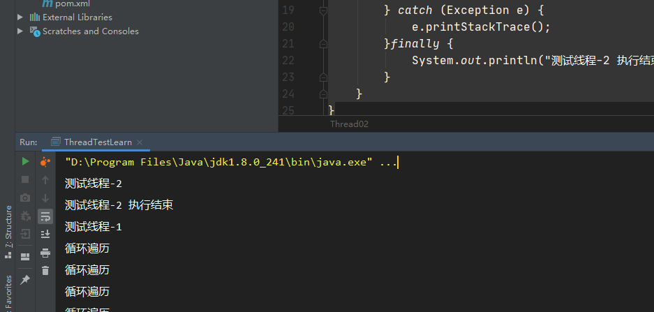
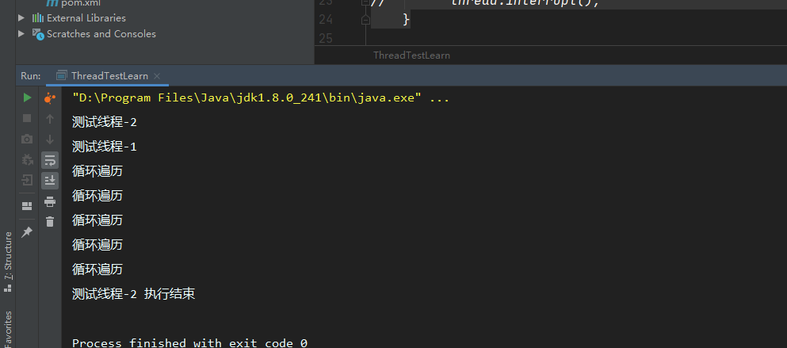
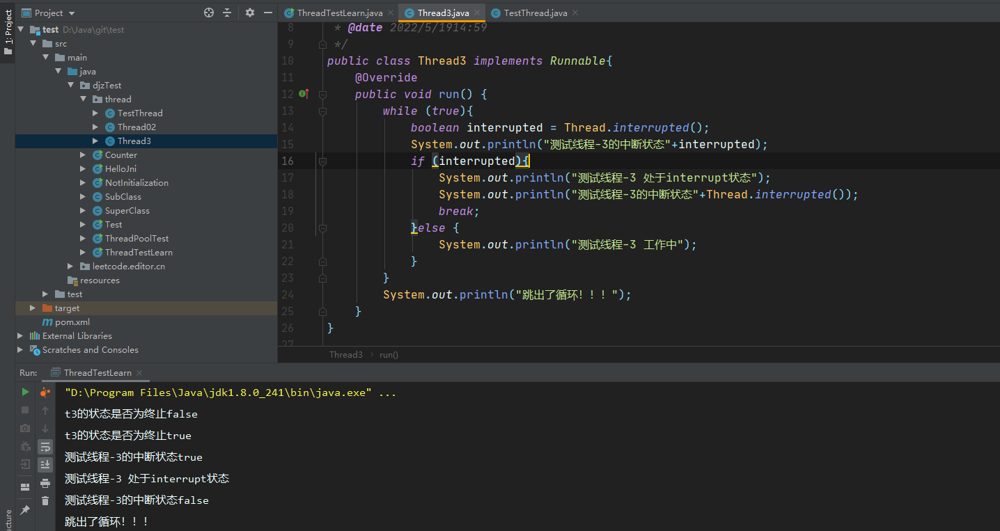
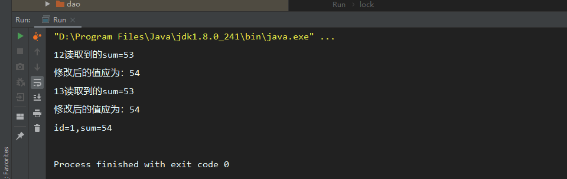

## JVM

### JVM和JDK和JRE的区别

JDK（Java development kit）Java开发环境。包含JRE

JRE（Java running Environment）Java运行环境。类库、类加载器和JVM构成

JVM（Java Virtual Machine） JVM就是一个引擎，提供运行时环境驱动Java代码或程序应用程序。JRE的一部分。

### JVM内存区域划分

由堆、栈、方法区、程序计数器组成。

| 堆 （运行时常量池）     | new的对象实例   数组                 |
| -------------- | ----------------------------- |
| 栈 （JVM栈和本地方法栈) | 局部变量(基本数据类型)和对象引用类型           |
| 方法区            | 加载好的类放在方法区，常量、静态变量            |
| 程序计数器          | 存储的是地址描述的是当前线程接下来 要执行的指令在什么地方 |

JVM栈与本地方法栈（Native Method Stack）的主要区别在于 本地方法栈执行native方法(非Java语言实现的接口)

程序计数器、栈都是线程独有的，所以线程安全

堆和方法区是共享的。所以线程不安全

### 堆的分类

##### 新生代

所有new的对象都在堆里面。对象优先分配到Eden区.当GC 年龄大于15（默认）会转存老年代。如果年龄n以下的对象内存超过新生代的一半，超过n的会转存老年代。

新生代会按照8:1:1的比例划分：

- Eden区                   
- From  survivor
- To   survivor

GC时，Eden区中存活的对象会移动到To   survivor 。然后清空Eden区。From survivor 中达到GC年龄上限的会移动到老年代。未达到的会移动到To survivor中，之后To servivor和From servivor交换角色。

##### 老年代

大对象（-XX:PretenureSizeThreadshold=1024）直接进入老年代，在新生代里面长期存活的对象进入老年代。

### native方法的引用

Unsafe.class下存在native方法引用。

native 关键字修饰接口，说明该接口在外部定义。使用非Java语言实现。

```java
//native 的使用 cd 到target/class下 需要使用 javah  包名+类名 命令 生成 C的头文件。在里面实现C的代码.编译完成的C文件需要放入windows的C类库下面
public class HelloJni {
    static {
        System.loadLibrary("hello");
    }

     private  native void sayHello();

    public static void main(String[] args) {
            new HelloJni().sayHello();
    }
}


```

### GC垃圾回收机制

##### 引用计数法

​      通俗的来说就是每一个程序有一个计数器，当程序被引用的时候计数器加1，引用失效计数器减1。计数器为0的对象表示不可用。

​       缺点：两个对象互相引用的时候，计数器都不为0.无法被回收。

JVM虚拟机没有使用这种方法。

##### 可达性分析算法

​      以 GC Roots 为根，向下搜索。搜索走过的路径称为引用链，如果一个对象与GC Roots 之间不存在联通的引用链。即不可达。认为该对象可回收。

##### 标记-清除算法

分为标记和清理两个阶段。标记阶段标记所有要回收的对象。清理阶段清理这些对象

缺点是：效率不高，清理后会产生大量内存不连续的碎片。导致分配给大对象时内存不足需要提前触发回收。

###### 复制算法（新生代回收算法）

将内存划分为大小相等的块，当一块内存使用结束的时候，将该区域存活的对象复制到另一块内存区域。然后回收当前内存区域。

缺点：内存缩小为原来的一半。

##### 标记-整理算法

在标记-清理的基础上，增加一步整理的功能。在清楚前，将有存活对象的内存区域向一端移动，然后清理边界之外的内存区域。

##### 分代收集算法

将内存分为新生代和老年代。新生代是生命周期短。新生代的对象因为生命周期短，所以使用复制算法进行回收。老年代的生命周期长，使用标记-整理或者标记-清除算法。

### JVM调优常用参数

- -Xmx1024m：最大堆内存，当物理内存不超过192m时最大堆内存为物理内存的一半，否则为物理内存的四分之一
- -Xms1024m：最小堆内存，一般设置为与-Xmx同等值
- -XX:+PrintGCDetails：输出gc详细日志
- -XX:+PrintGCTimeStamps或-XX:+PrintGCDateStamps：输出gc信息时带上时间戳


- jcmd：专用于查看JVM状态，可以查看正在运行的进程，会显示出进程号

### JVM分析堆内存溢出步骤

1.查看日志，看日志能不能定位内存溢出的原因

2.top 后 shift+M 按内存占用大到小排序，RES 是此进程实际占用内存，%MEM是占服务器总内存的49.8%

3.使用ps -aux|grep java 查看pid

4.利用 jstat 查看虚拟机 gc 情况

5.利用 jmap 直接生成 dump 文件

6.分析dump 文件 （MAT 或者 jvisualvm）

### class在JVM中的加载过程

##### 类加载的生命周期

- **加载**

​        1.通过一个类的全限定名来获取定义此类的二进制字节流

​        2.将这个字节流所代表的静态存储结构转化为方法区的运行时数据结构

​        3.在内存中生成一个代表这个类的class对象。作为方法区这个类的各种数据的访问入口。

- **验证**

​        1.文件格式验证   （是否以魔数开头、主次版本号是否在当前虚拟机处理范围）

​        2.元数据验证    对字节码描述的信息进行语义分析。类之间的相关关系及操作是否符合Java语法规范

​        3.字节码验证     对类的方法体进行校验。校验方法体中的操作是否符合语法规范

​        4.符号引用验证  对类自身以外的信息进行匹配验证。例如A类引用B类的数据。是否能正确获取。

- **准备**

​       为类变量分配内存并设置类变量初始值的阶段

- **解析**

​       将类中的常量池内的符号引用替换成直接引用的过程

​       符号引用：一组符号，与虚拟机内存无关。

​       直接引用：指向地址的指针、相对偏移量或者间接定位的句柄。与虚拟机的内存分布相关

- **初始化**  

  根据程序员指定的主观计划，进行类变量和资源的初始化。类构造器方法<clinit>() 的执行过程

  **JVM规范规定了五种情况**

​        1.遇到 new 、getstatic、putstatic、invokestatic 字节码指令的时候。尚未初始化，则必须先进行初始化操作。对应的Java代码场景：new关键字实例化对象、读取、设置一个类的静态字段、调用一个静态方法。

​        2.使用java.lang.reflect包的方法对类做反射调用的时候

​        3.初始化子类时，先初始化父类。

​        4.虚拟机启动时，用户指定了要执行的主类  main方法的类

​        5.JDK1.7 动态语音支持时，java.lang.invoke.MethodHandle示例后的解析结果的方法句柄对应的类未初始时。

```java
//静态代码块只能访问定义在代码块之前的静态变量。定义在之后的变量可以赋值不可以访问。
//父类会在子类之前初始化
//父类的初始化方法先执行所以父类的静态语句先于子类执行
public class Test{
  static{
    i=0;   // 可以赋值
    System.out.println(i);  //会报非法向前引用
  }
  static int i=1;
}
```

- **使用**
- **卸载**

##### 类加载器

###### **定义**

生成描述类的二进制字节流的过程 实现这一操作的模块 成为类加载器

###### **双亲委派模型**

不同类加载器通过组合工作。除了顶层的启动类加载器外，其他类加载器都有他的父加载器。在加载器处理加载任务时，会优先让父加载器处理直到传递至最顶层BootstrapClass Loader。父加载器无法处理，自己再尝试处理。

###### 双亲委派模式缺点

子类加载器可以使用父类加载的类。父类不能使用子类加载的类。例如SPI 实现的Java类一般是由AppClassLoader来加载的，BootstrapClass Loader无法找到SPI的实现类，无法代理AppClassLoader。

## Java基础

### JDK1.8的新特性

##### Lambda表达式

###### 是什么？

Lambda 表达式，也可称为闭包，它是推动 Java 8 发布的最重要新特性。

Lambda 允许把函数作为一个方法的参数（函数作为参数传递进方法中）。

使用 Lambda 表达式可以使代码变的更加简洁紧凑。

###### 语法

```txt
(parameters) -> expression
或
(parameters) ->{ statements; }
```

###### IDEA快捷键

alt+enter 可以将匿名内部类转换成Lambda表达式

###### 简单示例

```java
Collections.sort(userList, (a1, b1) -> b1.getAge()- a1.getAge());
Collections.sort(userList, new Comparator<User>() {
          @Override
          public int compare(User a, User b) {
              return b.getAge()-a.getAge();
          }
      });
```

##### 函数式接口

###### 是什么？

只包含一个抽象方法的接口，成为函数式接口。并且可以使用lambda表达式来创建该接口的对象，可以在任意函数式接口上使用@FunctionalInterface注解，来检测它是否是符合函数式接口。同时javac也会包含一条声明，说明这个接口是否符合函数式接口。

###### 自定义函数式接口

```
@FunctionalInterface
public interface fucInterface {
    
    public  void  test();
}

```

###### 优点

- 方便函数式编程
- 代码简洁
- 容易进行并行计算

###### 缺点

- 不容易调试
- 可读性查

##### 方法引用和构造器引用

###### 方法引用

使用::来将方法名和对象隔开。属于是lambda的语法糖

```java
 FunctionGeneric<String> strName = s -> System.out.println(s);
 strName.fun("Lambda表达式没有使用方法引用");
        
        //方法引用
        FunctionGeneric<String> strName2 = System.out::println;
        strName2.fun("使用方法引用");

```

###### 构造器引用

使用说明：函数式接口参数列表和构造器参数列表要一致，该接口返回值类型也是构造器返回值类型

格式：ClassName :: new

```java
//构造器引用
        Function<String, Integer> fun1 = (num) -> new Integer(num);
        Function<String, Integer> fun2 = Integer::new;

        //数组引用
        Function<Integer,Integer[]> fun3 = (num) ->new Integer[num];
        Function<Integer,Integer[]> fun4 = Integer[]::new;
```

##### StreamAPI

###### 是什么？

位于java.util.stream包下。StreamAPI主要帮助我们更好的进行集合操作。对集合的操作进行流水线式的处理。可以理解为更加高级的迭代器。

###### 特点

- 不存储对象
- 不改变源对象
- 操作具有延迟性。

###### 创建一个Stream

```java
//通过集合创建流
List<Integer> list =new ArrayList<>();
Stream<Integer> stream1 = list.stream();
//通过数组创建流
String[] strs= new String[10];
Stream<String> stream = Arrays.stream(strs);
//Stream.of 创建流
 Stream<String> a = Stream.of("a", "b");
//创建无限制流
 Stream.generate(Math::random);
        Stream<Integer> iterate = Stream.iterate(1, t -> t + 2);
```

###### 流的中间操作

| 方法                              | 说明                                   |
| ------------------------------- | ------------------------------------ |
| filter(Predicate p)             | 过滤器，接收断言，根据断言进行过滤处理                  |
| distinct()                      | 筛选,通过流生成元素的hashCode和equals方法取出相同元素   |
| limit(long maxSize)             | 截断流，使其长度不超过上限                        |
| skip(long n)                    | 跳过元素，返回丢弃前n个元素的流。若流中元素不足n个。返回空流。     |
| map（Function f）                 | 接收一个函数，会被应用到每一个元素上，生成新的stream        |
| mapToDouble(toDoubleFunction f) | 接收一个函数，会被应用到每一个元素上，生成新的DoubleStream  |
| mapToInt(toIntFunction  f)      | 接收一个函数，会被应用到每一个元素上，生成新的IntStream     |
| mapToLong(toLongFunction f)     | 接收一个函数，会被应用到每一个元素上，生成新的LongStream    |
| flatMap(Function f)             | 接收一个函数，将流中的所有元素转换成另一个元素，然后将所有的流连城一个流 |
| sorted()                        | 排序                                   |
| sorted(Comparator comp)         | 比较器排序                                |

###### 流的终止操作

| 方法                                | 说明                                       |
| --------------------------------- | ---------------------------------------- |
| allMatch(Predicate p)             | 检测元素是否全部匹配                               |
| anyMatch(Predicate p)             | 检测是否至少有一个元素匹配                            |
| noneMatch(Predicate p)            | 检测是否不包含匹配元素                              |
| findFirst()                       | 返回第一个元素                                  |
| findAny()                         | 返回当前流中的任意一个元素                            |
| count（）                           | 返回流中元素总数                                 |
| Max(Comparator comp）              | 返回最大值                                    |
| Min(Comparator comp)              | 返回最小值                                    |
| forEach(Consumer c)               | 内部迭代                                     |
| reduce(T iden, BinaryOperation b) | 提供一个跟Stream中数据同类型的初始值identity，通过累加器accumulator迭代计算Stream中的数据，得到一个跟Stream中数据相同类型的最终结果 |
| reduce(BinaryOperation b)         | 对Stream中的数据通过累加器accumulator迭代计算，最终得到一个Optional对象 |

###### 简单使用

```java
//使用流创建三个对象
User a = new User("a",10);
User b = new User("c",10);
User c = new User("c",10);
Stream<User> userStream = Stream.of(a, b, c);
List<User> collect = userStream.collect(Collectors.toList());
System.out.println(collect.size());
        //创建流
        User a = new User("a",10,"man");
        User b = new User("b",18,"man");
        User c = new User("c",20,"man");
        Stream<User> userStream = Stream.of(a, b, c);
       //通过流进行排序
        userStream.sorted().forEach(System.out::println);
```

##### DateAPI


### 反射

#### 介绍

反射是Java的一种语言特性。它允许Java程序在运行期间对自身进行检查。被private封装的资源只能类内部访问，外部无法访问。但是通过使用反射，可以直接操作类私有属性。反射可以在类运行的时候获取一个类的所有信息，并且操作类的字段、方法、构造器等部分。

#### 常用API

##### 获取class的方法

1.调用某个类的对象的getClass()方法，即：对象.getClass()；

```java
Student st =new Student();
Class<? extends Student> stClass = st.getClass();
```

2.调用类的class属性类获取该类对应的Class对象，即：类名.class

```java
Class<Student> studentClass = Student.class;
```

3.使用Class类中的forName()静态方法（最安全，性能最好）即：Class.forName(“类的全路径”)

```java
Class<?> aClass = Class.forName("reflect.Student");
```

4.通过类构造器获取

```java
Class clazz = ClassLoader.loadClass("cn.javaguide.TargetObject");
```

##### 常用方法

```java
//获取包名、类名  以reflect.Student对象为例
clazz.getPackage().getName()//包名   reflect
clazz.getSimpleName()//类名  Student
clazz.getName()//完整类名  reflect.Student
clazz.getClassLoader()//获取类加载器
//获取成员变量定义信息
getFields()//获取所有公开的成员变量,包括继承变量   public java.lang.String reflect.Student.sex
getDeclaredFields()//获取本类定义的成员变量,包括私有,但不包括继承的变量
getField(变量名)//获取公开成员
getDeclaredField(变量名)//获取成员变量。包括private修饰的对象
 
//获取构造方法定义信息
getConstructor(参数类型列表)//获取公开的构造方法
getConstructors()//获取所有的公开的构造方法
getDeclaredConstructors()//获取所有的构造方法,包括私有
getDeclaredConstructor(int.class,String.class)
 
//获取方法定义信息
getMethods()//获取所有可见的方法,包括继承的方法
getMethod(方法名,参数类型列表)
getDeclaredMethods()//获取本类定义的的方法,包括私有,不包括继承的方法
getDeclaredMethod(方法名,int.class,String.class)
 
//反射新建实例
clazz.newInstance();//执行无参构造创建对象
clazz.newInstance(222,"韦小宝");//执行有参构造创建对象
clazz.getConstructor(int.class,String.class)//获取构造方法
 
//反射调用成员变量
clazz.getDeclaredField(变量名);//获取变量
clazz.setAccessible(true);//使私有成员允许访问
f.set(实例,值);//为指定实例的变量赋值,静态变量,第一参数给null
f.get(实例);//访问指定实例变量的值,静态变量,第一参数给null
 
//反射调用成员方法
Method m = Clazz.getDeclaredMethod(方法名,参数类型列表);
m.setAccessible(true);//使私有方法允许被调用
m.invoke(实例,参数数据);//让指定实例来执行该方法
```

##### 简单使用示例

###### 使用反射创建一个对象

```java
Class<?> clazz = Class.forName("reflect.Student");
Constructor<?> c = clazz.getConstructor();
Student xiaohong = (Student)c.newInstance();
xiaohong.setName("小红");
```

###### 使用反射对象修改私有属性。

```java
//创建一个小红的学生
Class<?> clazz = Class.forName("reflect.Student");
Constructor<?> c = clazz.getConstructor();
Student xiaohong = (Student)c.newInstance();
xiaohong.setName("小红");
xiaohong.setSex("男");
//使用反射修改性别为女
Field sex = clazz.getDeclaredField("sex");
sex.set(xiaohong,"女");
System.out.println(xiaohong.getSex());
```

#### 常见面试问题

##### 什么是反射？

反射是Java的一种语法特性，这种特性允许Java在程序运行期间，对类进行自我检测。可以获取到类的所有信息。包括所有属性、变量、构造器。同时允许对这些信息进行操作。

##### 什么是Java序列化？

将Java程序以一串字符的形式保存到磁盘上。称为Java序列化。

##### 什么是反序列化？

将保存在磁盘文件中的java字节码重新转换成java对象称为反序列化。

### 老生常谈的面向对象

##### 是什么？

面向对象是一种思想，相对于面向过程而言。将某一类具有相同行为与属性的事物看做同一种对象。

##### 为什么？(面向对象的好处)

面向对象的思想更符合我们日常的行为习惯，开发效率也会更高。可以提高系统的可维护性、可扩展性、可重用性。

**可维护性 **：面向对象的思想开发会将程序分隔成不同的对象。每个对象具有不同的功能。当某一功能需要修改时，我们仅仅需要对该对象下的某个方法做变更即可。降低了维护成本。

**可扩展性** ：主要体现的Java面向对象的三大特征上：封装、继承、多态。将程序封装成对象。对象之间可以继承。在原有的类基础上，子类继承了父类的方法。同时可以在子类上进行更多的功能开发。

**多态 **是建立在继承的基础上的。要满足三个条件：

- 继承，必须有子类继承父类
- 重写，子类重写父类方法
- 向上转型，子类的引用赋值给父类对象。

**可重用性** :  常说的复用，因为代码被封装成了不同的对象。在需要执行某一操作时，仅仅需要调用该操作下对应方法即可。

##### 怎么做？(对象的实现过程)

Java中使用new关键字来创建对象。

### 基本数据类型及运算符

##### 基本类型

| 基本类型    | 大小     | 包装类型    |
| ------- | ------ | ------- |
| boolean |        | Boolean |
| char    | 16bit  | Char    |
| byte    | 8bits  | Byte    |
| short   | 16bits | Short   |
| int     | 32bits | Integer |
| long    | 64bits | Long    |
| float   | 32bits | Float   |
| double  | 64bits | Double  |
| void    |        | Void    |

##### 按位运算符

```java
&  与操作
|  或操作
^  异或操作
&=
|=
```

##### 移位操作符

进行二进制的位移操作。

```java
>> 有符号右移
<< 有符号左移
>>> 无符号右移
<<< 有符号左移
```

#### 对象引用类型

##### 强引用

强引用不会被GC回收，并且在java.lang.ref里也没有实际的对应类型 如：Object obj = new Object();

##### 软引用

被软引用的对象，如果内存空间足够，垃圾回收器不会回收，如果内存空间不足， 垃圾回收器将回收这些对象占用的内存空间，软件引用对应着java.lang.ref.SoftReference 类，一个对象如果要被软引用 只需将其作为参数传入

```java
SoftReference<Object> softRef =new SoftReference(obj);
```

##### 弱引用

与前面的软引用相比，被弱引用了的对象拥有更短的内存时间(生命周期)。垃圾回收器一旦发现了被弱引用 的对象，不管当前内存空间是不是足够，都会回收他的内存，弱引用使用方法与软引用类似，但回收策略不同。

##### 虚引用

虚引用不是一种真实可用的引用类型，完全可以视为一种“形同虚设”的引用类型。 设计虚拟引用的目的在于结合引用关联队列，实现对对象引用关系的跟踪。虚引用对应着 java.lang.ref.PhantomReference 类 一个对象如果要被虚引用，只要将其作为参数传入PhantomReference 类的构造方法中就行了，同时作为参数传入的还有引用关联队列 java.lang.ref.ReferenceQueue 的对象实例。虚引用的用法： SoftReference,WeakReference,PhantomReference 类都继承自 java.lang.ref.Reference 抽象类。

### 值传递和对象引用传递

##### 区别

基本数据类型在声明变量时就已经赋值。

对象引用类型在声明时只引用了空间。不分配数据空间

##### 值传递

方法调用的时候，实际参数将数值传递给形参，形参获得的是数据副本。形参数据更改不会影响实际参数的值。

###### 引用传递

方法调用时，实际参数的引用（是指地址，而不是参数的值）被传递给方法中相应的形式参数，函数接收到的是原始值的内存地址，在方法中，形参与实参的内容相同，方法中对形参的处理会影响实参的值。


### 重载和重写

##### 重载

方法名称相同，参数不同的处理叫做重载。重载的方法在同一个类中。

##### 重写 

方法名称参数相同，重写了方法体中的实现叫做重写。重写发生在继承的父子直接。或者接口实现

### 初始化顺序

遵循先父后子，变量优于块，静态优于非静态

- 父类静态变量
- 父类静态代码块
- 子类静态变量
- 子类静态代码块
- 父类非静态变量
- 父类非静态代码块
- 父类构造函数
- 子类非静态变量
- 子类非静态代码块
- 子类构造函数

### 权限控制

**public**  任何人都可以访问

**protected** 

-   基类（父类）的protected成员（包括成员变量个成员方法）对本包内可见，并且对子类可见；
-   若子类与基类（父类）不在同一包中，那么在子类中，只有子类实例可以访问其从基类继承而来的protected方法，而在子类中不能访问基类实例（对象）（所调用）的protected方法。
-   不论是否在一个包内，父类中可以访问子类实例（对象）继承的父类protected修饰的方法。（子父类访问权限特点：父类访问域大于子类）
-   若子类与基类（父类）不在同一包中,子类只能在自己的类（域）中访问父类继承而来的protected成员，无法访问别的子类实例（即便同父类的亲兄弟）所继承的protected修饰的方法。
-   若子类与基类（父类）不在同一包中，父类中不可以使用子类实例调用（父类中没有）子类中特有的（自己的）protected修饰的成员。（毕竟没有满足同一包内和继承获得protected成员的关系）

**private**  除了当前类，其他人均不可访问

### String和StringBuilder和StringBuffer的区别

StringBuffer 是线程安全的。底层使用了synchronized关键字

StringBuilder 不是线程安全的。

String创建之后不会更改，我们常做的+=操作底层实现是new StringBuilder 来完成的。

### throw和throws的区别

throw在方法中表示抛出异常。

throws 修饰函数名，表示该方法可能抛出异常。

```java
    public static void main(String[] args) throws Exception{
        System.out.println(test());
       try {
           
       }catch (Exception e){
           throw e;
       }
    }

```

### Java中的异常

分为Error和Exception

Error：编译时异常及系统错误

Exception：可以抛出异常的基本类型

### String能否被继承

不能被继承，因为final修饰了类

### Integer == int  结果

结果为false  

- 比较对象为基本数据类型，则比较的是存储的值
- 如果是引用类型，则比较所指向的对象的地址值是否相等。（引用类型本事是指向一个地址值）

equals()

不能比较基本数据类型。比较的是引用类型的变量所指向的对象的地址值

### 集合相关问题

#### ArrayList 、Vector、 LinkedList的区别

ArrayList、Vector的底层实现是数组。LinkedList的底层实现是链表。

两者在查询方面的区别：ArrayList更适合查询。但是如果只是获取首个元素或者尾部元素。查询效率是一致的。

##### 需要扩容的情况

ArrayList 插入指定位置或者末尾位置很快。但是数量大的时候需要扩容。LinkedList不存在扩容问题。但是向指定位置插入因为要遍历链表会降低效率。

##### 不需要扩容的情况

ArrayList指定位置插入数据。需要将后续数据移动。效率相对较慢。LinkedList不需要移动。

综上：如果需要频繁在中间位置插入数据。使用LinkedList会好一些。如果插入场景少，经常查询通常使用ArrayList。

Vector的方法大多都使用了synchronized 关键字。所以是线程安全的。它扩容会扩容两倍。ArrayList会扩容1.5呗。

#### HashMap

##### 关键参数

| initialCapacity | 负载因子  默认为0.75 |
| --------------- | ------------- |
| initialCapacity | 初始容量  默认是16   |
| threshold       | 临界值，大于该参数需要扩容 |

threshold =initialCapacity * initialCapacity

##### HashMap实现 JDK1.7

底层实现是数组+链表的方式实现的

##### HashMap实现JDK1.8

数组+链表+红黑树实现的

###### put方法的实现

1.调用hash()方法，在hash()中，通过hashCode()计算出key的一个hash值，与hash值右移16位结果做异或运算。（`hash^(hash>>>16)`）得到一个hash值。

```markdown
**这里为什么要做异或运算?**
异或运算能更好的保留各部分的特征，如果采用&运算计算出来的值会向0靠拢，采用|运算计算出来的值会向1靠拢
**为什么要右移16位呢?**
int 类型是4字节 32比特。底层二进制是32位的二进制串，当nodeTable长度过小时，做异或运算。高位就全部为0.导致高位的字节无法参与到后续的运算中。容易发生hash碰撞。
```

2.nodeTable长度为0或者数组为null，就调用resize()重新分配大小。

3.通过hash与nodeTable.length-1做与运算求得数组下标。当前nodeTable[index]为null 就将new一个节点插入到该位置。

4.nodeTable[index]不为空，比较两个节点的hash值。hash值一致，比较key值。如果还一致，将该节点的value替换成输入值。key值不一致时，判断headNode是否是TreeNode类型。

5.是TreeNode类型，就调用TreeNode的put添加节点方法

```markdown

```

6.不是TreeNode,遍历链表，判断hash值，hash值一致就继续判断key。key一致就替换value。遍历到尾部，就添加这个节点到尾部。链表长度超过8个节点，就调用treeifyBin()转换成红黑树结构。转红黑树前会判断数组长度是否大于64.小于就resize  大于才转换

```markdown  
**为什么转换阈值设置为8**
链表的查询时间复杂度为O(n) 红黑树为O(log(n)) 如果 hashCode 分布良好，也就是 hash 计算的结果离散好的话，那么红黑树这种形式是很少会被用到的，因为各个值都均匀分布，很少出现链表很长的情况。在理想情况下，链表长度符合泊松分布，各个长度的命中概率依次递减，当长度为 8 的时候，概率仅为 0.00000006。

treeifyBin()的逻辑
  1.nodeTable的长度小于64 或者为null  调用resize()
  2.headnode不为空  遍历替换成TreeNode
  3.treeify（）
 
```

7.判断map的size大小是否超过threshold扩容大小。超过的话调用resize方法扩容

###### HashMap get方法的实现

1.通过key的hashCode计算hash值。与右移16位的结果做异或运算。得到数组下标。

2.获取数组下标处的元素。不存在返回null，存在节点就比较hash和key值，一致就返回value。

3.key不同的情况下，判断是否节点是TreeNode类型是调用getTreeNode()方法

4.不是TreeNode类型，遍历链表获取value。没有匹配返回null

###### HashMap扩容  resize

1.判断旧的一个节点数组大小是否大于0.

2.大于0就判断是否大于理论最大值。大于就将数组长度设置为Integer.Max。小于最大值且旧的数组长度大于16就将扩容大小设置为旧的 threshold大小左移1位的值。

3.遍历计算新的下标位置。同时判断节点是否为TreeNode节点。 是TreeNode走splite

4.不是TreeNode类型。与旧数组大小-1做与运算 结果为0的放在index不变。不为0的放在旧坐标+旧数组长度的坐标下。

```java
//   |= 位运算      
static final int tableSizeFor(int cap) {
        int n = cap - 1;
        n |= n >>> 1;
        n |= n >>> 2;
        n |= n >>> 4;
        n |= n >>> 8;
        n |= n >>> 16;
        return (n < 0) ? 1 : (n >= MAXIMUM_CAPACITY) ? MAXIMUM_CAPACITY : n + 1;
    }
```

##### 与hashTable的区别

###### 相同点

都实现了Map、Cloneable、Serializable的接口

###### 不同点

- hashtable 的key或value不允许是null，加了非空判断。 HashMap的key或value允许为null。
- 求取hash的算法不同。hashMap是自定义算法，在使用hashCode取到hash值后会与无符号右移16位结果做异或运算。hashTable直接使用的hashCode方法获取hash值
- Hashtable 继承的是 Dictionary类，而 HashMap 继承的是 AbstractMap 类
- 初始化容量不同：HashMap 的初始容量为：16，Hashtable 初始容量为：11，两者的负载因子默认都是：0.75。
- 扩容机制不同：当已用容量>总容量 * 负载因子时，HashMap 扩容规则为当前容量翻倍，Hashtable 扩容规则为当前容量翻倍 +1。
- 支持的遍历种类不同：HashMap只支持Iterator遍历,而HashTable支持Iterator和Enumeration两种方式遍历

##### 与HashSet的区别于联系

1. HashSet 的底层实现是HashMap
2. HashSet 实现了Set接口，HashMap实现了Map接口。存储的数据不同，Map存储的键值对。Set存储对象。

##### 重写equals方法的同时为什么要重写hashCode方法

相等的对象，他们的hash值必须相同。如果只重写equals方法。会导致判定一致，两个对象的hash值不一致。或者hash值一致。equals返回false的情况。(object的equals上的注释有规定)

```java
public class student {
    String  id;

    String name;

    @Override
    public int hashCode() {
        return Objects.hash(id, name);
    }

    @Override
    public boolean equals(Object o) {
        if (this == o) {return true;}
        if (o == null || getClass() != o.getClass()) {return false;}
        student student = (student) o;
        return id.equals(student.id) &&
                name.equals(student.name);
    }
}

```

#### ConcurrentHashMap

##### 为什么使用？

- HashMap不是线程安全的。多线程put数据，容易导致Entry形成环形的数据结构。进而出现死循环的现象
- HashTable是线程安全的，但是底层实现是使用的synchronized来实现的。线程竞争激烈的情况下效率低下，
- ConcurrentHashMap本身是分段加锁。因为是分段锁的技术。每段数据会单独存在锁。极大的降低了锁的竞争情况

##### 数据结构

1.8之前ConcurrentHashMap 由segment数组和HashEntry组成。segment是一种可重入锁。一个segment里包含一个HashEntry数组。

1.8优化移除了segment。Synchronized + CAS + Node + Unsafe  通过乐观锁来实现。

##### put

###### JDK1.7

先定位 Segment，再定位桶，put 全程加锁，没有获取锁的线程提前找桶的位置，并最多自旋 64 次获取锁，超过则挂起。

###### JDK1.8

跟hashMap的逻辑一致。先求hash值。通过与数组长度-1做与运算获得数组下标。判断该下标下是否有node。为空通过CAS进行操作。-1扩容。其他情况执行链表插入，插入过程加了synchronize关键字操作。

##### get

value 加了volatile关键字。

### 并发

#### 并发编程的三大要素

- 原子性     一个或多个操作要么全部执行，要么全部不执行
- 有序性    程序按照代码的顺序执行
- 可见性    多线程操作共享变量时，一个线程修改。其他线程要保证能立即看到。

#### Java内存模型

JMM是一个抽象概念。线程本地会有一个私有的本地内存。线程之间的共享变量会存放在主内存中。本地内存存放以读写的共享变量副本。通信过程如下：

- 线程A操作共享变量副本。也就是本地内存中的数据。将数据刷新到主内存
- 线程B去主内存读取A更新的数据。

#### 为什么会出现并发安全问题

多线程操作共享变量。线程A做了修改。修改内容未更新到主内存的过程中。B线程读取了主内存信息。

#### 如何保证线程安全

volatile和synchronized

### 多线程

#### 线程的状态

- NEW      新建，初始状态，在执行start方法之前。
- RUNNABLE   执行start方法，线程进入运行状态
- BLOCKED     阻塞状态，线程阻塞于锁
- WAITING   等待状态，当前线程需要等待其他线程完成一些状态   join
- TIME_WAITING  超时等待状态，达到指定时间继续向后执行
- TERMINATED   终止状态，线程执行完毕


#### 线程的常用方法说明

##### ThreadLocal

线程变量，以threadLocal为key绑定一个值到线程上。

```java
public class demo {
    private static final ThreadLocal<Long> TIME_THREADLOACL=new ThreadLocal(){
        @Override
        protected Object initialValue() {
            return System.currentTimeMillis();
        }
    };
    public static void main(String[] args) {
        Long aLong = demo.TIME_THREADLOACL.get();
        System.out.println(aLong);
    }
}
```

##### join

A线程调用B线程，B线程执行join方法，则A线程被挂起直到B线程执行结束。示例如下

```java
//线程2启动中调用了线程1，线程1调用了join()方法。线程2被挂起
//线程1
public class TestThread implements Runnable {
    @Override
    public void run() {
        System.out.println("测试线程-1");
        for (int i = 0; i < 5; i++) {
            System.out.println("循环遍历");
        }
    }

    public TestThread() {
    }

}
//线程2
public class Thread02 implements Runnable{
    @Override
    public void run() {
        System.out.println("测试线程-2");
        TestThread testThread = new TestThread();
        Thread thread =new Thread(testThread);
        thread.start();
        try {
            thread.join();
        } catch (Exception e) {
            e.printStackTrace();
        }finally {
            System.out.println("测试线程-2 执行结束");
        }
    }
}

    public static void main(String[] args) throws Exception {

        Thread02 thread02=new Thread02();
        Thread t2 = new Thread(thread02);
        //开始方法
        t2.start();
        //

        //线程终止
//        thread.interrupt();
    }
```

将join的调用注释掉，结果如下



调用join方法后输出结果



##### start

线程的启动方法

##### interrupt

将线程设置为中断状态。如果线程处于阻塞状态（wait、sleep、join）会中断阻塞并抛出异常。如果非阻塞状态，会执行run结束然后终止。


##### isInterrupted

判断线程是否处于中断状态,当线程处于等待状态时，会抛出中断异常。

```java
//t3线程启动，如果不调用interrupt()方法，会一直循环下去，调用了interrupt（）方法。线程被设置为中断状态。在循环中使用Thread.interrupted()来获取当前线程的状态是否为中断，中断则执行break。结果打印出了 跳出循环的提示，说明interrupt只是设置状态。
public class Thread3 implements Runnable{
    @Override
    public void run() {
        while (true){
            if (Thread.interrupted()){
                System.out.println("测试线程-3 处于interrupt状态");
                break;
            }else {
                System.out.println("测试线程-3 工作中");
            }
        }
        System.out.println("跳出了循环！！！");
    }
}

    public static void main(String[] args) {
        Thread3 thread3=  new Thread3();
        Thread t3 = new Thread(thread3);
        t3.start();
        boolean interrupted = t3.isInterrupted();
        System.out.println("t3的状态是否为终止"+interrupted);
        t3.interrupt();
         interrupted = t3.isInterrupted();
        System.out.println("t3的状态是否为终止"+interrupted);
    }
```


##### stop

强制中断线程。会有线程安全问题。不建议使用

#### Thread类方法说明

##### Thread.Interruputed

获取当前类的是否中断，返回一个boolean 值并清空这个状态。如下图所示，两次调用获取状态不一致。



##### Thread.currentThread

获取当前线程

##### Thread.yield

让线程处于就绪状态。获取到资源后继续执行。不会重新开始执行run方法。

##### Thread.sleep

让线程进入睡眠状态。可以通过使用interrupt方法来唤醒\

```java
package djzTest.thread;

/**
 * @author djz
 * @Title: waitThread
 * @ProjectName djz-nacos
 * @Description: TODO
 * @date 2022/7/2511:52
 */
public class waitThread implements Runnable{
    @Override
    public void run() {
        try {
            Thread.sleep(10000);
        } catch (InterruptedException e) {
            e.printStackTrace();
        }
        while (true){

            System.out.println("============线程执行中==============");

        }

    }
}

```

```java
public class main {

    public static void main(String[] args) throws InterruptedException {
        waitThread w =new waitThread();
        Thread t =new Thread(w);
        t.start();
        t.interrupt();
//        t.wait();
    }
}
```

#### 线程的等待问题

##### 使用wait方法。

1. wait方法需要获取到锁。所以必须有同步代码块。必须配合synchronized关键字
2. wait会释放锁。notify不会。notify和wait的调用对象要一致。都是锁对象

```java
import java.util.ArrayList;
import java.util.List;

/**
 * @author djz
 * @Title: main
 * @ProjectName djz-nacos
 * @Description: TODO
 * @date 2022/7/2511:53
 */
public class main {

    private static Object obj =new Object();


    private volatile static List list =new ArrayList();

    public static void main(String[] args)  {

        Thread t1 = new Thread(new Runnable() {
            @Override
            public void run() {
                System.out.println("t1启动");
                synchronized (obj) {
                    System.out.println("t1获取到锁");
                    try {
                        if (list.size()<10){
                            System.out.println("t1进入等待状态");
                            obj.wait(10000);
                            System.out.println("t1解除等待状态");
                        }
                    } catch (InterruptedException e) {
                        e.printStackTrace();
                    }
                    System.out.println("t1收到通知");
                    System.out.println("t1运行中");
                }

            }
        });

        Thread t2 = new Thread(new Runnable() {
            @Override
            public void run() {
                System.out.println("t2启动");
                synchronized (obj) {
                    System.out.println("t2获取到锁");
                    for (int i = 0; i < 100; i++) {
                        list.add(i);
                    }
                    System.out.println("t2运行中");
                    if (list.size()>0){
                        try {
                            obj.notify();
                        } catch (Exception e) {
                            e.printStackTrace();
                        }
                        System.out.println("发送通知唤醒t1");
                    }
                    System.out.println("t2运行结束");
                }
            }
        });

        t1.start();
        t2.start();
    }

```

- sleep 方法睡眠。interrupt 方法 需要捕获异常

```java
ppublic class main {

    public static void main(String[] args) throws InterruptedException {
        int i = 10;
        Thread t1 = new Thread(new Runnable() {
            @Override
            public void run() {

                synchronized (main.class) {
                    try {
                        Thread.sleep(10000);
                    } catch (InterruptedException e) {
                        e.printStackTrace();
                    }
                    System.out.println("t1运行中");
                }

            }
        });

        Thread t2 = new Thread(new Runnable() {
            @Override
            public void run() {
                synchronized (main.class) {

                    System.out.println("t2运行中");
                }
            }
        });

        t1.start();
        t2.start();
        t1.interrupt();
//        t1.wait(10000);

    }
}

```

#### 线程中断问题

- 使用stop 强制中断线程。
- 使用interruput 设置中断状态。并在程序中捕获中断异常来完成中断操作
- 人为的设置中断标识，可以使用volatile关键字定义静态变量来实现。


```java
public class Shutdown {

    public static void main(String[] args) throws InterruptedException {
        Runner one = new Runner();
        Thread countThread =new Thread(one,"CountThread");
        countThread.start();
        TimeUnit.SECONDS.sleep(1);
        countThread.interrupt();
        Runner two=new Runner();
        countThread = new Thread(two,"CountThread");
        countThread.start();
        TimeUnit.SECONDS.sleep(1);
        two.cancel();
    }
    private static  class Runner implements Runnable{
        private long i;
        private volatile  boolean on =true;

        @Override
        public void run() {
            while (on &&!Thread.currentThread().isInterrupted()){
                i++;
            }
            System.out.println("Count i= "+i);
        }
        public void  cancel(){
            on =false;
        }
    }
}
```


#### volatile

##### 定义

Java编程语言允许线程访问共享变量，为了确保共享变量能够被准确和一致地更新，线程应该确保通过排他锁单独获取这个变量。

Java字段被该变量声明，则所有线程看到这个变量的值是一致的。

##### 实现原理

被volatile修饰的的变量，在转换为汇编语言的时候，会多出Lock前缀的指令。处理器在处理Lock前缀指令的时候会做两件事情：

- 将当前处理器的缓存行的数据写回到系统内存中。
- 写回内存的操作会因为缓存一致性协议导致其他CPU里缓存的内存地址无效。

##### volatile优化

JDK7中新增了LinkedTransferQueue。使用了追加字节的方式来进行了出队和入队的性能优化。

#### synchronized

- 修饰同步方法，锁对象是当前示例对象。
- 修饰静态同步方法，锁对象是当前类的class对象。
- 修饰同步方法块，锁对线是Synchronized括号里配置的对象。

##### 实现原理

JVM基于进入和退出monitor对象来实现同步。也就是monitorenter和monitorexit指令。任何一个对象都对应一个monitor。代码块同步在编译完成后，会在开始处插入monitorenter。在结束或者异常处插入monitorexit。当一个monitor被持有后，即为锁定状态。线程执行到monitorenter指令处会尝试获取monitor的所有权，即尝试获取锁对象。

##### 锁升级

Java SE 1.6 之后 引入了偏向锁和轻量级锁的概念。锁的状态分为：无锁状态、偏向锁、轻量级锁状态和重量级锁状态。


###### 偏向锁

- 线程访问同步代码块，会先判断是否加锁。未加锁的情况下，会在对象头和栈帧中存放偏向的线程ID
- 当线程第二次访问的时候，不需要再做CAS操作（比较内存位置V与预期原值是否A一致，一致替换成新值B）。只需要测试一下对象头中记录的线程ID是否指向当前线程即可
- 如果记录与当前访问线程不一致。会尝试撤销偏向锁。

###### 偏向锁的撤销

- 在撤销偏向锁时，会先判断持锁线程是否存活。如果存活，会在线程的安全节点处暂停线程。不存活则使用CAS操作修改线程ID
- 对于存活的持锁线程，检测是否仍在执行同步代码块的代码。如果未执行完毕。认为存在锁的竞争，升级为轻量锁。如果执行结束，则修改偏向锁。
- 唤醒暂停线程

###### 偏向锁的关闭

```shell
-XX:-UseBiasedLocking=false
```

###### 轻量锁

- 升级为轻量锁之后，JVM会在当前线程的帧栈中创建存储锁的记录空间。将对象头中的Markword复制到锁记录中
- 线程通过CAS操作尝试将MarkWord替换为指向锁记录的指针。如果成功，即为获得锁。失败则进入自旋。尝试解锁

###### 轻量锁解锁

- 线程会尝试使用CAS操作将Displaced Mark Word（位移标记） 替换会对象头。如果成功，表示没有发生竞争。如果失败，说明当前锁存在竞争。达到自旋次数上限后，锁会膨胀为重量级锁。

###### 锁标志位

- 00   轻量级锁
- 01   偏向锁
- 11    GC标记
- 10    重量级锁

#### Lock

##### 与synchronized的区别

- lock关键字是显示的获取与释放锁，synchronized是隐式获取
- lock获取锁的可操作性和中断性好
- lock会尝试非阻塞性的获取锁，
- 可以设置超时获取锁

##### API

| 方法名                                      | 描述        |
| ---------------------------------------- | --------- |
| void lock()                              | 获取锁       |
| void lockInterruptibly() throws InterruptedExeption | 可中断地获取锁   |
| boolean tryLock()                        | 尝试非阻塞的获取锁 |
| boolean tryLock(long  time,TimeUnit unit) | 超时获取锁     |
| void unlocked()                          | 解锁        |
| Condition newCondition()                 | 获取等待通知组件。 |

#### 原理（队列同步器）

Lock的实现主要通过队列同步器来实现的。

##### AQS

###### AQS说明

AQS（AbstractQueuedSynchronizer）提供

获取状态`getState()`

设置状态 `setState()` 

CAS `compareAndSetState()` 三个状态相关的方法

基于模板方法的设计模式，使用者需要继承同步器AQS重写指定方法。

###### AQS实现示例

```java
package QueueSynchronied;

import java.util.concurrent.TimeUnit;
import java.util.concurrent.locks.AbstractQueuedSynchronizer;
import java.util.concurrent.locks.Condition;
import java.util.concurrent.locks.Lock;

/**
 * @author djz
 * @Title: Mutex
 * @ProjectName djz-nacos
 * @Description: TODO
 * @date 2022/8/814:26
 */
public class Mutex implements Lock {

   /** 静态内部类，自定义同步器
      使用静态内部类的好处在于：
      1.该类可以直接访问外部类的静态方法
      2.内部类不对外提供服务可以减少引用节省资源消耗
      */
    private static class  Sync extends AbstractQueuedSynchronizer{
        protected Sync() {
            super();
        }

          //独立式获取同步状态，实现该方法需要查询当前状态并判断是否符合预期，然后通过CAS设置同步
        @Override
        protected boolean tryAcquire(int arg) {
            //设置为0时获取锁
            if (compareAndSetState(0,1)){
                setExclusiveOwnerThread(Thread.currentThread());
                return true;
            }
            return false;
        }

        //独立式释放同步状态
        @Override
        protected boolean tryRelease(int arg) {
            if (getState()==0){
                throw  new IllegalMonitorStateException();
            }
            setExclusiveOwnerThread(null);
            setState(0);
            return true;
        }
  
        //共享式获取锁状态，返回值大于0等于0，表示获取成功
        @Override
        protected int tryAcquireShared(int arg) {
            return super.tryAcquireShared(arg);
        }
       //共享式释放锁状态
        @Override
        protected boolean tryReleaseShared(int arg) {
            return super.tryReleaseShared(arg);
        }

       //是否处于占用
        @Override
        protected boolean isHeldExclusively() {
            return super.isHeldExclusively();
        }
        
    }

    private final Sync sync =new Sync();
    
    
    
    @Override
    public void lock() {

    }

    @Override
    public void lockInterruptibly() throws InterruptedException {

    }

    @Override
    public boolean tryLock() {
        return sync.tryAcquire(1);
    }

    @Override
    public boolean tryLock(long time, TimeUnit unit) throws InterruptedException {
        return false;
    }

    @Override
    public void unlock() {
        sync.tryRelease(1);
    }

    @Override
    public Condition newCondition() {
        AbstractQueuedSynchronizer.ConditionObject conditionObject = new AbstractQueuedSynchronizer.ConditionObject();
        return conditionObject;
    }
}

```

###### AQS同步队列

- 依赖内部的同步队列来完成状态同步管理。当前线程获取同步状态失败，同步器会将当前线程及等待状态信息构造一个node节点。并存放到队列中。同时阻塞线程。
- node节点会有前驱和后置两个指针。通过`compareAndSetTail(Node expect,Node update)` 方法将新的node加入尾部。
- 首节的释放同步状态时，会将nextNode设置为新的首节点，同时更改nextNode的状态。并断开与nextNode的连接。

###### AQS独占式同步状态获取

- 线程会先执行自定义的`tryAcquire()`方法,获取同步状态。
- 获取状态失败，会构建一个异步式的节点node（Node.EXCLUSIVE）
- 通过addWaiter(Node node) 方法将节点加入到同步队列的尾部。
- 调用`acquiredQueued(Node node,int arg)` 方法，使节点以死循环的方式获取同步状态。
- 获取不到则阻塞节点中的线程。被阻塞的线程的唤醒依靠前驱节点的出队或中断来实现。

###### AQS独占式同步状态释放

- 线程会调用tryRelease（）方法。
- 释放成功，会调用unparkSuccessor。使用LockSupport来唤醒处于等待的线程

###### AQS共享式状态获取

- 调用`acquireShared` 方法。通过`tryAcquiredShared` 判断是否可以获取同步状态
- 大于等于0表示可以获取同步状态。执行`doAcquireShared` 方法
- 如果前驱为头节点，尝试获取同步状态。获取值大于等于0.表明获取成功并从自旋过程退出

###### AQS共享式状态释放

- 线程会调用tryReleaseShared（）方法。
- 释放成功，会调用doReleaseShared方法

###### AQS独占式超时获取同步状态

添加了超时特性。

###### AQS总结

同步队列会阻塞线程。

共享和独占式线程会自旋

共享会支持多线程处理访问同步状态。

自旋的好处在于同步代码块内容少的情况下可以避免线程切换的开销。

自旋锁适用于并发度不是特别高的场景，以及临界区比较短小的情况，这样可以利用避免线程切换来提高效率。
如果临界区很大，线程一旦拿到锁，很久才会释放的话，那就不合适用自旋锁，因为自旋会一直占用 CPU 却无法拿到锁，白白消耗资源。

##### 重入锁 ReentrantLock

通过组合自定义同步器来实现的锁的获取与释放。

```java
  final boolean nonfairTryAcquire(int acquires) {
            final Thread current = Thread.currentThread();
            int c = getState();
            if (c == 0) {
                if (compareAndSetState(0, acquires)) {
                    setExclusiveOwnerThread(current);
                    return true;
                }
            }
            else if (current == getExclusiveOwnerThread()) {
                int nextc = c + acquires;
                if (nextc < 0) // overflow
                    throw new Error("Maximum lock count exceeded");
                setState(nextc);
                return true;
            }
            return false;
        }
```

增加了对当前线程二次获取锁的判断。如果是再次请求。同步状态值增加。并返回成功。

```java
      protected final boolean tryRelease(int releases) {
            int c = getState() - releases;
            if (Thread.currentThread() != getExclusiveOwnerThread())
                throw new IllegalMonitorStateException();
            boolean free = false;
            if (c == 0) {
                free = true;
                setExclusiveOwnerThread(null);
            }
            setState(c);
            return free;
        }

```

释放时，只有当同步状态为0时，将线程设置为null，返回true；

##### 读写锁

###### 简单使用

```java
package ReadWriteLock;

import java.util.HashMap;
import java.util.Map;
import java.util.concurrent.locks.Lock;
import java.util.concurrent.locks.ReentrantReadWriteLock;

/**
 * @author djz
 * @Title: Cache
 * @ProjectName djz-nacos
 * @Description: TODO
 * @date 2022/8/1015:02
 */
public class Cache {
    
    static Map<String,Object> map =new HashMap<>();
    static ReentrantReadWriteLock rwl= new ReentrantReadWriteLock();
    static Lock r =rwl.readLock();
    static Lock w =rwl.writeLock();
    
    public static final  Object get(String key){
        r.lock();
        try {
            return map.get(key);
        }finally {
            r.unlock();
        }
    }
    public static final Object put(String key,Object value){
        w.lock();
        try {
            return map.put(key,value);
        }finally {
            w.unlock();
        }
    }
    public static  final  void  clear(){
        w.lock();
        try {
            map.clear();
        }finally {
            w.unlock();
        }
    }
}

```

###### 写锁的获取与释放

线程未获取写锁时，直接获取写锁。同一线程重复获取写锁时，增加写状态

线程获取写锁时，读锁已被获取。则线程进入等待状态

线程竞争写锁，未获取写锁的线程进入等待状态

锁释放时，每次减少写状态。为0时标识已被释放，

######  读锁的获取与释放

写锁未被获取时，总能成功获取到读锁。写锁被获取时，进入等待状态。

#### 多线程的创建

1. 继承Thread
2. 实现Runnable接口。重写run方法
3. 实现Callable 接口 + futureTask

```java
public class callableThread implements Callable {
    @Override
    public Integer call() throws Exception {
        return 1;
    }

    public static void main(String[] args) throws ExecutionException, InterruptedException {
        FutureTask task =new FutureTask(new callableThread());
        new Thread(task).start();
        Object o = task.get();
        System.out.println(o);
    }
}

```

4.Executors线程池工具

#### Callable和Runnable的区别

- Callable有返回值，Runnable没有
- Callable使用需要配合futureTask使用 无法直接放入Thread中
- 重写的方法不同
- Callable可以抛出异常。runnable需要在run方法中手动处理

#### 线程的执行

```
thread.start();
```

#### 线程池

##### 实现原理

- 线程池判断核心线程池里面的线程数是否都在执行任务。不是，创建一个线程执行当前任务。是进入下一步
- 线程池判断工作队列是否已经满了。没满就添加进去，满了就进入下一步
- 线程池判断线程数是否达到最大线程数。没有就创建线程来执行任务。如果已经满了就交给饱和策略来处理。

##### 饱和策略

- AbortPolicy        直接抛出异常
- CallerRunsPolicy   只用调用者所在线程来运行任务
- DiscardOldestPolicy  丢弃队列里最近一个任务，执行当前任务
- DiscardPolicy  不处理，丢弃 

##### 关键参数

- 核心线程数 corePoolSize
- 最大线程数 maxinumPoolsize
- 线程活跃时间  keepAliveTime  线程空闲时间保持存活的时间
- 线程活动保持时间的单位 TimeUnit
- 任务队列 runnableTaskQueue 
- 线程工厂  ThreadFactory  可以给线程命名
- 饱和策略  RejectedExecutionHandler  

##### 任务队列

- ArrayBlockingQueue 数组结构的阻塞队列
- LinkedBlockingQueue  链表结构的队列
- SynchronousQueue  不存储元素的阻塞队列
- PriorityBlockingQueue  具有优先级的无限阻塞队列 

##### 任务队列的优缺点


##### 线程池提交任务

**execute**

直接执行无返回结果

##### **submit**

返回一个Future对象,可以使用get方法获取返回值。但是会阻塞当前线程

##### 线程的关闭

shutdown 或者shutdownNow

shutdown将线程状态设置为SHUTDOWN 然后中断没有执行任务的线程

shutdownNow 会将所有线程设置为STOP 然后中断线程。

调用之后使用isShutdown获取到true  使用isTerminaed需要等线程真正关闭才会返回true

##### 线程池的合理配置

- CPU密集型的任务，线程池配置为CPU数+1
- IO密集型任务，尽可能多的配置线程数
- 混合型，如果可以拆分。依照上述策略。如果拆分后执行时间相差较大，就没必要了。
- 优先级不同的任务，可以使用优先级队列来处理。
- 执行时间不同的任务可以设置不同的线程池来执行
- 依赖其他系统资源的任务，就尽量设置多一些的线程数。

##### 线程池监控

- taskCount
- completeTaskCount
- largestPoolSize
- getPoolSize
- getActiveCount

##### 通过ThreadPoolExecutor 创建的线程池

```java
ThreadPoolExecutor poolExecutor =
  new ThreadPoolExecutor(corePoolSize,maxinunmPoolsize,keepAliveTime,TimeUnit.HOURS,queue,threadFactory,  handler);
```

####  Executors 

**包括：**

-    Executors.newFixedThreadPool：创建⼀个固定⼤⼩的线程池，可控制并发的线程数，超出的线程会在队列中等待；
-    Executors.newCachedThreadPool：创建⼀个可缓存的线程池，若线程数超过处理所需，缓存⼀段时间后会回收，若线程数不够，则新建线程；
-    ​    Executors.newSingleThreadExecutor：创建单个线程数的线程池，它可以保证先进先出的执⾏顺序；
-    ​    Executors.newScheduledThreadPool：创建⼀个可以执⾏延迟任务的线程池；
-    ​    Executors.newSingleThreadScheduledExecutor：创建⼀个单线程的可以执⾏延迟任务的线程池；
-    ​    Executors.newWorkStealingPool：创建⼀个抢占式执⾏的线程池（任务执⾏顺序不确定）【JDK1.8 添加】。
-    ​    ThreadPoolExecutor：最原始的创建线程池的⽅式，它包含了 7 个参数可供设置，后⾯会详细讲。

#### 程序计数器

##### CountDownLatch

###### 应用场景

在主线程中等待所有线程完成之后做统计汇总。不可重新初始化

###### 简单使用

```java
package ProgramCounter;

import java.util.concurrent.CountDownLatch;

/**
 * @author djz
 * @Title: CountDownLatchTest
 * @ProjectName djz-nacos
 * @Description: TODO
 * @date 2022/8/1614:25
 */
public class CountDownLatchTest {

    static CountDownLatch count =new CountDownLatch(2);

    public static void main(String[] args) throws InterruptedException {
       new Thread(new Runnable() {
           @Override
           public void run() {
               System.out.println(1);
               count.countDown();//数量减一
               System.out.println(2);
               count.countDown();
           }
       }).start();
        count.await();//等待直到计数器归0。可以指定等待时长。
        System.out.println(3);
    }
}

```

##### CyclicBarrier

###### 应用场景

cyclic是循环，barrier是栅栏，合起来就是可循环的栅栏。多线程执行任务，必须等到所有线程到达某个点之后，线程才可以继续执行。

###### 简单代码

```java
package ProgramCounter;

import java.util.concurrent.BrokenBarrierException;
import java.util.concurrent.CyclicBarrier;

/**
 * @author djz
 * @Title: CyclicBarrierTest
 * @ProjectName djz-nacos
 * @Description: TODO
 * @date 2022/8/1614:36
 */
public class CyclicBarrierTest {

    static   CyclicBarrier  c = new CyclicBarrier(3);

    public static void main(String[] args) throws BrokenBarrierException, InterruptedException {
        new Thread(new Runnable() {
            @Override
            public void run() {
                try {
                    c.await();
                } catch (InterruptedException e) {
                    e.printStackTrace();
                } catch (BrokenBarrierException e) {
                    e.printStackTrace();
                }
                System.out.println(1);
            }
        }).start();
        c.await();
        System.out.println(2);
    }
}

```

##### 主要区别

CountDownLatch主要将创建线程作为主线程。可以在主线程汇总其他线程返回的数据。不可重新初始化。

CyclicBarrier可以reset。作用于多个线程。所有线程执行到标记点后，主线程继续执行。

#### 多线程并发读写同一条数据

##### 问题描述

多个线程并发的读取同一条数据库中的数据，并对数据做++操作后重新写入数据库。

##### 创建代码

```java
package mapping;

/**
 * @author djz
 * @Title: TestNum
 * @ProjectName djz-nacos
 * @Description: mybatis映射类 映射表为TEST_NUM
 * @date 2022/8/1511:23
 */
public class TestNum {
    String id;
    int sum;

    @Override
    public String toString() {
        return "id="+id+",sum="+sum;
    }

    public TestNum(String id, int sum) {
        this.id = id;
        this.sum = sum;
    }

    public TestNum() {
    }

    public String getId() {
        return id;
    }

    public void setId(String id) {
        this.id = id;
    }

    public int getSum() {
        return sum;
    }

    public void setSum(int sum) {
        this.sum = sum;
    }
}

```

##### xml

```xml
<?xml version="1.0" encoding="UTF-8" ?>
<!DOCTYPE mapper
        PUBLIC "-//mybatis.org//DTD Mapper 3.0//EN"
        "http://mybatis.org/dtd/mybatis-3-mapper.dtd">


<!--NameSpace 任意起名字，就是这个Mapper.xml的身份标签-->
<mapper namespace="TEST_NUM">

    <!--sql语句是select类型，标签用select，
    id随便起，是这条sql语句的身份标签，一个xml文件里可以有多个sql语句，但是id不能重复

    resultType是执行sql的结果，
    mybatis底层会把statement执行sql的结果集解析出来。用set方法封装到User对象里，因为User的变量名和数据库列名一样，所以通过反射setXx可以封装成功
   -->

    <select id="selectSum" resultType="mapping.TestNum">
        select * from test_num where id = 1
    </select>

    <select id="selectSumForUpdate" resultType="mapping.TestNum">
        select * from test_num  where id = 1 For update
    </select>

    <update id="updateSum" parameterType="int">
        update test_num set sum =#{sum} where id=1
    </update>
</mapper>
```

##### 线程实现

```java
package thread;

import dao.dao;

/**
 * @author djz
 * @Title: addThread
 * @ProjectName mybatis
 * @Description: TODO
 * @date 2022/8/1512:31
 */
public class addThread implements Runnable{
    dao dao = new dao();

    public void run() {

        updateSum();
    }

    public  void updateSum(){
        int i = 0;
        try {
            i = dao.readSum();
            System.out.println(Thread.currentThread().getId()+"读取到的sum="+i);
            i++;
            System.out.println("修改后的值应为："+i);
            dao.updateSum(i);
        } catch (Exception e) {
            e.printStackTrace();
        }
    }
}
```

##### 执行情况

```java
import dao.dao;
import mapping.TestNum;
import thread.addThread;

import java.io.IOException;
import java.util.concurrent.locks.ReentrantReadWriteLock;

/**
 * @author djz
 * @Title: Run
 * @ProjectName mybatis
 * @Description: TODO
 * @date 2022/8/1512:03
 */
public class Run {

    private static ReentrantReadWriteLock lock = new ReentrantReadWriteLock();

    public static void main(String[] args) throws IOException, InterruptedException {
        dao dao =new dao();
        addThread addThread =new addThread();
        Thread t1 = new Thread(addThread);
        Thread t2 = new Thread(addThread);
        t1.start();
//        TimeUnit.SECONDS.sleep(3);
        t2.start();
        t1.join();
        t2.join();
        TestNum testNum = dao.readTestSum();
        System.out.println(testNum.toString());
    }


}

```

执行结果如下：



可以看到，执行两次。预期结果应该为55.结果并发执行后。结果为54

##### 解决方法

###### synchronized

简单粗暴的使用synchronized关键字来解决

```java
public synchronized void updateSum(){
    int i = 0;
    try {
        i = dao.readSum();
        System.out.println(Thread.currentThread().getId()+"读取到的sum="+i);
        i++;
        System.out.println("修改后的值应为："+i);
        dao.updateSum(i);
    } catch (Exception e) {
        e.printStackTrace();
    }
}
```

###### 乐观锁

乐观锁假设数据不会发生冲突，只在数据提交时，进行数据的检测工作。

使用版本号机制来实现乐观锁,在表中添加version字段作为版本号。

```java
package mapping;

/**
 * @author djz
 * @Title: TestNum
 * @ProjectName djz-nacos
 * @Description: TODO
 * @date 2022/8/1511:23
 */
public class TestNum {
    String id;
    int sum;

    int version;

    public int getVersion() {
        return version;
    }

    public void setVersion(int version) {
        this.version = version;
    }

    public TestNum(String id, int sum, int version) {
        this.id = id;
        this.sum = sum;
        this.version = version;
    }

    @Override
    public String toString() {
        return "id="+id+",sum="+sum;
    }

    public TestNum(String id, int sum) {
        this.id = id;
        this.sum = sum;
    }

    public TestNum() {
    }

    public String getId() {
        return id;
    }

    public void setId(String id) {
        this.id = id;
    }

    public int getSum() {
        return sum;
    }

    public void setSum(int sum) {
        this.sum = sum;
    }
}

```

修改更新sql，添加版本号作为更新条件之一.更新后版本号+1

```sql
 update test_num set sum =#{sum},version=version+1 where id=1 and version =#{version}
```

添加对sql执行结果的校验。

```java
 public void updateSum(int i,int version)  {

//        TimeUnit.SECONDS.sleep(5);
        SqlSession session = null;
        try {
          Map<String,Object> map = new HashMap<String,Object>();
            map.put("sum",i);
            map.put("version",version);
            session = getSession();
            int update = session.update("TEST_NUM.updateSum", map);
            System.out.println("更新结果"+(update==1?"成功":"失败"));
            session.commit();
            session.close();
        } catch (IOException e) {
            e.printStackTrace();
        }

    }
```

执行结果如下，会有一次执行成功，一次执行失败。


###### 悲观锁

悲观锁具有强烈的独占和排他性，对数据修改持有保守态度。

悲观锁依靠事务回滚来实现。通过使用mysql的行锁。

### 注解相关

#### @Autowired和@Resource注解的区别是什么？

@Autowired 由Spring提供，只按照byType注入  可以使用@Qualifier byName

@Resource 由J2EE提供，默认按照byName自动注入

#### 常用注解说明

##### Controller层

###### @Controller

控制器。定义一个控制类。接收DispatcherServlet的分发请求。

###### @RequstMapping

处理请求的路径问题。用于映射一个地址或者路径。可以作用于类和方法上.表明该方法或者类的请求路径

###### @ResponseBody

将Java对象转json

###### @RequestBody

接收请求体中的内容并封装成javabean。一般用于处理非 Content-Type: application/x-www-form-urlencoded编码格式的数据，比如：application/json、application/xml等类型的数据。一个方法只能有一个。

###### @RequestParam

接收请求头中的指定属性赋值给形参。有三个属性：value/name、defaultvalue、required。

###### @PathVariable

映射URL绑定占位符。通过 @PathVariable 可以将 URL 中占位符参数绑定到控制器处理方法的入参中：URL 中的 {xxx} 占位符可以通过@PathVariable(“xxx“) 绑定到操作方法的入参中。

##### Service层

###### @Service

将该类标注为service类。处理业务逻辑。注入到Spring容器中。

###### @Component

泛指各种组件。不需要归类分层的类都可以使用该注解纳入Spring容器管理。

##### dao层

###### @Repository

标识数据访问层。表名该类是数据访问dao层。纳入Spring容器管理。

##### 其他

###### @Bean

方法级别的注解。用来表名方法产生一个纳入Spring管理的bean

###### @Order

控制bean的加载顺序

###### @DependsOn

表明该bean启动依赖于其他bean

###### @Lazy

仅在默认单例作用域的情况下才具有实际效果。延迟加载

###### @Configuration

配置类注解

## 设计模式

### 策略模式

##### 基类

使用抽象类定义的基础类，用来代指某一特征的对象，例如人、动物等。基础类中会引用不同的行为接口。通过调用set方法来完成自定义行为的功能。

```java
/**
 * @author djz
 * @Title: personAbstract
 * @ProjectName djz-nacos
 * @Description: 人物类
 * @date 2022/6/615:59
 */
public abstract class personAbstract {

    public String name;

    public String sex;

    public String age;

    //唱歌行为类
    public designMode.policyMode.behavior.singBehavior singBehavior;
    //跑步行为类
    public designMode.policyMode.behavior.runBehavior runBehavior;

    public void setSingBehavior(designMode.policyMode.behavior.singBehavior singBehavior) {
        this.singBehavior = singBehavior;
    }

    public void setRunBehavior(designMode.policyMode.behavior.runBehavior runBehavior) {
        this.runBehavior = runBehavior;
    }

    public String getName() {
        return name;
    }

    public void setName(String name) {
        this.name = name;
    }

    public String getSex() {
        return sex;
    }

    public void setSex(String sex) {
        this.sex = sex;
    }

    public String getAge() {
        return age;
    }

    public void setAge(String age) {
        this.age = age;
    }
}

```

##### 行为接口及实现

如下使用接口定义不同的功能方法，同时通过实现这些接口完成具体的功能。

```Java
/**
 * @author djz
 * @Title: runBehavior
 * @ProjectName djz-nacos
 * @Description: TODO
 * @date 2022/6/616:02
 */
public interface runBehavior {

    public  void  run();
}
```

```java
/**
 * @author djz
 * @Title: runSlow
 * @ProjectName djz-nacos
 * @Description: TODO
 * @date 2022/6/616:04
 */
public class runSlow implements runBehavior {

    @Override
    public void run() {
        System.out.println("跑的慢");
    }
}

```

##### 实现类

继承基类，用来定义具体的子类对象。例如人会有不同的职业。 

```java
/**
 * @author djz
 * @Title: singer
 * @ProjectName djz-nacos
 * @Description: TODO
 * @date 2022/6/616:10
 */
public class singer extends personAbstract{

    public singer(designMode.policyMode.behavior.singBehavior singBehavior) {
        this.singBehavior = singBehavior;
    }
}
```

##### 优点

- 遵循了开闭原则（对扩展开发，对修改关闭），使用者可以在不修改原有代码的基础上灵活使用或添加算法功能
- 能有效的避免代码重复（将重复代码移动到父类中）
- 可以有效的避免使用多重if-else语句

##### 缺点

- 每一个算法的实现都要单独生成一个策略类。如果算法多会导致类的数量多
- 使用者需要知道所有的策略。

### 观察者模式

##### 主题

观察者模式分为主题和订阅者（观察者），主题顾名思义，就是作为信息的生产方，在主题发生变化或者发出信息的时候，提醒订阅方进行相应的操作,提供消费者提醒方法，移除和添加订阅者的方法。

```java
/**
 * @author djz
 * @Title: subject   主题
 * @ProjectName 观察者模式
 * @Description: 观察者模式主要解决一对多的问题。MQ的设计模式实际就遵从观察者模式
 * @date 2022/6/616:23
 */
public  interface subject {

    public  void  notifyMethod();

    public  void  removeOb(observer observer);
    public  void addOb(observer observer);
}

```

```java
/**
 * @author djz
 * @Title: sub1
 * @ProjectName djz-nacos
 * @Description: TODO
 * @date 2022/6/616:27
 */
public class sub1 implements subject {
    private List<observer> observerList =new ArrayList<>();
    @Override
    public void notifyMethod() {
        for (observer observer : observerList) {
            observer.update();
        }
    }

    @Override
    public void removeOb(observer observer) {
        observerList.remove(observer);
    }

    @Override
    public void addOb(observer observer) {
        observerList.add(observer);
    }
}

```

##### 订阅者

消费主题消息，完成之后的相关操作

```java
public class ob1 implements observer{
    @Override
    public void update() {
        System.out.println("消息更新");
    }
}
```

### 装饰者模式

##### 装饰对象

###### 装饰对象基类

使用抽象类编写一个装饰对象的抽象类作为抽象组件，可以提供抽象方法用来在子类中进行重写，提供功能的扩展。公共代码可以在该组件中编写，避免重复。

```java
/**
 * @author djz
 * @Title: phone
 * @ProjectName djz-nacos
 * @Description: 
 * @date 2022/6/616:50
 */
public abstract class computer {
    public String name;

    public abstract double cost();
}
```

###### 装饰者对象

继承抽象类，同时实现在类中重写抽象方法。

```java
/**
 * @author djz
 * @Title: base
 * @ProjectName djz-nacos
 * @Description: TODO
 * @date 2022/6/616:56
 */
public class base extends computer {
    @Override
    public double cost() {
        return 0;
    }
}

```

##### 装饰者

###### 装饰者基类

使用抽象类继承装饰对象的抽象类，同时在该抽象类中进行引用

```java
public  abstract class computerDecoration extends computer {
    computer computer;

    public computerDecoration(computer computer) {
        this.computer = computer;
    }

    @Override
    public double cost() {
        return computer.cost();
    }
}
```

###### 装饰者

通过继承抽象装饰者。来实现具体的装饰者。完成具体功能

```java
public class CpuUpdate extends computerDecoration {

    @Override
    public double cost() {
        return computer.cost()+2000;
    }

    public CpuUpdate(computer computer) {
        super(computer);
    }
}

```

##### 总结

装饰者，给对象动态附加额外的功能。相较于子类化的方法提供了弹性的替代做法

### 工厂模式

##### 简单工厂模式

将经常修改的创建代码提取出来，创建一个工厂类。如下

```java
public class tableFactory {
    public Object create(String type) {
        Object object=null;
        switch (type){
            case "mysql":
                object= new mysqlTable();;break;
            case "oracle":
                object=  new oracleTable();break;
            default:
                object=   new hiveTable();;break;
        }
        return object;
    }
}
```

##### 工厂方法模式

###### 抽象工厂

在简单工厂模式的基础上，使用抽象类抽象出来一个基础抽象组件,组件中提供抽象方法让子类决定具体的创建，同时可以在基础抽象组件中编写公共代码避免重复

```java
public abstract class abstractFactory {

    public String url;
    public String password;
    public String user;

    public abstract  void create(String type);

}

```

###### 具体工厂

```java
public class tableFactory extends abstractFactory {

    @Override
    public Object create(String type) {
        Object object=null;
        switch (type){
            case "mysql":
                object= new mysqlTable();;break;
            case "oracle":
                object=  new oracleTable();break;
            default:
                object=  new hiveTable();;break;
        }
        return object;
    }
}

```

###### 抽象产品

这里举例使用表

```java
public abstract class abstarctTable {

    
}

```

###### 具体产品

```java
public class oracleTable extends abstarctTable {

    public oracleTable() {
        System.out.println("创建oracle表");
    }
}

```

###### 使用

```java
public class test {
    public static void main(String[] args) {
        abstractFactory factory  = new tableFactory();
        factory.create("mysql");
    }
}

```

##### 抽象工厂模式

在工厂方法模式的基础上，在上层添加同一的工厂创建接口、所有的工厂类实现该接口。同时提供一个构造器来统一创建工厂。

```java
public class factoryBuilder {

    public static abstractFactory getFactory(String factoryType){

       if ("db".equals(factoryType)){
           return  new dbConnectFactory();
       }else {
           return  new tableFactory();
       }

    }
}
```

##### 比较

工厂方法模式是在简单工厂模式上的延伸，满足了开闭原则。实现了可扩展。

抽象工厂针对的是产品族。工厂模式针对是产品系列。一个产品族包含多个产品新列。

抽象工厂模式不利于产品族的扩展。

### 单例模式

##### 懒汉式

```java
/**
 * 
 * @ClassName: Singleton
 * @Description: 懒汉式单例（在第一次调用的时候实例化自己）
 * 这种方式是最基本的实现方式，这种实现最大的问题就是不支持多线程。因为没有加锁 synchronized，
 *   所以严格意义上它并不算单例模式。
 */
public class Singleton {
	//构造函数私有化
	private Singleton(){}
	
	private static Singleton singleton = null;
	
	//构建实例化方法
	public static Singleton getSingleton(){
		if(singleton == null){
			singleton = new Singleton();
		}
		return singleton;
	}
}
```

##### 饿汉式

```java
/**
 * 
 * @ClassName: Singleton2
 * @Description: 饿汉式
 * 这种方式比较常用，但容易产生垃圾对象。
 * 优点：没有加锁，执行效率会提高。
 * 缺点：类加载时就初始化，浪费内存。
 */
class Singleton2 {
        //私有构造函数
	private Singleton2(){};
	private static Singleton2 singleton2= new Singleton2();
	public static Singleton2 getSingleton2(){
		return singleton2;
	}
}
```

##### 线程同步

```java 
/**
 * 
 * @ClassName: Singleton2
 * @Description: 加synchronized关键字
 * 优点：线程同步
 * 缺点：同步性能消耗大
 */
class Singleton2 {
 	//构造函数私有化
	private Singleton(){}
	
	private static Singleton singleton = null;
	
	//构建实例化方法
	public static synchronized Singleton getSingleton(){
		if(singleton == null){
			singleton = new Singleton();
		}
		return singleton;
	}
}
```

##### 最优版

```java
/**
 * 
 * @ClassName: Singleton2
 * @Description: 改良版
 * volatile保证变量的可见性，使用双重检查锁定。来减少同步的性能消耗。当线程加载到方法时。先判断变量是否为空。为空才进行实例化操作。极大的加快了响应速度。二次加锁是为了避免多实例的创建。
 */
class Singleton2 {
 	//构造函数私有化
	private Singleton(){}
	
	private volatile static Singleton singleton = null;
	
	//构建实例化方法
	public static  Singleton getSingleton(){
		if(singleton == null){ 
          synchronized(Singleton2.class){
            if(singleton == null){
              	singleton = new Singleton();
            }
          }
		}
		return singleton;
	}
}
```

### 命令模式

##### 执行（execute）

执行命令的对象

```java
/**
 * @author djz
 * @Title: client
 * @ProjectName djz-nacos
 * @Description: TODO
 * @date 2022/7/1215:17
 */
public class client {

    public void  sayHello(){
        System.out.println("hello world");
    }
}

```

##### 命令（Command）

###### 命令接口

```java
public interface order {
    void  execute();
}
```

###### 命令实现

```java
public class command implements order{

    //执行命令的对象
    client client;

    public command(designMode.commandModel.execute.client client) {
        this.client = client;
    }

    @Override
    public void execute() {
         client.sayHello();
    }
}
```

##### 入口（invoke）

```java
/**
 * @author djz
 * @Title: Control
 * @ProjectName djz-nacos
 * @Description: 命令适配类
 * @date 2022/7/1215:30
 */
public class Control {

    designMode.commandModel.command.order order ;

    public void setOrder(designMode.commandModel.command.order order) {
        this.order = order;
    }
   
    public  void  buttonWasPressed(){
        order.execute();
    }    
}


```

### 模板方法模式

定义一个算法的骨架，将一些步骤延迟到子类中实现。

```java
/**
 * @author djz
 * @Title: abstractMethod
 * @ProjectName djz-nacos
 * @Description: TODO
 * @date 2022/7/1215:58
 */
public abstract class abstractMethod {

    final void doSomething(){
        sayHello();
        sayBye();
    }

    abstract void sayHello();
    abstract void sayBye();
}

```

子类实现

```java
/**
 * @author djz
 * @Title: sayByeNotHellow
 * @ProjectName djz-nacos
 * @Description: TODO
 * @date 2022/7/1216:00
 */
public class sayByeNotHellow extends abstractMethod {

    @Override
    void sayHello() {

    }

    @Override
    void sayBye() {
        System.out.println("bye");
    }
}
```

### 状态模式

在状态模式（State Pattern）中，类的行为是基于它的状态改变的。这种类型的设计模式属于行为型模式。

##### 优点

1. 封装了转换规则。
2. 枚举可能的状态，在枚举状态之前需要确定状态种类。
3. 将所有与某个状态有关的行为放到一个类中，并且可以方便地增加新的状态，只需要改变对象状态即可改变对象的行为。 
4. 允许状态转换逻辑与状态对象合成一体，而不是某一个巨大的条件语句块。
5. 可以让多个环境对象共享一个状态对象，从而减少系统中对象的个数。

##### 缺点

1. 状态模式的使用必然会增加系统类和对象的个数。 
2. 状态模式的结构与实现都较为复杂，如果使用不当将导致程序结构和代码的混乱。
3. 状态模式对"开闭原则"的支持并不太好，对于可以切换状态的状态模式，增加新的状态类需要修改那些负责状态转换的源代码，否则无法切换到新增状态，而且修改某个状态类的行为也需修改对应类的源代码。

##### 使用场景

1、行为随状态改变而改变的场景。 

2、条件、分支语句的代替者。

##### 实现

###### 状态接口

```java
public interface State {
   public void doAction();
}
```

###### 状态实现

```java
/**
 * @author djz
 * @Title: startState
 * @ProjectName djz-nacos
 * @Description: TODO
 * @date 2022/7/1216:16
 */
public class startState implements state {
    @Override
    public void doAction() {
        System.out.println("开始操作");
    }
}

```

```java

/**
 * @author djz
 * @Title: startState
 * @ProjectName djz-nacos
 * @Description: TODO
 * @date 2022/7/1216:16
 */
public class startState implements state {
    @Override
    public void doAction() {
        System.out.println("开始操作");
    }
}
```

###### 使用

```java
/**
 * @author djz
 * @Title: Context
 * @ProjectName djz-nacos
 * @Description: TODO
 * @date 2022/7/1216:15
 */
public class context {

    private stopState stopState;
    
    private startState startState;
    
    public void  nowState(int a ){
        if (a==1){
            startState.doAction();
        }else {
            stopState.doAction();
        }
    }
}

```

### 代理模式

#### 什么是代理

通常创建一个对象，我们使用new的方式创建。代理模式则是通过创建一个代理类proxy的方式访问服务。代理类会持有一个委托类对象，代理类本身不会去实现服务。而是通过调用委托类对象来实现服务。

#### 代理模式类结构图


#### 解决问题

​      在直接访问对象时带来的问题，比如说：要访问的对象在远程的机器上。在面向对象系统中，有些对象由于某些原因（比如对象创建开销很大，或者某些操作需要安全控制，或者需要进程外的访问），直接访问会给使用者或者系统结构带来很多麻烦，我们可以在访问此对象时加上一个对此对象的访问层。

#### 使用场景

Spring Aop

#### 优点

1. 职责清晰。
2. 高扩展性。 
3. 智能化。

#### 缺点

- 由于在客户端和真实主题之间增加了代理对象，因此有些类型的代理模式可能会造成请求的处理速度变慢。 
- 实现代理模式需要额外的工作，有些代理模式的实现非常复杂。

#### 静态代理

##### 是什么？

静态代理就是程序员在编写代码的时候就已经把代理类的源码写好了，编译后就会生成.class文件

##### 实现

以加载图片为例

###### 提供一个接口

```java
public interface Image {
   void display();
}
```

###### 接口的远程服务器实现

```java
public class RealImage implements Image {
 
   private String fileName;
 
   public RealImage(String fileName){
      this.fileName = fileName;
      loadFromDisk(fileName);
   }
 
   @Override
   public void display() {
      System.out.println("Displaying " + fileName);
   }
 
   private void loadFromDisk(String fileName){
      System.out.println("Loading " + fileName);
   }
}
```

###### 接口的代理实现

```java
public class ProxyImage implements Image{
 
   private RealImage realImage;
   private String fileName;
 
   public ProxyImage(String fileName){
      this.fileName = fileName;
   }
 
   @Override
   public void display() {
      if(realImage == null){
         realImage = new RealImage(fileName);
      }
      realImage.display();
   }
}
```

#### 动态代理

##### 是什么？

代理类在程序运行时创建的代理方式被成为动态代理。在静态代理中，代理类（RenterProxy）是自己已经定义好了的，在程序运行之前就已经编译完成。而动态代理是在运行时根据我们在Java代码中的“指示”动态生成的。动态代理相较于静态代理的优势在于可以很方便的对代理类的所有函数进行统一管理，如果我们想在每个代理方法前都加一个方法，如果代理方法很多，我们需要在每个代理方法都要写一遍，很麻烦。而动态代理则不需要。

##### JDK代码实现

在java的java.lang.reflect包下提供了一个Proxy类和一个InvocationHandler接口，通过这个类和这个接口可以生成JDK动态代理类和动态代理对象

###### 定义一个接口

跟静态代理一样。先定义一个行为接口。提供统一的行为方法。

```java
package Proxy;

/**
 * @author djz
 * @Title: Person
 * @ProjectName djz-nacos
 * @Description: TODO
 * @date 2022/10/613:14
 */
public interface Person {
    
    
    public void sing();
}

```

###### 创建被代理的类。

```java
package Proxy;

/**
 * @author djz
 * @Title: Entrust
 * @ProjectName djz-nacos
 * @Description: 委托类，即被代理的类
 * @date 2022/10/613:17
 */
public class Entrust implements Person {

    public Entrust() {
        super();
    }


    @Override
    public void sing() {
        System.out.println("唱个歌");
    }
}

```

###### 实现InvocationHandler

```java
package Proxy;

import java.lang.reflect.InvocationHandler;
import java.lang.reflect.Method;

/**
 * @author djz
 * @Title: handlerImp
 * @ProjectName djz-nacos
 * @Description: TODO
 * @date 2022/10/613:18
 */
public class handlerImp<T> implements InvocationHandler {

    private  T  target;

    public handlerImp(T target) {
        this.target = target;
    }
    /**
     * proxy:代表动态代理对象
     * method：代表正在执行的方法
     * args：代表调用目标方法时传入的实参
     */
    @Override
    public Object invoke(Object proxy, Method method, Object[] args) throws Throwable {
        //代理过程中插入其他操作
        System.out.println("代理进行代理操作中");
        Object result = method.invoke(target, args);
        return result;
    }
}
```

###### 测试

```java
package Proxy;

import java.lang.reflect.Proxy;

/**
 * @author djz
 * @Title: Test
 * @ProjectName djz-nacos
 * @Description: TODO
 * @date 2022/10/613:13
 */
public class Test {

    public static void main(String[] args) {
      //创建委托类
        Entrust entrust = new Entrust();
        handlerImp<Entrust> entrusthandlerImp = new handlerImp<>(entrust);
        Person renterProxy = (Person)Proxy.newProxyInstance(Person.class.getClassLoader(),
                new Class[]{Person.class}, entrusthandlerImp);
        renterProxy.sing();

    }
}
```

##### CGLIB代理

被代理类未实现接口，可以使用CGLIB来实现动态代理。

###### 定义一个被代理类

```java
package Proxy.cglb;

/**
 * @author djz
 * @Title: UserServce
 * @ProjectName djz-nacos
 * @Description: TODO
 * @date 2022/10/614:54
 */
public class UserService {

    public  void  sayHello(){

        System.out.println("你好啊");
    }
}
```

###### 创建一个拦截器

```java
package Proxy.cglb;

import net.sf.cglib.proxy.MethodInterceptor;
import net.sf.cglib.proxy.MethodProxy;

import java.lang.reflect.Method;

/**
 * @author djz
 * @Title: ProxyInterceptor
 * @ProjectName djz-nacos
 * @Description: TODO
 * @date 2022/10/619:38
 */
public class ProxyInterceptor implements MethodInterceptor {

    @Override
    public Object intercept(Object o, Method method, Object[] objects, MethodProxy methodProxy) throws Throwable {
        System.out.println("代理作用中");
        Object result = method.invoke(o, objects);
        return result;
    }
}

```


###### 创建代理工厂类

```java
package Proxy.cglb;

import net.sf.cglib.proxy.Enhancer;

/**
 * @author djz
 * @Title: ProxyFactory
 * @ProjectName djz-nacos
 * @Description: TODO
 * @date 2022/10/614:56
 */
public class ProxyFactory  {


    public static  Object createCglibProcy(Class clazz){

        Enhancer enhancer =new Enhancer();
        // 为加强器指定要代理的业务类（即为下面生成的代理类指定父类）
       enhancer.setSuperclass(clazz);
        // 设置回调：对于代理类上所有方法的调用，都会调用CallBack，而Callback则需要实现intercept()方法
       enhancer.setCallback(new ProxyInterceptor());
       return enhancer.create();

    }
}

```

###### 测试

```java
package Proxy.cglb;

/**
 * @author djz
 * @Title: Test
 * @ProjectName djz-nacos
 * @Description: TODO
 * @date 2022/10/613:28
 */
public class Test {

    public static void main(String[] args) {

        UserService UserService = (UserService)ProxyFactory.createCglibProcy(UserService.class);
        UserService.sayHello();
    }
}

```


## 通信协议

#### HTTP

HTTP（HyperText Transfer Protocol：超文本传输协议）是一种用于分布式、协作式和超媒体信息系统的应用层协议。 简单来说就是一种发布和接收 HTML 页面的方法，被用于在 Web 浏览器和网站服务器之间传递信息。

HTTP 默认工作在 TCP 协议 80 端口

HTTP 协议以明文方式发送内容，不提供任何方式的数据加密，如果攻击者截取了Web浏览器和网站服务器之间的传输报文，就可以直接读懂其中的信息，因此，HTTP协议不适合传输一些敏感信息，比如：信用卡号、密码等支付信息。

#### HHTPS

HTTPS（Hypertext Transfer Protocol Secure：超文本传输安全协议）是一种透过计算机网络进行安全通信的传输协议。HTTPS 经由 HTTP 进行通信，但利用 SSL/TLS 来加密数据包。HTTPS 开发的主要目的，是提供对网站服务器的身份认证，保护交换数据的隐私与完整性。

HTTPS 默认工作在 TCP 协议443端口

工作流程：

1. TCP 三次同步握手
2. 客户端验证服务器数字证书
3. DH 算法协商对称加密算法的密钥、hash 算法的密钥
4. SSL 安全加密隧道协商完成
5. 网页以加密的方式传输，用协商的对称加密算法和密钥加密，保证数据机密性；用协商的hash算法进行数据完整性保护，保证数据不被篡改。

#### HTTP 与 HTTPS 区别

- HTTP是明文协议，不做加密。HTTPS 是SSL和HTTP。加密。安全性好
- 使用HTTPS需要到CA申请证书。
- HTTP的响应速度比HTTPS快。主要在于HTTPS三次握手传输的包要多。多了SSL的9个包。HTTP传输3个包
- 端口不同
- HTTPS 比 HTTP 要更耗费服务器资源。

#### 三次握手

在TCP/IP协议中，TCP协议通过三次握手建立一个可靠的连接

- 客户端尝试连接服务器。向服务器发送syn包（同步序列编号Synchronize Sequence Numbers）,客户端进入SYN_SEND状态等待服务器响应
- 服务器处理syn并做出响应。返回syn+ack(*Ack*nowledge character)。服务器进入SYN_RECV状态
- 客户端接收到SYN+ACK的包，向服务器发送确认包ACK。此包发送完毕，客户端和服务器进入ESTABLISHED状态，完成三次握手

#### 四次挥手

- 客户端发送FIN，表示不会再发送数据。进入等待状态FIN_WAIT_1
- 服务器端接收到FIN，返回ack。确认报文为序列号+1
- 服务器关闭并发送FIN给客户端
- 客户端发回ACK[报文](https://baike.baidu.com/item/%E6%8A%A5%E6%96%87)确认，并将确认序号设置为收到序号加1。

#### 为啥不能二挥、三挥

发送FIN之后不会立即断开连接。只是表明不再发送数据。二挥会导致服务器未发送完的消息无法被接收。

三挥会导致客户端以为服务器未接收到FIN一直发送FIN。

#### 打开一个网址使用了哪些协议

- DNS协议，将域名解析为IP
- TCP/IP协议  IP找地址、TCP规范传输规则。
- HTTP协议   在TCP/IP协议接收到数据之后，需要通过HTTP协议来解析。HTTP报文分为请求报文和响应报文，都包括三部分：首行、头部和主体。

#### Content-Type

##### 是什么？

中文直译为内容类型，表明这个参数是用来指定http请求的内容类型格式的。用来告诉服务器端应该如何处理请求信息。

##### 常见类型

- Application/Json

- Application/xml

- application/x-www-form-urlencoded   

  HTTP会将请求参数用key1=val1&key2=val2的方式进行组织，并放到请求实体里面，注意如果是中文或特殊字符如"/"、","、“:" 等会自动进行URL转码。不支持文件，一般用于表单提交。

- multipart/form-data   支持文件上传的格式


## 系统架构

#### 微服务架构图


微服务是相较于传统的服务部署而言的。传统的服务部署代码耦合性高，不利于升级维护。微服务是分布式架构的一种，将传统应用中的功能模块拆解成可以独立部署运行的应用。一方面降低了服务的耦合，一方面有利于服务的维护升级。

#### Getaway

###### 定义

由Spring Cloud 官方推出的第二代网关框架。由WebFlux+Netty+Reactor实现的响应式API网关.基于Filter的方法提供网关的基本功能，例如安全认证、监控、限流等功能。

###### 解决问题

微服务开发下，不同微服务地址端口不同，前后端请求变得复杂。网关起到的作用就是将这些请求地址和端口号同一管理起来。做路由的转发。网关本身就是一个微服务。

###### 作用

- 服务路由
- 流量控制
- 熔断保护
- 日志监控
- 安全认证

###### 配置项说明

- 断言(Predicate) 允许开发人员匹配http请求中的任意内容。根据匹配结果返回一个布尔值
- 路由(route)由 id 目标URI、断言集合、过滤器集合组成。如果聚合断言结果为真，则转发到该路由
- 过滤器(filter) 可以在返回请求之前或之后修改请求和响应的内容   

#### 框架

##### SpringMVC

###### 实现原理

1.用户访问网页提交request请求

2.前端控制器（dispatcherServlet）接收用户请求与响应

3.前端控制器调用处理映射器（handleMapping）解析请求对应的 `Handler`

4.解析到对应的 `Handler`（也就是我们平常说的 `Controller` 控制器）后，开始由 `HandlerAdapter` 适配器处理。

5.HandlerAdapter` 会根据 `Handler来调用真正的处理器来处理请求，并处理相应的业务逻辑。

6.处理器处理完业务后，会返回一个 `ModelAndView` 对象。

7.ViewResolver(视图解析器) modelAndView对象返回真正的视图view

8.DispaterServlet` 把返回的 `Model` 传给 `View`（视图渲染）。`

9.把 View返回给请求者（浏览器）

###### RestController与Controller 的区别

@RestController注解相当于@ResponseBody ＋ @Controller合在一起的作用。

###### @ResponseBody的作用

将Java对象转换为json格式数据

###### @RequestMapping

用于将任意HTTP 请求映射到控制器方法上。可以作为在类或者方法上。

###### @RequestParam

用于将请求参数区数据映射到功能处理方法的参数上

###### @PathVariable

用于将请求URL中的模板变量映射到功能处理方法的参数上，即取出uri模板中的变量作为参数。

###### @ResponseBody

该注解用于将Controller的方法返回的对象，通过适当的HttpMessageConverter转换为指定格式后，写入到Response对象的body数据区。

###### SpringMVC异常处理


##### Spring

###### 事务的传播行为

**是什么**

当事务方法A被事务方法B调用的时候，如何做处理。处理策略就是事务的传播行为。

**有哪些**

- PROPAGATION_REQUIRED    没有事务就创建事务，有事务就加入
- PROPAGATION_SUPPORTS    当前有事务就加入，没事务就以非事务的方式执行
- PROPAGATION_MANDATORY   有则加入，没有异常
- PROPAGATION_REQUIRES_NEW   创建新事务
- PROPAGATION_NOT_SUPPORTED   以非事务方式执行操作，如果当前存在事务，就把当前事务挂起
- PROPAGATION_NEVER   存在事务就抛出异常
- PROPAGATION_NESTED  如果当前存在事务，则在嵌套事务内执行。如果当前没有事务，则按REQUIRED属 性执行。

###### Spring Bean的注入方式

- xml配置
- @Configuration+@bean
- @Controller
- @Service
- @Repository
- @Component
- @import
- 实现BeanFactory
- @importResource

###### @Bean的作用域

作用于方法上

###### BeanFactory和FactoryBean的区别


##### Spring Bean的生命周期

​    SpringBean的生命周期包括：实例化bean、设置属性、初始化bean、销毁bean

- 请求未实例化的Bean，调用BeanFactory的doCreateBean方法创建一个bean。

- 对bean填充属性

- 进行初始化操作

  ```txt
  1.执行Aware接口的方法
  2.执行BeanPostProcessor的前置处理方法postProcessBeforelnitialization()，对Bean进行一些自定义的前置处理
  3.判断Bean是否实现了InitializingBean接口，如果实现了，将会执行lnitializingBean的afeterPropertiesSet()初始化方法
  4.执行用户自定义的初始化方法，如init-method等
  5.执行BeanPostProcessor的后置处理方法postProcessAfterinitialization()
  ```

- 初始化完成。

- 销毁

  1.判断是否实现了DestructionAwareBeanPostProcessor接口，如果实现了，则会执行DestructionAwareBeanPostProcessor后置处理器的销毁回调方法

  2.其次会判断Bean是否实现了DisposableBean接口，如果实现了将会调用其实现的destroy()方法

  3.最后判断这个Bean是否配置了destroy-method等自定义的销毁方法，如果有的话，则会自动调用其配置的销毁方法；

##### AOP

###### 代理模式

代理模式分为静态代理和动态代理。

- 静态代理

​        在运行前已经有相关代码，通过对代码的编译，在程序运行前生成代理类的.class文件

- 动态代理

​       通过反射机制来实现的。主要的代理有两种：JDK的动态代理和CGLIB的动态代理。JDK的代理只支持代理接口。不支持类的代理。

###### AOP（**Aspect Oriented Programming**）

AOP 面向切面编程，典型的代理模式。通过动态代理的技术来实现的在运行期间对植入增强代码。

###### AOP的使用场景

- 事务的管理控制
- 记录日志  
- 监控性能   在方法调用前后记录调用时间，方法执行太长或超时报警
- 权限控制  方法执行前验证是否有权限执行当前方法，没有则抛出没有权限执行异常，由业务代码捕捉
- 缓存    缓存某方法的返回值，下次执行该方法时，直接从缓存里获取

###### AOP的相关技术点

| **Joinpoint**    | 连接点,运行程序的一个方法或者异常处理。                     |
| ---------------- | ---------------------------------------- |
| **Pointcut**     | 切入点，进行advice的位置。程序的所有方法都是连接点。对程序的操作是以某一个连接点进行的。这个连接点就是切点 |
| **Advice**       | 通知，对切面连接点进行的操作。                          |
| **Introduction** | 增强，通过introduction可以对切面新增方法或者字段           |
| **Target**       | 目标                                       |
| **Weaving**      | 织入，切面连接到应用程序的过程                          |
| **Proxy**        | 代理                                       |
| **Aspect**       | 切面。由切点组成的对象                              |

###### AOP的失效场景

- 权限问题，未使用public修饰方法
- 方式使用了final修饰
- 内部调用方法
- 未被Spring对象管理
- 多线程调用   @Async 
- 手动处理异常
- 手动抛出异常与AOP处理的不同
- 抛出自定义异常

###### Spring AOP 的代码实现

配置方法一

```java
package com.dascy.learn.aop.aspect;

import org.aspectj.lang.ProceedingJoinPoint;
import org.aspectj.lang.annotation.*;
import org.springframework.stereotype.Component;

/**
 * @author djz
 * @Title: Myaspect
 * @ProjectName djz-nacos
 * @Description: TODO
 * @date 2022/5/3013:18
 */
//切面类
@Component
@Aspect
public class Myaspect {

    //前置通知
    @Before("execution(* com.dascy.learn.aop..*dao..*(..))")
    public void  sayHellow(){
        System.out.println("前置方法执行");
    }

  //后置通知
    @After("execution(* com.dascy.learn.aop..*dao..*(..))")
    public void sayGoodBye(){
        System.out.println("后置方法执行");
    }
  //环绕通知
    @Around("execution(* com.dascy.learn.aop..*dao..*(..))")
    public void Around(ProceedingJoinPoint point){

        System.out.println("环绕前置");

        try {
            Object proceed = point.proceed();
        } catch (Throwable throwable) {
            throwable.printStackTrace();
        }
        System.out.println("环绕后置");
    }
}
```

配置方法二

```java
@Component
@Aspect
public class Myaspect {


    @Pointcut(value = "execution(* com.dascy.learn.aop..*dao..*(..))")
    public void log(){
        System.out.println("切点方法执行中");
    }

    @Before("log()")
    public void  sayHellow(){
        System.out.println("前置方法执行");
    }

    @After("log()")
    public void sayGoodBye(){
        System.out.println("后置方法执行");
    }

    @Around("log()")
    public void Around(ProceedingJoinPoint point){

        System.out.println("环绕前置");

        try {
            Object proceed = point.proceed();
        } catch (Throwable throwable) {
            throwable.printStackTrace();
        }
        System.out.println("环绕后置");
    }
}
```

##### IOC（ Inversion Of Control ）

控制反转，相对于传统的对象引用方式而言的。传统的对象引用，在执行到需要使用对象的部位，进行new 一个对象。或者引用。IOC 的一个思想在于将创建对象的过程交由外部容器来实现。对于Spring而言就是交由Spring来进行这一行为。

###### IOC的实现原理

实现机制是反射

###### IOC与DI的区别

IOC  将创建对象的控制权交给IOC容器

DI  创建对象的时候为对象中的字段或者对象赋值。

##### SpringBoot

###### 特点

- 约定大于配置
- 自动装配

###### 为什么使用微服务

- 目前模块包拆分粒度比较细但未成体系/层次结构，很难化配出独立运行的应用
- 服务调用还停留在单体应用中方法调用的程度上，导致提供的应用过于臃肿
- 使用的技术框架较为老化，技术新特性很难应用在当前项目中
- 原应用的配置文件过于繁杂，应使用主流的编程式+文件式配置逐步替代

###### 核心注解

@SpringBootApplication

1. SpringBootConfiguration     声明当前类是SpringBoot应用的配置类
2. EnableAutoConfiguration    开启自动配置
3. ComponentScan  扫描Spring组件  basePackages 指定路径


###### 自动装配

SpringBoot 的使用特点主要是：约定大于配置、自动装配。所谓约定大于配置，即在使用过程中，使用者仅仅需要规定应用中不符合约定的部分。未做规定的部分使用默认配置。

自动装配主要体现在@EnableAutoConfiguration 。查看这个注解的内部实现。

- @AutoConfigurationPackage    将主配置下的包及子包里面的所有组件扫描并加载到Spring容器中


- @import(AutoConfigurationImportSelector.class)

​        selectImports（）方法，将需要自动装配的类以类全名的方式返回。**getAutoConfigurationEntry**()中又调用了 getCandidateConfigurations 扫描SpringBoot-autoconfig.jar的META-INF下的 spring.factories 文件，将里面的配置通过反射实例化为配置类。纳入IOC容器中管理。

###### 循环依赖解决

@Lazy  延迟一个bean的加载，从而解决Spring在初始化下bean的加载顺序问题

allow-circular-references为true。

排除依赖关系

###### SpringBoot 内存占用

默认配置高，修改启动命令。

-XX:MetaspaceSize=128m

-XX:MaxMetaspaceSize=128m

-Xms1024m：堆最大大小

-Xmx1024m：堆默认大小

-Xmn256m：新生代大小

###### SpringBoot自动装配关闭

@SpringBootApplication(exclude = {DataSourceAutoConfiguration.class })


##### SpringCloud

###### 常用注解说明

**@EnableDiscoveryClient**


 **@LoadBalanced**


##### Nacos

###### 简介

Nacos是Alibaba开源的一项技术、可以用来作为配置中心和服务注册中心

###### 快速使用

1. 下载安装包解压
2. 在数据库中执行conf下的nacos.sql文件
3. 配置conf文件夹下的application.properties文件
4. 使用命令启动nacos

###### SpringBoot整合

1. 启动nacos的服务。在IDEA中创建一个SpringBoot工程
2. 添加依赖   版本 0.2.x.RELEASE 对应的是 Spring Boot 2.x 版本，版本 0.1.x.RELEASE 对应的是 Spring Boot 1.x 版本如下所示整合的SpringBoot版本未2.7.0 所以Nacos版本号使用0.2.7

```xml
<dependency>
    <groupId>com.alibaba.boot</groupId>
    <artifactId>nacos-config-spring-boot-starter</artifactId>
    <version>0.2.7</version>
</dependency>
```

3. 使用 `@NacosPropertySource` 加载 `dataId` 为 `example` 的配置源，并开启自动更新

   ```java
   @SpringBootApplication
   @NacosPropertySource(dataId = "example", autoRefreshed = true)
   public class NacosConfigApplication {

       public static void main(String[] args) {
           SpringApplication.run(NacosConfigApplication.class, args);
       }
   }
   ```

###### SpringCloud整合

1. 启动nacos的服务。在IDEA中创建一个SpringBoot工程
2. 添加 spring-cloud-starter-alibaba-nacos-discovery 依赖
3. 添加 spring-cloud-starter-alibaba-nacos-config 依赖
4. 在SpringBoot的启动类上添加@EnableDiscoveryClient注解
5. 在bootstrapt.yml 或者applacation.properties下添加nacos配置

```xml
<---------applacation.properties-----------/>
server.port=8070
spring.application.name=service-provider
spring.cloud.nacos.discovery.server-addr=127.0.0.1:8848  
<---------bootstrapt.yml-----------/>
server:
  port: 8070
spring:
  cloud:
    nacos:
      discovery:
        <--> server-addr: 127.0.0.1:8848 </-->
        port: 8848 
        ip: 127.0.0.1
  application:
      name: dig-nacos-01
```

###### 配置中心

- dataId      配置文件的名称
- group      分组
- namespace     不同环境的配置文件隔离。

###### 服务发现


- 服务提供者Provider 在服务创建的时候，会向注册中心Nacos发送建立(publish)请求。将服务注册到注册中心
- 注册中心会监控Provider的健康状况
- 消费者Consumer在订阅服务的时候，会从注册中心获取服务提供者的地址信息
- 通过RPC请求调用Provider

###### 健康监测机制

**主流检测机制**

主流的健康监测机制TTL（TIME TO LIVE），客户端在一定时间没有向注册中心发送心跳，注册中心会认为服务已经不健康。进而触发后续的剔除逻辑。

**Nacos的检测机制**

Nacos 提供两种服务实例类型：临时实例和永久实例。

临时实例：临时注册在服务中心的实例。服务删除或者不可用的时候就会剔除。

永久实例：在被删除之前会永久的存在于注册中心，且有可能并不知道注册中心存在，不会主动向注册中心上报心跳，那么这个时候就需要注册中心主动进行探活。

**临时实例监控检测机制**

通过 Nacos 的OpenAPI 进行服务注册或通过 Nacos 提供的 SDK 进行服务注册。SDK（2.0版本通过远程RPC调用。）客户端会定时的通过 RPC 连接向 Nacos 注册中心发送心跳，保持连接的存活。如果客户端和注册中心的连接断开，那么注册中心会主动剔除该 client 所注册的服务，达到下线的效果。同时 Nacos 注册中心还会在注册中心启动时，注册⼀个过期客户端清除的定时任务，用于删除那些健康状态超过⼀段时间的客户端。

**永久实例监控检测机制**

使用 SDK 对于永久实例的注册实际也是使用 OpenAPI 的方式进行注册，这样可以保证即使是客户端下线后也不会影响永久实例的健康检查。

Nacos会在永久服务初始化时，根据客户端选择的协议类型注册探活的定时任务。

提供的三个协议类型：

- Http
- Tcp
- Mysql

可以通过白名单来放弃监控检测

##### Mybatis

###### Mybatis如何连接数据库

1.通过导入Mybatis的jar包,和连接数据库的驱动包

```pom
    <dependency>
        <groupId>org.mybatis</groupId>
        <artifactId>mybatis</artifactId>
        <version>3.5.1</version>
    </dependency>
    <dependency>
        <groupId>mysql</groupId>
        <artifactId>mysql-connector-java</artifactId>
        <version>8.0.25</version>
    </dependency>
```

2.配置mybatis-config.xml.  <properties/> 指定存放数据库信息的配置文件

<environments> 配置环境

<dataSource> 配置连接信息

 <mappers> 配置映射文件

```xml
<?xml version="1.0" encoding="UTF-8" ?>
<!DOCTYPE configuration
        PUBLIC "-//mybatis.org//DTD Config 3.0//EN"
        "http://mybatis.org/dtd/mybatis-3-config.dtd">
<configuration>
    <properties resource="config/config.properties"/>
  <!-- 配置环境：可以配置多个环境，default：配置某一个环境的唯一标识，表示默认使用哪个环境 -->
    <environments default="development">
        <environment id="development">
            <transactionManager type="JDBC"/>
           <!-- 配置连接信息 -->
            <dataSource type="POOLED">
                <property name="driver" value="${driver}"/>
                <property name="url" value="${url}"/>
                <property name="username" value="${username}"/>
                <property name="password" value="${password}"/>
            </dataSource>
        </environment>
    </environments>
   <!-- 配置映射文件：用来配置sql语句和结果集类型等 -->
    <mappers>
        <mapper resource="xml/TEST_NUM.xml"/>
    </mappers>

</configuration>
```

3.创建po对象,需要创建属性的get和set方法

```java
package mapping;

/**
 * @author djz
 * @Title: TestNum
 * @ProjectName djz-nacos
 * @Description: TODO
 * @date 2022/8/1511:23
 */
public class TestNum {
    String id;
    int sum;

    int version;

    public int getVersion() {
        return version;
    }

    public void setVersion(int version) {
        this.version = version;
    }

    public TestNum(String id, int sum, int version) {
        this.id = id;
        this.sum = sum;
        this.version = version;
    }

    @Override
    public String toString() {
        return "id="+id+",sum="+sum;
    }

    public TestNum(String id, int sum) {
        this.id = id;
        this.sum = sum;
    }

    public TestNum() {
    }

    public String getId() {
        return id;
    }

    public void setId(String id) {
        this.id = id;
    }

    public int getSum() {
        return sum;
    }

    public void setSum(int sum) {
        this.sum = sum;
    }
}
```

4.创建映射xml.指定namespace。编写sql

```xml
<?xml version="1.0" encoding="UTF-8" ?>
<!DOCTYPE mapper
        PUBLIC "-//mybatis.org//DTD Mapper 3.0//EN"
        "http://mybatis.org/dtd/mybatis-3-mapper.dtd">


<!--NameSpace 任意起名字，就是这个Mapper.xml的身份标签-->
<mapper namespace="TEST_NUM">

    <!--sql语句是select类型，标签用select，
    id随便起，是这条sql语句的身份标签，一个xml文件里可以有多个sql语句，但是id不能重复

    resultType是执行sql的结果，
    mybatis底层会把statement执行sql的结果集解析出来。用set方法封装到User对象里，因为User的变量名和数据库列名一样，所以通过反射setXx可以封装成功
   -->

    <select id="selectSum" resultType="mapping.TestNum">
        select * from test_num where id = 1
    </select>

    <select id="selectSumForUpdate" resultType="mapping.TestNum">
        select * from test_num  where id = 1 For update
    </select>

    <update id="updateSum" parameterType="java.util.Map">
        update test_num set sum =#{sum},version=version+1 where id=1 and version =#{version}
    </update>
</mapper>
```

##### Dubbo


## Linux

### 常用命令

```shell
lsb_release -a 查看版本信息
sudo passwd  重置密码
ls 查看列表
cd 进入目录
pwd 查看当前路径
free 查看内存
tail 用于显示指定文件末尾内容
which     查看可执行文件的位置。
whereis 查看文件的位置。
locate  配合数据库查看文件位置。
find        实际搜寻硬盘查询文件名称。
chmod 改变linux权限
chown  -R  XX   路径   改变文件所有者
sed   查看指定时间的日志
grep  查看指定时间的日志
java -jar 启动jar包
nohup java -jar xxx.jar &  后台启动
lsof -i:8000  查看端口
ifconfig  查看主机ip
```

### 数据库连接池的原理

复杂系统频繁创建、关闭数据库连接的会有极大性能消耗，数据库连接池是为了解决这一问题而产生的一种解决方案与技术。数据库连接池，提供一套高效的连接分配、使用策略，最终目标是实现连接的高效、安全的复用。

##### 优势

- 资源重复利用
- 加快系统的响应速度
- 新的技术分配手段，可以避免某一应用独占所有数据库资源。
- 统一的连接管理，避免数据库连接泄漏   （设置超时时间，强制回收占用）

##### 原理

- 建立连接池对象
- 创建指定的数量的数据库连接
- 对于一个数据库访问请求，直接从连接池中得到一个连接。如果数据库连接池对象中没有空闲的连接，且连接数没有达到最大（即：最大活跃连接数），创建一个新的数据库连接。
- 进行sql操作
- 关闭数据库，将连接归回连接池
- 释放数据库连接池对象

## Mysql

#### Mysql存储引擎

5.5版本之前默认的MyISAM存储引擎。现在默认的是Innodb存储引擎。

##### MyISAM

MySQL 5.5 之前，MyISAM 引擎是 MySQL 的默认存储引擎。

MyISAM 不支持事务和行级锁，而且最大的缺陷就是崩溃后无法安全恢复。不支持外键

##### Innodb

 支持行级锁(row-level locking)和表级锁,默认为行级锁,支持事务。支持崩溃后恢复。支持外键。

#### Mysql索引

##### 索引工作原理

当进行查询时，例如执行  select  a  from  b where b.name='aaa' 的查询。Mysql会先根据条件的索引检索出name为aaa的所有行。然后返回包含所有该值的数据行。

##### B+TREE索引

###### B+TREE索引

- 叶子节点存放数据和索引，非叶子节点只存放指针和索引
- 叶子节点构成一个双向循环链表

###### B+TREE遍历过程

- mysql会先把最上面的节点接在到内存中。查找目标索引对应的节点。
- 查询到对应节点的位置返回之后，会将该范围的索引加载到内存进一步缩小范围
- 检索到叶子节点处，将范围内的数据读取出来，查找出目标索引需要的数据返回。

##### 哈希索引

###### 原理

基于哈希表实现。只有精确匹配索引所有的列的查询才会生效。每一行数据，存储引擎会对所有的索引列计算出一个hashCode。哈希索引将所有的哈希码保存在索引中，同时在哈希表中记录指向每个数据行的指针。

###### 优点

索引结构紧促，查询快。

###### 缺点

- 哈希索引只包含了哈希值和行指针，不存储字段值。不能使用索引中的值避免读取行。
- 无法排序
- 不支持部分索引列匹配。
- 只支持等值比较查询
- 哈希冲突多的情况下索引维护代价高。

##### 空间索引（R-TREE）

MyISAM支持空间索引

##### 全文索引

MyISAM支持全文索引。

##### 索引的优点（为什么使用索引）

- 减少服务器扫描的数据量
- 避免了排序和临时表
- 将随机I/O变为顺序I/O

##### 高效使用索引

###### 前缀索引

对于BLOB、TEXT、长VARCHAR类型可以使用前缀索引。前缀索引会有索引选择性问题.无法排序。

```mysql
alter table A add index A_index(user_uuid(10));
```

###### 索引选择性

就是前缀索引的检索长度

```mysql
#结果为 1。全列选择性为 1 说明这一列的值都是唯一不重复的
SELECT COUNT(DISTINCT user_uuid) / COUNT(*) FROM system_user;
```

###### 联合索引

 

#### Mysql 表锁和行锁

##### 表锁


##### 行锁


#### Mysql事务

##### 事务四个特性

- 原子性     一个事务中的所有操作。要么全部执行成功提交，要么全部失败回滚。
- 一致性    数据库总是从一个一致性的状态转移到另一个一致性状态
- 隔离性    事务提交之前，对其他事务不可见
- 持久性    事务提交之后，会永久保留到数据库中。

##### 隔离界别

READ UNCOMMOTTED  读未提交

READ COMMITTED   读已提交

REPEATABLE READ  可重复读  （Mysql默认级别）

SERIALIZABLE 串行化

##### 脏读

事务读取到未提交的数据

##### 幻读

事务读取两次数据，两次数据中间有别的数据进行写操作。两次结果不一致。

##### 哪些解决脏读，哪些解决幻读

- 除了读未提交，其他均不会脏读

#### Mysql优化

定义慢sql

```sql
show variables like '%slow_query_log%'
```

1.使用explain 查看执行计划。查看索引应用情况

- 表的读取顺序
- 数据读取的操作类型
- 哪些索引可以使用
- 使用哪些索引
- 表之间的引用
- 表有多少行被查询

2.多条件匹配查询，尽量走联合索引，遵循最左前缀原则。

3.禁止在索引列上进行函数运算。

4.varchar类型的字段查询 字符串加单引号。防止隐式转换导致索引失效

5.避免使用select * 查询全部列。

6.is NULL 和 is not null 使用不正确会导致索引失效，所以一般数据存储的时候尽量避免空值

7.in 和not in   not in不走索引   in 走索引。

8.只查一条数据时候使用limit

9.or 条件双方有一方没有索引会导致不走索引

10. use index 指定使用索引
11. count（*）>count(1)>count(字段)


## Hadoop

#### Hive

##### 与hadoop的关系

Hive是一个在Hadoop中用来处理结构化数据的数据仓库基础工具。它架构在Hadoop之上，用来进行数据提取、转化、加载，这是一种可以存储、查询和分析存储在Hadoop中的大规模数据的机制。hive数据仓库工具能将结构化的数据文件映射为一张数据库表，并提供SQL查询功能，能将SQL语句转变成MapReduce任务来执行。

#### HDFS

##### 常用命令

```shell
#上传文件
hdfs dfs -put /本地路径 /远程路径
#剪切操作
hdfs dfs -moveFromLocal a.txt /aa.txt
#下载文件到本地
hdfs dfs -get  /hdfs路径 /本地路径 
#合并下载
hdfs dfs -getmerge /hdfs路径文件夹 /合并后的文件
#创建文件夹
hdfs dfs -mkdir /hello
#查看总空间
hdfs dfs -df /
hdfs dfs -df -h/
```

##### HDFS上传文件过程

- 客户端向nameNode发送请求。请求上传文件。nameNode会检测路径文件是否存在
- nameNode返回是否可以上传
- 客户端请求第一个block上传到哪几个datanode服务器上
- namenode返回3个datanode节点，分别为dn1、dn2、dn3
- 客户端请求dn1上传数据，dn1收到请求会继续调用dn2，然后dn2调用dn3，将这个通信管道建立完成。
- dn1、dn2、dn3逐级应答客户端
- 客户端开始往dn1上传第一个block（先从磁盘读取数据放到一个本地内存缓存），以packet为单位，dn1收到一个packet就会传给dn2，dn2传给dn3；dn1每传一个packet会放入一个应答队列等待应答
- 当一个block传输完成之后，客户端再次请求anmenode上传第二个block的服务器

## 消息中间件


## 程序算法题

##### 递归排序

```java

```

