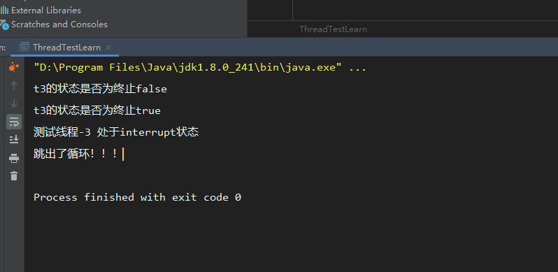

### JVM

#### JVM和JDK和JRE的区别

JDK（Java development kit）Java开发环境。包含JRE

JRE（Java running Environment）Java运行环境。类库、类加载器和JVM构成

JVM（Java Virtual Machine） JVM就是一个引擎，提供运行时环境驱动Java代码或程序应用程序。JRE的一部分。

#### JVM内存区域划分

由堆、栈、方法区、程序计数器组成。

| 堆 （运行时常量池）     | new的对象就会放在堆中  数组              |
| -------------- | ----------------------------- |
| 栈 （JVM栈和本地方法栈) | 局部变量(基本数据类型)和对象引用类型           |
| 方法区            | 加载好的类放在方法区，常量、静态变量            |
| 程序计数器          | 存储的是地址描述的是当前线程接下来 要执行的指令在什么地方 |

JVM栈与本地方法栈（Native Method Stack）的主要区别在于 本地方法栈执行native方法(非Java语言实现的接口)

#### native方法的引用

Unsafe.class下存在native方法引用。

native 关键字修饰接口，说明该接口在外部定义。使用非Java语言实现。

```java
//native 的使用 cd 到target/class下 需要使用 javah  包名+类名 命令 生成 C的头文件。在里面实现C的代码.编译完成的C文件需要放入windows的C类库下面
public class HelloJni {
    static {
        System.loadLibrary("hello");
    }

     private  native void sayHello();

    public static void main(String[] args) {
            new HelloJni().sayHello();
    }
}


```

#### GC垃圾回收机制

##### 引用计数法

​      通俗的来说就是每一个程序有一个计数器，当程序被引用的时候计数器加1，引用失效计数器减1。计数器为0的对象表示不可用。

​       缺点：两个对象互相引用的时候，计数器都不为0.无法被回收。

JVM虚拟机没有使用这种方法。

##### 可达性分析算法

​      以 GC Roots 为根，向下搜索。搜索走过的路径称为引用链，如果一个对象与GC Roots 之间不存在联通的引用链。即不可达。认为该对象可回收。

##### 标记-清除算法

分为标记和清理两个阶段。标记阶段标记所有要回收的对象。清理阶段清理这些对象

缺点是：效率不高，清理后会产生大量内存不连续的碎片。导致分配给大对象时内存不足需要提前触发回收。

###### 复制算法（新生代回收算法）

将内存划分为大小相等的块，当一块内存使用结束的时候，将该区域存活的对象复制到另一块内存区域。然后回收当前内存区域。

缺点：内存缩小为原来的一半。

##### 标记-整理算法

在标记-清理的基础上，增加一步整理的功能。在清楚前，将有存活对象的内存区域向一端移动，然后清理边界之外的内存区域。

##### 分代收集算法

将内存分为新生代和老年代。新生代是生命周期短。新生代的对象因为生命周期短，所以使用复制算法进行回收。老年代的生命周期长，使用标记-整理或者标记-清除算法。

#### JVM调优常用参数

- -Xmx1024m：最大堆内存，当物理内存不超过192m时最大堆内存为物理内存的一半，否则为物理内存的四分之一
- -Xms1024m：最小堆内存，一般设置为与-Xmx同等值
- -XX:+PrintGCDetails：输出gc详细日志
- -XX:+PrintGCTimeStamps或-XX:+PrintGCDateStamps：输出gc信息时带上时间戳


- jcmd：专用于查看JVM状态，可以查看正在运行的进程，会显示出进程号

#### JVM分析堆内存溢出步骤

1.查看日志，看日志能不能定位内存溢出的原因

2.top 后 shift+M 按内存占用大到小排序，RES 是此进程实际占用内存，%MEM是占服务器总内存的49.8%

3.使用ps -aux|grep java 查看pid

4.利用 jstat 查看虚拟机 gc 情况

5.利用 jmap 直接生成 dump 文件

6.分析dump 文件 （MAT 或者 jvisualvm）

#### class在JVM中的加载过程

##### 类加载的生命周期

- **加载**

​        1.通过一个类的全限定名来获取定义此类的二进制字节流

​        2.将这个字节流所代表的静态存储结构转化为方法区的运行时数据结构

​        3.在内存中生成一个代表这个类的class对象。作为方法区这个类的各种数据的访问入口。

- **验证**

​        1.文件格式验证   （是否以魔数开头、主次版本号是否在当前虚拟机处理范围）

​        2.元数据验证    对字节码描述的信息进行语义分析。类之间的相关关系及操作是否符合Java语法规范

​        3.字节码验证     对类的方法体进行校验。校验方法体中的操作是否符合语法规范

​        4.符号引用验证  对类自身以外的信息进行匹配验证。例如A类引用B类的数据。是否能正确获取。

- **准备**

​       为类变量分配内存并设置类变量初始值的阶段

- **解析**

​       将类中的常量池内的符号引用替换成直接引用的过程

​       符号引用：一组符号，与虚拟机内存无关。

​       直接引用：指向地址的指针、相对偏移量或者间接定位的句柄。与虚拟机的内存分布相关

- **初始化**  

  根据程序员指定的主管计划，进行类变量和资源的初始化。类构造器方法<clinit>() 的执行过程

  **JVM规范规定了五种情况**

​        1.遇到 new 、getstatic、putstatic、invokestatic 字节码指令的时候。尚未初始化，则必须先进行初始化操作。对应的Java代码场景：new关键字实例化对象、读取、设置一个类的静态字段、调用一个静态方法。

​        2.使用java.lang.reflect包的方法对类做反射调用的时候

​        3.初始化子类时，先初始化父类。

​        4.虚拟机启动时，用户指定了要执行的主类  main方法的类

​        5.JDK1.7 动态语音支持时，java.lang.invoke.MethodHandle示例后的解析结果的方法句柄对应的类未初始时。

```java
//静态代码块只能访问定义在代码块之前的静态变量。定义在之后的变量可以赋值不可以访问。
//父类会在子类之前初始化
//父类的初始化方法先执行所以父类的静态语句先于子类执行
public class Test{
  static{
    i=0;   // 可以赋值
    System.out.println(i);  //会报非法向前引用
  }
  static int i=1;
}
```

- **使用**
- **卸载**

###### 类加载器

**定义**

生成描述类的二进制字节流的过程 实现这一操作的模块 成为类加载器

**双亲委派模型**

不同类加载器通过组合工作。除了顶层的启动类加载器外，其他类加载器都有他的父加载器。

### Java基础

#### 老生常谈的面向对象

##### 是什么？

面向对象是一种思想，相对于面向过程而言。将某一类具有相同行为与属性的事物看做同一种对象。

##### 为什么？(面向对象的好处)

面向对象的思想更符合我们日常的行为习惯，开发效率也会更高。可以提高系统的可维护性、可扩展性、可重用性。

**可维护性 **：面向对象的思想开发会将程序分隔成不同的对象。每个对象具有不同的功能。当某一功能需要修改时，我们仅仅需要对该对象下的某个方法做变更即可。降低了维护成本。

**可扩展性** ：主要体现的Java面向对象的三大特征上：封装、继承、多态。将程序封装成对象。对象之间可以继承。在原有的类基础上，子类继承了父类的方法。同时可以在子类上进行更多的功能开发。多态是建立在继承的基础上的。要满足三个条件：

- 继承，必须有子类继承父类
- 重写，子类重写父类方法
- 向上转型，子类的引用赋值给父类对象。

多态解决的是同一类对象在不同情况下的不同处理问题。例如学生上课，上的课不同，需要去的地方不同。

**可重用性** :  常说的复用，因为代码被封装成了不同的对象。在需要执行某一操作时，仅仅需要调用该操作下对应方法即可。

##### 怎么做？(对象的实现过程)

Java中使用new关键字来创建对象。

#### 基本数据类型及运算符

##### 基本类型

| 基本类型    | 大小     | 包装类型    |
| ------- | ------ | ------- |
| boolean |        | Boolean |
| char    | 16bit  | Char    |
| byte    | 8bits  | Byte    |
| short   | 16bits | Short   |
| int     | 32bits | Integer |
| long    | 64bits | Long    |
| float   | 32bits | Float   |
| double  | 64bits | Double  |
| void    |        | Void    |

##### 按位运算符

```java
&  与操作
|  或操作
^  异或操作
&=
|=
```

##### 移位操作符

进行二进制的位移操作。

```java
>> 有符号右移
<< 有符号左移
>>> 无符号右移
<<< 有符号左移
```

#### 重载和重写

##### 重载

方法名称相同，参数不同的处理叫做重载。重载的方法在同一个类中。

##### 重写 

方法名称参数相同，重写了方法体中的实现叫做重写。重写发生在继承的父子直接。或者接口实现

#### 初始化顺序

遵循先父后子，变量优于块，静态优于非静态

- 父类静态变量
- 父类静态代码块
- 子类静态变量
- 子类静态代码块
- 父类非静态变量
- 父类非静态代码块
- 父类构造函数
- 子类非静态变量
- 子类非静态代码块
- 子类构造函数

#### 权限控制

**public**  任何人都可以访问

**protected** 

-   基类（父类）的protected成员（包括成员变量个成员方法）对本包内可见，并且对子类可见；
-   若子类与基类（父类）不在同一包中，那么在子类中，只有子类实例可以访问其从基类继承而来的protected方法，而在子类中不能访问基类实例（对象）（所调用）的protected方法。
-   不论是否在一个包内，父类中可以访问子类实例（对象）继承的父类protected修饰的方法。（子父类访问权限特点：父类访问域大于子类）
-   若子类与基类（父类）不在同一包中,子类只能在自己的类（域）中访问父类继承而来的protected成员，无法访问别的子类实例（即便同父类的亲兄弟）所继承的protected修饰的方法。
-   若子类与基类（父类）不在同一包中，父类中不可以使用子类实例调用（父类中没有）子类中特有的（自己的）protected修饰的成员。（毕竟没有满足同一包内和继承获得protected成员的关系）

**private**  除了当前类，其他人均不可访问

#### String和StringBuilder和StringBuffer的区别

StringBuffer 是线程安全的。底层使用了synchronized关键字

StringBuilder 不是线程安全的。

String创建之后不会更改，我们常做的+=操作底层实现是new StringBuilder 来完成的。

#### throw和throws的区别

throw在方法中表示抛出异常。

throws 修饰函数名，表示该方法可能抛出异常。

```java
    public static void main(String[] args) throws Exception{
        System.out.println(test());
       try {
           
       }catch (Exception e){
           throw e;
       }
    }

```

### 集合相关问题

##### ArrayList 和 LinkedList的区别

ArrayList的底层实现是数组。LinkedList的底层实现是链表。

两者在查询方面的区别：ArrayList更适合查询。但是如果只是获取首个元素或者尾部元素。查询效率是一致的。

两者在插入方面的区别：ArrayList 插入指定位置或者末尾位置很快。但是数量大的时候需要扩容。LinkedList不存在扩容问题。但是向指定位置插入因为要遍历链表会降低效率。

综上：如果仅仅是使用add做插入。使用LinkedList会好一些。如果插入场景少，经常查询通常使用ArrayList。

#### HashMap

##### 关键参数

| loadFactor      | 负载因子  默认为0.75 |
| --------------- | ------------- |
| initialCapacity | 初始容量  默认是16   |
| threshold       | 临界值，大于该参数需要扩容 |

##### HashMap实现 JDK1.7

底层实现是数组+链表的方式实现的

##### HashMap实现JDK1.8

数组+链表+红黑树实现的

###### put方法的实现

1.调用hash()方法，在hash()中，通过hashCode()计算出key的一个hash值，与hash值右移16位结果做异或运算。（`hash^(hash>>>16)`）得到一个hash值。

```markdown
**这里为什么要做异或运算?**
异或运算能更好的保留各部分的特征，如果采用&运算计算出来的值会向0靠拢，采用|运算计算出来的值会向1靠拢
**为什么要右移16位呢?**
int 类型是4字节 32比特。底层二进制是32位的二进制串，当nodeTable长度过小时，做异或运算。高位就全部为0.导致高位的字节无法参与到后续的运算中。容易发生hash碰撞。
```

2.nodeTable长度为0或者数组为null，就调用resize()重新分配大小。

3.通过hash与nodeTable.length-1做与运算求得数组下标。当前nodeTable[index]为null 就将new一个节点插入到该位置。

4.nodeTable[index]不为空，比较两个节点的hash值。hash值一致，比较key值。如果还一致，将该节点的value替换成输入值。key值不一致时，判断headNode是否是TreeNode类型。

5.是TreeNode类型，就调用TreeNode的put添加节点方法

```markdown

```

6.不是TreeNode,遍历链表，判断hash值，hash值一致就继续判断key。key一致就替换value。遍历到尾部，就添加这个节点到尾部。链表长度超过8个节点，就调用treeifyBin()转换成红黑树结构。

```markdown  
**为什么转换阈值设置为8**
链表的查询时间复杂度为O(n) 红黑树为O(log(n)) 如果 hashCode 分布良好，也就是 hash 计算的结果离散好的话，那么红黑树这种形式是很少会被用到的，因为各个值都均匀分布，很少出现链表很长的情况。在理想情况下，链表长度符合泊松分布，各个长度的命中概率依次递减，当长度为 8 的时候，概率仅为 0.00000006。

treeifyBin()的逻辑
  1.nodeTable的长度小于64 或者为null  调用resize()
  2.headnode不为空  遍历替换成TreeNode
  3.treeify（）
 
```

7.判断map的size大小是否超过threshold扩容大小。超过的话调用resize方法扩容

###### HashMap get方法的实现

1.通过key的hashCode计算hash值。与右移16位的结果做异或运算。得到数组下标。

2.获取数组下标处的元素。不存在返回null，存在节点就比较hash和key值，一致就返回value。

3.key不同的情况下，判断是否节点是TreeNode类型是调用getTreeNode()方法

4.不是TreeNode类型，遍历链表获取value。没有匹配返回null

###### HashMap扩容  resize

1.判断旧的一个节点数组大小是否大于0.

2.大于0就判断是否大于理论最大值。大于就将数组长度设置为Integer.Max。小于最大值且旧的数组长度大于16就将扩容大小设置为旧的 threshold大小左移1位的值。

3.遍历计算新的下标位置。同时判断节点是否为TreeNode节点。 是TreeNode走splite

4.不是TreeNode类型。与旧数组大小-1做与运算 结果为0的放在index不变。不为0的放在旧坐标+旧数组长度的坐标下。


```java
//   |= 位运算      
static final int tableSizeFor(int cap) {
        int n = cap - 1;
        n |= n >>> 1;
        n |= n >>> 2;
        n |= n >>> 4;
        n |= n >>> 8;
        n |= n >>> 16;
        return (n < 0) ? 1 : (n >= MAXIMUM_CAPACITY) ? MAXIMUM_CAPACITY : n + 1;
    }
```

##### 与HashSet的区别于联系

1. HashSet 的底层实现是HashMap
2. HashSet 实现了Set接口，HashMap实现了Map接口。存储的数据不同，Map存储的键值对。Set存储对象。

##### 重写equals方法的同时为什么要重写hashCode方法

相等的对象，他们的hash值必须相同。如果只重写equals方法。会导致判定一致，两个对象的hash值不一致。或者hash值一致。equals返回false的情况。(object的equals上的注释有规定)

```java
public class student {
    String  id;

    String name;

    @Override
    public int hashCode() {
        return Objects.hash(id, name);
    }

    @Override
    public boolean equals(Object o) {
        if (this == o) {return true;}
        if (o == null || getClass() != o.getClass()) {return false;}
        student student = (student) o;
        return id.equals(student.id) &&
                name.equals(student.name);
    }
}

```

### 多线程

#### 线程的状态

- NEW      新建，初始状态，在执行start方法之前。
- RUNNABLE   执行start方法，线程进入运行状态
- BLOCKED     阻塞状态，线程阻塞于锁
- WAITING   等待状态，当前线程需要等待其他线程完成一些状态   join
- TIME_WAITING  超时等待状态，达到指定时间继续向后执行
- TERMINATED   终止状态，线程执行完毕


#### 线程的常用方法说明

##### join

A线程调用B线程，B线程执行join方法，则A线程被挂起直到B线程执行结束。示例如下

```java
//线程2启动中调用了线程1，线程1调用了join()方法。线程2被挂起
//线程1
public class TestThread implements Runnable {
    @Override
    public void run() {
        System.out.println("测试线程-1");
        for (int i = 0; i < 5; i++) {
            System.out.println("循环遍历");
        }
    }

    public TestThread() {
    }

}
//线程2
public class Thread02 implements Runnable{
    @Override
    public void run() {
        System.out.println("测试线程-2");
        TestThread testThread = new TestThread();
        Thread thread =new Thread(testThread);
        thread.start();
        try {
            thread.join();
        } catch (Exception e) {
            e.printStackTrace();
        }finally {
            System.out.println("测试线程-2 执行结束");
        }
    }
}

    public static void main(String[] args) throws Exception {

        Thread02 thread02=new Thread02();
        Thread t2 = new Thread(thread02);
        //开始方法
        t2.start();
        //

        //线程终止
//        thread.interrupt();
    }
```

将join的调用注释掉，结果如下


调用join方法后输出结果


##### start

线程的启动方法

##### interrupt

将线程设置为中断状态。如果线程处于阻塞状态（wait、sleep、join）会中断阻塞并抛出异常。如果非阻塞状态，会执行run结束然后终止。

##### isInterrupted

判断线程是否处于中断状态,当线程处于等待状态时，会抛出中断异常。

```java
//t3线程启动，如果不调用interrupt()方法，会一直循环下去，调用了interrupt（）方法。线程被设置为中断状态。在循环中使用Thread.interrupted()来获取当前线程的状态是否为中断，中断则执行break。结果打印出了 跳出循环的提示，说明interrupt只是设置状态。
public class Thread3 implements Runnable{
    @Override
    public void run() {
        while (true){
            if (Thread.interrupted()){
                System.out.println("测试线程-3 处于interrupt状态");
                break;
            }else {
                System.out.println("测试线程-3 工作中");
            }
        }
        System.out.println("跳出了循环！！！");
    }
}

    public static void main(String[] args) {
        Thread3 thread3=  new Thread3();
        Thread t3 = new Thread(thread3);
        t3.start();
        boolean interrupted = t3.isInterrupted();
        System.out.println("t3的状态是否为终止"+interrupted);
        t3.interrupt();
         interrupted = t3.isInterrupted();
        System.out.println("t3的状态是否为终止"+interrupted);
    }
```



##### stop

强制中断线程。会有线程安全问题。不建议使用

#### Thread类方法说明

##### Thread.Interruputed

获取当前类的是否中断，返回一个boolean 值并清空这个状态。如下图所示，两次调用获取状态不一致。


##### Thread.currentThread

获取当前线程

##### Thread.yield

让线程处于就绪状态。获取到资源后继续执行。不会重新开始执行run方法。

#### 线程中断问题

- 使用stop 强制中断线程。
- 使用interruput 设置中断状态。并在程序中捕获中断异常来完成中断操作
- 人为的设置中断标识，可以使用volatile关键字定义静态变量来实现。


```java
public class Shutdown {

    public static void main(String[] args) throws InterruptedException {
        Runner one = new Runner();
        Thread countThread =new Thread(one,"CountThread");
        countThread.start();
        TimeUnit.SECONDS.sleep(1);
        countThread.interrupt();
        Runner two=new Runner();
        countThread = new Thread(two,"CountThread");
        countThread.start();
        TimeUnit.SECONDS.sleep(1);
        two.cancel();
    }
    private static  class Runner implements Runnable{
        private long i;
        private volatile  boolean on =true;

        @Override
        public void run() {
            while (on &&!Thread.currentThread().isInterrupted()){
                i++;
            }
            System.out.println("Count i= "+i);
        }
        public void  cancel(){
            on =false;
        }
    }
}
```


#### volatile

##### 定义

Java编程语言允许线程访问共享变量，为了确保共享变量能够被准确和一致地更新，线程应该确保通过排他锁单独获取这个变量。

Java字段被该变量声明，则所有线程看到这个变量的值是一致的。

##### 实现原理

被volatile修饰的的变量，在转换为汇编语言的时候，会多出Lock前缀的指令。处理器在处理Lock前缀指令的时候会做两件事情：

- 将当前处理器的缓存行的数据写回到系统内存中。
- 写回内存的操作会因为缓存一致性协议导致其他CPU里缓存的内存地址无效。

##### volatile优化

JDK7中新增了LinkedTransferQueue。使用了追加字节的方式来进行了出队和入队的性能优化。

#### synchronized

- 修饰同步方法，锁对象是当前示例对象。
- 修饰静态同步方法，锁对象是当前类的class对象。
- 修饰同步方法块，锁对线是Synchronized括号里配置的对象。

##### 实现原理

JVM基于进入和退出monitor对象来实现同步。也就是monitorenter和monitorexit指令。任何一个对象都对应一个monitor。代码块同步在编译完成后，会在开始处插入monitorenter。在结束或者异常处插入monitorexit。当一个monitor被持有后，即为锁定状态。线程执行到monitorenter指令处会尝试获取monitor的所有权，即尝试获取锁对象。

##### 锁升级


#### 多线程的创建与执行

###### 线程的创建

```java
Thread thread = new Thread();

class a implements Runnable{}

@Async

@EnableAsync
```

#### 线程的执行

```
thread.start();
```


#### 线程池

##### 实现原理

- 线程池判断核心线程池里面的线程数是否都在执行任务。不是，创建一个线程执行当前任务。是进入下一步
- 线程池判断工作队列是否已经满了。没满就添加进去，满了就进入下一步
- 线程池判断线程数是否达到最大线程数。没有就创建线程来执行任务。如果已经满了就交给饱和策略来处理。

##### 饱和策略

- AbortPolicy        直接抛出异常
- CallerRunsPolicy   只用调用者所在线程来运行任务
- DiscardOldestPolicy  丢弃队列里最近一个任务，执行当前任务
- DiscardPolicy  不处理，丢弃 

##### 关键参数

- 核心线程数 corePoolSize
- 最大线程数 maxinumPoolsize
- 线程活跃时间  keepAliveTime  线程空闲时间保持存活的时间
- 线程活动保持时间的单位 TimeUnit
- 任务队列 runnableTaskQueue 
- 线程工厂  ThreadFactory  可以给线程命名
- 饱和策略  RejectedExecutionHandler  

##### 任务队列

- ArrayBlockingQueue 数组结构的阻塞队列
- LinkedBlockingQueue  链表结构的队列
- SynchronousQueue  不存储元素的阻塞队列
- PriorityBlockingQueue  具有优先级的无限阻塞队列 

##### 线程池提交任务

**execute**

直接执行无返回结果

##### **submit**

返回一个Future对象,可以使用get方法获取返回值。但是会阻塞当前线程

##### 线程的关闭

shutdown 或者shutdownNow

shutdown将线程状态设置为SHUTDOWN 然后中断没有执行任务的线程

shutdownNow 会将所有线程设置为STOP 然后中断线程。

调用之后使用isShutdown获取到true  使用isTerminaed需要等线程真正关闭才会返回true

##### 线程池的合理配置

- CPU密集型的任务，线程池配置为CPU数+1
- IO密集型任务，尽可能多的配置线程数
- 混合型，如果可以拆分。依照上述策略。如果拆分后执行时间相差较大，就没必要了。
- 优先级不同的任务，可以使用优先级队列来处理。
- 执行时间不同的任务可以设置不同的线程池来执行
- 依赖其他系统资源的任务，就尽量设置多一些的线程数。

##### 线程池监控

- taskCount
- completeTaskCount
- largestPoolSize
- getPoolSize
- getActiveCount

##### 通过ThreadPoolExecutor 创建的线程池

```java
ThreadPoolExecutor poolExecutor =
  new ThreadPoolExecutor(corePoolSize,maxinunmPoolsize,keepAliveTime,TimeUnit.HOURS,queue,threadFactory,  handler);
```

####  Executors 

**包括：**

-    Executors.newFixedThreadPool：创建⼀个固定⼤⼩的线程池，可控制并发的线程数，超出的线程会在队列中等待；
-    Executors.newCachedThreadPool：创建⼀个可缓存的线程池，若线程数超过处理所需，缓存⼀段时间后会回收，若线程数不够，则新建线程；
-    ​    Executors.newSingleThreadExecutor：创建单个线程数的线程池，它可以保证先进先出的执⾏顺序；
-    ​    Executors.newScheduledThreadPool：创建⼀个可以执⾏延迟任务的线程池；
-    ​    Executors.newSingleThreadScheduledExecutor：创建⼀个单线程的可以执⾏延迟任务的线程池；
-    ​    Executors.newWorkStealingPool：创建⼀个抢占式执⾏的线程池（任务执⾏顺序不确定）【JDK1.8 添加】。
-    ​    ThreadPoolExecutor：最原始的创建线程池的⽅式，它包含了 7 个参数可供设置，后⾯会详细讲。

### 注解相关

##### @Autowired和@Resource注解的区别是什么？

@Autowired 由Spring提供，只按照byType注入  可以使用@Qualifier byName

@Resource 由J2EE提供，默认按照byName自动注入

### 设计模式

#### 策略模式

##### 基类

使用抽象类定义的基础类，用来代指某一特征的对象，例如人、动物等。基础类中会引用不同的行为接口。通过调用set方法来完成自定义行为的功能。

```java
/**
 * @author djz
 * @Title: personAbstract
 * @ProjectName djz-nacos
 * @Description: 人物类
 * @date 2022/6/615:59
 */
public abstract class personAbstract {

    public String name;

    public String sex;

    public String age;

    //唱歌行为类
    public designMode.policyMode.behavior.singBehavior singBehavior;
    //跑步行为类
    public designMode.policyMode.behavior.runBehavior runBehavior;

    public void setSingBehavior(designMode.policyMode.behavior.singBehavior singBehavior) {
        this.singBehavior = singBehavior;
    }

    public void setRunBehavior(designMode.policyMode.behavior.runBehavior runBehavior) {
        this.runBehavior = runBehavior;
    }

    public String getName() {
        return name;
    }

    public void setName(String name) {
        this.name = name;
    }

    public String getSex() {
        return sex;
    }

    public void setSex(String sex) {
        this.sex = sex;
    }

    public String getAge() {
        return age;
    }

    public void setAge(String age) {
        this.age = age;
    }
}

```

##### 行为接口及实现

如下使用接口定义不同的功能方法，同时通过实现这些接口完成具体的功能。

```Java
/**
 * @author djz
 * @Title: runBehavior
 * @ProjectName djz-nacos
 * @Description: TODO
 * @date 2022/6/616:02
 */
public interface runBehavior {

    public  void  run();
}
```

```java
/**
 * @author djz
 * @Title: runSlow
 * @ProjectName djz-nacos
 * @Description: TODO
 * @date 2022/6/616:04
 */
public class runSlow implements runBehavior {

    @Override
    public void run() {
        System.out.println("跑的慢");
    }
}

```

##### 实现类

继承基类，用来定义具体的子类对象。例如人会有不同的职业。 

```java
/**
 * @author djz
 * @Title: singer
 * @ProjectName djz-nacos
 * @Description: TODO
 * @date 2022/6/616:10
 */
public class singer extends personAbstract{

    public singer(designMode.policyMode.behavior.singBehavior singBehavior) {
        this.singBehavior = singBehavior;
    }
}
```

##### 优点

- 遵循了开闭原则（对扩展开发，对修改关闭），使用者可以在不修改原有代码的基础上灵活使用或添加算法功能
- 能有效的避免代码重复（将重复代码移动到父类中）
- 可以有效的避免使用多重if-else语句

##### 缺点

- 每一个算法的实现都要单独生成一个策略类。如果算法多会导致类的数量多
- 使用者需要知道所有的策略。

#### 观察者模式

##### 主题

观察者模式分为主题和订阅者（观察者），主题顾名思义，就是作为信息的生产方，在主题发生变化或者发出信息的时候，提醒订阅方进行相应的操作,提供消费者提醒方法，移除和添加订阅者的方法。

```java
/**
 * @author djz
 * @Title: subject   主题
 * @ProjectName 观察者模式
 * @Description: 观察者模式主要解决一对多的问题。MQ的设计模式实际就遵从观察者模式
 * @date 2022/6/616:23
 */
public  interface subject {

    public  void  notifyMethod();

    public  void  removeOb(observer observer);
    public  void addOb(observer observer);
}

```

```java
/**
 * @author djz
 * @Title: sub1
 * @ProjectName djz-nacos
 * @Description: TODO
 * @date 2022/6/616:27
 */
public class sub1 implements subject {
    private List<observer> observerList =new ArrayList<>();
    @Override
    public void notifyMethod() {
        for (observer observer : observerList) {
            observer.update();
        }
    }

    @Override
    public void removeOb(observer observer) {
        observerList.remove(observer);
    }

    @Override
    public void addOb(observer observer) {
        observerList.add(observer);
    }
}

```

##### 订阅者

消费主题消息，完成之后的相关操作

```java
public class ob1 implements observer{
    @Override
    public void update() {
        System.out.println("消息更新");
    }
}
```

#### 装饰者模式

##### 装饰对象

###### 装饰对象基类

使用抽象类编写一个装饰对象的抽象类作为抽象组件，可以提供抽象方法用来在子类中进行重写，提供功能的扩展。公共代码可以在该组件中编写，避免重复。

```java
/**
 * @author djz
 * @Title: phone
 * @ProjectName djz-nacos
 * @Description: 
 * @date 2022/6/616:50
 */
public abstract class computer {
    public String name;

    public abstract double cost();
}
```

###### 装饰者对象

继承抽象类，同时实现在类中重写抽象方法。

```java
/**
 * @author djz
 * @Title: base
 * @ProjectName djz-nacos
 * @Description: TODO
 * @date 2022/6/616:56
 */
public class base extends computer {
    @Override
    public double cost() {
        return 0;
    }
}

```

##### 装饰者

###### 装饰者基类

使用抽象类继承装饰对象的抽象类，同时在该抽象类中进行引用

```java
public  abstract class computerDecoration extends computer {
    computer computer;

    public computerDecoration(computer computer) {
        this.computer = computer;
    }

    @Override
    public double cost() {
        return computer.cost();
    }
}
```

###### 装饰者

通过继承抽象装饰者。来实现具体的装饰者。完成具体功能

```java
public class CpuUpdate extends computerDecoration {

    @Override
    public double cost() {
        return computer.cost()+2000;
    }

    public CpuUpdate(computer computer) {
        super(computer);
    }
}

```

##### 总结

装饰者，给对象动态附加额外的功能。相较于子类化的方法提供了弹性的替代做法

#### 工厂模式

##### 简单工厂模式

将经常修改的创建代码提取出来，创建一个工厂类。如下

```java
public class tableFactory {
    public Object create(String type) {
        Object object=null;
        switch (type){
            case "mysql":
                object= new mysqlTable();;break;
            case "oracle":
                object=  new oracleTable();break;
            default:
                object=   new hiveTable();;break;
        }
        return object;
    }
}
```

##### 工厂方法模式

###### 抽象工厂

在简单工厂模式的基础上，使用抽象类抽象出来一个基础抽象组件,组件中提供抽象方法让子类决定具体的创建，同时可以在基础抽象组件中编写公共代码避免重复

```java
public abstract class abstractFactory {

    public String url;
    public String password;
    public String user;

    public abstract  void create(String type);

}

```

###### 具体工厂

```java
public class tableFactory extends abstractFactory {

    @Override
    public Object create(String type) {
        Object object=null;
        switch (type){
            case "mysql":
                object= new mysqlTable();;break;
            case "oracle":
                object=  new oracleTable();break;
            default:
                object=  new hiveTable();;break;
        }
        return object;
    }
}

```

###### 抽象产品

这里举例使用表

```java
public abstract class abstarctTable {

    
}

```

###### 具体产品

```java
public class oracleTable extends abstarctTable {

    public oracleTable() {
        System.out.println("创建oracle表");
    }
}

```

###### 使用

```java
public class test {
    public static void main(String[] args) {
        abstractFactory factory  = new tableFactory();
        factory.create("mysql");
    }
}

```

##### 抽象工厂模式

在工厂方法模式的基础上，在上层添加同一的工厂创建接口、所有的工厂类实现该接口。同时提供一个构造器来统一创建工厂。

```java
public class factoryBuilder {

    public static abstractFactory getFactory(String factoryType){

       if ("db".equals(factoryType)){
           return  new dbConnectFactory();
       }else {
           return  new tableFactory();
       }

    }
}
```

##### 比较

工厂方法模式是在简单工厂模式上的延伸，满足了开闭原则。实现了可扩展。

抽象工厂针对的是产品族。工厂模式针对是产品系列。一个产品族包含多个产品新列。

抽象工厂模式不利于产品族的扩展。

#### 单例模式

##### 懒汉式

```java
/**
 * 
 * @ClassName: Singleton
 * @Description: 懒汉式单例（在第一次调用的时候实例化自己）
 * 这种方式是最基本的实现方式，这种实现最大的问题就是不支持多线程。因为没有加锁 synchronized，
 *   所以严格意义上它并不算单例模式。
 */
public class Singleton {
	//构造函数私有化
	private Singleton(){}
	
	private static Singleton singleton = null;
	
	//构建实例化方法
	public static Singleton getSingleton(){
		if(singleton == null){
			singleton = new Singleton();
		}
		return singleton;
	}
}
```

##### 饿汉式

```java
/**
 * 
 * @ClassName: Singleton2
 * @Description: 饿汉式
 * 这种方式比较常用，但容易产生垃圾对象。
 * 优点：没有加锁，执行效率会提高。
 * 缺点：类加载时就初始化，浪费内存。
 */
class Singleton2 {
        //私有构造函数
	private Singleton2(){};
	private static Singleton2 singleton2= new Singleton2();
	public static Singleton2 getSingleton2(){
		return singleton2;
	}
}
```

##### 线程同步

```java 
/**
 * 
 * @ClassName: Singleton2
 * @Description: 加synchronized关键字
 * 优点：线程同步
 * 缺点：同步性能消耗大
 */
class Singleton2 {
 	//构造函数私有化
	private Singleton(){}
	
	private static Singleton singleton = null;
	
	//构建实例化方法
	public static synchronized Singleton getSingleton(){
		if(singleton == null){
			singleton = new Singleton();
		}
		return singleton;
	}
}
```

##### 最优版

```java
/**
 * 
 * @ClassName: Singleton2
 * @Description: 改良版
 * volatile保证变量的可见性，使用双重synchronized关键字。来减少同步的性能消耗。当线程加载到方法时。先判断变量是否为空。为空才进行实例化操作。极大的加快了响应速度
 */
class Singleton2 {
 	//构造函数私有化
	private Singleton(){}
	
	private volatile static Singleton singleton = null;
	
	//构建实例化方法
	public static  Singleton getSingleton(){
		if(singleton == null){ 
          synchronized(Singleton2.class){
            if(singleton == null){
              	singleton = new Singleton();
            }
          }
		}
		return singleton;
	}
}
```

#### 命令模式

##### 执行（execute）

执行命令的对象

```java
/**
 * @author djz
 * @Title: client
 * @ProjectName djz-nacos
 * @Description: TODO
 * @date 2022/7/1215:17
 */
public class client {

    public void  sayHello(){
        System.out.println("hello world");
    }
}

```

##### 命令（Command）

###### 命令接口

```java
public interface order {
    void  execute();
}
```

###### 命令实现

```java
public class command implements order{

    //执行命令的对象
    client client;

    public command(designMode.commandModel.execute.client client) {
        this.client = client;
    }

    @Override
    public void execute() {
         client.sayHello();
    }
}
```

##### 入口（invoke）

```java
/**
 * @author djz
 * @Title: Control
 * @ProjectName djz-nacos
 * @Description: 命令适配类
 * @date 2022/7/1215:30
 */
public class Control {

    designMode.commandModel.command.order order ;

    public void setOrder(designMode.commandModel.command.order order) {
        this.order = order;
    }
   
    public  void  buttonWasPressed(){
        order.execute();
    }    
}


```

#### 模板方法模式

定义一个算法的骨架，将一些步骤延迟到子类中实现。

```java
/**
 * @author djz
 * @Title: abstractMethod
 * @ProjectName djz-nacos
 * @Description: TODO
 * @date 2022/7/1215:58
 */
public abstract class abstractMethod {

    final void doSomething(){
        sayHello();
        sayBye();
    }

    abstract void sayHello();
    abstract void sayBye();
}

```

子类实现

```java
/**
 * @author djz
 * @Title: sayByeNotHellow
 * @ProjectName djz-nacos
 * @Description: TODO
 * @date 2022/7/1216:00
 */
public class sayByeNotHellow extends abstractMethod {

    @Override
    void sayHello() {

    }

    @Override
    void sayBye() {
        System.out.println("bye");
    }
}
```

#### 状态模式

在状态模式（State Pattern）中，类的行为是基于它的状态改变的。这种类型的设计模式属于行为型模式。

##### 优点

1. 封装了转换规则。
2. 枚举可能的状态，在枚举状态之前需要确定状态种类。
3. 将所有与某个状态有关的行为放到一个类中，并且可以方便地增加新的状态，只需要改变对象状态即可改变对象的行为。 
4. 允许状态转换逻辑与状态对象合成一体，而不是某一个巨大的条件语句块。
5. 可以让多个环境对象共享一个状态对象，从而减少系统中对象的个数。

##### 缺点

1. 状态模式的使用必然会增加系统类和对象的个数。 
2. 状态模式的结构与实现都较为复杂，如果使用不当将导致程序结构和代码的混乱。
3. 状态模式对"开闭原则"的支持并不太好，对于可以切换状态的状态模式，增加新的状态类需要修改那些负责状态转换的源代码，否则无法切换到新增状态，而且修改某个状态类的行为也需修改对应类的源代码。

##### 使用场景

1、行为随状态改变而改变的场景。 

2、条件、分支语句的代替者。

##### 实现

###### 状态接口

```java
public interface State {
   public void doAction();
}
```

###### 状态实现

```java
/**
 * @author djz
 * @Title: startState
 * @ProjectName djz-nacos
 * @Description: TODO
 * @date 2022/7/1216:16
 */
public class startState implements state {
    @Override
    public void doAction() {
        System.out.println("开始操作");
    }
}

```

```java

/**
 * @author djz
 * @Title: startState
 * @ProjectName djz-nacos
 * @Description: TODO
 * @date 2022/7/1216:16
 */
public class startState implements state {
    @Override
    public void doAction() {
        System.out.println("开始操作");
    }
}
```

###### 使用

```java
/**
 * @author djz
 * @Title: Context
 * @ProjectName djz-nacos
 * @Description: TODO
 * @date 2022/7/1216:15
 */
public class context {

    private stopState stopState;
    
    private startState startState;
    
    public void  nowState(int a ){
        if (a==1){
            startState.doAction();
        }else {
            stopState.doAction();
        }
    }
}

```

#### 代理模式

##### 解决问题

​      在直接访问对象时带来的问题，比如说：要访问的对象在远程的机器上。在面向对象系统中，有些对象由于某些原因（比如对象创建开销很大，或者某些操作需要安全控制，或者需要进程外的访问），直接访问会给使用者或者系统结构带来很多麻烦，我们可以在访问此对象时加上一个对此对象的访问层。

##### 使用场景

Spring Aop

##### 优点

1. 职责清晰。
2. 高扩展性。 
3. 智能化。

##### 缺点

- 由于在客户端和真实主题之间增加了代理对象，因此有些类型的代理模式可能会造成请求的处理速度变慢。 
- 实现代理模式需要额外的工作，有些代理模式的实现非常复杂。

##### 实现

以加载图片为例

###### 提供一个接口

```java
public interface Image {
   void display();
}
```

###### 接口的远程服务器实现

```java
public class RealImage implements Image {
 
   private String fileName;
 
   public RealImage(String fileName){
      this.fileName = fileName;
      loadFromDisk(fileName);
   }
 
   @Override
   public void display() {
      System.out.println("Displaying " + fileName);
   }
 
   private void loadFromDisk(String fileName){
      System.out.println("Loading " + fileName);
   }
}
```

###### 接口的代理实现

```java
public class ProxyImage implements Image{
 
   private RealImage realImage;
   private String fileName;
 
   public ProxyImage(String fileName){
      this.fileName = fileName;
   }
 
   @Override
   public void display() {
      if(realImage == null){
         realImage = new RealImage(fileName);
      }
      realImage.display();
   }
}
```


### 通信协议

##### http

超文本传输协议,HTTP 是一个基于TCP/IP通信协议来传递数据。

##### 工作原理


### 系统架构

##### 微服务架构图


##### Getaway

###### 定义

由Spring Cloud 官方推出的第二代网关框架。由WebFlux+Netty+Reactor实现的响应式API网关.基于Filter的方法提供网关的基本功能，例如安全认证、监控、限流等功能。

###### 解决问题

微服务开发下，不同微服务地址端口不同，前后端请求变得复杂。网关起到的作用就是将这些请求地址和端口号同一管理起来。做路由的转发。网关本身就是一个微服务。

###### 作用

- 服务路由
- 流量控制
- 熔断保护
- 日志监控
- 安全认证

###### 配置项说明

- 断言(Predicate) 允许开发人员匹配http请求中的任意内容。根据匹配结果返回一个布尔值
- 路由(route)由 id 目标URI、断言集合、过滤器集合组成。如果聚合断言结果为真，则转发到该路由
- 过滤器(filter) 可以在返回请求之前或之后修改请求和响应的内容   

#### 框架

##### SpringMVC

###### 实现原理

1.用户访问网页提交request请求

2.前端控制器（dispatcherServlet）接收用户请求与响应

3.前端控制器调用处理映射器（handleMapping）解析请求对应的 `Handler`

4.解析到对应的 `Handler`（也就是我们平常说的 `Controller` 控制器）后，开始由 `HandlerAdapter` 适配器处理。

5.HandlerAdapter` 会根据 `Handler来调用真正的处理器来处理请求，并处理相应的业务逻辑。

6.处理器处理完业务后，会返回一个 `ModelAndView` 对象。

7.ViewResolver(视图解析器) modelAndView对象返回真正的视图view

8.DispaterServlet` 把返回的 `Model` 传给 `View`（视图渲染）。`

9.把 View返回给请求者（浏览器）

###### RestController与Controller 的区别

@RestController注解相当于@ResponseBody ＋ @Controller合在一起的作用。

###### @ResponseBody的作用

将Java对象转换为json格式数据

###### @RequestMapping

用于将任意HTTP 请求映射到控制器方法上。可以作为在类或者方法上。

##### Spring

###### 事务的传播行为

**是什么**

当事务方法A被事务方法B调用的时候，如何做处理。处理策略就是事务的传播行为。

**有哪些**

- PROPAGATION_REQUIRED    没有事务就创建事务，有事务就加入
- PROPAGATION_SUPPORTS    当前有事务就加入，没事务就以非事务的方式执行
- PROPAGATION_MANDATORY   有则加入，没有异常
- PROPAGATION_REQUIRES_NEW   创建新事务
- PROPAGATION_NOT_SUPPORTED   以非事务方式执行操作，如果当前存在事务，就把当前事务挂起
- PROPAGATION_NEVER   存在事务就抛出异常
- PROPAGATION_NESTED  如果当前存在事务，则在嵌套事务内执行。如果当前没有事务，则按REQUIRED属 性执行。

##### Spring Bean的注入方式

- @bean
- @Controller
- @Service
- @Repository
- @Component
- @import
- 实现BeanFactory
- @importResource

##### @Bean的作用域

作用于方法上

##### AOP

###### 代理模式

代理模式分为静态代理和动态代理。

- 静态代理

​        在运行前已经有相关代码，通过对代码的编译，在程序运行前生成代理类的.class文件

- 动态代理

​       通过反射机制来实现的。主要的代理有两种：JDK的动态代理和CGLIB的动态代理。JDK的代理只支持代理接口。不支持类的代理。

###### AOP（**Aspect Oriented Programming**）

AOP 面向切面编程，典型的代理模式。通过动态代理的技术来实现的在运行期间对植入增强代码。

###### AOP的使用场景

- 事务的管理控制
- 记录日志  
- 监控性能   在方法调用前后记录调用时间，方法执行太长或超时报警
- 权限控制  方法执行前验证是否有权限执行当前方法，没有则抛出没有权限执行异常，由业务代码捕捉
- 缓存    缓存某方法的返回值，下次执行该方法时，直接从缓存里获取

###### AOP的相关技术点

| **Joinpoint**    | 连接点,运行程序的一个方法或者异常处理。                     |
| ---------------- | ---------------------------------------- |
| **Pointcut**     | 切入点，进行advice的位置。程序的所有方法都是连接点。对程序的操作是以某一个连接点进行的。这个连接点就是切点 |
| **Advice**       | 通知，对切面连接点进行的操作。                          |
| **Introduction** | 增强，通过intoduction可以对切面新增方法或者字段            |
| **Target**       | 目标                                       |
| **Weaving**      | 织入，切面连接到应用程序的过程                          |
| **Proxy**        | 代理                                       |
| **Aspect**       | 切面。由切点组成的对象                              |

###### AOP的失效场景

- 权限问题，未使用public修饰方法
- 方式使用了final修饰
- 内部调用方法
- 未被Spring对象管理
- 多线程调用   @Async 
- 手动处理异常
- 手动抛出异常与AOP处理的不同
- 抛出自定义异常

##### IOC（ Inversion Of Control ）

控制反转，相对于传统的对象引用方式而言的。传统的对象引用，在执行到需要使用对象的部位，进行new 一个对象。或者引用。IOC 的一个思想在于将创建对象的过程交由外部容器来实现。对于Spring而言就是交由Spring来进行这一行为。

###### IOC的实现原理

实现机制是反射

###### IOC与BI的区别

IOC  将创建对象的控制权交给IOC容器

BI  创建对象的时候为对象中的字段或者对象赋值。

###### Spring Bean的生命周期


##### SpringBoot

###### 特点

- 约定大于配置
- 自动装配

###### 为什么使用微服务

- 目前模块包拆分粒度比较细但未成体系/层次结构，很难化配出独立运行的应用
- 服务调用还停留在单体应用中方法调用的程度上，导致提供的应用过于臃肿
- 使用的技术框架较为老化，技术新特性很难应用在当前项目中
- 原应用的配置文件过于繁杂，应使用主流的编程式+文件式配置逐步替代

###### 核心注解

@SpringBootApplication

1. SpringBootConfiguration     声明当前类是SpringBoot应用的配置类
2. EnableAutoConfiguration    开启自动配置
3. ComponentScan  扫描Spring组件  basePackages 指定路径


###### 自动装配

SpringBoot 的使用特点主要是：约定大于配置、自动装配。所谓约定大于配置，即在使用过程中，使用者仅仅需要规定应用中不符合约定的部分。未做规定的部分使用默认配置。

自动装配主要体现在@EnableAutoConfiguration 。查看这个注解的内部实现。

- @AutoConfigurationPackage     (存储自动配置的包路径以便后续使用)


- @import(AutoConfigurationImportSelector.class)

​           getCandidateConfigurations 扫描SpringBoot-autoconfig.jar的META-INF下的 spring.factories 文件，将里面的配置通过反射实例化为配置类。纳入IOC容器中管理。

##### SpringCloud

###### 常用注解说明

**@EnableDiscoveryClient**


 **@LoadBalanced**


##### Nacos

###### 简介

Nacos是Alibaba开源的一项技术、可以用来作为配置中心和服务注册中心

###### 快速使用

1. 下载安装包解压
2. 在数据库中执行conf下的nacos.sql文件
3. 配置conf文件夹下的application.properties文件
4. 使用命令启动nacos

###### SpringBoot整合

1. 启动nacos的服务。在IDEA中创建一个SpringBoot工程
2. 添加依赖   版本 0.2.x.RELEASE 对应的是 Spring Boot 2.x 版本，版本 0.1.x.RELEASE 对应的是 Spring Boot 1.x 版本如下所示整合的SpringBoot版本未2.7.0 所以Nacos版本号使用0.2.7

```xml
<dependency>
    <groupId>com.alibaba.boot</groupId>
    <artifactId>nacos-config-spring-boot-starter</artifactId>
    <version>0.2.7</version>
</dependency>
```

3. 使用 `@NacosPropertySource` 加载 `dataId` 为 `example` 的配置源，并开启自动更新

   ```java
   @SpringBootApplication
   @NacosPropertySource(dataId = "example", autoRefreshed = true)
   public class NacosConfigApplication {

       public static void main(String[] args) {
           SpringApplication.run(NacosConfigApplication.class, args);
       }
   }
   ```

###### SpringCloud整合

1. 启动nacos的服务。在IDEA中创建一个SpringBoot工程
2. 添加 spring-cloud-starter-alibaba-nacos-discovery 依赖
3. 添加 spring-cloud-starter-alibaba-nacos-config 依赖
4. 在SpringBoot的启动类上添加@EnableDiscoveryClient注解
5. 在bootstrapt.yml 或者applacation.properties下添加nacos配置

```xml
<---------applacation.properties-----------/>
server.port=8070
spring.application.name=service-provider
spring.cloud.nacos.discovery.server-addr=127.0.0.1:8848  
<---------bootstrapt.yml-----------/>
server:
  port: 8070
spring:
  cloud:
    nacos:
      discovery:
        <--> server-addr: 127.0.0.1:8848 </-->
        port: 8848 
        ip: 127.0.0.1
  application:
      name: dig-nacos-01
```

###### 配置中心

- dataId      配置文件的名称
- group      分组
- namespace     不同环境的配置文件隔离。

###### 服务发现


- 服务提供者Provider 在服务创建的时候，会向注册中心Nacos发送建立(publish)请求。将服务注册到注册中心
- 注册中心会监控Provider的健康状况
- 消费者Consumer在订阅服务的时候，会从注册中心获取服务提供者的地址信息
- 通过RPC请求调用Provider

###### 健康监测机制

**主流检测机制**

主流的健康监测机制TTL（TIME TO LIVE），客户端在一定时间没有向注册中心发送心跳，注册中心会认为服务已经不健康。进而触发后续的剔除逻辑。

**Nacos的检测机制**

Nacos 提供两种服务实例类型：临时实例和永久实例。

临时实例：临时注册在服务中心的实例。服务删除或者不可用的时候就会剔除。

永久实例：在被删除之前会永久的存在于注册中心，且有可能并不知道注册中心存在，不会主动向注册中心上报心跳，那么这个时候就需要注册中心主动进行探活。

**临时实例监控检测机制**

通过 Nacos 的OpenAPI 进行服务注册或通过 Nacos 提供的 SDK 进行服务注册。SDK（2.0版本通过远程RPC调用。）客户端会定时的通过 RPC 连接向 Nacos 注册中心发送心跳，保持连接的存活。如果客户端和注册中心的连接断开，那么注册中心会主动剔除该 client 所注册的服务，达到下线的效果。同时 Nacos 注册中心还会在注册中心启动时，注册⼀个过期客户端清除的定时任务，用于删除那些健康状态超过⼀段时间的客户端。

**永久实例监控检测机制**

使用 SDK 对于永久实例的注册实际也是使用 OpenAPI 的方式进行注册，这样可以保证即使是客户端下线后也不会影响永久实例的健康检查。

Nacos会在永久服务初始化时，根据客户端选择的协议类型注册探活的定时任务。

提供的三个协议类型：

- Http
- Tcp
- Mysql

可以通过白名单来放弃监控检测

##### Dubbo


### Linux

##### 常用命令

```shell
lsb_release -a 查看版本信息
sudo passwd  重置密码
ls 查看列表
cd 进入目录
pwd 查看当前路径
free 查看内存
tail 用于显示指定文件末尾内容
which     查看可执行文件的位置。
whereis 查看文件的位置。
locate  配合数据库查看文件位置。
find        实际搜寻硬盘查询文件名称。
chmod 改变linux权限
chown  -R  XX   路径   改变文件所有者
sed   查看指定时间的日志
grep  查看指定时间的日志
```

### 数据库连接池的原理

复杂系统频繁创建、关闭数据库连接的会有极大性能消耗，数据库连接池是为了解决这一问题而产生的一种解决方案与技术。数据库连接池，提供一套高效的连接分配、使用策略，最终目标是实现连接的高效、安全的复用。

##### 优势

- 资源重复利用
- 加快系统的响应速度
- 新的技术分配手段，可以避免某一应用独占所有数据库资源。
- 统一的连接管理，避免数据库连接泄漏   （设置超时时间，强制回收占用）

##### 原理

- 建立连接池对象
- 创建指定的数量的数据库连接
- 对于一个数据库访问请求，直接从连接池中得到一个连接。如果数据库连接池对象中没有空闲的连接，且连接数没有达到最大（即：最大活跃连接数），创建一个新的数据库连接。
- 进行sql操作
- 关闭数据库，将连接归回连接池
- 释放数据库连接池对象

### Mysql

##### Mysql存储引擎

5.5版本之前默认的MyISAM存储引擎。现在默认的是Innodb存储引擎。

###### MyISAM

MySQL 5.5 之前，MyISAM 引擎是 MySQL 的默认存储引擎。

MyISAM 不支持事务和行级锁，而且最大的缺陷就是崩溃后无法安全恢复。不支持外键

###### Innodb

 支持行级锁(row-level locking)和表级锁,默认为行级锁,支持事务。支持崩溃后恢复。支持外键。

##### Mysql索引原理


##### Mysql优化

1.使用explain 查看执行计划。查看索引应用情况

2.多条件匹配查询，尽量走联合索引，遵循最左前缀原则。

3.禁止在索引列上进行函数运算。

4.varchar类型的字段查询 字符串加单引号。防止索引失效

5.避免使用select * 查询全部列。

6.is NULL 和 is not null 使用不正确会导致索引失效，所以一般数据存储的时候尽量避免空值

7.in 和not in   not in不走索引   in 走索引。


### Hadoop

##### Hive

###### 与hadoop的关系

Hive是一个在Hadoop中用来处理结构化数据的数据仓库基础工具。它架构在Hadoop之上，用来进行数据提取、转化、加载，这是一种可以存储、查询和分析存储在Hadoop中的大规模数据的机制。hive数据仓库工具能将结构化的数据文件映射为一张数据库表，并提供SQL查询功能，能将SQL语句转变成MapReduce任务来执行。

##### HDFS

###### 常用命令

```shell
#上传文件
hdfs dfs -put /本地路径 /远程路径
#剪切操作
hdfs dfs -moveFromLocal a.txt /aa.txt
#下载文件到本地
hdfs dfs -get  /hdfs路径 /本地路径 
#合并下载
hdfs dfs -getmerge /hdfs路径文件夹 /合并后的文件
#创建文件夹
hdfs dfs -mkdir /hello
#查看总空间
hdfs dfs -df /
hdfs dfs -df -h/
```

### 消息中间件


### 程序算法题

##### 递归排序

```java

```

