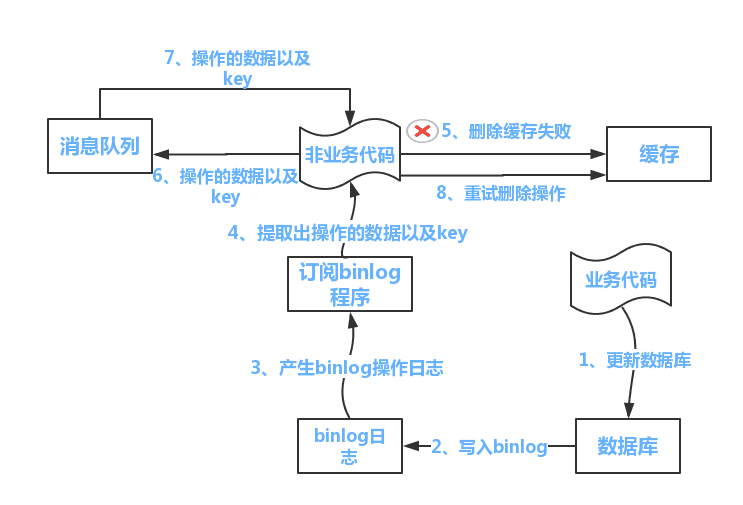

### 缓存一致性

#### 常见的缓存更新设计模式

- Cache Aside Patter
- Read through
- Write through
- Write behind caching

##### Cache Aside Patter

 最常用的设计模式，其整体逻辑如下：

**读数据的时候** 先判断是否命中缓存，未命中的情况下去数据读取加载到缓存，命中则直接返回缓存。

**写数据的时候** 先持久化到数据库，之后再去使缓存失效（删除缓存）。

这种设计模式不能完全杜绝不一致的问题。在读写并发的过程中，如果缓存失效，读取数据的同时写操作更新数据，就会出现脏数据。

但是这种情况发生的概率很低。一般情况下，写操作会比读操作慢。同时发生的概率很小。

##### Read through

这种模式就是在读取的时候更新缓存。与 cache aside 的主要区别在于，缓存操作更新数据库。应用只从缓存读取数据。

##### Write through

这种模式时在写的时候更新缓存。当写操作时，未命中缓存，直接更新数据库。命中缓存则更新缓存。之后由Cache更新数据库。

##### Write behind Cacheing Pattern/Write back

跟Linux的PageCache一致，更新的时候只更新缓存，不更新数据库。数据库的更新交由缓存来更新。

#### Cache aSide pattern 具体实现方案

##### 队列+重试机制

流程如下：

1.业务代码更新数据库

2.业务代码尝试删除缓存。

3.删除失败，向消息队列发送需要删除的key

4.消息队列发送消息给业务代码，重新尝试删除操作。

缺点： 代码会有比较高的侵入。

##### 订阅binlog的同步机制（异步缓存同步机制）

该方案基于对mysql的binlog增量订阅，通过消息机制，将新增数据更新到redis中

读取主要是基于reids来进行读取。

写操作主要是针对mysql

更新交由MySQ的数据操作binlog，来更新到Redis

可以使用阿里的Cancal 或者第三方mq

#### QA

**Cache Aside Pattern 模式为什么是删除缓存而不是更新缓存呢？**

删除相较于更新操作更加简单，出问题概率更小。实际使用中的数据源于多表聚合。更新操作会更加耗时。

而且有的数据缓存之后不是很频繁的访问。从资源和整体性能上考虑，下次查询填充效率会更高。

**为什么要加入重试机制？**

主要是预防删除缓存的操作失败。